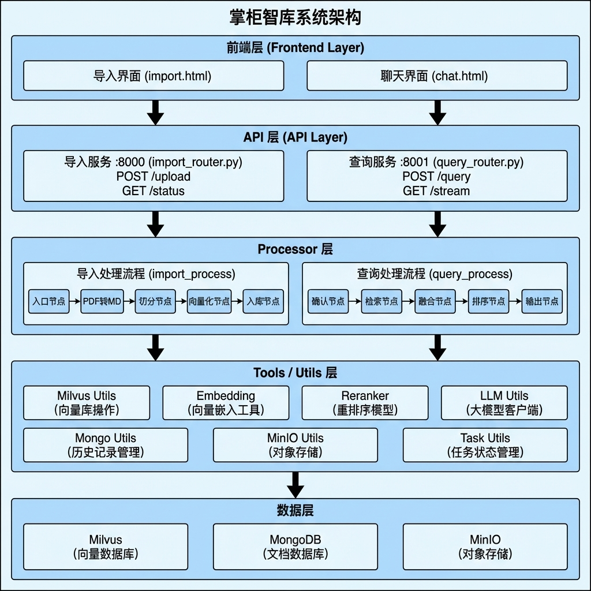

[TOC]

# 掌柜智库 - 项目简介

> 本文档为 掌柜智库的全景概览，涵盖项目定位、系统架构、核心技术栈介绍。 

## 1. 项目概述

### 1.1 项目定位与目标

**项目定位：**

掌柜智库是一个企业级智能知识库系统，基于 **RAG（检索增强生成）** 技术，旨在为垂直领域（如电子产品手册、维修指南、技术文档等）提供精准、智能的知识检索与问答服务。

**核心目标：**

- 将非结构化文档（PDF、Markdown）转化为可检索的结构化知识
- 通过多路召回策略提升检索准确率
- 提供流畅的流式问答交互体验

### 1.2 核心模块

**数据处理流水线 (Data Pipeline)**：支持 PDF/Markdown 等多格式文档导入，执行文档结构化解析、智能切片、元数据提取及向量化存储的全链路预处理。（为智能客服提供数据支撑）

**智能检索系统 (Retrieval System)**：集成混合检索 (稠密向量 + 稀疏向量)、假设性问题生成 (HyDE)、MCP 联网搜索及结果重排序 (Rerank) 等高级策略，确保回答的准确性与时效性。

### 1.3 核心功能特性

| 功能模块         | 描述                                               |
| ---------------- | -------------------------------------------------- |
| **文档智能导入** | 支持 PDF/Markdown 文件上传，自动解析、切分、向量化 |
| **混合向量检索** | 稠密向量 + 稀疏向量（BM25）混合检索                |
| **多路召回融合** | 向量检索 + HyDE + Web 搜索                         |
| **智能重排序**   | Reranker 模型重排序，断崖检测动态截断              |
| **流式问答**     | SSE 实时推送，逐字输出答案                         |
| **会话历史管理** | MongoDB 存储对话历史，支持上下文连续对话           |

------

### 1.4 适用场景

- **产品手册问答**：电子产品使用说明、维修手册等
- **技术文档检索**：API 文档、开发指南、FAQ 等
- **企业知识库**：内部制度、操作规范、培训资料等
- **售后客服支持**：产品故障排查、使用指导等

## 2. 系统架构

### 2.1 整体架构图

### 2.2 核心模块说明

| 模块             | 职责                       | 技术实现                 |
| ---------------- | -------------------------- | ------------------------ |
| **API 层**       | HTTP 接口暴露、请求路由    | FastAPI + Uvicorn        |
| **Processor 层** | 业务流程编排、节点调度     | LangGraph                |
| **Utils 层**     | 工具函数封装、外部服务调用 | Python 模块              |
| **数据层**       | 数据持久化、检索           | Milvus / MongoDB / MinIO |

### 2.3 技术栈选型

| 类别           | 技术选型                                | 版本/说明                   |
| -------------- | --------------------------------------- | --------------------------- |
| **后端框架**   | FastAPI + Uvicorn                       | 异步高性能 HTTP 服务        |
| **工作流引擎** | LangGraph                               | 有状态图编排框架            |
| **大语言模型** | 阿里云 DashScope (Qwen)                 | qwen-flash / qwen3-vl-flash |
| **向量嵌入**   | OpenAI API (text-embedding-v4) + BGE-M3 | 1536维 / 1024维+稀疏        |
| **重排序模型** | BGE-Reranker-Large                      | 本地部署                    |
| **向量数据库** | Milvus                                  | 混合检索（稠密+稀疏）       |
| **文档数据库** | MongoDB                                 | 对话历史存储                |
| **对象存储**   | MinIO                                   | 文件与图片存储              |
| **PDF解析**    | MinerU                                  | PDF 转 Markdown             |
| **前端**       | HTML5 + JS                              | 无框架，轻量实现            |

## 3. 第三方中间件与技术栈

### 3.1 核心中间件

| 中间件      | 官网地址                | 作用                           | 使用位置                     |
| ----------- | ----------------------- | ------------------------------ | ---------------------------- |
| **Milvus**  | https://milvus.io       | 向量数据库，存储和检索文档向量 | 向量检索节点、向量化入库节点 |
| **MongoDB** | https://www.mongodb.com | 文档数据库，存储对话历史       | 历史管理、答案生成节点       |
| **MinIO**   | https://min.io          | 对象存储，存储原始文件和图片   | 图片处理节点、PDF转换节点    |

### 3.2 AI/ML 框架与模型

| 框架/模型         | 官网地址                                       | 作用                                                 | 使用位置                 |
| ----------------- | ---------------------------------------------- | ---------------------------------------------------- | ------------------------ |
| **LangChain**     | https://python.langchain.com                   | LLM 应用框架，统一 LLM 调用接口                      | 各 LLM 调用节点          |
| **LangGraph**     | https://langchain-ai.github.io/langgraph       | 工作流编排框架，构建 DAG 流程                        | 主图编排（导入/查询）    |
| **BGE-M3**        | https://huggingface.co/BAAI/bge-m3             | 混合向量嵌入模型（稠密+稀疏）                        | 向量化节点、向量检索节点 |
| **BGE-Reranker**  | https://huggingface.co/BAAI/bge-reranker-large | 重排序模型（交叉编码器）                             | Rerank重排序节点         |
| **FlagEmbedding** | https://github.com/FlagOpen/FlagEmbedding      | 嵌入模型工具库                                       | 向量化、重排序           |
| **MinerU**        | https://github.com/opendatalab/MinerU          | PDF 转 Markdown 工具（支持公式、表格等复杂排版提取） | PDF转换节点              |

### 3.3 Web 框架与协议

| 框架/协议    | 官网地址                        | 作用               | 使用位置           |
| ------------ | ------------------------------- | ------------------ | ------------------ |
| **FastAPI**  | https://fastapi.tiangolo.com    | 高性能 Web 框架    | 导入路由、查询路由 |
| **Pydantic** | https://docs.pydantic.dev       | 数据验证和序列化   | 请求/响应模型      |
| **Uvicorn**  | https://www.uvicorn.org         | ASGI 服务器        | 应用启动入口       |
| **SSE**      | MDN Web Docs                    | 服务端推送事件协议 | 流式输出           |
| **MCP**      | https://modelcontextprotocol.io | 模型上下文协议     | 网络搜索节点       |

### 3.4 Python 核心库

| 库                | 官网地址                                                     | 作用                  | 使用位置          |
| ----------------- | ------------------------------------------------------------ | --------------------- | ----------------- |
| **pymilvus**      | https://milvus.io/docs                                       | Milvus Python SDK     | 向量操作          |
| **pymongo**       | https://pymongo.readthedocs.io                               | MongoDB Python Driver | 历史记录管理      |
| **minio**         | https://min.io/docs/minio/linux/developers/python/minio-py.html | MinIO Python SDK      | 文件上传          |
| **python-dotenv** | https://github.com/theskumar/python-dotenv                   | 环境变量管理          | 各模块配置加载    |
| **asyncio**       | Python 标准库                                                | 异步编程支持          | 网络搜索节点、SSE |

