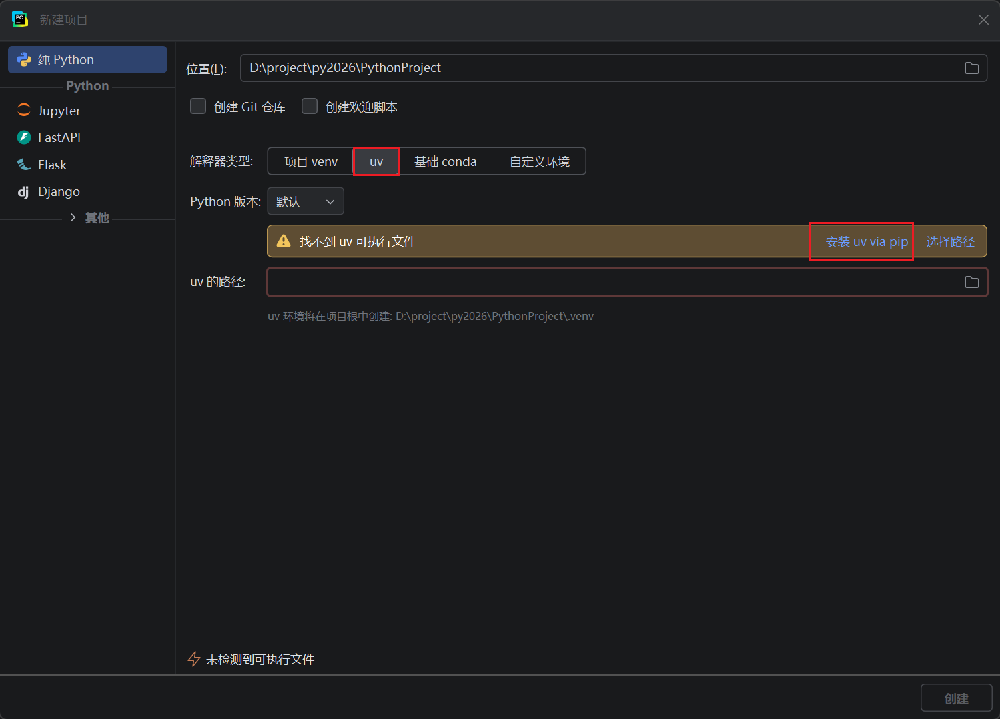
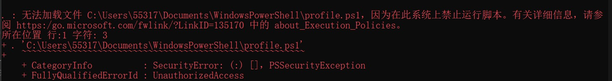
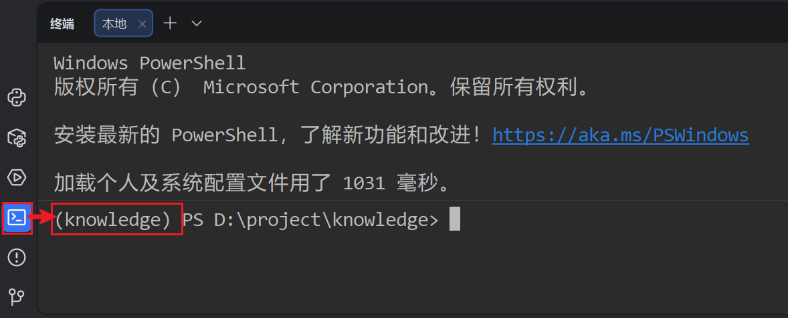

[TOC]

# 掌柜智库 - 环境准备 

> 本文档详细介绍掌柜智库项目的环境配置与中间件服务部署，包括 Python 环境搭建、Docker 安装、各中间件部署配置及验证方法。 

## 1. 服务器环境

### 1.1 配置虚拟网络

确认虚拟网络编辑器VMnet8的虚拟网络环境

### 1.2 安装CentOS

典型 > iso > 选择虚拟机名称和位置 > 磁盘大小：40G > 自定义硬件（内存:4G，CPU:2x2）> Install CentOS7

中文 | 简体中文 | 日期时间 | 安装位置 | 网络和主机（手动配置IPv4）

设置ROOT密码

网络可以安装CentOS的时候配置也可以服务器安装完毕后以命令行方式修改：

```bash
cd /etc/sysconfig/network-scripts 
vi ifcfg-ens33

IPADDR=192.168.100.100
GATEWAY=192.168.100.2
NETMASK=255.255.255.0
DNS1=192.168.100.2
DNS2=8.8.8.8
DNS3=114.114.114.114
ONBOOT=yes
```

使用远程工具连接后确认网络配置并关闭防火墙

```bash
#查看修改
ip a

#看是否能上外网
ping baidu.com

# 停止firewalld防火墙
systemctl stop firewalld
# 禁用开机自启
systemctl disable firewalld
# 查看最终状态
systemctl status firewalld

# 恢复开启防火墙命令（备用，需要时用）
systemctl enable firewalld
systemctl start firewalld
```

### 1.3 安装Docker

#### 1.3.1 配置yum源

* docker 从 17.03 版本之后分为 CE（Community Edition: 社区版） 和 EE（Enterprise Edition: 企业版），CE版本是免费的，EE版本是收费的。本次我们使用社区版。
* docker的安装和卸载可以参考官方文档：https://docs.docker.com/engine/install/centos/

1. 备份原有的 repo 文件

   ```bash
   mv /etc/yum.repos.d/CentOS-Base.repo /etc/yum.repos.d/CentOS-Base.repo.backup
   ```

2. 替换为国内镜像源：通过wget命令下载CentOS-Base.repo文件

   ```bash
   wget -O /etc/yum.repos.d/CentOS-Base.repo http://mirrors.aliyun.com/repo/Centos-7.repo
   ```

3. 更新yum镜像源

   ```bash
   yum clean all
   yum makecache
   yum -y update
   ```

4. 一些必要的工具

   ```
   yum install lrzsz
   yum install vim
   yum install wget
   ```

   

#### 1.3.2 安装docker

* 安装必要的一些系统工具

```bash
# yy -utils提供了yy-config-manager相关功能
sudo yum install -y yum-utils
```

* 添加docker软件源信息（设置阿里云镜像地址，提高下载速度）

```bash
sudo yum-config-manager --add-repo http://mirrors.aliyun.com/docker-ce/linux/centos/docker-ce.repo
```

* 安装Docker

```bash
sudo yum install -y docker-ce docker-ce-cli containerd.io docker-compose-plugin
```

#### 1.3.3 启动docker服务

```bash
# 先关闭防火墙，并将防火墙设置为开机关闭
systemctl stop firewalld
systemctl disable firewalld

# 启动docker服务
sudo systemctl enable docker --now

#和上面等价
sudo systemctl start docker
systemctl enable docker

#测试是否安装成功
docker -v
```

#### 1.3.4 配置Docker镜像加速

参考 `利用ssh反向隧道进行镜像加速`

### 1.4 安装MinIO容器

> **重要说明**
>
> 版本选择：MinIO 在 2024 年底/2025 年初的策略调整中，将 Web 控制台的用户管理、桶策略配置等核心功能移入了企业版付费专区。
> 本脚本锁定使用 RELEASE.2024-12-18T13-15-44Z 版本，这是社区版中保留完整 Web UI 管理功能的最后一个稳定版本。

```cmd
# ==============================================================================
# MinIO 对象存储安装脚本 (社区版功能完整最后版本)
# ==============================================================================
#
# 1. 镜像来源：
#    - quay.io/minio/minio
#
# 2. 端口规划：
#    - 9000: S3 API 端口 (程序代码读写数据使用)
#    - 9001: Web Console 端口 (浏览器后台管理使用)
#    显式指定 --console-address ":9001" 可避免端口随机化或与 API 端口冲突。
#
# 3. 数据安全：
#    - 通过 -v 将容器内 /data 挂载到宿主机 ./volumes/minio/data
#    - 即使删除容器，数据也会保留在宿主机目录中。
#
# 4. 安全警告：
#    - 默认账号密码为 minioadmin/minioadmin
#    - 【生产环境务必修改】环境变量 MINIO_ACCESS_KEY 和 MINIO_SECRET_KEY！
# ==============================================================================

# 还原镜像：将**资料**中的 `minio.tar` 镜像上传至CentOS服务器，还原镜像（如果网速还可以，就跳过这一步）
docker load -i minio.tar

# 安装并启动容器
docker run -d --name minio \
    --restart always \
    -p 9000:9000 \
    -p 9001:9001 \
    -e "MINIO_ROOT_USER=minioadmin" \
    -e "MINIO_ROOT_PASSWORD=minioadmin" \
    -v "$(pwd)/volumes/minio/data:/data" \
    quay.io/minio/minio:RELEASE.2024-12-18T13-15-44Z server /data \
    --console-address ":9001"

# ==============================================================================
# 后续操作指引
# ==============================================================================
# 1. 查看日志确认启动成功:
#    docker logs -f minio
#
# 2. 访问 Web 管理后台:
#    http://<服务器IP>:9001
#    账号: minioadmin
#    密码: minioadmin
# ==============================================================================

```

修改 `.env` 中的minio全局配置

```ini
# ====================
# Object Storage (MinIO)
# ====================
# MinIO 服务端点
MINIO_ENDPOINT=192.168.100.100:9000
# 访问密钥
MINIO_ACCESS_KEY=minioadmin
# 私有密钥
MINIO_SECRET_KEY=minioadmin
# 存储桶名称
MINIO_BUCKET_NAME=knowledge-base
```

### 1.5 安装Milvus 容器

**官网：**[Milvus | 高性能向量数据库，为规模而构建](https://milvus.io/zh)

```bash
# 1、下载 Milvus v2.5.5 官方单机版docker-compose配置文件
wget https://github.com/milvus-io/milvus/releases/download/v2.5.5/milvus-standalone-docker-compose.yml -O docker-compose.yml

#⚠️这里需要先编辑这个yml
# （1）修改minio的端口号避免和之前安装的冲突
# （2）添加Attu的容器配置
💡这步可以直接从“资料”目录中拿到修改好的 docker-compose.yml 文件上传到服务器中

# 2、如果网速较慢，则提前使用资料中的镜像包进行还原
# 将 所有的 .tar 上传到服务器上，然后执行以下命令(通过 docker save -o 文件名.tar 镜像名:版本 可以保存镜像)
docker load -i attu.tar
docker load -i milvus-etcd.tar
docker load -i milvus-minio.tar
docker load -i milvus.tar

# 3、在资料中找到：`docker-compose.yml` 上传到服务器的 /root 目录
# 启动所有相关服务
docker compose up -d    

# 检查Milvus运行状态（第2步完成后等几秒再试）
docker compose ps

# 【常用运维命令】后续管理Milvus可使用
# 停止Milvus：docker compose stop
# 重启Milvus：docker compose restart
# 删除所有容器和卷：docker compose down --volumes --remove-orphans
# 查看运行日志（排查问题用）：docker compose logs milvus-standalone
```

浏览器访问：`http://<Linux服务器IP>:7000`,连接 Milvus：页面无需输入账号密码，直接点击【Connect】按钮，若能进入 Attu 可视化界面，即 **Milvus 部署 + Attu 连接全部成功**。

修改 `.env` 中的Milvus全局配置

```ini
# ====================
# Vector Database (Milvus)
# ====================
# Milvus 连接地址
MILVUS_URL=http://192.168.100.100:19530
# 知识库切片集合名
CHUNKS_COLLECTION=kb_chunks
# 商品名称集合名
ITEM_NAME_COLLECTION=kb_item_names
# 相似度度量方式
MILVUS_METRIC_TYPE=COSINE
# 最小余弦相似度阈值
MILVUS_MIN_COSINE_SCORE=0.75
```

### 1.6 安装MongoDB

```bash
# 如果网速较慢，则提前使用资料中的镜像包进行还原
docker load -i mongo.tar

# 安装并启动容器
docker run -d --name mongo --restart always -p 27017:27017 mongo

# 查看运行状态
docker ps | grep mongo
# 进入 MongoDB 容器
docker exec -it mongo mongosh


# 【常用运维命令】后续管理MongoDB可使用
# 停止 MongoDB 容器
docker stop mongo
# 启动 MongoDB 容器
docker start mongo
# 重启 MongoDB 容器
docker restart mongo
```

客户端连接工具的安装：推荐使用 **MongoDB Compass**，这是 MongoDB 官方提供的图形化管理工具。

1.  **下载**：访问 [MongoDB Download Center](https://www.mongodb.com/try/download/compass)，选择 Windows 版本下载安装包。
2.  **安装**：运行下载的 `.exe` 或 `.msi` 文件，按照提示完成安装。
3.  **连接**：
    *   打开 MongoDB Compass。
    *   在连接页面输入连接字符串（URI），例如：`mongodb://localhost:27017`（如果是远程服务器，替换 `localhost` 为服务器 IP）。
    *   点击 **Connect** 按钮。

修改 `.env` 中的MongoDB全局配置

```ini
# ====================
# Document Database (MongoDB)
# ====================
# MongoDB 连接 URL
MONGO_URL=mongodb://192.168.100.100:27017
# 数据库名
MONGO_DB_NAME=kb001
```

## 2. Python虚拟环境创建

### 2.1 安装uv

使用 `uv` 方式创建虚拟环境，如果之前用其他方式安装过 `uv` 则此处会自动识别出 `uv` 路径，如果没安装过 `uv` 直接点击 `安装 uv via pip`



`PyCharm`版本没有 `uv` 选项，则选择 `自定义环境`，类型选 `uv`，然后再点击 `安装 uv via pip`


安装完uv 后将 uv 路径配置在系统的 `Path` 环境变量中：例如我的路径是 `C:\Users\用户名\AppData\Roaming\Python\Scripts`

### 2.2 配置镜像源

为uv命令配置国内镜像源。

以管理员身份运行`Windows PowerShell`


如果运行报如下错误：



则在 `Windows PowerShell` 中设置安全策略允许本地脚本执行，方式如下：

```bash
Set-ExecutionPolicy Unrestricted -Scope CurrentUser
```

然后执行以下命令创建uv配置文件

```bash
# 在用户目录创建文件夹
mkdir -Force $env:APPDATA\uv
# 在文件夹中创建文件
New-Item -Path $env:APPDATA\uv\uv.toml -ItemType File
```

编辑 `uv.toml` 文件，添加以下内容

```bash
# 清华镜像（推荐）
index-url = "https://pypi.tuna.tsinghua.edu.cn/simple"
python-install-mirror = "https://mirror.nju.edu.cn/github-release/astral-sh/python-build-standalone/"
```

### 2.3 安装指定版本的Python解释器

打开命令行终端，执行以下命令安装 `python 3.11`

```bash
# 列出已安装版本
uv python list

# 如果没安装过 3.11 版本，则安装特定 Python 版本
uv python install 3.11
```

回到 `PyCharm` 创建项目的页面，选择 Python版本为 `3.11`，定义项目名称为 `knowledge_base` 然后创建项目


项目创建成功后，根目录下自动生成一个 `pyproject.toml`  文件。在 uv 虚拟环境中，`pyproject.toml` 是**项目依赖和配置的核心文件**，相当于项目的 “身份卡 + 依赖清单”，uv 会通过这个文件统一管理项目的 Python 版本、依赖包、构建规则等，是 uv 实现 “跨环境一致性” 的关键。

### 2.4 激活当前虚拟环境

打开 **PyCharm的终端**，当前虚拟环境会自动被激活



```bash
#可能有用的命令

#禁用conda虚拟环境
conda deactivate #本次禁用
conda config --set auto_activate_base false #永久禁用
```

## 3. 配置文件

### 3.1 配置文件导入

在项目的跟目录中创建以下配置文件

> `.env` 文件（不提交到Git，配置apikey）
> `.env.example` 文件（提交到Git，不要配置正确的 apikey，避免泄露）

完整 `.env.example` 配置示例

```python
# ====================
# MinerU API
# ====================
MINERU_API_TOKEN=xxxxxxxxxxxxxxxxxxxxxxxxxxxxxxxx
MINERU_BASE_URL=https://mineru.net/api/v4

# ====================
# Model Source & Cache
# ====================
# 模型来源（ModelScope / HuggingFace）
MINERU_MODEL_SOURCE=modelscope
# ModelScope 离线模式（1=启用）
MODELSCOPE_OFFLINE=1
# ModelScope 模型缓存路径
MODELSCOPE_CACHE=D:/ai_models/modelscope_cache
# Hugging Face 缓存路径
HF_HOME=D:/ai_models/huggingface_cache
# 临时文件根目录
MD_ROOT_DIR=./temp-files/

# ====================
# OpenAI / LLM API (DashScope compatible)
# ====================
# API 密钥（兼容 OpenAI 格式）
OPENAI_API_KEY=sk-xxxxxxxxxxxxxxxxxxxxxxxxxxxxxxxx
# API 基础地址（阿里云 DashScope）
OPENAI_API_BASE=https://dashscope.aliyuncs.com/compatible-mode/v1
# 默认 LLM 模型
LLM_DEFAULT_MODEL=qwen-flash
# 默认温度参数（0-1，越低越稳定）
LLM_DEFAULT_TEMPERATURE=0.1
# 视觉语言模型
VL_MODEL=qwen3-vl-flash
# 商品名识别模型
ITEM_MODEL=qwen-flash

# ====================
# BGE Embedding Models
# ====================
# BGE-M3 模型本地路径
BGE_M3_PATH=D:\ai_models\modelscope_cache\models\BAAI\bge-m3
# BGE-M3 模型名称
BGE_M3=BAAI/bge-m3
# 嵌入模型运行设备
BGE_DEVICE=cuda:0
# 是否使用半精度（True/False）
BGE_FP16=True
# BGE 重排序模型路径
BGE_RERANKER_LARGE=D:\ai_models\modelscope_cache\models\BAAI\bge-reranker-large
# 重排序模型设备
BGE_RERANKER_DEVICE=cuda:0
# 重排序模型半精度
BGE_RERANKER_FP16=1
卸
# ====================
# Embedding General
# ====================
# 嵌入向量维度（OpenAI text-embedding-v4）
EMBEDDING_DIM=1536
# 嵌入模型名称
EMBEDDING_MODEL=text-embedding-v4

# ====================
# Vector Database (Milvus)
# ====================
# Milvus 连接地址
MILVUS_URL=http://localhost:19530
# 知识库切片集合名
CHUNKS_COLLECTION=kb_chunks
# 商品名称集合名
ITEM_NAME_COLLECTION=kb_item_names
# 相似度度量方式
MILVUS_METRIC_TYPE=COSINE
# 最小余弦相似度阈值
MILVUS_MIN_COSINE_SCORE=0.75

# ====================
# Document Database (MongoDB)
# ====================
# MongoDB 连接 URL
MONGO_URL=mongodb://localhost:27017
# 数据库名
MONGO_DB_NAME=kb001

# ====================
# Object Storage (MinIO)
# ====================
# MinIO 服务端点
MINIO_ENDPOINT=localhost:9000
# 访问密钥
MINIO_ACCESS_KEY=minioadmin
# 私有密钥
MINIO_SECRET_KEY=minioadmin
# 存储桶名称
MINIO_BUCKET_NAME=knowledge-base

# ====================
# Other / MCP Services
# ====================
# MCP Web 搜索服务地址
MCP_DASHSCOPE_BASE_URL=https://dashscope.aliyuncs.com/api/v1/mcps/WebSearch/sse
```

### 3.2 测试环境变量的读取

安装依赖

```bash
uv add python-dotenv
或
uv pip install python-dotenv
```

使用 `uv add` 或 `uv pip install` 都以可为当前虚拟环境安装依赖。区别如下

- 使用 `uv add` 安装的依赖会自动添加到 `pyproject.toml` 中，但是不能在命令中直接使用 `--index-url` 参数指定镜像源，只能通过前面的`uv.toml` 文件指定
- 使用 `uv pip install` 则不会将依赖添加到 `pyproject.toml` 中，但是可以在命令中直接使用 `--index-url` 参数指定镜像源

测试环境变量的读取

```python
# test/01_env和系统环境变量的优先级.py

import os
from dotenv import load_dotenv

# 加载.env文件
load_dotenv()

print(os.getenv("OPENAI_API_KEY"))

# 示例：假设系统有环境变量 MY_KEY=system_val，.env里 MY_KEY=dotenv_val
print(os.getenv("MY_KEY"))
# load_dotenv() → 输出 system_val（系统优先级高）
# load_dotenv(override=True) → 输出 dotenv_val（.env覆盖系统）
```

## 4. 安装依赖

```bash
uv add python-dotenv    # 加载 .env 环境变量文件，管理密钥、配置等敏感信息
uv add numpy            # 科学计算核心库，提供高性能数组操作、线性代数等功能
uv add langgraph        # 基于LangChain的工作流框架，用于构建多智能体/状态管理的LLM应用
uv add grandalf         # 图布局与可视化库，支持图的绘制、路径计算等
uv add fastapi          # 高性能异步Web框架，用于快速构建API接口（支持自动生成文档）
uv add minio            # MinIO对象存储的Python客户端，用于操作S3兼容的存储服务
uv add langchain-openai # LangChain对接OpenAI API的专用模块（含GPT、Embeddings等）
uv add langchain        # LLM应用开发框架，整合各类大模型、工具、数据源
uv add langchain-text-splitters # LangChain的文本分割模块，用于切分长文本适配LLM上下文
uv add pymongo          # MongoDB数据库的Python驱动，用于连接和操作MongoDB
uv add colorlog         # 彩色日志输出库，让终端日志带颜色区分，提升调试与查看效率

#陆陆续续还有一些其他依赖，需要特别说明，我们在后续的课程中再做介绍和安装

#可能有用的命令
#查看虚拟环境中的依赖关系
uv tree

#根据pyproject.toml同步虚拟环境
uv sync

#强制根据pyproject.toml重新下载环境依赖
rm uv.
uv.lock
uv sync --reinstall   

#必要时清理uv缓存，重新下载所有的依赖
#uv缓存的位置由环境变量 UV_CACHE_DIR 指定 
```

