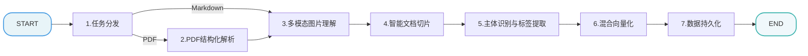
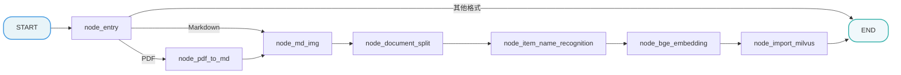

[TOC]

# 掌柜智库 - 【导入】骨架代码

> 本文档详细介绍知识库导入流程的骨架代码设计与实现，包括配置管理、异常处理、状态定义、节点基类和流程图构建。

## 1. 任务目标

### 1.1 本章目标 

通过本章学习，你将掌握：

1. **理解 LangGraph 工作流框架**：掌握图状态、节点、边的核心概念
2. **设计可扩展的流程骨架**：学会使用基类、配置、异常等模式构建健壮的处理流程
3. **实现导入流程主图**：构建完整的文档导入工作流
4. **编写可测试的代码**：通过 `if __name__ == "__main__"` 验证流程

### 1.2 涉及模块 

```
processor/import_processor/nodes/
├── config.py        # 配置管理模块
├── exceptions.py    # 自定义异常类
├── state.py         # 图状态类型定义
├── base.py          # 节点基类
├── main_graph.py    # 主图定义与构建
└── __init__.py      # 模块导出
```

## 2. 知识库导入业务处理流程

### 2.1 整体流程




### 2.2 骨架模块职责

| 模块              | 职责                                 | 重要性         |
| ----------------- | ------------------------------------ | -------------- |
| **config.py**     | 集中管理所有配置项，支持环境变量覆盖 | 配置与代码分离 |
| **exceptions.py** | 定义异常层级，统一错误处理           | 错误可追踪     |
| **state.py**      | 定义图状态结构，节点间数据传递       | 数据契约       |
| **base.py**       | 定义节点基类，统一执行逻辑           | 代码复用       |
| **nodes**         | 定义节点，定义核心业务逻辑           | 业务逻辑       |
| **main_graph.py** | 构建工作流图，编排节点执行顺序       | 流程编排       |


### 2.3 配置管理模块 (config.py)

#### 2.3.1 目标

- 集中管理所有配置项
- 支持环境变量覆盖
- 实现单例模式

#### 2.3.2 需求分析

**配置来源：**

1. 代码默认值（开发环境）
2. 环境变量（生产环境）
3. `.env` 文件（本地开发）

**配置分类：**

- 文档处理配置（切片长度、图片扩展名等）
- LLM API 配置（API Key、模型名等）
- 数据库配置（Milvus、MinIO）
- 向量配置（维度、批次大小）

#### 2.3.3 实现流程

```
┌─────────────────────────────────────────────────────────────────────────────┐
│                           配置加载流程                                        
└─────────────────────────────────────────────────────────────────────────────┘

  程序启动
      │
      ▼
  ┌─────────────────┐
  │ load_dotenv()   │ ──→ 加载 .env 文件到环境变量
  └────────┬────────┘
           │
           ▼
  ┌─────────────────────────────────────────────────────────────────────────┐
  │ @dataclass 
  │ class ImportConfig:                                               
  │                                                                         
  │  字段定义:                                                              
  │  ├── max_content_length = 2000        # 默认值                         
  │  ├── openai_api_key = field(           # 从环境变量读取                 
  │  │     default_factory=lambda: os.getenv("OPENAI_API_KEY", ""))        
  │  └── ...                                                               
  └─────────────────────────────────────────────────────────────────────────┘
           │
           ▼
  ┌─────────────────┐
  │ get_config()    │ ──→ 返回全局单例
  └─────────────────┘
```

#### 2.3.4 代码实现

```python
# processor/import_processor/config.py

"""
导入流程配置管理模块

集中管理所有配置项，支持环境变量覆盖
"""

from dataclasses import dataclass, field
from typing import Set, Optional
import os
from dotenv import load_dotenv

# 加载 .env 文件
load_dotenv()


@dataclass
class ImportConfig:
    """导入流程配置"""

    # ==================== 文档处理配置 ====================
    max_content_length: int = 2000      # 切片最大长度
    img_content_length: int = 200       # 图片上下文最大长度
    min_content_length: int = 500       # 合并短内容的最小长度
    overlap_sentences: int = 1          # 句子级切分时重叠句数
    item_name_chunk_k: int = 3          # 商品名识别时使用的切片数量
    item_name_chunk_size: int = 2500    # 商品名识别时使用的切片内容长度

    # 支持的图片扩展名
    image_extensions: Set[str] = field(
        default_factory=lambda: {".jpg", ".jpeg", ".png", ".gif", ".bmp", ".webp"}
    )

    # ==================== LLM 配置 ====================
    openai_api_base: str = field(
        default_factory=lambda: os.getenv("OPENAI_API_BASE", "")
    )
    openai_api_key: str = field(
        default_factory=lambda: os.getenv("OPENAI_API_KEY", "")
    )
    vl_model: str = field(
        default_factory=lambda: os.getenv("VL_MODEL", "")
    )
    item_model: str = field(
        default_factory=lambda: os.getenv("ITEM_MODEL", "")
    )
    default_model: str = field(
        default_factory=lambda: os.getenv("MODEL", "")
    )

    # ==================== Milvus 配置 ====================
    milvus_url: str = field(
        default_factory=lambda: os.getenv("MILVUS_URL", "")
    )
    chunks_collection: str = field(
        default_factory=lambda: os.getenv("CHUNKS_COLLECTION", "")
    )
    item_name_collection: str = field(
        default_factory=lambda: os.getenv("ITEM_NAME_COLLECTION", "")
    )

    # ==================== MinIO 配置 ====================
    minio_endpoint: str = field(
        default_factory=lambda: os.getenv("MINIO_ENDPOINT", "")
    )
    minio_access_key: str = field(
        default_factory=lambda: os.getenv("MINIO_ACCESS_KEY", "")
    )
    minio_secret_key: str = field(
        default_factory=lambda: os.getenv("MINIO_SECRET_KEY", "")
    )
    minio_bucket: str = field(
        default_factory=lambda: os.getenv("MINIO_BUCKET_NAME", "")
    )
    minio_secure: bool = False

    # ==================== 向量配置 ====================
    embedding_dim: int = field(
        default_factory=lambda: int(os.getenv("EMBEDDING_DIM", "1024"))
    )
    embedding_batch_size: int = 8

    # ==================== 速率限制 ====================
    requests_per_minute: int = 15       # 图片总结 API 速率限制

    @classmethod
    def from_env(cls) -> "ImportConfig":
        """从环境变量加载配置"""
        return cls()

    def get_minio_base_url(self) -> str:
        """获取 MinIO 基础 URL"""
        protocol = "https://" if self.minio_secure else "http://"
        return protocol + f"{self.minio_endpoint}"


# ==================== 全局单例 ====================
_config: Optional[ImportConfig] = None


def get_config() -> ImportConfig:
    """获取配置单例"""
    global _config
    if _config is None:
        _config = ImportConfig.from_env()
    return _config
```

#### 2.3.5 关键设计点

##### 单例模式 

`get_config()`

- 避免重复创建配置对象
- 全局共享同一份配置

##### 配置管理

`dataclass` 是 Python 3.7+ 的装饰器，用于简化类定义：

```python
from dataclasses import dataclass, field

@dataclass
class Config:
    # 简单默认值
    name: str = "default"

    # 动态默认值（使用 field + default_factory）
    items: list = field(default_factory=list)

    # 从环境变量读取
    api_key: str = field(
        default_factory=lambda: os.getenv("API_KEY", "")
    )
```

`field()` 函数用于为数据类的字段提供更精细的控制，当简单的赋值语法无法满足需求时（例如需要可变类型的默认值），就需要用到它。

下面我们来逐一解析你代码中的三种情况：

###### 📝 简单默认值

这是一种语法糖，适用于**不可变类型**（如 `str`, `int`, `float`, `bool`, `tuple`）的静态默认值。 

```python
name: str = "default"
#等同于
name: str = field(default="default")
```

###### ⚙️ 动态默认值 (`default_factory`)

这是 `field()` 最重要的用途之一，专门用于处理**可变类型**（如 `list`, `dict`, `set`）的默认值。

```python
items: list = field(default_factory=list)
```

- **为什么需要它？**
  如果直接写成 `items: list = []`，那么这个空列表 `[]` 会在类定义时被创建一次，并被所有 `Config` 实例共享。修改一个实例的 `items` 会影响所有其他实例，这是一个常见的陷阱。
- **它是如何工作的？**
  `default_factory` 参数接收一个**无参的可调用对象**（也叫工厂函数）。每次创建一个新的 `Config` 实例时，`dataclass` 都会自动调用这个工厂函数，并将它的返回值作为该字段的初始值。
  - `list` 本身就是一个无参构造函数，调用 `list()` 会返回一个新的空列表。
  - 因此，`default_factory=list` 确保了每个 `Config` 实例都拥有自己独立的、全新的空列表，从而避免了数据共享的问题。

###### 🌐 从环境变量读取默认值

```python
api_key: str = field(
    default_factory=lambda: os.getenv("API_KEY", "")
)
```

这是 `default_factory` 的一个高级应用，展示了它的灵活性。

- **`lambda` 表达式的作用**
  这里使用了 `lambda` 创建一个匿名的无参函数。这个函数的作用是调用 `os.getenv("API_KEY", "")` 来获取环境变量的值。

- **为什么用 `lambda`？**
  因为我们需要在每次实例化时执行一段逻辑（获取环境变量），而不仅仅是调用一个简单的构造函数。`lambda: ...` 完美地满足了 `default_factory` 需要一个“无参可调用对象”的要求。

  这行代码等价于先定义一个普通函数，再传给 `field`：

  ```python
  def _get_api_key():
      return os.getenv("API_KEY", "")
  
  class Config:
      # ... 其他字段
      api_key: str = field(default_factory=_get_api_key)
  ```

###### 🧪 代码示例与测试

```python
# test/02_dataclass_field.py

from dataclasses import dataclass, field


@dataclass
class User:
    # 1. 必需字段：没有默认值，创建实例时必须提供
    username: str

    # 2. 简单默认值：适用于不可变类型 (str, int, float等)
    age: int = 18

    # 3. 动态默认值：适用于可变类型 (list, dict等)，防止实例间共享状态
    tags: list = field(default_factory=list)


# --- 开始测试 ---

print("--- 测试 1: 只提供必需字段 ---")
user1 = User("Alice")
print(f"user1: {user1}")
# 输出: user1: User(username='Alice', age=18, tags=[])

print("\n--- 测试 2: 提供所有字段 ---")
user2 = User("Bob", 25, ["developer", "pythonist"])
print(f"user2: {user2}")
# 输出: user2: User(username='Bob', age=25, tags=['developer', 'pythonist'])

print("\n--- 测试 3: 验证可变默认值的独立性 ---")
# 这是使用 field(default_factory=list) 的关键原因
user3 = User("Charlie")
user4 = User("David")

# 修改 user3 的 tags 列表
user3.tags.append("new_tag")

print(f"user3.tags: {user3.tags}")
print(f"user4.tags: {user4.tags}")

# 如果这里使用的是 tags: list = []，那么 user4.tags 也会包含 'new_tag'
# 但因为使用了 default_factory，每个实例都有自己独立的列表
# 输出:
# user3.tags: ['new_tag']
# user4.tags: []
```

###### 总结

| 场景               | 适用类型                    | 写法                                        | 目的                                           |
| :----------------- | :-------------------------- | :------------------------------------------ | :--------------------------------------------- |
| **静态默认值**     | 不可变类型 (`str`, `int`等) | `name: str = "default"`                     | 设置一个固定的、安全的默认值。                 |
| **动态默认值**     | 可变类型 (`list`, `dict`等) | `items: list = field(default_factory=list)` | 为每个实例生成一个独立的新对象，避免共享状态。 |
| **复杂逻辑默认值** | 任何类型                    | `field(default_factory=lambda: ...)`        | 在实例化时通过执行函数来动态计算默认值。       |

---

### 2.4 异常处理模块 (exceptions.py)

#### 2.4.1 目标

- 定义统一的异常层级结构
- 提供清晰的错误信息
- 支持错误溯源

#### 2.4.2 需求分析

**异常分类：**

```
┌─────────────────────────────────────────────────────────────────────────────┐
│                           异常层级结构                                       │
└─────────────────────────────────────────────────────────────────────────────┘

ImportProcessError (基础异常)
│
├── ConfigurationError      # 配置错误
│
├── FileProcessingError     # 文件处理错误
│   ├── PdfConversionError  # PDF 转换错误
│   └── ImageProcessingError# 图片处理错误
│
├── DocumentSplitError      # 文档切分错误
│
├── EmbeddingError          # 向量化错误
│
├── LLMError                # LLM 调用错误
│
├── StorageError            # 存储错误
│   ├── MilvusError         # Milvus 存储错误
│   └── MinioError          # MinIO 存储错误
│
└── ValidationError         # 数据验证错误
```

**设计原则：**

- 继承层级清晰，便于分类捕获
- 每个异常携带上下文信息（节点名、原因）
- 支持异常链追溯

#### 2.4.3 代码实现

```python
# processor/import_processor/exceptions.py

"""
导入流程自定义异常类

统一错误处理，提供更清晰的错误信息
"""

class ImportProcessError(Exception):
    """导入流程基础异常"""

    def __init__(self, message: str, node_name: str = "", cause: Exception = None):
        self.node_name = node_name
        self.cause = cause
        super().__init__(message)

    def __str__(self):
        parts = []
        if self.node_name:
            parts.append(f"[{self.node_name}]")
        parts.append(super().__str__())
        if self.cause:
            parts.append(f"(原因: {self.cause})")
        return " ".join(parts)


class StateFieldError(ImportProcessError):
    """状态字段错误。

    从 state 中获取必需字段缺失、为空或类型不符时抛出。

    Attributes:
        field_name: 缺失或无效的字段名称。
        expected_type: 期望的字段类型（可选）。
    """

    def __init__(
            self,
            node_name: str = "",
            field_name: str = "",
            expected_type: type = None,
            message: str = "",
            cause: Exception = None,
    ):
        self.field_name = field_name
        self.expected_type = expected_type
        if not message:
            message = f"状态字段 '{field_name}' 缺失或无效"
            if expected_type:
                message += f"，期望类型: {expected_type.__name__}"
        super().__init__(message, node_name=node_name, cause=cause)


class ConfigurationError(ImportProcessError):
    """配置错误：环境变量缺失或配置值无效"""
    pass


class FileProcessingError(ImportProcessError):
    """文件处理错误：文件不存在、格式错误、读写失败"""
    pass


class PdfConversionError(FileProcessingError):
    """PDF 转换错误：MinerU 转换失败"""
    pass


class ImageProcessingError(FileProcessingError):
    """图片处理错误：图片总结、上传失败"""
    pass


class DocumentSplitError(ImportProcessError):
    """文档切分错误：切分逻辑异常"""
    pass


class EmbeddingError(ImportProcessError):
    """向量化错误：模型调用失败、向量生成异常"""
    pass


class LLMError(ImportProcessError):
    """LLM 调用错误：API 调用失败、响应解析失败"""
    pass


class StorageError(ImportProcessError):
    """存储错误：数据库操作失败"""
    pass


class MilvusError(StorageError):
    """Milvus 存储错误"""
    pass


class MinioError(StorageError):
    """MinIO 存储错误"""
    pass


class ValidationError(ImportProcessError):
    """数据验证错误：输入数据不符合预期"""
    pass

```

**使用示例：**

```python
# test/03_测试异常处理.py

from processor.import_processor.exceptions import ValidationError

try:
    # 可能失败的操作
    raise ValidationError("数据类型不匹配")
except Exception as e:
    raise ValidationError(
        message="向量写入失败",
        node_name="import_milvus",
        cause=e
    )
```

**输出效果：**

```
MilvusError: [import_milvus] 向量写入失败 (原因: ConnectionError: ...)
```

---

### 2.5 状态定义模块 (state.py)

#### 2.5.1 目标

- 定义图状态的完整结构
- 文档化每个字段的用途

#### 2.5.2 需求分析

**状态字段分类：**

| 类别         | 字段                                                  | 说明         |
| ------------ | ----------------------------------------------------- | ------------ |
| **任务标识** | `task_id`                                             | 任务追踪 ID  |
| **控制标志** | `is_pdf_read_enabled`, `is_md_read_enabled`           | 文件类型标志 |
| **路径信息** | `import_file_path`, `file_dir`, `pdf_path`, `md_path` | 文件路径     |
| **文件信息** | `file_title`, `item_name`                             | 元数据       |
| **处理数据** | `md_content`, `chunks`                                | 中间结果     |

#### 2.5.3 代码实现

```python
# knowledge/processor/import_processor/state.py

"""
导入流程状态类型定义

定义完整的状态结构和辅助函数
"""

from typing import TypedDict, List
import copy


class ImportGraphState(TypedDict):
    """
    导入流程图状态

    包含整个导入流程中传递的所有数据。
    """

    # ==================== 任务标识 ====================
    task_id: str                    # 任务 ID，用于任务追踪

    # ==================== 控制标志 ====================
    is_md_read_enabled: bool        # 是否启用 MD 读取
    is_pdf_read_enabled: bool       # 是否启用 PDF 读取

    # ==================== 路径信息 ====================
    import_file_path: str           # 导入文件路径（原始输入）
    file_dir: str                   # 导入(出)文件目录
    pdf_path: str                   # PDF 文件路径
    md_path: str                    # 转换后 Markdown 文件路径

    # ==================== 文件信息 ====================
    file_title: str                 # 文件标题（不含扩展名）
    item_name: str                  # 识别出的商品/产品名称

    # ==================== 处理中间数据 ====================
    md_content: str                 # Markdown 文档内容
    chunks: List                    # 文档切片列表


GRAPH_DEFAULT_STATE: ImportGraphState = {

    "task_id": "",

    "is_pdf_read_enabled": False,

    "is_md_read_enabled": False,

    "import_file_path": "",

    "file_dir": "",

    "pdf_path": "",

    "md_path": "",

    "file_title": "",

    "item_name": "",

    "md_content": "",

    "chunks": [],
}

def get_default_state() -> ImportGraphState:
    """
    获取默认状态副本
    :return: 状态副本（避免全局污染）
    """
    return copy.deepcopy(GRAPH_DEFAULT_STATE)
```

#### 2.5.4 关键设计点

##### TypedDict 类型提示

Python 的 `TypedDict` 用于定义字典的类型结构：

```python
from typing import TypedDict, List

class MyState(TypedDict, total=False):
    """
    total=False 表示所有字段都是可选的
    """
    name: str           # 字符串类型
    count: int          # 整数类型
    items: List[str]    # 字符串列表
```

为什么使用 TypedDict？

- 提供 IDE 智能提示
- 静态类型检查
- 文档化数据结构
- 与 LangGraph 无缝集成

##### `total=False`

- 所有字段都是可选的
- 节点只需更新自己关心的字段

##### `copy.deepcopy()`

- 避免修改全局模板
- 每次创建独立的状态实例

##### 工厂函数模式

- `create_default_state()` 支持参数覆盖
- 方便测试和初始化

---

### 2.6 节点基类模块 (base.py)

#### 2.6.1 目标

- 定义统一的节点接口
- 提供通用功能（日志、任务追踪、异常处理）
- 减少重复代码

#### 2.6.2 需求分析

**节点通用功能：**

1. **日志记录**：节点开始/结束、步骤日志
2. **任务追踪**：注册当前执行的节点
3. **异常处理**：统一包装异常，添加节点信息
4. **配置注入**：提供配置对象访问

#### 2.6.3 实现流程


#### 2.6.4 代码实现

```python
# processor/import_processor/base.py

"""
导入流程节点基类

定义统一的节点接口规范，提供通用功能
"""
import colorlog

from processor.import_processor.config import ImportConfig, get_config
from processor.import_processor.exceptions import ImportProcessError

"""
导入流程节点基类

定义统一的节点接口规范，提供通用功能
"""

from abc import ABC, abstractmethod
from typing import TypeVar, Optional
import logging

T = TypeVar("T")  # 泛型状态类型

"""
1、抽象的类（ABC），子类需要实现这个类
2、抽象的方法（@abstractmethod process），子类需要实现这个方法
3、name属性，子类必须覆盖这个属性
4、__init__() 方法中初始化了日志记录器，日志记录器的名字是 self所在类的名字
5、__init__() 方法中初始化了全局配置，获取全局单例配置对象
6、__call__() 方法的调用时机  
    (1)对象 = 类名() 
    (2)结果 = 对象()     圆括号调用了__call__()方法
7、self.process()， 当前这句话是从哪调用过来的，process()就定义在哪个位置
8、未来可以在父类的process()中实现任务追踪
9、封装了统一日志处理，使用logging、colorlog
    注意：使用日志记录器记录日志时一定要先激活日志setup_logging(logging.INFO)，并指定日志级别
    
"""


class BaseNode(ABC):
    """
    导入流程节点基类

    所有节点类都应继承此基类，实现 process 方法。
    基类提供统一的日志、任务追踪和错误处理。

    使用示例:
        class MyNode(BaseNode):
            name = "my_node"

            def process(self, state):
                # 实现具体逻辑
                return state

        # 作为 LangGraph 节点使用
        node = MyNode()
        state = node()
        workflow.add_node("my_node", node)
    """

    name: str = "base_node"  # 节点名称，子类应覆盖

    def __init__(self, config: Optional[ImportConfig] = None):
        """
        初始化节点

        Args:
            config: 配置对象，默认使用全局配置
        """
        self.config = config or get_config()

        #日志记录器：命名 import.{self.name}
        self.logger = logging.getLogger(f"import.{self.name}")

    def __call__(self, state: T) -> T:
        """
        节点执行入口

        LangGraph 调用节点时会调用此方法。
        提供统一的日志输出、任务追踪和异常处理。

        Args:
            state: 图状态字典

        Returns:
            更新后的状态字典

        Raises:
            ImportProcessError: 节点执行失败时抛出
        """
        try:
            # 1. 开始准备执行节点
            self.logger.info(f"--- {self.name} 开始啦 ---")

            # 2. 执行节点
            result = self.process(state)

            # 3. 执行节点成功
            self.logger.info(f"--- {self.name} 完成啦 ---")

            return result

        except Exception as e:
            self.logger.error(f"{self.name} 执行失败: {e}")
            raise ImportProcessError(
                message="节点失败",
                node_name=self.name,
                cause=e
            )

    @abstractmethod
    def process(self, state: T) -> T:
        """
        节点核心处理逻辑

        子类必须实现此方法。

        Args:
            state: 图状态字典

        Returns:
            更新后的状态字典
        """
        pass

    def log_step(self, step_name: str, message: str = ""):
        """
        记录步骤日志
            [步骤名称]传递进来的消息
        Args:
            step_name: 步骤名称
            message: 附加信息
        """
        log_msg = f"[{step_name}]"
        if message:
            log_msg += f" {message}"
        self.logger.info(log_msg)


# 配置日志格式
def setup_logging(level: int = logging.INFO):
    """
    配置日志格式

    Args:
        level: 日志级别
    """

    logger = logging.getLogger()
    logger.setLevel(level)

    handler = colorlog.StreamHandler()
    handler.setFormatter(colorlog.ColoredFormatter(
        '%(log_color)s%(asctime)s - %(name)s - %(levelname)s - %(message)s',
        datefmt='%Y-%m-%d %H:%M:%S',
        log_colors={
            'DEBUG': 'cyan',
            'INFO': 'green',  # INFO 显示为绿色
            'WARNING': 'yellow',
            'ERROR': 'red',
            'CRITICAL': 'bold_red',
        }
    ))

    logger.handlers.clear()
    logger.addHandler(handler)

```

#### 2.6.5 关键设计点

##### 抽象基类 (ABC)

抽象基类定义接口规范，强制子类实现特定方法：

```python
# knowledge/processor/import_processor/base.py

"""
导入流程节点基类

定义统一的节点接口规范，提供通用功能
"""
import colorlog

from processor.import_processor.config import ImportConfig, get_config
from processor.import_processor.exceptions import ImportProcessError

"""
导入流程节点基类

定义统一的节点接口规范，提供通用功能
"""

from abc import ABC, abstractmethod
from typing import TypeVar, Optional
import logging

T = TypeVar("T")  # 泛型状态类型


class BaseNode(ABC):
    """
    导入流程节点基类

    所有节点类都应继承此基类，实现 process 方法。
    基类提供统一的日志、任务追踪和错误处理。

    使用示例:
        class MyNode(BaseNode):
            name = "my_node"

            def process(self, state):
                # 实现具体逻辑
                return state

        # 作为 LangGraph 节点使用
        node = MyNode()
        workflow.add_node("my_node", node)
    """

    name: str = "base_node"  # 节点名称，子类应覆盖

    def __init__(self, config: Optional[ImportConfig] = None):
        """
        初始化节点

        Args:
            config: 配置对象，默认使用全局配置
        """
        self.config = config or get_config()
        self.logger = logging.getLogger(f"import.{self.name}")

    def __call__(self, state: T) -> T:
        """
        节点执行入口

        LangGraph 调用节点时会调用此方法。
        提供统一的日志输出、任务追踪和异常处理。

        Args:
            state: 图状态字典

        Returns:
            更新后的状态字典

        Raises:
            ImportProcessError: 节点执行失败时抛出
        """
        try:
            # 1. 开始准备执行节点
            self.logger.info(f"--- {self.name} 开始 ---")

            # 2. 执行节点
            result = self.process(state)

            # 3. 执行节点成功
            self.logger.info(f"--- {self.name} 完成 ---")

            return result
        except Exception as e:
            self.logger.error(f"{self.name} 执行失败: {e}")
            raise ImportProcessError(
                message=str(e),
                node_name=self.name,
                cause=e
            )

    @abstractmethod
    def process(self, state: T) -> T:
        """
        节点核心处理逻辑

        子类必须实现此方法。

        Args:
            state: 图状态字典

        Returns:
            更新后的状态字典
        """
        pass

    def log_step(self, step_name: str, message: str = ""):
        """
        记录步骤日志

        Args:
            step_name: 步骤名称
            message: 附加信息
        """
        log_msg = f"[{step_name}]"
        if message:
            log_msg += f" {message}"
        self.logger.info(log_msg)


# 配置日志格式
def setup_logging(level: int = logging.INFO):
    """
    配置日志格式

    Args:
        level: 日志级别
    """

    logger = logging.getLogger()
    logger.setLevel(level)

    handler = colorlog.StreamHandler()
    handler.setFormatter(colorlog.ColoredFormatter(
        '%(log_color)s%(asctime)s - %(name)s - %(levelname)s - %(message)s',
        datefmt='%Y-%m-%d %H:%M:%S',
        log_colors={
            'DEBUG': 'cyan',
            'INFO': 'green',  # INFO 显示为绿色
            'WARNING': 'yellow',
            'ERROR': 'red',
            'CRITICAL': 'bold_red',
        }
    ))

    logger.handlers.clear()
    logger.addHandler(handler)

```

##### `__call__` 方法

- 使节点实例可调用
- LangGraph 调用 `node(state)` 时触发

##### 模板方法模式

- `__call__` 定义执行骨架
- `process` 由子类实现具体逻辑

###### 🧪 代码示例与测试

```python
import logging
from typing import Dict

from processor.import_processor.base import BaseNode, setup_logging
from processor.import_processor.exceptions import ImportProcessError


# --- 定义测试节点 (继承 BaseNode) ---
class NodeTest(BaseNode):
    name = "test_node"  # 覆盖基类的 name

    def process(self, state: Dict) -> Dict:
        """
        实现具体的 process 逻辑。
        这里我们简单地修改状态，添加一个键值对，并记录一个步骤日志。
        """
        # 模拟业务逻辑：修改状态
        state["processed_by"] = self.name

        # 使用基类提供的 log_step 方法
        self.log_step("数据清洗", "移除空值完成")

        return state


# --- 4. 测试入口 ---
if __name__ == "__main__":
    # 1. 初始化日志 (显示 INFO 级别)
    setup_logging(logging.INFO)

    # 2. 创建节点实例
    node = NodeTest()

    # 3. 准备初始状态
    initial_state = {"data": [1, 2, 3], "status": "raw"}

    print("初始状态:", initial_state)
    print("\n开始执行节点...\n")

    # 4. 调用 __call__ 方法 (LangGraph 或工作流引擎通常就是这样调用的)
    try:
        final_state = node(initial_state)
        print("\n最终状态:", final_state)
    except ImportProcessError as e:
        print("捕获到流程错误:", e)
```

##### 异常包装

- 非自定义异常自动包装为 `ImportProcessError`
- 保留原始异常信息

##### 日志命名空间

- `logging.getLogger(f"import.{self.name}")`
- 便于按节点过滤日志

### 2.7 节点(nodes)

#### 2.7.1 目标

- 定义工作流需要的所有节点骨架
- 确认每个节点的输入输出

#### 2.7.2 需求分析

所有的节点包含：

- `node_entry`任务分发
- `node_pdf_to_md`pdf结构化解析
- `node_md_img`多模态图片理解
- `node_document_split`智能文档切片 
- `node_item_name_recognition`主体识别与标签提取
-  `node_bge_embedding`混合向量化 
- `node_import_milvus`数据持久化

#### 2.7.3 代码实现

```python
# processor/import_processor/nodes/node_entry.py

from processor.import_processor.base import BaseNode
from processor.import_processor.state import ImportGraphState


class NodeEntry(BaseNode):
    """
    入口节点：任务分发
    """

    name = "node_entry"

    def process(self, state: ImportGraphState):


        return state
```

```python
# processor/import_processor/nodes/node_pdf_to_md.py

from processor.import_processor.base import BaseNode
from processor.import_processor.state import ImportGraphState


class NodePDFToMD(BaseNode):
    """
    PDF 转 Markdown 节点：PDF结构化解析
    """

    name = "node_pdf_to_md"

    def process(self, state: ImportGraphState):

        return state
```

```python
# processor/import_processor/nodes/node_md_img.py

from processor.import_processor.base import BaseNode
from processor.import_processor.state import ImportGraphState


class NodeMDImg(BaseNode):
    """
    MarkDown图片处理节点：多模态图片理解
    """

    name = "node_md_img"

    def process(self, state: ImportGraphState):


        return state
```

```python
# processor/import_processor/nodes/node_document_split.py

from processor.import_processor.base import BaseNode
from processor.import_processor.state import ImportGraphState


class NodeDocumentSplit(BaseNode):
    """
    文档切分节点：智能文档切片
    """

    name = "node_document_split"

    def process(self, state: ImportGraphState):


        return state
```

```python
# processor/import_processor/nodes/node_item_name_recognition.py

from processor.import_processor.base import BaseNode
from processor.import_processor.state import ImportGraphState


class NodeItemNameRecognition(BaseNode):
    """
    主体识别节点：主体识别与标签提取
    """

    name = "node_item_name_recognition"

    def process(self, state: ImportGraphState):


        return state
```

```python
# processor/import_processor/nodes/node_bge_embedding.py

from processor.import_processor.base import BaseNode
from processor.import_processor.state import ImportGraphState


class NodeBGEEmbedding(BaseNode):
    """
    混合向量化节点：使用 BGE-M3 模型将文本转换为向量
    """

    name = "node_bge_embedding"

    def process(self, state: ImportGraphState):


        return state
```

```python
# processor/import_processor/nodes/node_import_milvus.py

from processor.import_processor.base import BaseNode
from processor.import_processor.state import ImportGraphState


class NodeImportMilvus(BaseNode):
    """
    导入向量库节点：数据持久化
    """

    name = "node_import_milvus"

    def process(self, state: ImportGraphState):


        return state
```

### 2.8 主图 (main_graph.py)

#### 2.8.1 目标

- 构建完整的导入工作流图
- 定义节点执行顺序和条件路由
- 提供便捷的测试入口

#### 2.8.2 需求分析

**流程结构：**

1. **入口节点**：`node_entry` 检测文件类型
2. **条件路由**：PDF → `node_pdf_to_md`；MD → `node_md_img`；其他 → `END`
3. **顺序执行**：`node_md_img` → `node_document_split` → `node_item_name_recognition` → `node_bge_embedding` → `node_import_milvus`
4. **结束节点**：`END`



#### 2.8.3 代码实现

```python
# processor/import_processor/main_graph.py

import json

from langgraph.constants import END
from langgraph.graph import StateGraph

from processor.import_processor.nodes.node_bge_embedding import NodeBGEEmbedding
from processor.import_processor.nodes.node_document_split import NodeDocumentSplit
from processor.import_processor.nodes.node_entry import NodeEntry
from processor.import_processor.nodes.node_import_milvus import NodeImportMilvus
from processor.import_processor.nodes.node_item_name_recognition import NodeItemNameRecognition
from processor.import_processor.nodes.node_md_img import NodeMDImg
from processor.import_processor.nodes.node_pdf_to_md import NodePDFToMD
from processor.import_processor.state import ImportGraphState


class KBImportWorkflow:
    """知识库导入工作流"""

    def __init__(self, config=None):
        """
        初始化工作流
        """
        self.__compiled_graph = None

    @property
    def graph(self):
        """懒加载：只在第一次使用时编译图"""
        if self.__compiled_graph is None:
            self.__compiled_graph = self.build_graph()
        return self.__compiled_graph

    @staticmethod
    def route_after_entry(state: ImportGraphState) -> str:
        """
        入口节点后的条件路由函数
        :param state: 当前状态
        :return: 下一个节点名称
        """
        if state.get("is_pdf_read_enabled"):
            return "node_pdf_to_md"
        elif state.get("is_md_read_enabled"):
            return "node_md_img"
        else:
            return END

    def build_graph(self):
        """
        创建图结构
        :return: 编译后的图
        """
        # 1. 初始化LangGraph状态图
        graph = StateGraph(ImportGraphState)

        # 2. 注册节点到工作流
        graph.add_node("node_entry", NodeEntry())
        graph.add_node("node_pdf_to_md", NodePDFToMD())
        graph.add_node("node_md_img", NodeMDImg())
        graph.add_node("node_document_split", NodeDocumentSplit())
        graph.add_node("node_item_name_recognition", NodeItemNameRecognition())
        graph.add_node("node_bge_embedding", NodeBGEEmbedding())
        graph.add_node("node_import_milvus", NodeImportMilvus())

        # 3. 设置入口节点
        graph.set_entry_point("node_entry")

        # 4. 注册条件边
        graph.add_conditional_edges(
            "node_entry",
            self.route_after_entry,
            {
                #key：路由函数的返回值，value:节点的名字
                "node_md_img": "node_md_img",
                "node_pdf_to_md": "node_pdf_to_md",
                END: END
            }
        )

        # 5. 注册顺序边
        graph.add_edge("node_pdf_to_md", "node_md_img")
        graph.add_edge("node_md_img", "node_document_split")
        graph.add_edge("node_document_split", "node_item_name_recognition")
        graph.add_edge("node_item_name_recognition", "node_bge_embedding")
        graph.add_edge("node_bge_embedding", "node_import_milvus")
        graph.add_edge("node_import_milvus", END)

        # 6. 编译工作流
        return graph.compile()

    def run(self, state: ImportGraphState, stream: bool = False):
        """
        统一执行入口，支持切换invoke/stream
        :param state: 初始状态
        :param stream: 是否流式输出
        :return: 执行结果
        """
        if stream:
            return self.graph.stream(state, stream_mode="values")
        else:
            return self.graph.invoke(state)


if __name__ == "__main__":
    
    #启用日志
    setup_logging()
    
    # 定义初始状态
    init_state = {"import_file_path": r"D:\doc\hak180产品安全手册.pdf"}
	workflow = KBImportWorkflow()
    
    # 方式1：实例化后使用（推荐方式，可复用）
    for event in workflow.run(init_state, stream=True):
        print(f"state: {event}")

    # 方式2：非流式执行
    final_state = workflow.run(init_state, stream=False)
    print(json.dumps(final_state, ensure_ascii=False, indent=4))
    
    # 打印编译后的图结构
    workflow.graph.get_graph().print_ascii()

```
