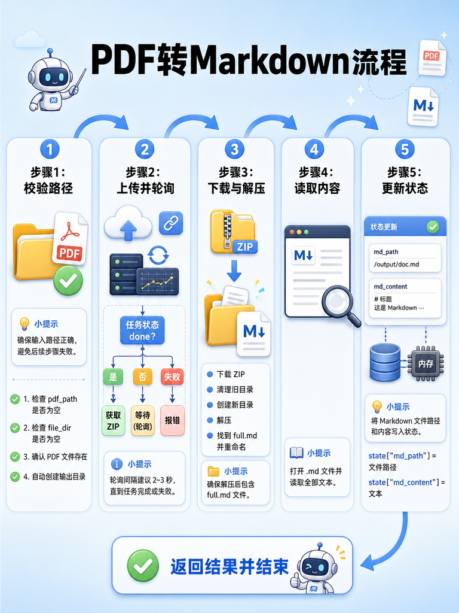

[TOC]

# 掌柜智库 - 【导入】PDF 转 Markdown 节点 

> 本文档详细介绍知识库导入流程的 PDF 转 Markdown 节点 

## 1. 任务目标

### 1.1 涉及模块 

```
processor/import_processor/nodes/
├── node_pdf_to_md.py     # PDF 转 Markdown 节点
config/
├── mineru_config.py	  # 读取MinerU配置
.env					# MinerU API配置
```

### 1.2 节点在流程中的位置


## 2. 节点业务流程

### 2.1 节点作用

解决非结构化 PDF 文档难以直接处理的痛点，利用 MinerU 高精度解析能力，将 PDF 转换为结构清晰、包含图片引用的 Markdown 格式，为后续的文本切分和图片理解打下基础。

### 2.2 实现思路

1. **云端算力卸载**: 考虑到本地 OCR 和布局分析的资源消耗巨大，本节点采用“云端 API”模式，将繁重的解析任务卸载到 MinerU 服务端。

   官网：[MinerU | 一站式 PDF 文档解析工具 | 在线API + 离线部署 + 桌面客户端](https://mineru.net/)
2. **异步轮询机制**: 针对大文件解析耗时较长的问题，设计了“上传 -> 提交 -> 轮询 -> 下载”的异步交互流程，通过固定间隔轮询状态，避免长连接超时。
3. **完整性保障**: 解析完成后，不仅提取 Markdown 文本，还同步下载并解压关联的图片资源，保持文档的多模态完整性。

### 2.3 步骤分解

1.  **准备参数**: 获取 PDF 路径和输出目录。
2.  **请求上传**: 调用 MinerU 在线 API (`/file-urls/batch`) 获取上传链接（签名 URL）。
3.  **上传文件**: 将 PDF 文件 上传到签名 URL。
4.  **轮询结果**: 循环查询任务状态 (`/extract-results/batch/{batch_id}`)，直到完成。
5.  **获取结果**: 下载生成的 ZIP 包，解压并读取 `.md` 文件内容到 state。

### 2.4 需求分析

**输入：**

- `pdf_path`：PDF 文件路径
- `file_dir`：输出目录（可选，默认为 PDF 所在目录）

**输出：**

- `md_path`：转换后的 Markdown 文件路径

**依赖：**

- MinerU API
- MinerU Config

**边界条件：**

| 场景                      | 处理方式                   |
| ------------------------- | -------------------------- |
| `pdf_path` 为空           | 抛出 `StateFieldError`     |
| `pdf_path` 物理文件不存在 | 抛出 `FileProcessingError` |
| `file_dir`为空            | 抛出 `StateFieldError`     |
| 输出目录不存在            | MinerU 会自动创建          |
| MinerU 转换失败           | 抛出 `PdfConversionError`  |
| MinerU配置不存在          | 抛出`ConfigurationError`   |

### 2.5 代码实现

#### 2.5.1 单元测试

```python
if __name__ == "__main__":

    setup_logging()

    init_state = {
        "pdf_path": r"D:\doc\hak180产品安全手册.pdf",
        "file_dir": r"D:\output"
    }
    node_pdf_to_md = NodePDFToMD()
    result = node_pdf_to_md(init_state)

    logging.getLogger().info(json.dumps(result, ensure_ascii=False, indent=4))
```

#### 2.5.2 主流程

##### 流程图



##### process

```python
# processor/import_processor/nodes/node_pdf_to_md.py
import json
import logging
import shutil
import time
import zipfile
from pathlib import Path

import requests

from config.mineru_config import mineru_config
from processor.import_processor.base import BaseNode, setup_logging
from processor.import_processor.exceptions import StateFieldError, FileProcessingError, ConfigurationError, \
    PdfConversionError
from processor.import_processor.state import ImportGraphState


class NodePDFToMD(BaseNode):
    """
    PDF 转 Markdown 节点：PDF结构化解析
    """

    name = "node_pdf_to_md"

    def process(self, state: ImportGraphState):
        """
        :param state: `pdf_path`、`file_dir`
        :return: `md_path`、`md_content`
        """

        # 步骤1：校验PDF路径和输出目录
        pdf_path_obj, output_dir_obj = self._step_1_validate_paths(state)

        # 步骤2：上传PDF至MinerU并轮询解析结果
        zip_url = self._step_2_upload_and_poll(pdf_path_obj)

        # 步骤3：下载ZIP包并提取MD文件
        md_path = self._step_3_download_and_extract(zip_url, output_dir_obj, pdf_path_obj.stem)

        # 步骤4：读取md的内容
        with open(md_path, "r", encoding="utf-8") as f:
            md_content = f.read()

        # 步骤5：更新state状态
        state["md_path"] = md_path
        state["md_content"] = md_content

        return state

```

##### 步骤 1: 校验路径

这一步负责检查 `state` 中的参数，并确保文件存在

⚠️ **注意缩进：**需要定义在NodePDFToMD类的成员中

```python

    def _step_1_validate_paths(self, state: ImportGraphState):
        """
        步骤1：校验PDF文件路径和输出目录
        核心职责：参数非空校验 | 路径转换 | PDF文件有效性校验 | 输出目录自动创建
        返回：合法的PDF文件Path对象、输出目录Path对象
        异常：StateFieldError(参数缺失)、FileProcessingError(文件无效)
        """

        # 1、参数非空校验
        pdf_path = state.get("pdf_path")
        if not pdf_path:
            raise StateFieldError(field_name='pdf_path', expected_type=str)

        file_dir = state.get("file_dir")
        if not file_dir:
            raise StateFieldError(field_name='file_dir', expected_type=str)

        # 2、转换为Path对象统一处理路径
        pdf_path_obj = Path(pdf_path)
        file_dir_obj = Path(file_dir)

        # 3、PDF文件有效性校验
        if not pdf_path_obj.exists():
            raise FileProcessingError(message=f"PDF文件{pdf_path_obj.name}不存在")

        # 4、确保输出目录存在，不存在则递归创建
        if not file_dir_obj.exists():
            self.logger.info(f"输出目录不存在，自动创建：{file_dir_obj.absolute()}")
            file_dir_obj.mkdir(parents=True, exist_ok=True)

        return pdf_path_obj, file_dir_obj
```

##### 步骤 2: 上传与轮询

这一步实现了与 MinerU API 的交互，包括申请上传链接、上传文件、提交任务和轮询状态。

###### 申请 MinerU API Token

https://mineru.net/apiManage/token

###### 添加 MinerU 配置

```properties
#.env

# ====================
# MinerU API
# ====================
MINERU_API_TOKEN=xxxxxxxxxxxx
MINERU_BASE_URL=https://mineru.net/api/v4
```

###### 创建 MinerU 配置文件

```python
# config/mineru_config.py

from dataclasses import dataclass
import os
from dotenv import load_dotenv

# 提前加载.env配置文件
load_dotenv()

# 定义minerU服务配置
@dataclass
class MineruConfig:
    base_url: str
    api_token : str

mineru_config = MineruConfig(
    base_url=os.getenv("MINERU_BASE_URL"),
    api_token=os.getenv("MINERU_API_TOKEN")
)
```

###### 核心业务流程

```python
    def _step_2_upload_and_poll(self, pdf_path_obj: Path):
        """
        步骤2：上传PDF至MinerU并轮询解析任务状态
        核心流程：获取上传链接 → 文件上传 → 任务轮询（直至完成/失败/超时）
        参数：pdf_path_obj-已校验的PDF Path对象
        返回：解析结果ZIP包下载链接full_zip_url
        异常：ConfigurationError(配置缺失)、PdfConversionError(请求/上传失败)、TimeoutError(任务超时)
        """

        # 1. 从MinerU服务器获取上传链接
        token = mineru_config.api_token
        url = f"{mineru_config.base_url}/file-urls/batch"
        header = {
            "Content-Type": "application/json",
            "Authorization": f"Bearer {token}"
        }
        data = {
            "files": [
                {"name": pdf_path_obj.name}
            ],
            "model_version": "vlm"
        }

        # 获取上传url和任务的batch_id
        response = requests.post(url, headers=header, json=data)

        # 对响应结果进行校验
        # 先校验http状态
        if response.status_code != 200:
            raise PdfConversionError(message=f"获取上传链接响应失败：状态码：{response.status_code}，响应结果：{response}")

        # 校验业务码
        result = response.json()
        if result.get("code") != 0:
            raise PdfConversionError(f"获取上传链接失败：返回数据：{result}")

        # 获取响应结果
        signed_url = result["data"]["file_urls"][0]
        batch_id = result["data"]["batch_id"]

        # 2. 文件上传
        with open(pdf_path_obj, "rb") as f:
            res_upload = requests.put(signed_url, data=f)
            if res_upload.status_code != 200:
                raise PdfConversionError(f"文件上传失败：状态码：{res_upload.status_code}，响应结果：{res_upload}")

            self.logger.info(f"文件上传成功！")

        # 3. 批量获取任务结果
        poll_url = f"{mineru_config.base_url}/extract-results/batch/{batch_id}"

        start_time = time.time()  # 记录开始时间
        timeout_seconds = 600  # 最大超时时间
        poll_interval = 3  # 轮询间隔时间
        self.logger.info(f"【任务轮询】最大超时：{timeout_seconds}s，batch_id：{batch_id}")

        # 4. 根据batch_id轮询任务状态直到成功"done"
        while True:
            # 已消耗时间
            elapsed_time = time.time() - start_time
            if elapsed_time > timeout_seconds:
                raise TimeoutError(f"【任务轮询】超时！任务处理超{timeout_seconds}秒，batch_id：{batch_id}")

            # 发起轮询请求，短超时10秒，异常则重试
            try:
                res_poll = requests.get(url=poll_url, headers=header, timeout=10)
            except Exception as e:
                self.logger.warning(f"【任务轮询】网络请求异常，{poll_interval}秒后重试：{str(e)}，bactch_id：{batch_id}")
                time.sleep(poll_interval)
                continue

            # 处理HTTP响应错误
            if res_poll.status_code != 200:
                raise PdfConversionError(f"【任务轮询】HTTP请求失败，状态码：{res_poll.status_code}，响应内容：{res_poll}")

            # 解析轮询结果，校验业务状态
            poll_data = res_poll.json()
            if poll_data["code"] != 0:
                raise PdfConversionError(f"【任务轮询】业务错误，返回数据：{poll_data}")

            extract_results = poll_data["data"]["extract_result"]

            # 获取结果
            result_item = extract_results[0]
            data_state = result_item["state"]

            # 状态为 done
            if data_state == "done":
                self.logger.info(f"【任务轮询】解析任务完成！总耗时{int(elapsed_time)}s，bactch_id：{batch_id}")

                full_zip_url = result_item["full_zip_url"]
                self.logger.info(f"【任务轮询】返回ZIP包下载链接：{full_zip_url}，bactch_id：{batch_id}")

                return full_zip_url

            elif data_state == "failed":
                err_msg = result_item.get("err_msg", "未知错误，无具体信息")
                raise PdfConversionError(f"【任务轮询】解析任务失败！batch_id：{batch_id}，错误信息：{err_msg}")

            else:
                self.logger.info(f"【任务轮询】处理中... 已耗时{int(elapsed_time)}s，状态：{data_state}， batch_id：{batch_id}")
                time.sleep(poll_interval)
```

##### 步骤 3: 下载与解压

这一步负责下载 MinerU 返回的 ZIP 包，解压并提取目标 Markdown 文件。

```python

    def _step_3_download_and_extract(self, zip_url: str, output_dir_obj: Path, pdf_stem: str) -> str:
        """
       步骤3：下载MinerU解析结果ZIP包并解压，提取目标MD文件
       核心流程：下载ZIP → 清理旧目录并解压 → 查找MD文件 → 重命名统一为PDF同名
       参数：zip_url-ZIP包下载链接；output_dir_obj-输出目录Path；pdf_stem-PDF无后缀纯名称
       返回：最终MD文件的字符串格式绝对路径
       异常：RuntimeError(下载失败)
       """

        # 1、下载ZIP包
        self.logger.info(f"【ZIP下载】开始下载ZIP包：{zip_url} ...")
        response = requests.get(zip_url)

        # 对响应结果进行校验
        if response.status_code != 200:
            raise RuntimeError(f"【ZIP下载】ZIP包下载失败：状态码：{response.status_code}，响应结果：{response}")

        # 拼接ZIP包保存路径并保存
        zip_save_path = output_dir_obj / f"{pdf_stem}_result.zip"
        with open(zip_save_path, "wb") as f:
            f.write(response.content)
        self.logger.info(f"【ZIP下载】ZIP包下载成功：保存路径：{zip_save_path}")


        # 2. 如果目标文件夹已存在，先删除（确保环境干净）
        extract_target_dir = output_dir_obj / pdf_stem
        if extract_target_dir.exists():
            shutil.rmtree(extract_target_dir)
        self.logger.info(f"【ZIP解压】已清空旧的解压目录：{extract_target_dir}")

        # 3、创建解压目录
        extract_target_dir.mkdir(parents=True, exist_ok=True)

        # 4、解压
        self.logger.info(f"【ZIP解压】开始解压ZIP包：{output_dir_obj} ...")
        with zipfile.ZipFile(zip_save_path, "r") as zip_file_obj:
            zip_file_obj.extractall(extract_target_dir)
        self.logger.info(f"【ZIP解压】ZIP解压完成，解压目录：{extract_target_dir}")

        # 5、重命名
        self.logger.info(f"【MD重命名】找到MinerU生成的full.md文件")
        target_md_file = extract_target_dir / "full.md"
        self.logger.info(f"【MD重命名】开始将full.md文件进行重命名")
        new_md_path = target_md_file.with_name(f"{pdf_stem}.md")
        target_md_file.rename(new_md_path)
        self.logger.info(f"【MD重命名】重命名成功，文件名：{pdf_stem}.md")

        return str(new_md_path.absolute())
```

###### 关键语法补充说明

| 函数 / 方法                 | 所属模块 / 对象 |                           核心作用                           |                           关键特点                           |
| :-------------------------- | :-------------: | :----------------------------------------------------------: | :----------------------------------------------------------: |
| `zipfile.ZipFile(..., 'r')` |     zipfile     |         以只读模式打开 ZIP 压缩包，创建 ZIP 操作对象         |     需配合`with`语句使用，自动释放文件句柄，避免资源泄漏     |
| `zip_file_obj.extractall()` | zipfile.ZipFile | 将 ZIP 包内**所有文件 / 目录**解压至指定目录，保留原内部目录结构 |    一键解压，无需遍历文件，适配 MinerU 返回的 ZIP 包格式     |
| `shutil.rmtree()`           |     shutil      |            递归删除指定目录及所有子文件 / 子目录             | 比`os.rmdir`更彻底（os.rmdir 仅删除空目录），适合清理旧解压目录 |
| `Path.with_name(新文件名)`  |  pathlib.Path   | 基于原路径，**仅修改文件名**，保留父目录，返回**新的 Path 对象** | 不修改实际文件，仅生成路径；自动保留父目录，无需手动拼接路径 |
| `Path.rename(新路径)`       |  pathlib.Path   | 将文件 / 目录从原路径**重命名 / 移动**至新路径，实际修改文件系统 | 若新路径已存在会报错；需捕获异常，处理文件被占用 / 权限不足等场景 |

