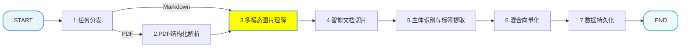
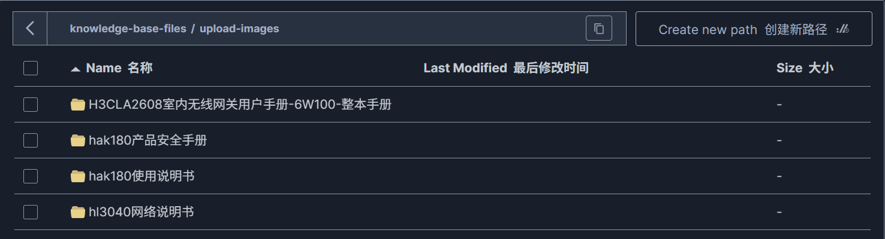

[TOC]

# 掌柜智库 - 【导入】MD图片处理节点 

> 本文档详细介绍知识库导入流程的MD图片处理节点 

## 1. 任务目标 

### 1.1 涉及模块 

```
processor/import_processor/nodes/
├── node_md_img.py     		# MD图片处理节点
config/
├── lm_config.py	  		# 读取大模型配置
├── minio_config.py			# 读取minio配置
utils/
├── minio_utils.py			# 初始化minio客户端
.env					   # minio配置
```

### 1.2 节点在流程中的位置



## 2. 节点业务流程

### 2.1 节点作用

实现文档的“多模态语义对齐”。

### 2.2 实现思路

1.  **图文解耦与持久化**： 将图片从本地文件系统迁移到 MinIO 对象存储，实现计算节点与存储分离，确保知识库在不同环境下的可访问性。
2.  **语义增强**：引入 qwen3-vl-flash 或其他 VLM 模型（多模态模型），对每张图片进行“看图说话”，将视觉信息转化为文本摘要。这使得原本不可被搜索的图片，能够通过文本语义被检索到（如搜索“架构图”能找到对应的图片）。
3.  **速率控制**： 在调用 VLM API 时加入速率限制（Rate Limit），防止因图片过多触发并发风控。

### 2.3 步骤分解

本节点负责处理 Markdown 文件中的图片，实现多模态信息的融合。

1.  **初始化与上下文获取 (Step 1)**： 从 `state` 中读取 Markdown 文件路径和内容。
2.  **扫描与筛选图片 (Step 2)**： 扫描 Markdown 中引用的本地图片，校验图片是否存在。
3.  **图片内容总结 (Step 3)**： 使用多模态大模型（如 qwen3-vl-flash 或其他 VL 模型）对图片生成中文摘要。为了避免 API 限流，实现了令牌桶算法进行速率控制（Rate Limit）。
4.  **上传与替换 (Step 4)**:：
    *   清理 MinIO 中对应的旧图片目录。
    *   将图片批量上传到 MinIO 对象存储。
    *   将 Markdown 中的本地图片路径替换为 MinIO 的 HTTP URL，并将生成的图片摘要填入 Markdown 图片的 Alt 文本中。
5.  **备份与保存 (Step 5)**: 将处理后的内容保存为 `_new.md` 文件，并更新 `state` 中的路径。

### 2.4 代码实现

#### 2.4.1 单元测试

```python
if __name__ == "__main__":

    setup_logging()

    md_path = r"D:\output\hak180产品安全手册\hak180产品安全手册.md"
    with open(md_path, "r", encoding="utf-8") as f:
        md_content = f.read()

    init_state = {
        "md_path": md_path,
        "md_content": md_content
    }

    # 执行核心处理流程
    node_md_img = NodeMDImg()
    result = node_md_img(init_state)

    logging.getLogger().info(json.dumps(result, ensure_ascii=False, indent=4))
```

#### 2.4.2 主流程

##### 流程图


##### process

```python
# processor/import_processor/nodes/node_md_img.py
import base64
import json
import logging
import os
import re
import time
from collections import deque
from pathlib import Path
from typing import Tuple, List, Dict, Deque

from langchain_openai import ChatOpenAI
from minio import Minio
from minio.deleteobjects import DeleteObject
from openai import OpenAI

from config.lm_config import lm_config
from config.minio_config import minio_config
from processor.import_processor.base import BaseNode, setup_logging
from processor.import_processor.exceptions import StateFieldError, FileProcessingError
from processor.import_processor.state import ImportGraphState
from utils.minio_utils import get_minio_client


class NodeMDImg(BaseNode):
    """
    MarkDown图片处理节点：多模态图片理解
    """

    name = "node_md_img"

    def process(self, state: ImportGraphState):

        """
        MD文件图片处理核心节点
        核心流程：
        1. 获取MD内容、文件路径、图片文件夹路径
        2. 扫描图片文件夹，筛选MD中实际引用的支持格式图片
        3. 调用多模态大模型为图片生成内容摘要
        4. 将图片上传至MinIO，替换MD中本地图片路径为MinIO访问URL，并填充图片摘要
        5. 备份原MD文件，保存处理后的新MD文件并更新状态

        :param state: md_path、md_content
        :return: md_path、md_content
        """

        # 步骤1：初始化数据，获取MD核心信息
        md_content, md_path_obj, images_dir = self._step_1_get_content(state)
        if not images_dir.exists():
            self.logger.info("无图片文件夹，跳过图片处理")
            return state

        # 步骤2：扫描并筛选MD中引用的图片
        target_images = self._step_2_scan_images(md_content, images_dir)
        if not target_images:
            self.logger.info("未检测到MD中引用了图片，跳过图片处理")
            return state

        # 步骤3：调用多模态大模型生成图片摘要
        summaries = self._step_3_generate_summaries(md_path_obj.stem, target_images)

        # 步骤4：上传图片至MinIO，替换MD图片路径并填充摘要
        new_md_content = self._step_4_upload_and_replace(md_path_obj.stem, target_images, summaries, md_content)

        # 步骤5：备份并保存新MD文件
        new_md_file_name = self._step_5_backup_new_md_file(state['md_path'], new_md_content)

        # 步骤6：更新state状态值
        state["md_content"] = new_md_content
        state["md_path"] = new_md_file_name

        return state
```

##### 步骤 1: 获取内容和路径

```python
    def _step_1_get_content(self, state: ImportGraphState) -> Tuple[str, Path, Path]:
        """
        从全局状态中提取并初始化MD处理所需核心数据
        :param state: 流程全局状态对象
        :return: 元组(MD文件内容, MD文件路径, 图片文件夹路径)
        :raise FileProcessingError: 当状态中无有效MD文件路径时抛出
        """

        # 1、参数非空校验
        md_path = state.get("md_path")
        if not md_path:
            raise StateFieldError(field_name='md_path', expected_type=str)

        # 2、路径转换
        md_path_obj = Path(md_path)

        # 3、检查PDF文件的有效性
        if not md_path_obj.exists():
            raise FileProcessingError(message=f"MD文件{md_path_obj.name}不存在")

        # 4、获取md_content
        md_content = state["md_content"]

        # 5、组装图片文件夹路径：图片文件夹固定为MD文件同级的images目录
        images_dir = md_path_obj.parent / "images"

        return md_content, md_path_obj, images_dir
```

##### 步骤 2: 图片扫描

```python
    def _step_2_scan_images(self, md_content: str, images_dir: Path) -> List[Tuple[str, str, Tuple[str, str]]]:
        """
        扫描图片文件夹，过滤出「支持格式+MD中实际引用」的图片，组装处理元数据
        :param md_content: MD文件完整内容
        :param images_dir: 图片文件夹路径对象
        :return: 待处理图片列表，每个元素为(图片文件名, 图片完整路径, 图片上下文)元组
        """

        # 1. 定义待处理图片列表
        target_images = []

        # 2. 遍历图片文件夹
        for image_file in os.listdir(images_dir):

            # 2.1 过滤无效后缀
            file_ext = os.path.splitext(image_file)[1].lower()
            if file_ext not in self.config.image_extensions:
                self.logger.warning(f"图片格式不支持，跳过：{image_file}")
                continue

            # 1.2 组装图片完整路径并转成字符串
            img_path = str(images_dir / image_file)

            # 1.3 查找图片在MD中的引用上下文
            context = self._find_image_in_md(md_content, image_file)

            # 过滤MD中未引用的图片
            if not context:
                self.logger.warning(f"图片未在MD中引用，跳过处理：{image_file}")
                continue

            # 1.4 组装待处理图片元数据，取第一个匹配的图片上下文
            target_images.append((image_file, img_path, context))

        return target_images

    def _find_image_in_md(self, md_content: str, image_file: str, context_len: int = 100) -> Tuple[str, str]:
        """
        查找MD内容中指定图片的所有引用位置，并返回每个位置的上下文文本
        :param md_content: MD文件完整内容
        :param image_file: 图片文件名（含后缀）
        :param context_len: 上下文截取长度，默认前后各100字符
        :return: 每个图片的(上文, 下文)元组，无匹配则返回None
        """

        # 1、定义正则表达式
        # 
        # r"字符串"：不要将其中的特殊符号进行转义
        # re.escape 转义图片文件名中的特殊字符，避免正则语法错误
        # .* 贪婪匹配 .*? 非贪婪匹配
        pattern = re.compile(r"!\[.*?\]\(.*?" + re.escape(image_file) + r".*?\)")

        # 2、找到1个匹配项即返回
        match = pattern.search(md_content)
        if not match:
            return None  # 没有找到

        # 3、截取匹配位置的上文和下文（防止索引越界）
        start, end = match.span()
        pre_text = md_content[max(0, start - context_len):start]
        post_text = md_content[end:min(len(md_content), end + context_len)]

        # 4、返回上下文元组
        return pre_text, post_text
```

##### 步骤3：图片摘要

###### 添加LLM和VL的配置

```ini
#.env

# ====================
# OpenAI / LLM API (DashScope compatible)
# ====================
# API 密钥（兼容 OpenAI 格式）
OPENAI_API_KEY=xxxxxxxxxxxxxxxxxxxxxxxxxxxxxxxxx
# API 基础地址（阿里云 DashScope）
OPENAI_API_BASE=https://dashscope.aliyuncs.com/compatible-mode/v1
# 默认 LLM 模型
LLM_DEFAULT_MODEL=qwen-flash
# 默认温度参数（0-1，越低越稳定）
LLM_DEFAULT_TEMPERATURE=0.1
# 视觉语言模型
VL_MODEL=qwen3-vl-flash
# 商品名识别模型
ITEM_MODEL=qwen-flash
```

###### 创建模型配置文件

```python
# config/lm_config.py

from dataclasses import dataclass
import os
from dotenv import load_dotenv

load_dotenv()

@dataclass
class LLMConfig:
    base_url: str
    api_key : str
    vl_model: str
    llm_model: str
    item_model: str
    llm_temperature: float

lm_config = LLMConfig(
    base_url=os.getenv("OPENAI_API_BASE"),
    api_key=os.getenv("OPENAI_API_KEY"),
    vl_model=os.getenv("VL_MODEL"),
    llm_model=os.getenv("LLM_DEFAULT_MODEL"),
    item_model=os.getenv("ITEM_MODEL"),
    llm_temperature=float(os.getenv("LLM_DEFAULT_TEMPERATURE"))
)
```

###### 核心业务流程

为了避免触发大模型的 API 速率限制，我们实现了简单的令牌桶算法。

限流规则：[大模型服务平台百炼控制台](https://bailian.console.aliyun.com/cn-beijing/?spm=5176.29597918.J_SEsSjsNv72yRuRFS2VknO.2.460a133cc4s3P7&tab=doc#/doc/?type=model&url=2840182)

```python
    def _step_3_generate_summaries(self, doc_stem: str, target_images: List[Tuple[str, str, Tuple[str, str]]]) -> Dict[
        str, str]:
        """
        步骤3：批量为待处理图片生成内容摘要，带API速率限制防止触发大模型限流
        :param doc_stem: 文档文件名（不含后缀），作为大模型prompt上下文
        :param targets: 待处理图片列表，元素为(图片文件名, 图片完整路径, 图片上下文)
        :param requests_per_minute: 每分钟最大API请求数，默认9次（按大模型限制调整）
        :return: 图片摘要字典，键：图片文件名，值：图片内容摘要
        """
        summaries = {}

        # 1、外部初始化双端队列，用于API速率限制，跨循环复用
        request_deque = deque()

        # 2、循环处理图片
        for img_file, image_path, context in target_images:
            # 2.1、速率限制
            self._apply_api_rate_limit(request_deque, max_requests=10)

            # 2.2、调用大模型生成图片摘要
            summaries[img_file] = self._summarize_image(image_path, root_folder=doc_stem, image_content=context)

        return summaries

    def _apply_api_rate_limit(
            self,
            request_times: Deque[float],
            max_requests: int,
            window_seconds: int = 60
    ) -> None:
        """
        通用滑动窗口API速率限制器（抽离为公共工具）
        核心逻辑：维护请求时间戳双端队列，窗口内请求数超上限则自动等待，防止触发第三方API限流
        :param request_times: 存储请求时间戳的双端队列，需外部初始化（全局/单例），跨调用复用
        :param max_requests: 速率限制窗口内的最大允许请求次数
        :param window_seconds: 速率限制滑动窗口时长，默认60秒（1分钟）
        :return: None，超出限制时会阻塞等待
        """
        current_time = time.time()

        # 1. 清理滑动窗口外的过期请求时间戳，保证队列仅存窗口内的请求
        while request_times and current_time - request_times[0] >= window_seconds:
            request_times.popleft()

        # 2. 窗口内请求数达上限，计算并阻塞等待剩余时间
        if len(request_times) >= max_requests:
            # 计算需要等待的时长（窗口总时长 - 最早请求已存在的时长）
            sleep_duration = window_seconds - (current_time - request_times[0])
            if sleep_duration > 0:
                logging.getLogger().info(
                    f"触发API速率限制，窗口{window_seconds}秒内最多{max_requests}次，需等待：{sleep_duration:.2f} 秒")
                time.sleep(sleep_duration)
                # 等待后更新当前时间，重新清理过期请求（避免等待期间有请求过期）
                current_time = time.time()
                while request_times and current_time - request_times[0] >= window_seconds:
                    request_times.popleft()

        # 3. 记录当前请求时间戳，加入滑动窗口队列
        request_times.append(current_time)
        logging.getLogger().info(f"API请求时间戳已记录，当前{window_seconds}秒窗口内请求数：{len(request_times)}")
```

这一步调用多模态大模型（如 Qwen-VL）来生成图片的中文摘要，作为 Markdown 图片的 Alt Text

```python
    def _summarize_image(self, image_path: str, root_folder: str, image_content: Tuple[str, str]) -> str:
        """
           调用多模态大模型总结图片内容。

           参数：
           - image_path: 图片本地路径。
           - root_folder: 文档所属文件夹名（提供更多上下文）。
           - image_content: 图片在文档中的上下文 (前文, 后文)。
        """
        with open(image_path, "rb") as img_file:
            base64_image = base64.b64encode(img_file.read()).decode("utf-8")

        try:
            chat_model = ChatOpenAI(
                model=lm_config.vl_model,
                api_key=lm_config.api_key,
                base_url=lm_config.base_url,
                temperature=lm_config.llm_temperature
            )
            messages = [
                {
                    "role": "user",
                    "content": [
                        {
                            "type": "text",
                            "text": f"""这是"{root_folder}"文件中的一张图片，图片上文部分为"{image_content[0]}"，下文部分为"{image_content[1]}"，请用中文简要总结这张图片的内容，用于 Markdown 图片标题。"""
                        },
                        {
                            "type": "image_url",
                            "image_url": {
                                "url": f"data:image/jpeg;base64,{base64_image}"
                            }
                        }
                    ]
                }
            ]
            response = chat_model.invoke(messages)
            return response.content.strip().replace("\n", "")

        except Exception as e:
            self.logger.error(f"图像总结失败：{image_path}, 错误{e}")
            return "图片描述"
```


##### 步骤 4: 上传与替换

这一步将图片上传到 MinIO 对象存储，并将 Markdown 中的本地图片路径替换为 MinIO 的 URL，同时填入生成的摘要。



MinIO SDK参考：[Python 客户端 API 参考 — MinIO 对象存储 for Linux - MinIO 文档](https://min-io.cn/docs/minio/linux/developers/python/API.html#)

###### 添加 MinIO配置

```ini
#.env

# ====================
# Object Storage (MinIO)
# ====================
# MinIO 服务端点
MINIO_ENDPOINT=192.168.100.100:9000
# 访问密钥
MINIO_ACCESS_KEY=minioadmin
# 私有密钥
MINIO_SECRET_KEY=minioadmin
# 存储桶名称
MINIO_BUCKET_NAME=knowledge-base
# 图片上传目录
MINIO_IMG_DIR=upload-images
```

###### 创建minio_config配置

```python
# config/minio_config.py

from dataclasses import dataclass
import os
from dotenv import load_dotenv

load_dotenv()

@dataclass
class MinIOConfig:
    endpoint: str
    access_key: str
    secret_key: str
    bucket_name: str
    img_dir: str

minio_config = MinIOConfig(
    endpoint=os.getenv("MINIO_ENDPOINT"),
    access_key=os.getenv("MINIO_ACCESS_KEY"),
    secret_key=os.getenv("MINIO_SECRET_KEY"),
    bucket_name=os.getenv("MINIO_BUCKET_NAME"),
    img_dir=os.getenv("MINIO_IMG_DIR"),
)
```

###### 定义minio_utils客户端工具

```python
# utils/minio_utils.py

import json
from minio import Minio
from config.minio_config import minio_config
try:
    minio_client = Minio(
        endpoint=minio_config.endpoint,
        access_key=minio_config.access_key,
        secret_key=minio_config.secret_key,
        secure=False)
    # secure=False 是否启用HTTPS加密连接；False=用HTTP，True=用HTTPS；本地/内网部署一律写False
    if not minio_client.bucket_exists(minio_config.bucket_name):
        minio_client.make_bucket(minio_config.bucket_name)
    # 设置存储桶策略为 Public Read (只读权限开放给匿名用户)
    # 这样前端可以直接通过 URL 访问图片，而不需要预签名 URL
    policy = {
        "Version": "2012-10-17",
        "Statement": [
            {
                "Effect": "Allow",
                "Principal": {"AWS": ["*"]},
                "Action": ["s3:GetObject"],
                "Resource": [f"arn:aws:s3:::{minio_config.bucket_name}/*"]
            }
        ]
    }
    minio_client.set_bucket_policy(minio_config.bucket_name, json.dumps(policy))
except Exception as e:
    print("Minio init failed:{e}")
    minio_client = None

def get_minio_client():
    return minio_client
```

###### 核心业务流程

```python
    def _step_4_upload_and_replace(self, doc_stem: str, target_images: List[Tuple[str, str, Tuple[str, str]]],
                                   summaries: Dict[str, str], md_content: str) -> str:
        """
        步骤 4: 上传图片并合并信息，然后替换 Markdown 中的内容。

        流程：
        1. 确定 MinIO 上的上传目录（按文档名隔离）。
        2. 清理该目录下的旧数据。
        3. 批量上传图片。
        4. 合并“图片摘要”和“图片URL”。
        5. 替换 Markdown 文本中的图片引用。
        :param doc_stem: 文档文件名（不含后缀），作为MinIO上传子目录名（按文档隔离）
        :param target_images: 待处理图片列表，元素为(图片文件名, 图片完整路径, 图片上下文)
        :param summaries: 图片摘要字典，键：图片文件名，值：内容摘要
        :param md_content: 原始MD文件内容
        :return: 图片引用替换后的新MD内容
        """

        # 获取MinIO客户端
        minio_client = get_minio_client()

        # 构造上传目录，去除文件名中的空格
        minio_img_dir = minio_config.img_dir
        upload_dir = f"{minio_img_dir}/{doc_stem}".replace(" ", "")

        # 步骤1：清理该文档对应的MinIO旧目录
        self._clean_minio_directory(minio_client, upload_dir)

        # 步骤2：批量上传图片至MinIO，获取URL映射
        urls = self._upload_images_batch(minio_client, upload_dir, target_images)

        # 步骤3：合并图片摘要和URL，过滤上传失败的图片
        image_info = self._merge_summary_and_url(summaries, urls)

        # 步骤4：替换MD内容中的本地图片引用为MinIO远程引用
        md_content = self._process_md_file(md_content, image_info)

        return md_content

    def _clean_minio_directory(self, minio_client: Minio, prefix: str) -> None:
        """
        幂等性清理：上传前先删除 MinIO 中指定目录下的旧文件。
        防止重名文件导致的内容混淆或垃圾堆积。
        :param minio_client: 初始化完成的MinIO客户端对象
        :param prefix: MinIO目录前缀（要清理的目录路径）
        """
        try:
            objects_to_delete = minio_client.list_objects(minio_config.bucket_name, prefix=prefix, recursive=True)
            # 构造删除列表
            delete_list = [DeleteObject(obj.object_name) for obj in objects_to_delete]
            if delete_list:
                errors = minio_client.remove_objects(minio_config.bucket_name, delete_list)
                for error in errors:
                    self.logger.error(f"删除失败：{error}")
        except Exception as e:
            self.logger.error(f"清理minio目录失败：{e}")

    def _upload_images_batch(self, minio_client: Minio, upload_dir: str, target_images: List[Tuple]) -> Dict[str, str]:
        """
        批量上传待处理图片至MinIO，返回图片文件名与访问URL的映射关系
        :param minio_client: 初始化完成的MinIO客户端对象
        :param upload_dir: MinIO上传根目录
        :param target_images: 待处理图片列表，元素为(图片文件名, 图片完整路径, 图片上下文)
        :return: 图片URL字典，键：图片文件名，值：MinIO访问URL
        """
        urls = {}
        for img_file, img_path, _ in target_images:
            object_name = f"{upload_dir}/{img_file}"
            urls[img_file] = self._upload_to_minio(minio_client, img_path, object_name)
        return urls

    def _upload_to_minio(self, minio_client: Minio, local_path: str, object_name: str) -> str | None:
        """
        将单张本地图片上传至MinIO对象存储，并返回公网可访问URL
        :param minio_client: 初始化完成的MinIO客户端对象
        :param local_path: 图片本地完整路径
        :param object_name: MinIO中要存储的对象名称
        :return: 图片MinIO访问URL（上传失败返回None）
        """
        try:
            # 上传本地文件至MinIO（fput_object：文件流上传，适合大文件）
            minio_client.fput_object(
                bucket_name=minio_config.bucket_name,  # MinIO存储桶名（从配置读取）
                object_name=object_name,  # MinIO对象名称
                file_path=local_path,  # 本地文件路径
                # 关键规则：多后缀文件仅拆分最后一个，如test.tar.gz拆分为("test.tar", ".gz")。
                content_type=f"image/{os.path.splitext(local_path)[1][1:]}"
            )

            # 构造MinIO基础访问URL
            base_url = f"http://{minio_config.endpoint}/{minio_config.bucket_name}"

            return f"{base_url}/{object_name}"

        except Exception as e:
            self.logger.error(f"图片上传MinIO失败：{local_path}，错误信息：{str(e)}")

    def _merge_summary_and_url(self, summaries: Dict[str, str], urls: Dict[str, str]) -> Dict[str, Tuple[str, str]]:
        """
        合并图片摘要字典和URL字典，过滤掉上传失败无URL的图片
        :param summaries: 图片摘要字典，键：图片文件名，值：内容摘要
        :param urls: 图片URL字典，键：图片文件名，值：MinIO访问URL
        :return: 合并后的图片信息字典，键：图片文件名，值：(摘要, URL)元组
        """
        image_info = {}
        for image_file, summary in summaries.items():
            if url := urls.get(image_file):
                image_info[image_file] = (summary, url)
        return image_info

    def _process_md_file(self, md_content: str, image_info: Dict[str, Tuple[str, str]]) -> str:
        """
        核心功能：替换MD内容中的本地图片引用为MinIO远程引用
        替换规则： → 
        :param md_content: 原始MD文件内容
        :param image_info: 合并后的图片信息字典，键：图片文件名，值：(摘要, URL)
        :return: 替换后的新MD内容
        """

        # 遍历 image_info 字典的每一项：key=图片文件名，value=(摘要, 新URL)
        for image_file, (summary, new_url) in image_info.items():

            # 正则匹配MD图片标签，忽略大小写
            # 正则规则：
            # re.escape: 转义图片文件名中的特殊字符，避免正则语法错误
            pattern = re.compile(r"!\[.*?\]\(.*?" + re.escape(image_file) + r".*?\)")

            # 替换匹配内容：使用新摘要作为图片描述，新URL作为图片路径
            # pattern.sub(替换规则, 待替换文本)
            # md_content = ..., 替换后原地更新
            md_content = pattern.sub(lambda m: f"", md_content)

        self.logger.info(f"MD文件图片引用替换完成，共替换{len(image_info)}处图片引用")

        return md_content
```

##### 步骤 5: 备份文件

```python
    def _step_5_backup_new_md_file(self, origin_md_path: str, md_content: str) -> str:
        """
        步骤5：将处理后的MD内容保存为新文件（原文件不变，避免数据丢失）
        新文件命名规则：原文件名 + _new.md（如test.md → test_new.md）
        :param origin_md_path: 原始MD文件完整路径
        :param md_content: 处理后的新MD内容
        :return: 新MD文件的完整路径
        """
        # 构造新文件路径：替换原后缀为 _new.md
        new_md_file_name = os.path.splitext(origin_md_path)[0] + "_new.md"

        # 写入新MD内容（覆盖写入，若文件已存在则更新）
        with open(new_md_file_name, "w", encoding="utf-8") as f:
            f.write(md_content)

        self.logger.info(f"处理后MD文件已保存，新文件路径：{new_md_file_name}")

        return new_md_file_name
```

###### 关键语法补充说明

`pattern.sub(lambda m: )` 和 `pattern.sub()` 的区别 ：使用 `lambda` 版本的函数可以兼容特殊字符

```python
# 原始 MD
import re

#原始md的content
md_content = "一些文本一些文本"
#要查找的图片文件名
img_filename = "img.png"
#一旦找到旧替换成新说明和minio上的url
summary = "新\s说明" #包含特殊字符 \s 必须使用 lambda
new_url = "https://minio/img.png"
#正则
pattern = re.compile(r"!\[.*?\]\(.*?" + re.escape(img_filename) + ".*?\)")
#匹配
#替换全部匹配的内容
md_content = pattern.sub(lambda m: f"", md_content)
# md_content = pattern.sub(f"", md_content)

print(md_content)
```


