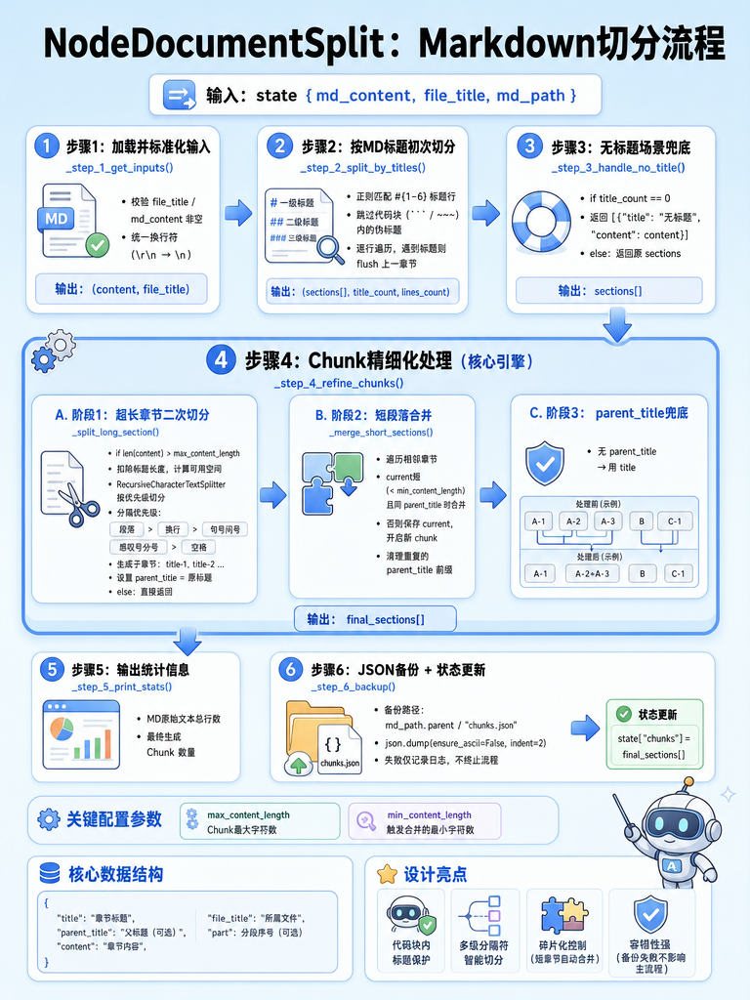

[TOC]

# 掌柜智库 - 【导入】文档切片节点 

> 本文档详细介绍知识库导入流程的文档切片节点 

## 1. 任务目标

### 1.1 涉及模块 

```
processor/import_processor/nodes/
├── node_document_split.py     		# 文档切片节点
```

### 1.2 节点在流程中的位置


### 1.3 节点在业务中的意义

在 RAG（检索增强生成）系统中，用户上传的文档不能直接丢给 LLM 处理，原因如下：

| 问题             | 说明                                                         |
| ---------------- | ------------------------------------------------------------ |
| **Token 限制**   | LLM 的上下文窗口有限，无法一次性处理整篇长文档               |
| **检索不精确**   | 如果不切分，检索时返回整篇文档，噪声过多，LLM 容易产生幻觉   |
| **向量化成本高** | 整篇文档做 Embedding，计算和存储成本都很高                   |
| **语义模糊**     | 嵌入模型对短文本的语义表达更精确，长文本的向量表示会"稀释"关键信息 |

切分的质量直接决定了后续检索和回答的质量：

- **切分太粗**：检索到的内容噪声多，LLM 回答不精确
- **切分太细**：上下文碎片化，LLM 无法理解完整语义
- **切分得当**：每个 chunk 语义完整、长度适中，检索精准、回答质量高

本节点采用 **"按标题结构切分 + 超长二次切分 + 过短合并"** 的三层策略，在语义完整性和检索精确度之间取得平衡。

## 2. 节点业务流程

### 2.1 节点作用

将长文档转化为适合向量检索的微观语义单元（Chunk）。通过智能切分策略，在保持语义完整性的前提下，控制切片长度，最大化检索的召回率和准确率。

### 2.2 实现思路

1.  **结构化优先**：摒弃简单的固定字符数切分，优先依据 Markdown 标题层级（Headers）进行逻辑分块，确保同一知识点的连贯性。
2.  **递归优化**：对于超长段落，采用“段落 -> 句子”的递归切分策略。先按换行符切，若仍超长则按句号切，确保切片不会在句子中间截断。
3.  **上下文保留**： 在每个切片中保留 `file_title` 和 `parent_title`（父级标题），为后续的 LLM 回答提供丰富的上下文背景。

### 2.3 步骤分解

本节点负责将 Markdown 文本切分为适合检索的 Chunk（片段）。采用“先按标题切分，再按长度优化”的策略。

1.  **获取输入 (Step 1)**：从 `state` 中提取 Markdown 内容、文件标题等输入数据。
2.  **标题初切 (Step 2)**：基于 Markdown 标题语法（#）进行第一轮粗略切分，保留层级结构。
3.  **无标题兜底 (Step 3)**：处理无标题的纯文本文件，避免丢失内容。
4.  **精细化处理 (Step 4)**：对过长的 Chunk 进行递归切分（按段落/句子），对过短的 Chunk 进行合并。
5.  **打印统计 (Step 5)**：输出切分结果的统计信息。
6.  **备份与更新 (Step 6)**：将切分结果更新到 `state` 并备份到本地 JSON 文件。

### 2.4 代码实现

#### 2.4.1 单元测试

```python
if __name__ == "__main__":

    setup_logging()

    md_path = r"D:\output\hak180产品安全手册\hak180产品安全手册_new.md"
    with open(md_path, "r", encoding="utf-8") as f:
        md_content = f.read()

    init_state = {
        "md_path": md_path,
        "md_content": md_content,
        "file_title": "hak180产品安全手册"
    }
    # 执行文档切分节点
    node_document_split = NodeDocumentSplit()
    result = node_document_split(init_state)

    logging.getLogger().info(json.dumps(result, ensure_ascii=False, indent=4))
```

#### 2.4.2 主流程定义 

##### 流程图



##### process

定义 `node_document_split` ，串联各个步骤。

```python
# processor/import_processor/nodes/node_document_split.py
import json
import logging
import re
from pathlib import Path
from typing import Tuple, List, Dict

from langchain_text_splitters import RecursiveCharacterTextSplitter

from processor.import_processor.base import BaseNode, setup_logging
from processor.import_processor.exceptions import StateFieldError
from processor.import_processor.state import ImportGraphState

class NodeDocumentSplit(BaseNode):
    """
    节点: 文档切分 (node_document_split)
    将长文档切分成小的 Chunks (切片) 以便检索。
    """

    # 覆盖基类的 name 属性，标识节点名称
    name: str = "node_document_split"

    def process(self, state: ImportGraphState) -> ImportGraphState:
        """
        节点：文档切分（node_document_split）
        整体流程：加载输入→按MD标题初切→长切短合→统计输出→结果备份
        核心目的：将长MD文档切分为长度适中的Chunk，适配大模型上下文窗口和向量检索
        后续扩展点：可在各步骤间新增Chunk元信息补充、自定义切分规则、向量入库前置处理等

        必要参数：md_content、file_title
        更新参数：chunks

        :param state: 工作流状态对象
        :return: 更新后的状态对象
        """

        # 步骤1：加载并标准化输入数据
        content, file_title = self._step_1_get_inputs(state)

        # 步骤2：按MD标题进行初次切分
        sections, title_count, lines_count = self._step_2_split_by_titles(content, file_title)

        # 步骤3：无标题场景兜底处理
        sections = self._step_3_handle_no_title(content, sections, title_count, file_title)

        # 步骤4：Chunk精细化处理（长切短合
        sections = self._step_4_refine_chunks(sections)

        # 步骤5：输出文档切分统计信息
        self._step_5_print_stats(lines_count, sections)

        # 步骤6：Chunk结果本地JSON备份
        self._step_6_backup(state, sections)

        # 写入状态字典
        state["chunks"] = sections
        return state
```

##### 步骤 1: 获取输入

从 State 中提取必要的数据，并进行基础清洗。

```python
   def _step_1_get_inputs(self, state: ImportGraphState) -> Tuple[str, str]:
        """
        【步骤1】获取并预处理输入数据
        功能：从状态字典中提取MD内容/文件标题/最大长度，做基础标准化
        :param state: 项目状态字典（ImportGraphState），包含md_content等核心键
        :return: 标准化后的MD内容/文件标题
        """
        # 1、非空校验
        file_title = state.get("file_title")
        if not file_title:
            raise StateFieldError(field_name="file_title", message="文件标题不能为空", expected_type=str)

        md_content = state.get("md_content")
        if not md_content:
            raise StateFieldError(field_name="md_content", message="文件内容不能为空", expected_type=str)

        # 2、基础标准化：统一换行符
        md_content = md_content.replace("\r\n", "\n").replace("\r", "\n")

        return md_content, file_title
```

**为什么要统一换行符？**

不同操作系统的换行符不同：

| 操作系统             | 换行符 | 说明        |
| -------------------- | ------ | ----------- |
| Windows              | `\r\n` | 回车 + 换行 |
| Unix/Linux/Mac（新） | `\n`   | 换行        |
| Mac（旧版）          | `\r`   | 回车        |

如果不统一，后续 `md_content.split("\n")` 按行切分时会出现问题：

- Windows 的 `\r\n` 会导致每行末尾残留 `\r`
- 旧版 Mac 的 `\r` 根本不会被 `\n` 切开，整篇文档变成一行

##### 步骤 2: 标题初切

基于 Markdown 的标题语法（#）进行第一轮粗略切分。

v1： 代码快只识别 三个返引号 和 三个 波浪线

```python
def _step_2_split_by_titles(self, content: str, file_title: str) -> Tuple[List[Dict[str, str]], int, int]:
    """
    【步骤2】按Markdown标题初次切分（核心：按#分级切分，跳过代码块内标题）
    LangChain前置预处理：将整份MD按标题拆分为独立章节，为后续精细化切分做基础
    :param content: 标准化后的MD完整内容（字符串）
    :param file_title: 所属文件标题，用于标记章节归属
    :return: 切分后的章节列表/有效标题数量/原始文本总行数
    """

    # 1、定义标题正则
    # 正则匹配Markdown 1-6级标题（核心规则，适配缩进/标准格式）
    # ^\s*：行首允许0/多个空格/Tab（兼容缩进的标题）
    # #{1,6}：匹配1-6个#（对应MD1-6级标题）
    # \s+：#后必须有至少1个空格（区分#是标题还是普通文本）
    # .+：标题文字至少1个字符（避免空标题）
    title_pattern = r'^\s*#{1,6}\s+.+'

    # 2、初始化需要的数据
    lines = content.split("\n")
    sections = [] #章节列表
    title_count = 0 #标题数量
    current_title = "" #当前章节的标题
    current_lines = [] #当前标题和下一个标题之间的文本内容
    in_code_block = False #代码块标记：False当前没在代码块中，True当前在代码块中

    # 3、定义内部函数组装sections列表
    def _flush_section():
        """内部辅助函数：将当前缓存的章节写入sections，空缓存则跳过"""
        if not current_lines:
            return
        sections.append({
            "title": current_title,
            # 每段使用 \n换行区分
            "content": "\n".join(current_lines),
            "file_title": file_title,
        })

    # 4、逐行遍历，识别标题和普通行以及代码快
    for line in lines:
        stripped_line = line.strip()

        # 4.1 识别代码快边界 ``` 或 ~~~
        if stripped_line.startswith("```") or stripped_line.startswith("~~~"):
            in_code_block = not in_code_block
            current_lines.append(line)
            continue

        # 4.2 识别标题
        is_valid_title = (not in_code_block) and re.match(title_pattern, line)
        if is_valid_title:
            #遇到标题现将上一个片段写入sesions，再初始化新的章节
            _flush_section()
            current_title = stripped_line
            current_lines = [current_title]
            title_count += 1
            self.logger.info(f"识别标题：{current_title}")
        else:
            #普通行
            current_lines.append(line)

    _flush_section()
    self.logger.info(f"文档粗切（按标题切分）完成，共{len(sections)}个章节，标题数量是{title_count}，文本共有{len(lines)}行")
    return sections, title_count, len(lines)
```

v2： 代码快的情况更复杂，多个返引号和多个波浪线，有嵌套的情况

```python
    def _step_2_split_by_titles(self, content: str, file_title: str) -> Tuple[List[Dict[str, str]], int, int]:
        """
        【步骤2】按Markdown标题初次切分（核心：按#分级切分，跳过代码块内标题）
        LangChain前置预处理：将整份MD按标题拆分为独立章节，为后续精细化切分做基础
        :param content: 标准化后的MD完整内容（字符串）
        :param file_title: 所属文件标题，用于标记章节归属
        :return: 切分后的章节列表/有效标题数量/原始文本总行数
        """

        # 1、定义标题正则
        # 正则匹配Markdown 1-6级标题（核心规则，适配缩进/标准格式）
        # ^\s*：行首允许0/多个空格/Tab（兼容缩进的标题）
        # #{1,6}：匹配1-6个#（对应MD1-6级标题）
        # \s+：#后必须有至少1个空格（区分#是标题还是普通文本）
        # .+：标题文字至少1个字符（避免空标题）
        title_pattern = r'^\s*#{1,6}\s+.+'

        # 2、初始化需要的数据
        lines = content.split("\n")
        sections = [] #章节列表
        title_count = 0 #标题数量
        current_title = "" #当前章节的标题
        current_lines = [] #当前标题和下一个标题之间的文本内容
        in_code_block = False #代码块标记：False当前没在代码块中，True当前在代码块中

        # 3、定义内部函数组装sections列表
        def _flush_section():
            """内部辅助函数：将当前缓存的章节写入sections，空缓存则跳过"""
            if not current_lines:
                return
            sections.append({
                "title": current_title,
                # 每段时间使用 \n换行区分
                "content": "\n".join(current_lines),
                "file_title": file_title,
            })

        # 4、逐行遍历，识别标题和普通行以及代码快
        for line in lines:
            striped_line = line.strip()
            # 4.1 识别代码块边界 ```、~~~、````、~~~~ 等（至少 3 个连续字符）
            # 使用正则匹配：行首到行尾只有 ` 或 ~ 字符，且数量>=3
            code_block_marker_match = re.match(r'^(`{3,}|~{3,})$', striped_line)
            if code_block_marker_match:
                marker = code_block_marker_match.group(1)

                if not in_code_block:
                    # 进入代码块，记录开始的标记特征
                    in_code_block = True
                    code_block_start_marker = marker
                elif in_code_block and striped_line == code_block_start_marker:
                    # 遇到匹配的结束标记（相同字符且相同长度）
                    in_code_block = False
                    code_block_start_marker = None

                current_lines.append(line)
                continue

            # 4.2 识别标题
            is_valid_title = (not in_code_block) and re.match(title_pattern, line)
            if is_valid_title:
                #遇到标题现将上一个片段写入sesions，再初始化新的章节
                _flush_section()
                current_title = stripped_line
                current_lines = [current_title]
                title_count += 1
                self.logger.info(f"识别标题：{current_title}")
            else:
                #普通行
                current_lines.append(line)

        _flush_section()
        self.logger.info(f"文档粗切（按标题切分）完成，共{len(sections)}个章节，标题数量是{title_count}，文本共有{len(lines)}行")
        return sections, title_count, len(lines)
```

###### **关键语法补充说明**

正则中的分组标识 圆括号()

```python
import re

stripped_line = "````123~~~abc```````"

# 方法2: 保持原有的 match 方式，但更清晰
code_block_marker_match = re.match(r'^(`{3,}|~{3,}).*?(`{3,}|~{3,}).*?(`{3,}|~{3,})$', stripped_line)
if code_block_marker_match:
    marker1 = code_block_marker_match.group(1)
    marker2 = code_block_marker_match.group(2)
    marker3 = code_block_marker_match.group(3)
    print("\n原有方法结果:")
    print(f"标记1: {marker1}")
    print(f"标记2: {marker2}")
    print(f"标记3: {marker3}")
```

##### 步骤 3: 无标题兜底

处理那些没有任何 Markdown 标题的纯文本文件。

```python
    def _step_3_handle_no_title(self, content: str, sections: List[Dict[str, str]], title_count: int, file_title: str) -> List[Dict[str, str]]:
        """
        【步骤3】无标题兜底处理
        功能：若MD中未识别到任何标题，将全文作为一个整体处理，避免后续逻辑异常
        :param content: 标准化后的MD完整内容
        :param sections: 步骤2切分后的章节列表
        :param title_count: 步骤2识别的有效标题数量
        :param file_title: 所属文件标题
        :return: 兜底后的章节列表
        """
        if title_count == 0:
            # 无标题情况：替换为单章节，标题为"无标题"
            self.logger.warning(f"步骤3：未识别到任何MD标题，将全文作为单个章节处理，文件：{file_title}")
            return [{"title": "无标题", "content": content, "file_title": file_title}]
        # 有标题情况：直接返回步骤2的结果
        self.logger.debug(f"步骤3：检测到{title_count}个有效标题，无需兜底处理")
        return sections
```

##### 步骤 4: 精细化

###### 代码实现

调用辅助函数，对过长或过短的 Chunk 进行二次处理。

```python
    def _step_4_refine_chunks(self, sections: List[Dict[str, str]]) -> List[Dict[str, str]]:
        """
        【步骤4】Chunk精细化处理（核心：长切短合，适配大模型/检索）
        执行流程：1.切分超长章节 2.合并过短章节 3.父标题兜底（适配Milvus向量库schema）
        :param sections: 步骤3处理后的章节列表
        :return: 长度适中、低碎片化的最终Chunk列表
        """

        # 阶段1：切分超长章节 → 所有章节长度控制在最大长度内
        refined_split = []
        for sec in sections:
            # 对每个章节执行超长切分，结果平铺加入列表（避免嵌套）
            refined_split.extend(self._split_long_section(sec))
        self.logger.info(f"步骤4-1：超长章节切分完成，共生成{len(refined_split)}个初始子Chunk")

        # 阶段2：合并过短章节 → 减少碎片化，提升后续检索/大模型调用效果
        final_sections = self._merge_short_sections(refined_split)
        self.logger.info(f"步骤4-2：过短章节合并完成，最终得到{len(final_sections)}个Chunk")

        # 阶段3：父标题兜底 → 适配Milvus向量库schema（parent_title为必填字段）
        # 兜底规则：无parent_title则用自身title，title也无则填空字符串
        for sec in final_sections:
            if not sec.get("parent_title"):
                sec["parent_title"] = sec.get("title") or ""
        self.logger.debug(f"步骤4-3：父标题兜底完成，所有Chunk均包含parent_title字段")

        return final_sections
```

###### 切分超长章节

```python

        def _split_long_section(self, section: Dict[str, str]) -> List[Dict[str, str]]:
        """
        【辅助函数】超长章节二次切分（核心适配LangChain分割器）
        功能：单个章节内容超限时，按「段落→句子→空格」从粗到细切分，保留语义
        切分规则：1.先按空行(段落) 2.再按换行 3.最后按中英文标点/空格
        :param section: 原始章节字典，必须包含content键，可选title/file_title等
        :return: 切分后的子章节列表，每个子章节带父标题/序号等元信息
        """
        # 内容空值兜底：无内容直接返回原章节
        content = section.get("content", "")
        # 长度未超限，无需切分，直接返回原章节（列表格式保持统一）
        if len(content) <= self.config.max_content_length:
            return [section]

        # 提取章节标题，用于组装子Chunk前缀（保留标题上下文）
        title = section.get("title", "")
        # 标题前缀：带空行分隔，与正文区分开
        prefix = f"{title}\n\n" if title else ""
        # 计算正文可用长度：总长度 - 标题前缀长度（避免标题占满Chunk额度）
        available_len = self.config.max_content_length - len(prefix)
        # 极端情况：标题长度超过阈值，无法切分，返回原章节
        if available_len <= 0:
            self.logger.warning(f"章节标题过长，无法切分：{title[:20]}...")
            return [section]

        # 清理正文重复标题：避免原章节中正文开头重复标题，导致子Chunk内容冗余
        body = content
        if title and body.lstrip().startswith(title):
            body = body[body.find(title) + len(title):].lstrip()

        # 初始化LangChain递归分割器（核心工具：按优先级分隔符切分，保留语义）
        # separators：分割符优先级（从粗到细），优先按大语义单元切分，最后才硬拆
        splitter = RecursiveCharacterTextSplitter(
            chunk_size=available_len,  # 正文部分最大长度（已扣除标题）
            chunk_overlap=0,           # 无重叠：按标题切分后语义完整，无需重叠
            # 分割符优先级：空行(段落)→换行→中文标点→英文标点→空格，最后硬拆（在 chunk_size 位置强制切断）
            # 先用第一个分隔符进行切分，切分后如果某个 Chunk 还是超过 chunk_size，则继续用下一个优先级的分隔符切分
            separators=["\n\n", "\n", "。", "！", "？", "；", ".", "!", "?", ";", " "],
        )

        # 切分正文并组装子章节（带完整元信息，便于溯源）
        sub_sections = []

        # 遍历切分后的每个文本块，idx 从 1 开始计数
        for idx, chunk in enumerate(splitter.split_text(body), start=1):

            # 清理空内容：跳过切分后的空字符串
            text = chunk.strip()
            if not text:
                continue

            # 组装子Chunk完整内容 = 标题前缀 + 切分后的正文
            full_text = (prefix + text).strip()

            # 子章节元信息：保留父级关联，添加序号，便于后续检索/溯源
            sub_sections.append({
                "title": f"{title}-{idx}" if title else f"chunk-{idx}",  # 子Chunk标题（带序号）
                "content": full_text,                                     # 切分后的完整内容
                "parent_title": title,                                    # 父章节标题（用于后续合并）
                "part": idx,                                              # 子Chunk序号
                "file_title": section.get("file_title"),                  # 所属文件标题
            })

        self.self.logger.debug(f"超长章节切分完成：{title} → 生成{len(sub_sections)}个子Chunk")
        return sub_sections

```

###### **关键语法补充说明**

1、RecursiveCharacterTextSplitter

这是 LangChain 库提供的一个递归字符文本分割器，它会按照指定的分隔符优先级列表，递归地将文本切分成合适大小的片段。

先用 separators 中的第一个分隔符进行切分，切分后如果某个 Chunk 还是超过 chunk_size，则继续用下一个优先级的分隔符切分。

如果所有分隔符都使用了，还是有某个 Chunk 超过 chunk_size （比如一个超长单词），则会在 chunk_size 位置强制切断

2、enumerate

```python
enumerate(可迭代对象, start=起始值)
```

enumerate() 用于同时获取索引和对应的元素值，它会返回一个枚举对象，每次迭代产生一个 (索引，元素) 的元组。

```python
# 不使用 enumerate
chunks = splitter.split_text(body)
for i in range(len(chunks)):
 idx = i + 1  # 手动计算序号
 chunk = chunks[i]
 # 处理逻辑...

# 使用 enumerate
for idx, chunk in enumerate(splitter.split_text(body), start=1):
 # 直接使用 idx 和 chunk
 # 处理逻辑...
```

###### 合并过短章节

```python
    def _merge_short_sections(self, sections: List[Dict[str, str]]) -> List[Dict[str, str]]:
        """
        【辅助函数】过短章节合并（减少碎片化，提升检索效果）
        核心规则：仅合并「同父标题」且「当前块长度不足阈值」的相邻Chunk，避免跨章节合并
        :param sections: 待合并的Chunk列表（通常是_split_long_section切分后的结果）
        :return: 合并后的Chunk列表，长度适中，保留元信息
        """
        # 边界处理：空列表直接返回，避免后续索引报错
        if not sections:
            self.logger.debug("待合并Chunk列表为空，直接返回")
            return []

        merged_sections = []  # 最终合并结果
        current_chunk = None  # 迭代累加器：保存当前待合并的Chunk

        for sec in sections:
            # 初始化：第一个Chunk直接作为当前待合并块
            if current_chunk is None:
                current_chunk = sec
                continue

            # 合并条件：1.当前块长度不足阈值 2.与下一块同父标题（同属一个原章节）
            is_current_short = len(current_chunk["content"]) < self.config.min_content_length
            is_same_parent = current_chunk.get("parent_title") == sec.get("parent_title")

            if is_current_short and is_same_parent:
                # 合并前清理：去掉下一块开头重复的父标题，避免内容冗余
                parent_title = sec.get("parent_title", "")
                next_content = sec["content"]
                if parent_title and next_content.startswith(parent_title):
                    next_content = next_content[len(parent_title):].lstrip()
                # 合并内容：空行分隔，保证格式整洁
                current_chunk["content"] += "\n\n" + next_content
                # 更新子Chunk序号：保留最新序号，便于溯源
                if "part" in sec:
                    current_chunk["part"] = sec["part"]
                self.logger.debug(f"合并短Chunk：{current_chunk.get('parent_title')} → 累计长度{len(current_chunk['content'])}")
            else:
                # 不满足合并条件：将当前块加入结果，切换为新的待合并块
                merged_sections.append(current_chunk)
                current_chunk = sec

        # 循环结束后，将最后一个待合并块加入结果
        if current_chunk is not None:
            merged_sections.append(current_chunk)

        self.logger.debug(f"短Chunk合并完成：原{len(sections)}个 → 合并后{len(merged_sections)}个")
        return merged_sections
```

##### 步骤 5: 打印统计

在控制台输出切分结果的简要统计。

```python
    def _step_5_print_stats(self, lines_count: int, sections: List[Dict[str, str]]) -> None:
        """
        【步骤5】输出文档切分统计信息（日志记录，便于监控/调试）
        :param lines_count: MD原始文本总行数
        :param sections: 最终处理后的Chunk列表
        """
        chunk_num = len(sections)
        # 输出核心统计信息：原始行数/最终Chunk数/首个Chunk预览
        self.logger.info("-" * 50 + " 文档切分统计信息 " + "-" * 50)
        self.logger.info(f"MD原始文本总行数：{lines_count}")
        self.logger.info(f"最终生成Chunk数量：{chunk_num}")
```

##### 步骤 6: 备份

将结果备份到本地。

```python
    def _step_6_backup(self, state: ImportGraphState, sections: List[Dict[str, str]]) -> None:
        """
        【步骤6】Chunk结果本地JSON备份（便于调试/问题排查，保留处理结果）
        :param state: 项目状态字典，需包含md_dir（备份目录）
        :param sections: 最终处理后的Chunk列表
        """

        try:
            # 拼接备份文件路径：固定文件名，便于查找
            backup_path = "D:/doc" / state.get("file_title") / "chunks.json"
            # 写入JSON文件：保留中文/格式化缩进，便于人工查看
            with open(backup_path, "w", encoding="utf-8") as f:
                """
                sections是Python 嵌套数据结构（List[Dict[str, str]]，列表里装字典，字典里可能嵌套字符串 / 数字等），而普通文件写入
                （如f.write(sections)）仅支持写入字符串，直接写 Python 数据结构会报错。
                json.dump的核心作用就是：将 Python 原生数据结构（列表、字典、字符串、数字等）直接序列化并写入 JSON 文件，无需手动转换为字符串，
                同时保证数据格式规范、可跨语言 / 跨场景读取，完美适配「Chunk 列表备份」的需求。
                """
                json.dump(
                    sections,
                    f,
                    #开启 True："title": "\u4e00\u7ea7\u6807\u9898"（乱码，无法直接看）；
                    #开启 False："title": "一级标题"（正常中文，人工可直接阅读）。
                    ensure_ascii=False,  # 保留中文，不转义为\u编码
                    indent=2             # 格式化缩进，便于阅读
                )
            self.logger.info(f"步骤6：Chunk结果备份成功，备份文件路径：{backup_path}")
        except Exception as e:
            # 备份失败仅记录日志，不终止主流程
            self.logger.error(f"步骤6：Chunk结果备份失败，错误信息：{str(e)}", exc_info=False)
```

