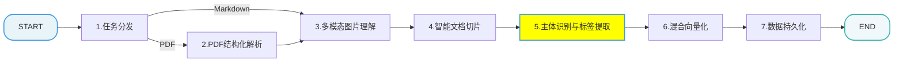
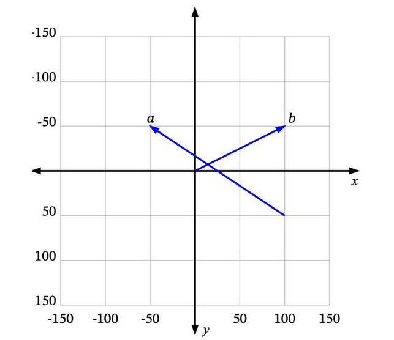
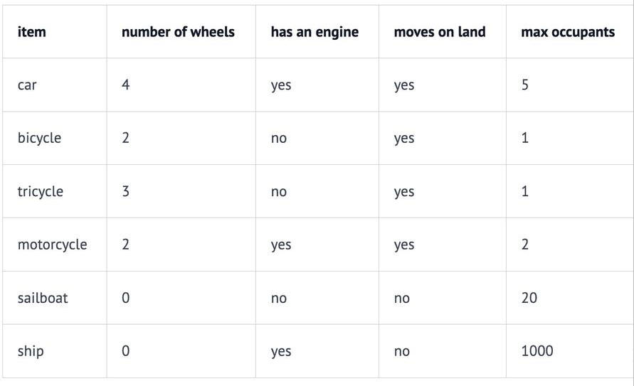
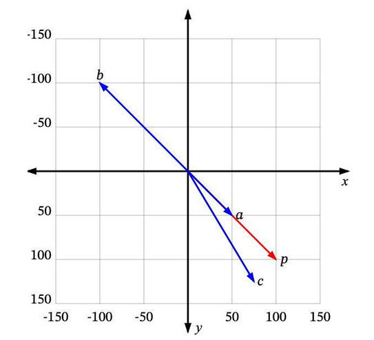
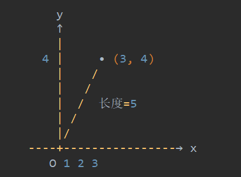
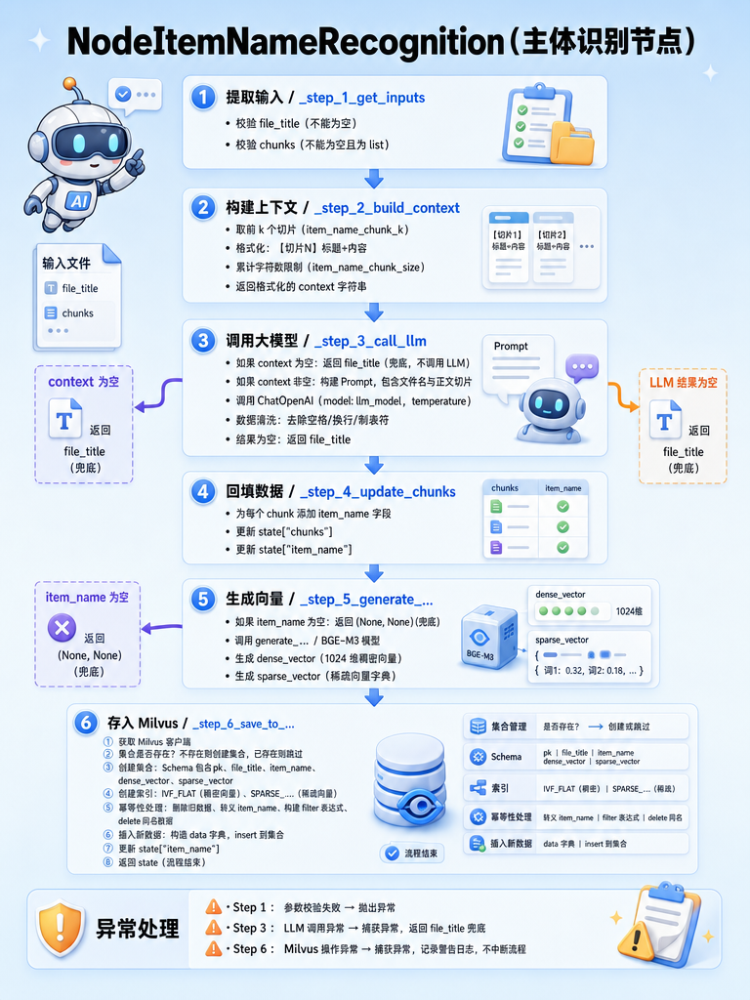

[TOC]

# 掌柜智库 - 【导入】主体识别节点

> 本文档详细介绍知识库导入流程中的商品名识别节点

## 1. 任务目标

### 1.1 涉及模块 

```
processor/import_processor/nodes/
├── node_item_name_recognition.py     		# 主体识别节点
```

### 1.2 节点在流程中的位置



## 2. 节点业务流程

### 2.1 节点作用

主体识别节点不是孤立的，它产出的数据直接服务于**查询阶段**的`商品名确认节点`。两者构成了一条完整的业务链路

### 2.2 实现思路

1.  **上下文压缩**：取文档的前 K 个切片（通常包含标题和摘要）构建 Prompt，利用 LLM 强大的理解能力提取核心实体名称。
2.  **错误鲁棒性**：考虑到 LLM 输出的不确定性，增加了空结果处理和默认值兜底机制，确保流程不会因识别失败而中断。
3.  **向量化准备**：识别出的实体名称会被向量化，用于在 Milvus 中进行基于实体的语义对齐（如搜索“iPhone”能关联到“苹果手机”的切片）。

### 2.3 Embedding模型和工具

#### 2.3.1 混合向量检索

##### 向量

向量：既有大小，又有方向的量。例如：

> **$\vec{a}$** 是一个从 (100, 50) 到 (-50, -50) 的向量，**$\vec{b}$** 是一个从 (0, 0) 到 (100, -50) 的向量。



很多时候，我们处理的向量是从原点 (0, 0) 开始的，比如 **$\vec{b}$**。这样我们可以省略向量起点部分，直接说 **$\vec{b}$​** 是向量 (100, -50)。

##### 维度

**注意：**数学领域表示向量常用小括号，编程领域常用中括号


**如何将向量的概念扩展到非数值实体上呢（例如文本）？**

如我们所见，每个数值向量都有 x 和 y 坐标（或者在多维系统中是 x、y、z，...）。x、y、z... 是这个向量空间的轴，称为维度。对于我们想要表示为向量的一些非数值实体，我们首先需要决定这些维度，并为每个实体在每个维度上分配一个值。

例如，在一个交通工具数据集中，我们可以定义四个维度：“轮子数量”、“是否有发动机”、“是否可以在地上开动”和“最大乘客数”。然后我们可以将一些交通工具表示为：



因此，我们的汽车Car向量将是 [4, yes, yes, 5]，或者用数值表示为 [4, 1, 1, 5]（将 yes 设为 1，no 设为 -1）。

向量的每个维度代表数据的不同特性，维度越多对事务的描述越精确，我们可以使用“是否有翅膀”、“是否使用柴油”、“最高速度”、“平均重量”、“价格”等等更多的维度信息。

##### 相似度

如果用户搜索`“轿车”或“Car”`，你希望能够返回所有与`“汽车automobile”`和`“车辆vehicle”`等信息相关的结果。向量搜索就是实现这个目标的一种方法。

**如何确定哪些是最相似的？**

每个向量都有一个长度和方向。例如，在这个图中，**$\vec{p}$** 和 **$\vec{a}$** 指向相同的方向，但长度不同。**$\vec{p}$** 和 **$\vec{b}$** 正好指向相反的方向，但有相同的长度。然后还有 **$\vec{c}$**，长度比  **$\vec{p}$** 短一点，方向不完全相同，但很接近。



那么，哪一个最接近 **$\vec{p}$** 呢？

- 如果“相似”仅仅意味着指向相似的方向，那么**$\vec{a}$** 是最接近 **$\vec{p}$** 的。接下来是 **$\vec{c}$**。**$\vec{b}$** 是最不相似的，因为它正好指向与 **$\vec{p}$** 相反的方向。
- 如果“相似”仅仅意味着相似的长度，那么 **$\vec{b}$** 是最接近 **$\vec{p}$** 的（因为它有相同的长度），接下来是 **$\vec{c}$**，然后是 **$\vec{a}$​**。

由于向量通常用于描述语义意义，仅仅看长度通常无法满足需求。**大多数相似度测量要么仅依赖于方向，要么同时考虑方向和大小。**

##### 稠密向量

**定义：**大部分分量都不是 0，数值很 “满” 的向量。

**例子：**

(1, 2, 3, 4),(0.5, −1, 2, 7)

- 数字**密密麻麻**
- 0 很少甚至没有

**特点：**

- 维度高，但每个位置几乎都有值，占空间大

##### 稠密向量在 AI 里干什么？

**embedding（嵌入）：**

AI 会把一个词、一张图、一句话，压缩成**一小串非 0 数字**。

**例子：使用稠密向量进行语义表达**

- “数学” → 稠密向量：(0.1, 0.5, -0.2, 0.7)
- “语文” → 稠密向量：(0.11, 0.49, -0.22, 0.72)
- 表示：意思、语义、特征

  - 近义词 → 向量靠得近
  - 反义词 → 向量离得远
- 大模型里的**词向量、图片特征、用户偏好**，全是稠密向量。
- 特点：

  - 维度不那么夸张（几十～几千维）
  - 每个数字都有意义


##### 稀疏向量

**定义：**绝大多数分量都是 0，只有极少数非 0 的向量。

**例子：**

(0, 0, 5, 0, 0, 0, −2, 0)

- 大部分是 0
- 只有**少数位置有值**

**特点：**

- 不用存所有数，**只记 “哪一位不是 0” 和 “它的值”**，省空间、计算快

##### 稀疏向量在 AI 里干什么？

**例子：使用稀疏向量进行词频统计**

比如一句话：**我 爱 数学 数学 数学**

把它变成向量：

- 我：1
- 爱：1
- 数学：3 
- 其他所有词：0

写成向量就是：

(1, 1, 3, 0, 0, 0, …)

**作用：**

- 统计**出现了几次**
- 统计**有没有出现**
- 适合：文本计数、用户点击次数等

**特点：**

- 维度可以**超级大**（比如几万、几十万维）
- 但**只有很少位置不是 0**
- 省空间、算得快

##### 稀疏向量和稠密向量

- 稠密向量（Dense Vector） ： 用来表示 “语义、特征”
- 稀疏向量（Sparse Vector） ： 用来表示 “统计、计数”

`BGE-M3` 模型同时输出这两种向量，结合使用能兼顾 “语义理解” 和 “精准匹配”。

#### 2.3.2 安装Python核心依赖

在使用模型之前，需要安装相关的 Python 依赖库。

**安装torch：**PyTorch 深度学习框架，**为向量模型（BGE-M3）提供运行环境**，支撑模型的加载、推理、张量计算，是大部分深度学习模型的基础依赖。

**安装哪个版本：**

- cpu 源
  - PyTorch 的 “基础版”，不管有没有 GPU，都只能用 CPU 干活，优点是体积小、不挑环境，缺点是速度慢。
- gpu 源
  - 给 PyTorch 装上 “GPU 加速器”，只有你的电脑 / 服务器有 NVIDIA GPU，且装了对应驱动，才能用上这个加速器；如果没有 GPU，装了也没用（PyTorch 会自动降级到 CPU 运行）。
  - 正常情况下使用 uv add 就可以安装依赖，但是对于PyTorch来说最好去官网下载和计算机对应的版本，因为国内普通镜像源大概率是**CPU-only 版本**，可能没有适配最新 CUDA 的版本。
  - 需要安装适配自己的 GPU CUDA 的版本： 查询方式 `nvidia-smi`

```bash
# ===================== 环境安装命令（适配BGE-M3+Milvus，GPU/CPU版区分）=====================
# 【优先推荐-GPU版】安装CUDA 12.8版PyTorch（含torchvision/torchaudio，NVIDIA显卡GPU加速必备）
uv pip install torch torchvision torchaudio --index-url https://download.pytorch.org/whl/cu128

# 【备用-CPU版】无NVIDIA显卡（AMD/Intel集显）请用此命令，直接安装CPU版PyTorch
uv add torch torchvision torchaudio
```

 GPU 支持检测：创建py代码验证

```python
# test/GPU验证.py

import torch

print('=== GPU 信息检测 ===')
print(f'GPU 可用：{torch.cuda.is_available()}')

if torch.cuda.is_available():
    # 获取显卡数量
    gpu_count = torch.cuda.device_count()
    print(f'显卡数量：{gpu_count}')

    # 遍历每块显卡的详细信息
    for i in range(gpu_count):
        print(f'\n--- 显卡 {i} ---')
        print(f'名称：{torch.cuda.get_device_name(i)}')
        print(f'计算能力：{torch.cuda.get_device_capability(i)}')

        # 获取显存信息（单位：GB）
        total_memory = torch.cuda.get_device_properties(i).total_memory / (1024**3)
        print(f'总显存：{total_memory:.2f} GB')

        # 当前显存使用情况
        allocated = torch.cuda.memory_allocated(i) / (1024**3)
        reserved = torch.cuda.memory_reserved(i) / (1024**3)
        print(f'已分配显存：{allocated:.2f} GB')
        print(f'已预留显存：{reserved:.2f} GB')

        # CUDA 版本
        print(f'CUDA 版本：{torch.version.cuda}')
        print(f'cuDNN 版本：{torch.backends.cudnn.version()}')
else:
    print('未检测到可用的 GPU，将使用 CPU')

```

##### 关键知识点说明

**为什么GPU的向量计算速度更快？**

例如：两个向量做加法运算：

```
[a1, a2, a3, …] + [b1, b2, b3, …] = [c1, c2, c3, …]
```

本质就是：对每一对位置上的数，做一模一样的操作，是大量重复、简单、彼此独立的操作

GPU 正好是为这个设计的

- GPU 有成百上千个小核心
- 它们可以同时执行同一条指令，只是数据不同
- 向量有 1024 个元素 → 1024 个小核心一起算，一步完事

而 CPU：核心少，更适合走复杂逻辑、分支、跳转

总结：

- CPU 擅长：少路、强逻辑、复杂控制的串行任务。
- GPU 擅长：多路、高吞吐、高度一致的并行计算。

##### 锁定pytorch版本

```toml
#⚠️：安装FlagEmbedding的时候会自动安装一个cpu版本的torch替换掉之前的gpu版本的torch，
# 要解决这个问题需要将以下内容配置在pyproject.toml中锁定这三个依赖的版本为cuda版
# 另外 transformers 和 FlagEmbedding  也有版本兼容问题，这里也锁定 transformers 的版本
dependencies = [
     其他之前安装过的配置,
    "torch>=2.11.0",
    "torchvision>=0.26.0",
    "torchaudio>=2.11.0",
    "flagembedding>=1.3.5",
    "transformers>=4.45.0,<5.0.0"
]

[tool.uv.sources]
# 强制从 NVIDIA 源安装
torch = { index = "pytorch-cuda" }
torchvision = { index = "pytorch-cuda" }
torchaudio = { index = "pytorch-cuda" }

[[tool.uv.index]]
name = "pytorch-cuda"
url = "https://download.pytorch.org/whl/cu128"
explicit = true
```

#### 2.3.3 安装Milvus和BGE-M3核心依赖

所有环境必装，无GPU/CPU区分

```bash
# pymilvus[model]：Milvus Python客户端（带模型相关依赖，适配向量入库/检索）
# FlagEmbedding：BGE-M3向量生成模型的核心依赖（不可替代）
# transformers：FlagEmbedding底层依赖，Hugging Face模型运行库
uv add pymilvus[model] transformers FlagEmbedding
```

#### 2.3.4 Embedding模型

如果访问 HuggingFace 较慢，可以使用阿里云（阿里巴巴通义实验室，原达摩院）的 ModelScope 社区下载。

https://www.modelscope.cn/models/BAAI/bge-m3 

##### 安装 modelscope 库

```bash
uv add modelscope
```

##### 运行 Python 脚本下载模型

运行 `tool/download_bgem3.py`

```python
# 下载模型到当前目录下的 models/bge-m3 文件夹
# model_dir = snapshot_download('Xorbits/bge-m3', cache_dir='D:/ai_models/modelscope_cache/models')
# print(f"模型已下载到: {model_dir}")

from modelscope.hub.snapshot_download import snapshot_download

# 下载模型到当前目录下的 models/bge-m3 文件夹
model_dir = snapshot_download('BAAI/bge-m3', cache_dir='D:/ai_models/modelscope_cache/models')
print(f"模型已下载到: {model_dir}")
```

##### BGE-M3 .env配置

```ini
# ====================
# BGE Embedding Models
# ====================
# BGE-M3 模型本地路径
BGE_M3_PATH=D:\ai_models\modelscope_cache\models\BAAI\bge-m3
# BGE-M3 模型名称
BGE_M3=BAAI/bge-m3
# 嵌入模型运行设备，cuda:0表示使用第1块GPU，cpu表示使用CPU，cuda:N表示第N+1块GPU
BGE_DEVICE=cuda:0
# 是否使用半精度（True/False）1=开启（GPU加速更高效），0=关闭（兼容低版本GPU/CPU）
BGE_FP16=True
```

##### 读取配置参数

```python
# config/embedding_config.py
from dataclasses import dataclass
import os
from dotenv import load_dotenv

load_dotenv()

@dataclass
class EmbeddingConfig:
    bge_m3_path: str
    bge_m3: str 
    bge_device: str
    bge_fp16: bool

embedding_config = EmbeddingConfig(
    bge_m3_path=os.getenv("BGE_M3_PATH"),
    bge_m3=os.getenv("BGE_M3"),
    bge_device=os.getenv("BGE_DEVICE"),
    # 特殊处理：将.env中的1/0转为布尔值，兼容常见的数字/字符串格式
    bge_fp16=os.getenv("BGE_FP16") in ("1", "True", "true", 1)
)
```

###### 关键知识点说明

半精度推理（FP16）是指将原本32位的浮点数运算转换为16位运算。
📌可以这样类比：

- 全精度（FP32）：就像用一把非常精确的尺子，能测量到小数点后很多位，精度高但占空间、速度慢
- 半精度（FP16）：就像用一把稍微粗糙一点的尺子，精度稍低但更轻便、更快

📌具体区别：

- FP32 = 32位浮点数 = 单精度 = 占用4字节内存
- FP16 = 16位浮点数 = 半精度 = 占用2字节内存

📌使用半精度的好处：

- 速度更快：GPU处理16位数据比32位快得多
- 显存更少：模型占用内存减半，可以处理更大的批次
- 功耗更低：计算量减少，更省电

📌可能的影响：

- 精度略有损失，但对于大多数AI推理任务来说，这种损失几乎察觉不到
- 特别适合像BGE-M3这样的嵌入模型，对精度要求不是特别苛刻的场景

所以BGE_FP16=True 就是让BGE-M3模型使用16位半精度进行推理，以获得更快的速度和更低的内存占用。

##### BGEM3初始化工具

文档：[BGE M3 | Milvus 文档](https://milvus.io/docs/zh/embed-with-bgm-m3.md)

```python
# utils/embedding_utils.py

from pymilvus.model.hybrid import BGEM3EmbeddingFunction

from config.embedding_config import embedding_config
from processor.import_processor.base import setup_logging

setup_logging()

# 模型单例对象，避免重复初始化
_bge_m3_ef = None

def get_bge_m3_ef():
    """
    获取BGE-M3模型单例对象，自动加载环境变量配置
    :return: 初始化完成的BGEM3EmbeddingFunction实例
    """
    global _bge_m3_ef
    if _bge_m3_ef is not None:
        return _bge_m3_ef

    # 从环境变量加载配置
    model_name = embedding_config.bge_m3_path
    device = embedding_config.bge_device
    use_fp16 = embedding_config.bge_fp16

    # 如果模型没有被提前下载，会自动下载
    _bge_m3_ef = BGEM3EmbeddingFunction(
        model_name=model_name,
        device=device,
        use_fp16=use_fp16
    )
    return _bge_m3_ef

def generate_embeddings(texts ):
    """
    为文本生成向量嵌入
    :param texts: 要生成嵌入的文本列表
    :return: 包含dense和sparse向量的字典
    """
    model = get_bge_m3_ef()
    embeddings = model.encode_documents(texts)
    processed_sparse = []
    for i in range(len(texts)):
        sparse_indices = embeddings["sparse"].indices[embeddings["sparse"].indptr[i]:embeddings["sparse"].indptr[i+1]].tolist()
        sparse_data = embeddings["sparse"].data[embeddings["sparse"].indptr[i]:embeddings["sparse"].indptr[i+1]].tolist()
        sparse_dict = {k: v for k, v in zip(sparse_indices,sparse_data)}
        processed_sparse.append(sparse_dict)

    return {
        "dense": [emb.tolist() for emb in embeddings["dense"]],
        "sparse": processed_sparse
    }
```

###### 关键知识点说明

```python
normalize_embeddings: bool = True #模型出厂时已经把向量处理成标准格式了  (归一化)
```

📌**打个比方，想做薯条 🥔**

- 【场景 1】：买土豆（非原生）

你去买土豆，商家给你一堆大小不一的土豆：你要自己清洗，切条

这就像**没有原生归一化的模型**，给你的向量长短不一，你要自己处理。

- 【场景 2】：买标准化包装的薯条（原生）

你去超市买土豆，人家已经给你处理好了：每个袋子都是 **500 克** 标准包装，拿起来就能用，不需要再处理

这就像**原生 L2 归一化的模型**，给你的向量都是统一规格（长度都是 1）。

📌**向量 [3, 4] 的几何意义**



- L2 归一化在做什么？就是把长度为 5 的向量，缩成长度为 1：

原始向量：[3, 4]     # 长度 = 5
除以 5 后：[0.6, 0.8] # 长度 = 1 

📌**具体到模型上**

假设模型输出一个向量 `[3, 4]`：

非模型原生 L2 归一化：

```
直接给你 [3, 4] 
→ 长度是 5
→ 你要自己算：[3/5, 4/5] = [0.6, 0.8]
```


原生模型：

```
内部已经处理好
直接给你 [0.6, 0.8] 
→ 长度已经是 1
→ 拿来就能用 ✅
```

**这么做的目的是为了方便比较相似度！**

比如两个向量：

- A = `[0.6, 0.8]`（长度已经是 1）
- B = `[0.8, 0.6]`（长度已经是 1）

要算它们有多像，直接相乘就行：

```
0.6×0.8 + 0.8×0.6 = 0.96（满分 1）
→ 说明很像！✅
```


如果没归一化，就要先除长度再计算。

##### 测试向量转换

```python
# test/bge_m3测试向量转换.py
from utils.embedding_utils import get_bge_m3_ef

model = get_bge_m3_ef()
result = model.encode_documents(["测试","test"])

print(result)
# 数据结构：
# 稠密向量：这是一个包含两个 array 的列表。每个 array 长度为 1024，数据类型是 float16（半精度）。
# 稀疏向量：这是一个 Compressed Sparse Row sparse array（压缩稀疏行矩阵），形状是 (2, 250002)，250002 代表模型词汇表的大小（大约有 25 万个可能的词），2表示当前是2个词的向量
```

###### 关键知识点说明

`csr_array` 是 **SciPy（一个高级科学计算库） 稀疏矩阵库** 中用于表示 **压缩稀疏行（Compressed Sparse Row, CSR）格式** 的二维稀疏数组类。它专为**高效行操作、矩阵 - 向量乘法**设计，是科学计算与深度学习中最常用的稀疏存储格式之一。

**一、核心概念**

- **稀疏矩阵**：大部分元素为 0 的矩阵，用普通 `ndarray( N-dimensional array,n维数组)` 存储会浪费大量内存与计算资源。

- CSR 格式：用 3 个数组紧凑存储非零元素，大幅节省空间：

  - `data`：所有非零元素的值（长度 = 非零元素总数 NNZ-Number of Non-Zero elements）
  - `indices`：每个非零元素对应的**列索引**（长度 = NNZ）
  - `indptr`：**行指针**，标记每行第一个非零元素在 `data/indices` 中的起始位置（长度 = 行数 + 1）

**二、结构示例**

以 3×3 稀疏矩阵为例：

```
[[1, 0, 2],
 [0, 3, 0],
 [4, 0, 5]]
```

对应的 CSR 三个数组：

- 非零元素  `data = [1, 2, 3, 4, 5]`
- 非零元素对应的列索引 `indices = [0, 2, 1, 0, 2]`
- 非零元素对应的行索引 `indptr = [0, 2, 3, 5]`
  - `indptr[0]=0`：第 0 行从 `data[0]` 开始
  - `indptr[1]=2`： 第 0 行到 `data[2]`结束
  - `indptr[2]=3`：第 1 行到`data[3]`结束
  - `indptr[3]=5`：第 2 行到`data[5]`结束

##### 测试向量获取

```python
# test/bge_m3测试向量获取.py

from app.core.logger import logger
from app.lm.embedding_utils import get_bge_m3_ef

# 加载BGE-M3模型单例
model = get_bge_m3_ef()

# 模型编码生成向量，返回dense（稠密向量）+sparse（CSR格式稀疏向量）
texts = ["测试","hello"]
embeddings = model.encode_documents(texts)

logger.debug(f"获取成功！")
logger.debug(embeddings)

# 稠密向量获取
dense_obj = embeddings["dense"]
dense_list = [emb.tolist() for emb in dense_obj]
logger.debug(dense_list)

# 稀疏向量获取：解析为字典格式（适配序列化/存储）
sparse_obj = embeddings["sparse"]
processed_sparse = []
for i in range(len(texts)):

    # 提取第i个文本的稀疏向量索引
    sparse_indices = sparse_obj.indices[
        sparse_obj.indptr[i]:sparse_obj.indptr[i + 1]
    ].tolist()

    # 提取第i个文本的稀疏向量权重
    sparse_data = sparse_obj.data[
        sparse_obj.indptr[i]:sparse_obj.indptr[i + 1]
    ].tolist()

    # 构造{特征索引: 归一化权重}的稀疏向量字典
    # 把两个列表“打包”成一个字典（Milvus 数据库的要求）
    sparse_dict = {k: v for k, v in zip(sparse_indices, sparse_data)}
    processed_sparse.append(sparse_dict)

    #sparse_indices = [0, 5, 23, 156]    # 特征在词汇表中的位置编号
    #sparse_data = [0.8, 0.3, 0.9, 0.2]  # 每个特征的权重
    # zip 后生成：[(0, 0.8), (5, 0.3), (23, 0.9), (156, 0.2)]
    #              ↑   ↑
    #            索引 权重
```

### 2.4 步骤分解

1.  **步骤 1: 获取输入**: 校验 State 中的 `file_title` 和 `chunks`。
2.  **步骤 2: 构建上下文**: 截取前 K 个切片作为 LLM 的识别素材。
3.  **步骤 3: 调用 LLM**: 使用大模型识别商品名称，包含错误重试与兜底。
4.  **步骤 4: 回填数据**: 将识别结果更新回 State 和 Chunks 元数据。
5.  **步骤 5: 生成向量**: 调用 Embedding 模型生成 Dense/Sparse 向量。
6.  **步骤 6: 保存结果**: 将数据写入 Milvus 向量库，并处理幂等性。

### 2.5 代码实现

#### 2.5.1 单元测试

```python
if __name__ == "__main__":

    setup_logging()

    md_path = r"D:\output\hak180产品安全手册\chunks.json"
    with open(md_path, "r", encoding="utf-8") as f:
        chunks_json = f.read()

    chunks = json.loads(chunks_json)
    init_state = {
        "chunks": chunks,
        "file_title": "hak180产品安全手册"
    }

    # 执行核心处理流程
    node_item_name_recognition = NodeItemNameRecognition()
    result = node_item_name_recognition(init_state)

    logging.getLogger().info(json.dumps(result, ensure_ascii=False, indent=4))
```

#### 2.5.2 主流程定义

##### 流程图



##### process

定义 `node_item_name_recognition` ，串联各个步骤。

```python
# processor/import_processor/nodes/node_item_name_recognition.py
import json
import logging
from typing import Tuple, Dict, List

from langchain_core.messages import SystemMessage, HumanMessage
from langchain_openai import ChatOpenAI
from pymilvus import DataType

from config.lm_config import lm_config
from config.milvus_config import milvus_config
from processor.import_processor.base import BaseNode, setup_logging
from processor.import_processor.exceptions import StateFieldError
from processor.import_processor.state import ImportGraphState
from utils.embedding_utils import generate_embeddings
from utils.milvus_utils import get_milvus_client, escape_milvus_string


class NodeItemNameRecognition(BaseNode):
    """
    主体识别节点：主体识别与标签提取
    """

    name: str = "node_item_name_recognition"

    def process(self, state: ImportGraphState) -> ImportGraphState:
        """
        LangGraph 核心节点：商品主体名称识别
        流程总览：
            1. 提取输入
            2. 构建大模型上下文
            3. 调用大模型识别商品名称
            4. 回填商品名称到状态和切片
            5. 生成商品名称的稠密/稀疏向量
            6. 将数据存入Milvus向量数据库

        必要参数：task_id、file_title, chunks
        更新参数：item_name

        :param state: 工作流状态对象
        :return: 更新后的状态对象
        """

        # 步骤1：提取并校验输入
        file_title, chunks = self._step_1_get_inputs(state)

        # 步骤2：构建大模型识别的上下文
        context = self._step_2_build_context(chunks)

        # 步骤3：调用大模型识别商品名称
        item_name = self._step_3_call_llm(file_title, context)

        # 步骤4：回填商品名称到状态和切片
        self._step_4_update_chunks(state, chunks, item_name)

        # 步骤5：为商品名称生成稠密/稀疏向量
        dense_vector, sparse_vector = self._step_5_generate_vectors(item_name)

        # 步骤6：将数据存入Milvus向量数据库
        self._step_6_save_to_milvus(state, file_title, item_name, dense_vector, sparse_vector)


        # 打印识别结果
        self.logger.info(f"--- 识别完成: {item_name} ---")

        return state
```

##### 步骤 1: 获取输入 

从 State 中提取文件名和切片数据，并进行基础校验。

```python
    def _step_1_get_inputs(self, state: ImportGraphState) -> Tuple[str, List[Dict]]:
        """
        步骤 1: 接收并校验流程输入
        核心作用：
            1. 从流程状态中提取文件标题、文本切片核心数据
            2. 基础数据类型校验，保证下游流程输入有效性
        依赖的状态数据（上游节点产出）：
            - state["file_title"]: 上游提取的文件标题
            - state["chunks"]: 文本切片列表
        返回值：
            Tuple[str, List[Dict]]: (处理后的文件标题, 校验后的文本切片列表)
        """

        # 1、参数校验
        file_title = state.get("file_title")
        if not file_title:
            raise StateFieldError(field_name="file_title", message="文件标题不能为空", expected_type=str)

        chunks = state.get("chunks")
        if not chunks:
            raise StateFieldError(field_name="chunks", message="chunks不能为空", expected_type=list)

        if not isinstance(chunks, list):
            raise StateFieldError(field_name="chunks", message="chunks数据类型不正确", expected_type=list)

        return file_title, chunks

```

##### 步骤 2: 构建上下文

截取文档的前 K 个切片，拼接成用于 LLM 识别的 Context。

```python
    def _step_2_build_context(self, chunks: List[Dict]) -> str:
        """
        步骤 2: 构造大模型商品名称识别的标准化上下文
        核心作用：
            1. 限制切片数量：仅取前k个切片，避免上下文过长
            2. 限制字符长度：总上下文字符限制，适配大模型输入上限
            3. 格式化内容：带序号的结构化格式，提升大模型识别精度
        参数说明：
            chunks: 文本切片列表
        返回值：
            str: 格式化后的上下文字符串
        """

        parts: List[str] = []
        total_chars = 0
        for idx, chunk in enumerate(chunks[:self.config.item_name_chunk_k], start = 1):

            # 1. 提取前k的切片，避免上下文过长
            chunk_title = chunk.get("title").strip()
            chunk_content = chunk.get("content").strip()

            # 2. 格式化切片
            piece = f"【切片{idx}】\n标题{chunk_title}\n内容：{chunk_content}"
            parts.append(piece)

            # 3. 计算累计的字符数
            total_chars += len(piece)

            # 4. 判断是否需要继续切分
            if total_chars > self.config.item_name_chunk_size:
                self.logger.warning(f"累计字符数{total_chars}已超过限制{self.config.item_name_chunk_size}，停止切分")
                break

        # 5. 使用换行符对切分后的片段进行连接
        context = "\n\n".join(parts).strip()

        # 6. 对返回结果进行二次截断
        final_context = context[:self.config.item_name_chunk_size]

        return final_context
```

##### 步骤 3: 调用大模型识别商品名称

构造 Prompt 并调用大模型，识别商品名称。

提示词

```python
# processor/query_processor/prompt/item_name_recognition.py

# System Prompt
ITEM_NAME_SYSTEM_PROMPT = "你是一个专业的商品名称识别模型，请根据提供的信息，识别商品名称。"

# User Prompt Template
ITEM_NAME_USER_PROMPT_TEMPLATE = """
请从以下信息中识别出商品名称与型号：
文件名：{file_title}

正文切片（用于辅助识别）：
{context}

要求：
1. 返回内容为字符串形式，最好是带品牌、型号和名称的完整商品名称。比如：苏伯尓5000W大功率电磁炉；
2. 返回结果应该只包含商品名称，不要添加任何解释或其他内容；
3. 如果无法识别商品名称,请返回空字符串。
"""
```

代码

```python
    def _step_3_call_llm(self, file_title: str, context: str) -> str:
        """
        步骤 3: 调用大模型实现商品名称/型号精准识别
        核心逻辑：
            1. 上下文为空 → 直接返回file_title（兜底，无需调用大模型）
            2. 上下文非空 → 加载标准化prompt模板，构建大模型对话消息
            3. 调用大模型后对返回结果做清洗，过滤无效字符
            4. 大模型返回空/调用异常 → 均返回file_title兜底，保证流程不中断
        核心特性：
            - 提示词解耦：通过load_prompt加载本地模板，无需硬编码
            - 格式兼容：兼容不同LLM客户端返回格式，防止属性报错
            - 异常兜底：全异常捕获，大模型服务不可用时不影响主流程
        参数：
            file_title: 处理后的文件标题（异常/空值时的兜底值）
            context: 步骤2构建的结构化切片上下文（大模型识别的核心依据）
        返回值：
            str: 清洗后的商品名称（异常/空值时返回原始file_title）
        """

        # 1. 上下文为空，返回file_title
        if not context:
            return file_title

        try:
            # 2. 加载提示词模板
            user_prompt = ITEM_NAME_USER_PROMPT_TEMPLATE.format(
                file_title=file_title, context=context
            )

            # 3. 初始化大模型客户端
            llm = ChatOpenAI(
                model=lm_config.llm_model,
                api_key=lm_config.api_key,
                base_url=lm_config.base_url,
                temperature=lm_config.llm_temperature,
                extra_body={"enable_thinking": False}
            )

            # 4. 创建消息对象
            messages = [
                SystemMessage(content=ITEM_NAME_SYSTEM_PROMPT),
                HumanMessage(content=user_prompt)
            ]

            # 5. 模型调用
            response = llm.invoke(messages)
            item_name = response.content

            # 6. 数据清洗
            item_name = (item_name.replace(" ", "")
                         .replace("\n", "")
                         .replace("\t", "")
                         .replace("\r", ""))

            # 7. 如果返回空字符串
            if not item_name:
                return file_title

            # 8. 返回结果
            return item_name

        except Exception as e:
            self.logger.error(f"大模型调用异常：{e}")
            return file_title
```

##### 步骤 4: 回填数据

将识别到的 `item_name` 回填到 State 和 Chunks 中。

```python
    def _step_4_update_chunks(self, state: ImportGraphState, chunks: List[Dict[str, str]], item_name: str):
        """
        步骤 4: 回填商品名称到流程状态和所有文本切片
        核心作用：
            1. 全局状态更新：将item_name存入state，供下游所有节点直接使用
            2. 切片数据补全：为每个切片添加item_name字段，保证数据一致性
            3. 状态同步：更新state中的chunks，确保切片修改全局生效
        设计思路：
            所有切片关联同一商品名称，保证后续向量入库、检索时的维度一致性
        参数：
            state: 流程状态对象
            chunks: 校验后的文本切片列表
            item_name: 步骤3识别并清洗后的商品名称
        """

        # 1. 遍历所有切片，为每个切片添加商品名字段，保证数据全链路一致
        for chunk in chunks:
            chunk["item_name"] = item_name

        # 2. 同步更新state中的切片列表，确保修改全局生效
        state["chunks"] = chunks

        # 3. 将商品名称存入全局状态，供下游节点调用
        state["item_name"] = item_name
```

##### 步骤 5: 生成向量

使用 Embedding 模型为商品名称生成向量。

BGE-M3 模型同时输出这两种向量，结合使用能兼顾 “语义理解” 和 “精准匹配”。

```python
    def _step_5_generate_vectors(self, item_name: str) -> Tuple[List, Dict]:
        """
        步骤 5: 为商品名称生成 BGE-M3 稠密 + 稀疏双向量（Milvus 向量检索核心）
        核心说明：
            - 稠密向量（dense_vector）：BGE-M3 固定 1024 维，记录文本深层语义信息
            - 稀疏向量（sparse_vector）：变长键值对，记录文本关键词/特征位置信息
        依赖工具：
            generate_embeddings：封装 BGE-M3 模型，批量生成双向量，兼容单条/批量输入
        参数：
            item_name: 步骤 3 识别的商品名称（非空，空值时直接返回空向量）
        返回值：
            Tuple[List, Dict]: (稠密向量列表，稀疏向量字典)
        """

        # 1. 商品名称为空 → 直接返回空向量
        if not item_name:
            return None, None

        # 2、调用向量生成工具：传入列表支持批量生成，单条数据仍用列表保证格式统一
        vectors = generate_embeddings([item_name])
        return vectors["dense"][0], vectors["sparse"][0]
```

##### 步骤 6: 保存结果

###### Milvus .env配置

```ini
# ====================
# Vector Database (Milvus)
# ====================
# Milvus 连接地址
MILVUS_URL=http://localhost:19530
# 知识库切片集合名
CHUNKS_COLLECTION=kb_chunks
# 商品名称集合名
ITEM_NAME_COLLECTION=kb_item_names
```

###### 读取Milvus配置参数

```python
# config/milvus_config.py

from dataclasses import dataclass
import os
from dotenv import load_dotenv

load_dotenv()

@dataclass
class MilvusConfig:
    milvus_url: str
    chunks_collection: str
    item_name_collection: str

# 实例化Milvus配置对象（和其他配置对象命名风格统一）
milvus_config = MilvusConfig(
    milvus_url=os.getenv("MILVUS_URL"),
    chunks_collection=os.getenv("CHUNKS_COLLECTION"),
    item_name_collection=os.getenv("ITEM_NAME_COLLECTION")
)
```

###### 定义 milvus_utils 客户端工具

```python
# utils/milvus_utils.py

import os
from pymilvus import MilvusClient

from config.milvus_config import milvus_config

_milvus_client = None
def get_milvus_client():
    """
    获取全局单例的MilvusClient对象
    :return: MilvusClient实例
    """
    global _milvus_client
    if _milvus_client is not None:
        return _milvus_client

    _milvus_client = MilvusClient(uri=milvus_config.milvus_url)

    return _milvus_client
```

###### 核心业务流程

将识别结果及向量保存到 Milvus 数据库。

```python
    def _step_6_save_to_milvus(self, state: ImportGraphState, file_title: str, item_name: str, dense_vector,
                               sparse_vector):
        """
        步骤 6: 将商品名称、文件标题、双向量持久化到 Milvus 向量数据库
        核心逻辑：
            1. 客户端获取：获取单例 Milvus 客户端，连接失败则跳过
            2. 集合初始化：无集合则创建（定义 Schema+索引），有集合则直接使用
            3. 幂等性处理：删除同名商品数据，避免重复存储
            4. 数据插入：构造符合 Schema 的数据，非空向量才添加
            5. 集合加载：插入后强制加载集合，确保数据立即可查/Attu 可见
        参数：
            state: 流程状态对象，用于最终状态同步
            file_title: 处理后的文件标题
            item_name: 识别后的商品名称（主键去重依据）
            dense_vector: 步骤 5 生成的稠密向量（1024 维列表）
            sparse_vector: 步骤 5 生成的稀疏向量（字典格式）
        """
        try:

            # 1. 获取 Milvus 单例客户端，连接失败则直接返回
            # milvus_client = MilvusClient(uri=milvus_uri)
            milvus_client = get_milvus_client()
            if not milvus_client:
                self.logger.warning("无法获取 Milvus 客户端（连接失败），跳过数据保存")
                return

            # 2. 创建集合（如果不存在）
            collection_name = milvus_config.item_name_collection  # 集合名称
            if not milvus_client.has_collection(collection_name):
                self._create_item_name_collection(collection_name, milvus_client)

            # 3. 幂等性处理：删除同名商品数据（避免重复存储）
            # 转义商品名称（防止特殊字符导致filter解析失败）
            safe_item_name = escape_milvus_string(item_name)
            # 构建过滤表达式：item_name等于目标值
            filter_expr = f'item_name=="{safe_item_name}"'
            # 删除符合条件的数据
            milvus_client.delete(collection_name=collection_name, filter=filter_expr)

            # 4. 准备插入Milvus的数据
            data = {
                "file_title": file_title,  # 文件标题
                "item_name": item_name  # 商品名称
            }
            # 稠密向量非空则添加
            if dense_vector is not None:
                data["dense_vector"] = dense_vector
            # 稀疏向量非空则添加
            if sparse_vector is not None:
                data["sparse_vector"] = sparse_vector

            # 5. 插入数据（传入列表支持批量插入，这里仅1条）
            milvus_client.insert(collection_name=collection_name, data=[data])

            # 6. 把商品名称存入state（供下游节点使用）
            state["item_name"] = item_name

        # 捕获所有Milvus操作异常：连接中断、入库失败、索引错误等，不中断主流程
        except Exception as e:
            self.logger.warning(f"数据存入Milvus失败，原因：{str(e)}", exc_info=True)
```

###### 创建集合

```python
    def _create_item_name_collection(self, collection_name, milvus_client):
        # 创建Schema（数据结构定义）
        # auto_id=True：主键自动生成；enable_dynamic_field=True：支持动态字段（允许插入 Schema 中未定义的字段）
        schema = milvus_client.create_schema(auto_id=True, enable_dynamic_field=True)

        # 添加主键字段（INT64类型，自增）
        schema.add_field(
            field_name="pk",
            datatype=DataType.INT64,
            is_primary=True,
            auto_id=True
        )
        # 添加文件标题字段（VARCHAR类型，最大长度65535）
        schema.add_field(
            field_name="file_title",
            datatype=DataType.VARCHAR,
            max_length=100
        )
        # 添加商品名称字段（VARCHAR类型，最大长度65535）
        schema.add_field(
            field_name="item_name",
            datatype=DataType.VARCHAR,
            max_length=100
        )
        # 添加稠密向量字段（FLOAT_VECTOR类型，1024维，BGE-M3模型固定维度）
        schema.add_field(
            field_name="dense_vector",
            datatype=DataType.FLOAT_VECTOR,
            dim=1024
        )
        # 添加稀疏向量字段（SPARSE_FLOAT_VECTOR类型，变长，适配BGE-M3的稀疏向量）
        schema.add_field(field_name="sparse_vector", datatype=DataType.SPARSE_FLOAT_VECTOR)

        # 3. 构建索引参数（提升向量检索性能）
        index_params = milvus_client.prepare_index_params()
        # 为稠密向量创建索引（IVF_FLAT：兼容性好，适合小数据量）
        # 核心是 “先聚类分桶、再桶内暴力精确检索”。
        index_params.add_index(
            field_name="dense_vector",  # 字段名
            index_name="dense_vector_index",  # 索引名
            index_type="IVF_FLAT",  # 索引类型（兼容所有Milvus版本）
            metric_type="COSINE",  # 相似度计算方式（余弦相似度）
            params={"nlist": 128}  # 聚类数（影响检索精度/速度）
        )

        # 为稀疏向量创建索引（SPARSE_INVERTED_INDEX：稀疏向量专用索引）
        index_params.add_index(
            field_name="sparse_vector",  # 字段名
            index_name="sparse_vector_index",  # 索引名
            index_type="SPARSE_INVERTED_INDEX",  # 索引类型
            metric_type="IP",  # 相似度计算方式（内积）
            params={
                "inverted_index_algo": "DAAT_MAXSCORE",
                # 高效的稀疏检索算法

                "normalize": True,
                # ↑ L2 归一化，让内积 (IP) 等价于余弦相似度

                "quantization": "none"
                # ↑ 关闭量化，保持原始精度：模型生成的向量已经压缩的一半的精度了（BGE_FP16=1），这里就不再压缩了
                # "quantization": "none" → 存储原始向量，不压缩
                # "quantization": "sq8" → 存储压缩后的向量（8-bit 量化
            })

        # 4. 创建集合（Schema + 索引）
        milvus_client.create_collection(
            collection_name=collection_name,
            schema=schema,
            index_params=index_params
        )
```

###### 转义

```python
# utils/milvus_utils.py

def escape_milvus_string(value: str) -> str:
    """
    Milvus数据库过滤表达式中字符串的安全转义函数（防止解析失败）
    作用：
        转义特殊字符（反斜杠、双引号），避免Milvus解析filter时报错
    参数：
        value: 需要转义的原始字符串
    返回：
        str: 转义后的安全字符串
    """
    # 转义反斜杠（\ → \\） 双引号（" → \"） 单引号（' → \'）
    value = value.replace("\\", "\\\\").replace('"', '\\"').replace("'", "\\'")
    return value
```

