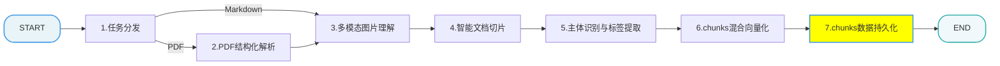
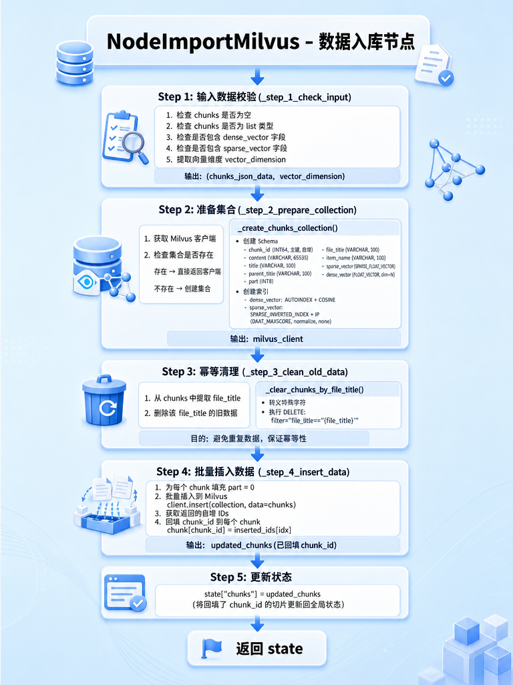

[TOC]

# 掌柜智库 - 【导入】导入数据节点

> 本文档详细介绍知识库导入流程中的导入数据节点

## 1. 任务目标

### 1.1 涉及模块 

```
processor/import_processor/nodes/
├── node_import_milvus.py     		# 入数据节点
```

### 1.2 节点在流程中的位置



## 2. 节点业务流程

### 2.1 节点作用

数据加载流程的终点，负责将处理好的结构化数据（切片内容、元数据、向量）持久化存储到向量数据库中，构建可供即时查询的索引。

### 2.2 实现思路

1.  **幂等性设计**: 在插入新数据前，根据 `item_name` 或文件 ID 清理旧数据，防止重复导入导致的数据污染。
2.  **Schema 适配**: 严格按照 Milvus 集合的 Schema 定义（主键、Dense字段、Sparse字段、JSON元数据字段）组织数据，确保插入成功率。
3.  **混合索引构建**: 确保存入的数据能够支持 Milvus 的 Hybrid Search（Dense + Sparse 加权），最大化检索效果。

### 2.3 代码实现

#### 2.3.1 单元测试

```python
if __name__ == "__main__":

    setup_logging()

    json_path = r"D:\output\hak180产品安全手册\state_vector.json"
    with open(json_path, "r", encoding="utf-8") as f:
        state_json = f.read()

    state = json.loads(state_json)

    init_state = {
        "chunks": state.get("chunks")
    }

    # 执行核心处理流程
    node_import_milvus = NodeImportMilvus()
    result = node_import_milvus(init_state)

    logging.getLogger().info(json.dumps(result, ensure_ascii=False, indent=4))
```

#### 2.3.2 主流程定义

##### 流程图



##### process

```python
# processor/import_processor/nodes/node_import_milvus.py
import json
import logging
from typing import Dict, Any, List

from pymilvus import DataType

from config.milvus_config import milvus_config
from processor.import_processor.base import BaseNode, setup_logging
from processor.import_processor.exceptions import StateFieldError, MilvusError
from processor.import_processor.state import ImportGraphState
from utils.milvus_utils import get_milvus_client, escape_milvus_string


class NodeImportMilvus(BaseNode):
    """
    导入向量库节点：数据持久化
    """

    name = "node_import_milvus"

    name: str = "node_import_milvus"

    def process(self, state: ImportGraphState) -> ImportGraphState:
        """
        LangGraph核心节点：Milvus切片数据入库主流程
        执行流程（串行执行，一步一校验，保证数据一致性）：
            1. 输入校验：验证切片有效性、向量字段完整性，提取向量维度
            2. 环境准备：连接Milvus，集合不存在则自动创建Schema+索引
            3. 幂等清理：删除同file_title旧数据，避免重复存储
            4. 批量插入：预处理数据后批量入库，回填Milvus自增chunk_id
            5. 状态更新：将回填了chunk_id的切片更新回全局状态，供下游使用

        异常处理：
            任一步骤失败抛出异常，终止节点执行，保证数据不脏写

        必要参数：chunks
        更新参数：chunks字段回填chunk_id

        :param state: 工作流状态对象
        :return: 更新后的状态对象
        """

        # 步骤1：输入数据有效性校验
        chunks_json_data, vector_dimension = self._step_1_check_input(state)

        # 步骤2：Milvus客户端连接+集合准备（自动建表）
        client = self._step_2_prepare_collection(vector_dimension)

        # 步骤3：幂等性处理 - 清理同file_title旧数据
        self._step_3_clean_old_data(client, chunks_json_data)

        # 步骤4：批量插入数据+主键chunk_id回填
        updated_chunks = self._step_4_insert_data(client, chunks_json_data)

        # 步骤5：更新全局状态，将回填后的切片回传下游
        state["chunks"] = updated_chunks

        return state

```

##### 步骤 1: 检查输入

**功能**: 验证 `chunks` 是否存在，并提取 `dense_vector` 维度。

```python

    def _step_1_check_input(self, state: Dict[str, Any]) -> tuple[List[Dict[str, Any]], int]:
        """
        步骤1：输入数据有效性校验
        核心校验项：
            1. chunks非空且为列表类型
            2. 切片包含dense_vector核心字段
            3. 提取向量维度，为集合创建/索引构建提供依据
        参数：
            state: Dict[str, Any] - 流程状态对象，包含上游传入的chunks数据
        返回：
            tuple - (校验通过的切片列表, 稠密向量维度)
        异常：
            任一校验项不通过，抛出ValueError终止入库流程，避免脏数据处理

        """

        # 校验1：chunks非空
        chunks = state.get("chunks")

        if not chunks:
            raise StateFieldError(field_name="chunks", message="chunks不能为空", expected_type=list)

        if not isinstance(chunks, list):
            raise StateFieldError(field_name="chunks", message="chunks数据类型不正确", expected_type=list)

        # 校验2：切片包含dense_vector字段
        first_chunk = chunks[0]
        if 'dense_vector' not in first_chunk:
            raise StateFieldError(field_name="chunks", message="错误: 数据中缺失dense_vector字段")

        # 校验3：切片包含 sparse_vector 字段
        if 'sparse_vector' not in first_chunk:
            raise StateFieldError(field_name="chunks", message="错误: 数据中缺失sparse_vector字段")

        # 提取向量维度
        vector_dimension = len(first_chunk['dense_vector'])
        return chunks, vector_dimension

```

##### 步骤 2: 准备集合 

**功能**: 获取 Milvus 客户端，如果集合不存在则创建。

```python

    def _step_2_prepare_collection(self, vector_dimension: int):
        """
        步骤2：Milvus客户端连接+集合准备
        核心逻辑：
            1. 获取Milvus单例客户端，验证连接有效性
            2. 集合不存在则自动创建（Schema+索引），存在则直接复用
        参数：
            vector_dimension: int - 稠密向量维度（步骤1提取）
        返回：
            MilvusClient - 已连接、集合准备完成的客户端实例
        异常：
            客户端获取失败/集合名称未配置，抛出异常终止流程
        """

        # 1. 获取milvus客户端对象
        milvus_client = get_milvus_client()
        if not milvus_client:
            self.logger.error("Milvus 连接失败")
            raise MilvusError("Milvus 连接失败")

        # 2. 集合不存在则创建
        collections_name = milvus_config.chunks_collection
        if not milvus_client.has_collection(collections_name):
            self._create_chunks_collection(collections_name, milvus_client, vector_dimension)

        return milvus_client

    def _create_chunks_collection(self, collections_name, milvus_client, vector_dimension):

        # 1. 创建schem
        schema = milvus_client.create_schema(auto_id=True, enable_dynamic_field=True)
        # 2. 创建列
        schema.add_field(field_name="chunk_id", datatype=DataType.INT64, is_primary=True, auto_id=True)
        schema.add_field(field_name="content", datatype=DataType.VARCHAR, max_length=65535)  # 切片内容
        schema.add_field(field_name="title", datatype=DataType.VARCHAR, max_length=100)  # 切片标题
        schema.add_field(field_name="parent_title", datatype=DataType.VARCHAR, max_length=100)  # 父标题
        schema.add_field(field_name="part", datatype=DataType.INT8)  # 分片编号
        schema.add_field(field_name="file_title", datatype=DataType.VARCHAR, max_length=100)  # 源文件标题
        schema.add_field(field_name="item_name", datatype=DataType.VARCHAR, max_length=100)  # 商品名称（幂等性依据）
        schema.add_field(field_name="sparse_vector", datatype=DataType.SPARSE_FLOAT_VECTOR)  # 稀疏向量
        schema.add_field(field_name="dense_vector", datatype=DataType.FLOAT_VECTOR, dim=vector_dimension)  # 稠密向量

        # 3. 创建索引
        index_params = milvus_client.prepare_index_params()
        # 稠密向量索引：AUTOINDEX自动选最优索引类型+余弦相似度（语义检索常用）
        index_params.add_index(
            field_name="dense_vector",
            index_name="dense_vector_index",
            index_type="AUTOINDEX",
            metric_type="COSINE"
        )
        # 稀疏向量索引：专用SPARSE_INVERTED_INDEX+内积（IP），适配稀疏向量检索
        index_params.add_index(
            field_name="sparse_vector",
            index_name="sparse_inverted_index",
            index_type="SPARSE_INVERTED_INDEX",
            metric_type="IP",
            params={"inverted_index_algo": "DAAT_MAXSCORE", "normalize": True, "quantization": "none"}
        )

        # 创建集合
        milvus_client.create_collection(
            collection_name=collections_name,
            schema=schema,
            index_params=index_params
        )

```

**IVF_FLAT 和 AUTOINDEX** 

1. IVF_FLAT - 手动指定索引类型

特点：
✅ 明确控制：你知道用的是什么索引
✅ 可 tuning：可以调整 nlist 等参数优化性能
❌ 需要经验：要自己判断适合什么索引
❌ 固定不变：数据量变化后可能不是最优

2. AUTOINDEX - 自动选择最优索引

特点：
✅ 智能选择：Milvus 根据数据量、维度自动选最优
✅ 自适应：数据量变化时自动升级索引策略
✅ 省心：不需要懂索引原理也能用好
❌ 黑盒：你不知道具体用的是什么
❌ 不可控：无法手动调优

3. Milvus 的 AUTOINDEX 如何选择？

- Milvus 会根据以下因素自动选择：

```python
# 伪代码展示 AUTOINDEX 的决策逻辑
if 数据量 < 10 万:
    使用 FLAT 索引  # 精确搜索，速度也够快
elif 数据量 < 1000 万:
    使用 IVF_FLAT  # 近似搜索，精度高速度快
elif 数据量 < 1 亿:
    使用 IVF_PQ  # 压缩存储，节省内存
else:
    使用 HNSW  # 超大规模最优
```

4. 哪个更好？

- 推荐 AUTOINDEX 的场景 ✅
  - 快速原型开发：先跑通业务，再优化
  - 数据量不确定：不知道未来会有多少数据
  - 团队无专家：没有人专门研究向量索引
  - 中小规模：数据量 < 1000 万

- 推荐 IVF_FLAT 的场景 ✅
  - 生产环境优化：已经知道数据特征
  - 性能敏感：需要极致优化检索速度
  - 有专业团队：有人能 tuning 参数
  - 特殊需求：需要精确控制内存/速度比

##### 步骤 3: 清理旧数据 

**功能**: 根据 `item_name` 删除已存在的切片，确保幂等性。

```python

    def _step_3_clean_old_data(self, client, chunks_json_data):

        """
        幂等清理
        基于每个片段的file_title进行旧数据的清理
        :param client: milvus客户端
        :param chunks_json_data: chunks数据
        :return:
        """

        # 1. 获取查询条件
        file_title = chunks_json_data[0].get("file_title")

        # 2. 执行幂等清理
        self._clear_chunks_by_file_title(client, file_title)

    def _clear_chunks_by_file_title(self, client, file_title):

        try:
            file_title = escape_milvus_string(file_title)
            client.delete(
                collection_name=milvus_config.chunks_collection,
                filter=f"file_title=='{file_title}'")
        except Exception as e:
            self.logger.error(f"Milvus 数据删除失败: {str(e)}")
            raise MilvusError(f"Milvus 数据删除失败: {str(e)}")

    def _step_4_insert_data(self, client, chunks_json_data):
        """
        步骤4：批量插入切片数据到Milvus+主键回填
        核心逻辑：
            1. 批量插入数据：提升入库效率，减少Milvus连接次数
            2. 回填chunk_id：将Milvus生成的自增主键回填到切片，供下游业务使用
        参数：
            client - MilvusClient实例
            chunks_json_data: List[Dict[str, Any]] - 待入库的切片列表
        返回：
            List[Dict[str, Any]] - 回填了chunk_id的切片列表
        """
        # 1. 填充part字段
        for item in chunks_json_data:
            if "part" not in item:
                item["part"] = 0

        # 2. 批量插入数据
        result = client.insert(
            collection_name=milvus_config.chunks_collection,
            data=chunks_json_data
        )

        # 3. 回填chunk_id
        inserted_ids = result.get("ids")
        for idx, item in enumerate(chunks_json_data):
            item["chunk_id"] = inserted_ids[idx]

        return chunks_json_data
```

列表推导式拆解

```python
item_names = sorted({
 str(x.get("item_name", "")).strip()
 for x in chunks_json_data or []
 if str(x.get("item_name", "")).strip()
})
```

分解动作：

- `for x in chunks_json_data or []` 遍历 `chunks_json_data` 列表中的每个元素。如果这个列表是 `None`，就用空列表 `[]` 代替，避免报错。
- `x.get("item_name", "")` 从每个元素（字典）中获取 `item_name` 这个键的值。如果找不到这个键，就返回空字符串 ""。
- `str(...)` 确保拿到的值转换成字符串类型。
- `.strip()` 去掉字符串开头和结尾的空格（比如 " 空调 " 变成 "空调"）。
- `if str(x.get("item_name", "")).strip()` 这是一个过滤条件：只保留那些处理后不是空字符串的项目名称。
- `{...}` 使用集合（`set`）来存储结果，自动去重。比如有两个 "空调"，只会保留一个。
- `sorted(...)` 对去重后的集合进行排序，返回一个有序的列表。

##### 步骤 4: 插入数据

**功能**: 移除临时 `chunk_id`，批量插入数据，并回填生成的 ID。

```python
    def _step_4_insert_data(self, client, chunks_json_data: List[Dict[str, Any]]) -> List[Dict[str, Any]]:
        """
        步骤4：批量插入切片数据到Milvus+主键回填
        核心逻辑：
            1. 批量插入数据：提升入库效率，减少Milvus连接次数
            2. 回填chunk_id：将Milvus生成的自增主键回填到切片，供下游业务使用
        参数：
            client - MilvusClient实例
            chunks_json_data: List[Dict[str, Any]] - 待入库的切片列表
        返回：
            List[Dict[str, Any]] - 回填了chunk_id的切片列表
        """
        # 1. 预处理数据：移除手动chunk_id，避免与Milvus自增主键冲突
        data_to_insert = []
        for item in chunks_json_data:
            item_copy = item.copy()

            # 补充 part 字段
            if "part" not in item_copy:
                item_copy["part"] = 0

            # 添加到待插入列表
            data_to_insert.append(item_copy)

        # 2. 执行批量插入
        insert_result = client.insert(collection_name=milvus_config.chunks_collection, data=data_to_insert)
        insert_count = insert_result.get('insert_count', 0)
     
        # 3. 主键回填：将Milvus生成的chunk_id回填到原始切片
        inserted_ids = insert_result.get('ids', [])
        if inserted_ids:
            for idx, item in enumerate(chunks_json_data):
                item['chunk_id'] = str(inserted_ids[idx])

        return chunks_json_data
```


