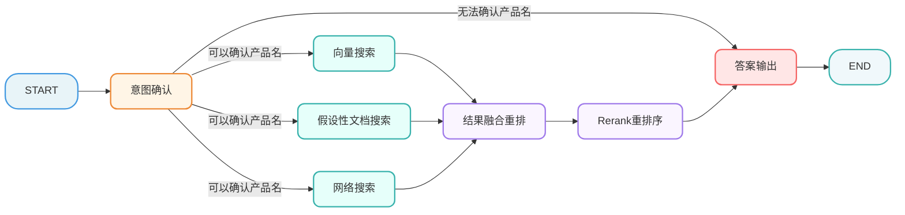
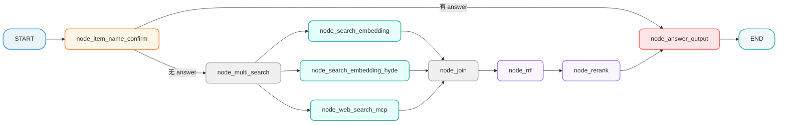
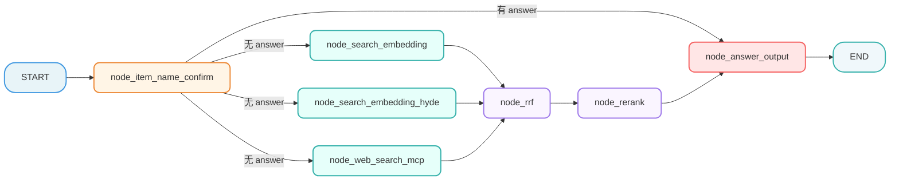

[TOC]

# 掌柜智库 - 【检索】骨架代码 

> 本文档详细介绍知识库检索流程的骨架代码设计与实现，包括状态定义、节点基类和流程图构建。

## 1. 骨架代码

### 1.1 骨架模块职责

| 模块              | 职责                           | 重要性   |
| ----------------- | ------------------------------ | -------- |
| **state.py**      | 定义图状态结构，节点间数据传递 | 数据契约 |
| **base.py**       | 定义节点基类，统一执行逻辑     | 代码复用 |
| **nodes**         | 定义节点，定义核心业务逻辑     | 业务逻辑 |
| **logger.py**     | 统一日志配置                   | 代码复用 |
| **main_graph.py** | 构建工作流图，编排节点执行顺序 | 流程编排 |

### 1.2 全局日志(logger.py)

```python
# tool/logger.py

import logging
import colorlog

logger = logging.getLogger()
logger.setLevel(logging.INFO)

handler = colorlog.StreamHandler()
handler.setFormatter(colorlog.ColoredFormatter(
    '%(log_color)s%(asctime)s - %(filename)s:%(lineno)d - %(levelname)s - %(message)s',
    datefmt='%Y-%m-%d %H:%M:%S',
    log_colors={
        'DEBUG': 'cyan',
        'INFO': 'green',
        'WARNING': 'yellow',
        'ERROR': 'red',
        'CRITICAL': 'bold_red',
    }
))

# logger.handlers.clear()
logger.addHandler(handler)
```

### 1.3 状态定义模块 (state.py)

```python
# processor/query_processor/state.py

from typing import TypedDict, List

class QueryGraphState(TypedDict):
    """
    查询流程图状态
    包含整个查询流程中传递的所有数据。
    """

    session_id: str  # 会话ID
    message_id: str  # 消息ID

    original_query: str  # 用户原始问题

    # 检索过程中的中间数据
    embedding_chunks: list  # 普通向量检索回来的切片
    hyde_embedding_chunks: list  # 已向量化的假设性问题切片
    web_search_docs: list  # 网络搜索回来的文档

    # 排序过程中的数据
    rrf_chunks: list  # RRF 融合排序后的切片
    reranked_docs: list  # 重排序后的最终 Top-K 文档

    # 生成过程中的数据
    prompt: str  # 组装好的 Prompt
    answer: str  # 最终生成的答案

    # 辅助信息
    item_names: List[str]  # 提取出的商品名称
    rewritten_query: str  # 改写后的问题
    history: list  # 历史对话记录
    is_stream: bool  # 是否流式输出
```

### 1.4 节点基类模块 (base.py)

```python
# processor/query_processor/base.py

"""
查询流程节点基类

定义统一的节点接口规范，提供通用功能
"""
from abc import abstractmethod, ABC
from typing import TypeVar
from tool.logger import logger

T = TypeVar("T")  # 泛型状态类型
class NodeBase(ABC):

    name: str = "base_node"  # 节点名称，子类应覆盖

    def __call__(self, state: T) -> T:
        """
        节点执行入口
        """
        try:
            # 1. 开始准备执行节点
            logger.info(f"--- {self.name} 开始啦 ---")

            # 2. 执行节点
            result = self.process(state)

            # 3. 执行节点成功
            logger.info(f"--- {self.name} 完成啦 ---")

            return result

        except Exception as e:
            logger.error(f"{self.name} 执行失败: {e}")
            raise

    @abstractmethod
    def process(self, state: T) -> T:
        """
        节点核心处理逻辑
        子类必须实现此方法
        :param state: 工作流状态对象
        :return: 更新后的状态对象
        """
        pass
```

## 2. 知识库查询业务流程

### 2.1 整体流程

**业务流程**



### 2.2 节点

#### 2.2.1 意图确认

 `node_item_name_confirm.py`

这个节点主要干了 4 件事：

1. 提取与改写 ：结合历史对话提取商品名，并将模糊问题改写为完整独立的精准问题。
2. 向量化检索 ：将提取出的商品名在 Milvus 向量库中进行混合搜索。
3. 标准化对齐 ：根据评分高低自动对齐标准型号，或生成反问让用户手动确认。
4. 同步历史记录 ：将改写后的问题、确认的商品名和处理状态实时写入 MongoDB 数据库。

```python
# processor/query_processor/nodes/node_item_name_confirm.py

import json

from processor.query_processor.base import NodeBase
from processor.query_processor.state import QueryGraphState
from tool.logger import logger


class NodeItemNameConfirm(NodeBase):
    """
    节点功能：确认用户问题中的核心商品名称。
    """

    # 覆盖基类的 name 属性，标识节点名称
    name: str = "node_item_name_confirm"

    def process(self, state: QueryGraphState) -> QueryGraphState:
        """
        节点逻辑
        :param state: 工作流状态对象
        :return: 更新后的状态对象
        """

        logger.info(f"【{self.name}】节点逻辑")

        return state

if __name__ == "__main__":

    # 初始化图状态
    init_state = {
        "original_query": "怎么调他的转印温度？"
    }

    # 创建节点对象
    node_item_name_confirm = NodeItemNameConfirm()
    # 执行节点的单元测试
    result = node_item_name_confirm(init_state)
    # 将返回的图状态进行json序列化
    json_state = json.dumps(result, ensure_ascii=False, indent=4)
    # 输出
    logger.info(json_state)
```

#### 2.2.2 向量检索

`node_search_embedding.py`

这个节点负责根据 改写后的用户问题 ，在 限定的商品范围内 ，利用 BGEM3 混合检索（稠密+稀疏） 技术，从 Milvus 向量数据库中召回 Top5 最相关的知识切片。

```python
# processor/query_processor/nodes/node_search_embedding.py

from processor.query_processor.base import NodeBase
from processor.query_processor.state import QueryGraphState
from tool.logger import logger


class NodeSearchEmbedding(NodeBase):
     """
    节点功能：基于已确认主体名+改写后的用户问题，执行Milvus向量数据库混合检索
    """

     # 覆盖基类的 name 属性，标识节点名称
     name: str = "node_search_embedding"

     def process(self, state: QueryGraphState) -> QueryGraphState:
         """
         节点逻辑
         :param state: 工作流状态对象
         :return: 更新后的状态对象
         """

         # TODO
         logger.info(f"【{self.name}】节点逻辑")

         # return state
         return {"embedding_chunks":  []}
```

#### 2.2.3 HyDE 假设检索节点

`node_search_embedding_hyde.py`

这个节点实现了 HyDE (Hypothetical Document Embeddings) 策略，核心逻辑是 先让 LLM 虚构一个“理想答案”，再用这个答案去向量库检索真实的文档 。

它通过“LLM 生成假设性答案”来增强原始问题的语义信息，再进行混合向量检索，从而大幅提升对“语义匹配但字面不匹配”问题的召回能力。

```python
# processor/query_processor/nodes/node_search_embedding_hyde.py

from processor.query_processor.base import NodeBase
from processor.query_processor.state import QueryGraphState
from tool.logger import logger


class NodeSearchEmbeddingHyde(NodeBase):
    """
    节点功能：HyDE (Hypothetical Document Embedding)
    先让 LLM 生成假设性答案，再对答案进行向量检索，提高召回率。
    """

    # 覆盖基类的 name 属性，标识节点名称
    name: str = "node_search_embedding_hyde"

    def process(self, state: QueryGraphState) -> QueryGraphState:
        """
        节点逻辑
        :param state: 工作流状态对象
        :return: 更新后的状态对象
        """

        # TODO
        logger.info(f"【{self.name}】节点逻辑")

        # return state
        return {"hyde_embedding_chunks": []}
```

#### 2.2.4 网络搜索节点

`node_web_search_mcp.py`

这个节点 负责调用 百炼 MCP (Model Context Protocol) 联网搜索服务 ，获取互联网上的实时信息。

它通过 MCP 协议异步调用百炼联网搜索接口，将用户的查询转化为实时的、结构化的网络搜索结果（包含标题、链接和摘要）。

```python
# processor/query_processor/nodes/node_web_search_mcp.py

from processor.query_processor.base import NodeBase
from processor.query_processor.state import QueryGraphState
from tool.logger import logger


class NodeWebSearchMcp(NodeBase):
    """
    节点功能，调用外部搜索引擎补充信息
    """

    # 覆盖基类的 name 属性，标识节点名称
    name: str = "node_web_search_mcp"

    def process(self, state: QueryGraphState) -> QueryGraphState:
        """
        节点逻辑
        :param state: 工作流状态对象
        :return: 更新后的状态对象
        """

        # TODO
        logger.info(f"【{self.name}】节点逻辑")

        # return state
        return {"web_search_docs": []}
```

#### 2.2.5 倒排融合排序节点:

`node_rrf.py`

这个节点负责将来自不同检索源（如向量检索、HyDE 检索、知识图谱等）的文档列表进行统一合并和重新排序 。它消除了不同检索方式的分数差异，给出一个综合排名最高的文档列表（Top 10）。

```python
# processor/query_processor/nodes/node_rrf.py

from processor.query_processor.base import NodeBase
from processor.query_processor.state import QueryGraphState
from tool.logger import logger


class NodeRrf(NodeBase):
    """
    节点功能：Reciprocal Rank Fusion
    将多路召回的结果（向量、HyDE、Web）进行加权融合排序。
    """

    # 覆盖基类的 name 属性，标识节点名称
    name: str = "node_rrf"

    def process(self, state: QueryGraphState) -> QueryGraphState:
        """
        节点逻辑
        :param state: 工作流状态对象
        :return: 更新后的状态对象
        """

        # TODO
        logger.info(f"【{self.name}】节点逻辑")

        return state
```

#### 2.2.6 重排序节点

`node_rerank.py`

这个节点是知识库检索的“精修师”，它对之前所有步骤召回的文档进行 二次精细排序 。

```python
# processor/query_processor/nodes/node_rerank.py

from processor.query_processor.base import NodeBase
from processor.query_processor.state import QueryGraphState
from tool.logger import logger


class NodeRerank(NodeBase):
    """
    节点功能：使用 Cross-Encoder 模型对 RRF 后的结果进行精确打分重排。
    """

    # 覆盖基类的 name 属性，标识节点名称
    name: str = "node_rerank"

    def process(self, state: QueryGraphState) -> QueryGraphState:
        """
        节点逻辑
        :param state: 工作流状态对象
        :return: 更新后的状态对象
        """

        # TODO
        logger.info(f"【{self.name}】节点逻辑")

        return state
```

#### 2.2.7 答案生成

`node_answer_output.py`

这个节点是知识库查询的“最后一公里”，负责生成最终回答并交付给用户 。

```python
# processor/query_processor/nodes/node_answer_output.py

from processor.query_processor.base import NodeBase
from processor.query_processor.state import QueryGraphState
from tool.logger import logger


class NodeAnswerOutput(NodeBase):
    """
    节点功能: 答案生成
    """

    # 覆盖基类的 name 属性，标识节点名称
    name: str = "node_answer_output"

    def process(self, state: QueryGraphState) -> QueryGraphState:
        """
        节点逻辑
        :param state: 工作流状态对象
        :return: 更新后的状态对象
        """

        # TODO
        logger.info(f"【{self.name}】节点逻辑")

        return state
```

### 2.3 主图

#### 2.3.1 V1



```python
# processor/query_processor/main_graph.py
from dotenv import load_dotenv
from langgraph.constants import END
from langgraph.graph import StateGraph

from processor.query_processor.nodes.node_answer_output import NodeAnswerOutput
from processor.query_processor.nodes.node_item_name_confirm import NodeItemNameConfirm
from processor.query_processor.nodes.node_rerank import NodeRerank
from processor.query_processor.nodes.node_rrf import NodeRrf
from processor.query_processor.nodes.node_search_embedding import NodeSearchEmbedding
from processor.query_processor.nodes.node_search_embedding_hyde import NodeSearchEmbeddingHyde
from processor.query_processor.nodes.node_web_search_mcp import NodeWebSearchMcp
from processor.query_processor.state import QueryGraphState
from tool.logger import logger

# 初始化环境变量（类加载前执行，保证全局生效）
load_dotenv()


class KBQueryWorkflow:
    """
    知识库查询工作流类
    封装LangGraph工作流的构建、编译、执行逻辑，支持自定义配置和多实例运行
    """
    def __init__(self):
        """初始化工作流：创建状态图、注册节点、定义路由规则"""
        # 1. 初始化LangGraph状态图
        self.workflow = StateGraph(QueryGraphState)
        # 2. 初始化所有业务节点（实例属性，支持多实例隔离）
        self._init_nodes()
        # 3. 注册节点到工作流
        self._register_nodes()
        # 4. 设置入口和路由规则
        self._setup_routes()
        # 5. 编译工作流（懒加载，首次执行时编译）
        self._compiled_app = None

    def _init_nodes(self):
        """初始化所有业务节点（私有方法，封装节点创建逻辑）"""
        self.node_item_name_confirm = NodeItemNameConfirm()
        self.node_search_embedding = NodeSearchEmbedding()
        self.node_search_embedding_hyde = NodeSearchEmbeddingHyde()
        self.node_web_search_mcp = NodeWebSearchMcp()
        self.node_rrf = NodeRrf()
        self.node_rerank = NodeRerank()
        self.node_answer_output = NodeAnswerOutput()

    def _register_nodes(self):
        """注册所有节点到工作流（私有方法，统一管理节点注册）"""
        # 节点标识与实例属性名保持一致，便于维护
        self.workflow.add_node("node_item_name_confirm", self.node_item_name_confirm) # 确认主体
        self.workflow.add_node("node_multi_search", lambda x: x) # 虚拟节点：多路搜索分叉点（状态不变）
        self.workflow.add_node("node_search_embedding", self.node_search_embedding) # 向量搜索
        self.workflow.add_node("node_search_embedding_hyde", self.node_search_embedding_hyde) #假设性答案向量搜索
        self.workflow.add_node("node_web_search_mcp", self.node_web_search_mcp) # 联网搜索
        self.workflow.add_node("node_join", lambda x: {}) # 虚拟节点：多路搜索合并点
        self.workflow.add_node("node_rrf", self.node_rrf) # 排序
        self.workflow.add_node("node_rerank", self.node_rerank) # 重排
        self.workflow.add_node("node_answer_output", self.node_answer_output) # 生成

        # 虚拟节点的作用：作为流程的「分叉 / 合并中转站」，解决多分支流程的组织问题，本身无业务逻辑；
        # lambda x:x 含义：接收 state 并原样返回，是最轻便的 “无逻辑传递” 方式；
        # 普通函数替换：定义 def 函数名(state): return state 即可完全等价，优势是易扩展、易调试；

    def _route_after_item_name_confirm(self, state: QueryGraphState) -> str:
        """主体名称确认后的条件路由函数"""
        if state.get("answer"):
            """
            这主要发生在 node_item_name_confirm 节点无法直接确定唯一的商品型号，从而需要“反问用户”或“拒绝回答”的场景。
            具体来说，有以下两种情况会导致 state 中直接出现 answer ，从而跳过后续的检索流程，直接输出：
            1. 多选一（反问用户） ：
            - 场景 ：用户问得太模糊（比如“华为P60”），系统发现数据库里有“华为P60 128G”和“华为P60 Art”两个型号，不足以直接确认。
            - 处理 ：节点会生成一条反问句作为 answer ，例如：“您是想问以下哪个产品：华为P60 128G、华为P60 Art？请明确一下型号。”
            - 结果 ：此时不需要去检索文档了，直接把这句话发给用户让他选。
            
            2. 查无此人（拒绝回答） ：
            - 场景 ：用户问了一个系统里压根没有的商品（比如“小米15”，库里只有华为的数据）。
            - 处理 ：节点会生成一条拒绝句作为 answer ，例如：“抱歉，未找到相关产品，请提供准确型号以便我为您查询。”
            - 结果 ：同样不需要后续检索，直接结束流程。
            """
            return "node_answer_output"

        # 否则继续搜索流程
        return "node_multi_search"


    def _setup_routes(self):
        """设置工作流路由规则"""
        # 1、设置入口节点
        self.workflow.set_entry_point("node_item_name_confirm")

        # 2、注册条件路由边
        self.workflow.add_conditional_edges(
            "node_item_name_confirm",
            self._route_after_item_name_confirm,
            {
                "node_answer_output": "node_answer_output",
                "node_multi_search": "node_multi_search"
            }
        )

        # 3. 并发执行搜索
        self.workflow.add_edge("node_multi_search", "node_search_embedding")
        self.workflow.add_edge("node_multi_search", "node_search_embedding_hyde")
        self.workflow.add_edge("node_multi_search", "node_web_search_mcp")

        # 4. 多路搜索结果合并
        self.workflow.add_edge("node_search_embedding", "node_join")
        self.workflow.add_edge("node_search_embedding_hyde", "node_join")
        self.workflow.add_edge("node_web_search_mcp", "node_join")

        # 5. 合并 -> 排序 -> 重排 -> 生成 -> 结束
        self.workflow.add_edge("node_join", "node_rrf")
        self.workflow.add_edge("node_rrf", "node_rerank")
        self.workflow.add_edge("node_rerank", "node_answer_output")
        self.workflow.add_edge("node_answer_output", END)


    def compile(self):
        """编译工作流（公开方法，支持手动触发编译）"""
        if not self._compiled_app:
            self._compiled_app = self.workflow.compile()
        return self._compiled_app

    def run(self, initial_state: QueryGraphState, stream: bool = False) -> QueryGraphState:
        """
        统一执行入口，支持切换invoke/stream
        :param initial_state:  初始状态对象
        :param stream: 是否是流式输出
        :return: 执行完成后的状态对象
        """
        """"""
        if not self._compiled_app:
            self.compile()
        if stream:
            return self._compiled_app.stream(initial_state)
        else:
            return self._compiled_app.invoke(initial_state)


# ===================== 用法示例 =====================

if __name__ == "__main__":

    # 定义初始状态
    init_state = { "original_query": "如何使用万用表测量电压？"}

    workflow = KBQueryWorkflow()
    # final_state = workflow.run(init_state)
    # logger.info(final_state)
    # 流式输出
    for chunk in workflow.run(init_state, stream=True):
        logger.warning(chunk)

    # 打印编译后的图结构
    logger.info(workflow.compile().get_graph().draw_ascii())

```

#### 2.3.2 V2



```python
from typing import Optional

from dotenv import load_dotenv
from langgraph.constants import END
from langgraph.graph import StateGraph
from processor.query_processor.nodes.node_answer_output import NodeAnswerOutput
from processor.query_processor.nodes.node_item_name_confirm import NodeItemNameConfirm
from processor.query_processor.nodes.node_rerank import NodeRerank
from processor.query_processor.nodes.node_rrf import NodeRrf
from processor.query_processor.nodes.node_search_embedding import NodeSearchEmbedding
from processor.query_processor.nodes.node_search_embedding_hyde import NodeSearchEmbeddingHyde
from processor.query_processor.nodes.node_web_search_mcp import NodeWebSearchMcp
from processor.query_processor.state import QueryGraphState
from tool.logger import logger

# 初始化环境变量（类加载前执行，保证全局生效）
load_dotenv()


class KBQueryWorkflowV2:
    """
    知识库查询工作流类
    封装LangGraph工作流的构建、编译、执行逻辑，支持自定义配置和多实例运行
    """
    def __init__(self):
        """初始化工作流：创建状态图、注册节点、定义路由规则"""
        # 1. 初始化LangGraph状态图
        self.workflow = StateGraph(QueryGraphState)
        # 2. 初始化所有业务节点（实例属性，支持多实例隔离）
        self._init_nodes()
        # 3. 注册节点到工作流
        self._register_nodes()
        # 4. 设置入口和路由规则
        self._setup_routes()
        # 5. 编译工作流（懒加载，首次执行时编译）
        self._compiled_app: Optional[object] = None

    def _init_nodes(self):
        """初始化所有业务节点（私有方法，封装节点创建逻辑）"""
        self.node_item_name_confirm = NodeItemNameConfirm()
        self.node_search_embedding = NodeSearchEmbedding()
        self.node_search_embedding_hyde = NodeSearchEmbeddingHyde()
        self.node_web_search_mcp = NodeWebSearchMcp()
        self.node_rrf = NodeRrf()
        self.node_rerank = NodeRerank()
        self.node_answer_output = NodeAnswerOutput()

    def _register_nodes(self):
        """注册所有节点到工作流（私有方法，统一管理节点注册）"""
        # 节点标识与实例属性名保持一致，便于维护
        self.workflow.add_node("node_item_name_confirm", self.node_item_name_confirm) # 确认主体
        self.workflow.add_node("node_search_embedding", self.node_search_embedding) # 向量搜索
        self.workflow.add_node("node_search_embedding_hyde", self.node_search_embedding_hyde) #假设性答案向量搜索
        self.workflow.add_node("node_web_search_mcp", self.node_web_search_mcp) # 联网搜索
        self.workflow.add_node("node_rrf", self.node_rrf) # 排序
        self.workflow.add_node("node_rerank", self.node_rerank) # 重排
        self.workflow.add_node("node_answer_output", self.node_answer_output) # 生成

    def _route_after_item_name_confirm(self, state: QueryGraphState) -> str:
        """主体名称确认后的条件路由函数"""
        if state.get("answer"):
            """
            这主要发生在 node_item_name_confirm 节点无法直接确定唯一的商品型号，从而需要“反问用户”或“拒绝回答”的场景。
            具体来说，有以下两种情况会导致 state 中直接出现 answer ，从而跳过后续的检索流程，直接输出：
            1. 多选一（反问用户） ：
            - 场景 ：用户问得太模糊（比如“华为P60”），系统发现数据库里有“华为P60 128G”和“华为P60 Art”两个型号，不足以直接确认。
            - 处理 ：节点会生成一条反问句作为 answer ，例如：“您是想问以下哪个产品：华为P60 128G、华为P60 Art？请明确一下型号。”
            - 结果 ：此时不需要去检索文档了，直接把这句话发给用户让他选。

            2. 查无此人（拒绝回答） ：
            - 场景 ：用户问了一个系统里压根没有的商品（比如“小米15”，库里只有华为的数据）。
            - 处理 ：节点会生成一条拒绝句作为 answer ，例如：“抱歉，未找到相关产品，请提供准确型号以便我为您查询。”
            - 结果 ：同样不需要后续检索，直接结束流程。
            """
            return "node_answer_output"

        # 否则继续搜索流程
        return ["node_search_embedding", "node_search_embedding_hyde", "node_web_search_mcp"]


    def _setup_routes(self):
        """设置工作流路由规则"""
        # 1、设置入口节点
        self.workflow.set_entry_point("node_item_name_confirm")

        # 2、注册条件路由边
        self.workflow.add_conditional_edges(
            "node_item_name_confirm",
            self._route_after_item_name_confirm,
            {
                "node_answer_output": "node_answer_output",
                "node_search_embedding": "node_search_embedding",
                "node_search_embedding_hyde": "node_search_embedding_hyde",
                "node_web_search_mcp": "node_web_search_mcp"
            }
        )

        # 3. 多路搜索结果合并
        self.workflow.add_edge("node_search_embedding", "node_rrf")
        self.workflow.add_edge("node_search_embedding_hyde", "node_rrf")
        self.workflow.add_edge("node_web_search_mcp", "node_rrf")

        # 4. 排序 -> 重排 -> 生成 -> 结束
        self.workflow.add_edge("node_rrf", "node_rerank")
        self.workflow.add_edge("node_rerank", "node_answer_output")
        self.workflow.add_edge("node_answer_output", END)


    def compile(self):
        """编译工作流（公开方法，支持手动触发编译）"""
        if not self._compiled_app:
            self._compiled_app = self.workflow.compile()
        return self._compiled_app

    def run(self, initial_state: QueryGraphState, stream: bool = False) -> QueryGraphState:
        """
        统一执行入口，支持切换invoke/stream
        :param initial_state:  初始状态对象
        :param stream: 是否是流式输出
        :return: 执行完成后的状态对象
        """
        """"""
        if not self._compiled_app:
            self.compile()

        self._compiled_app.get_graph().print_ascii()

        if stream:
            return self._compiled_app.stream(initial_state)
        else:
            return self._compiled_app.invoke(initial_state)

# ===================== 用法示例 =====================
if __name__ == "__main__":

    # 定义初始状态
    init_state = { "original_query": "如何使用万用表测量电压？"}

    workflow = KBQueryWorkflowV2()
    # final_state = workflow.run(init_state)
    # logger.info(final_state)
    # 流式输出
    for chunk in workflow.run(init_state, stream=True):
        logger.warning(chunk)

    # 打印编译后的图结构
    logger.info(workflow.compile().get_graph().draw_ascii())
```

