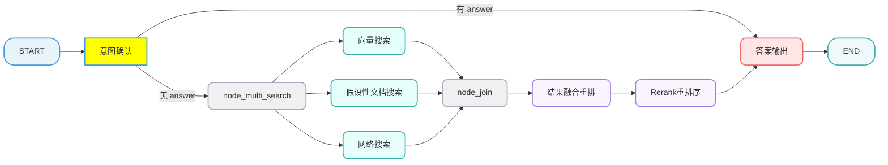
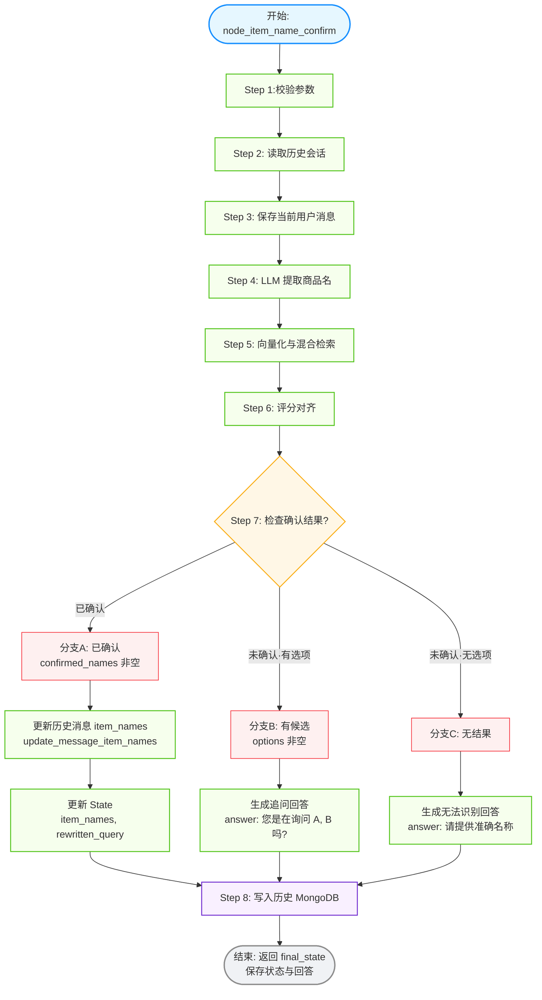
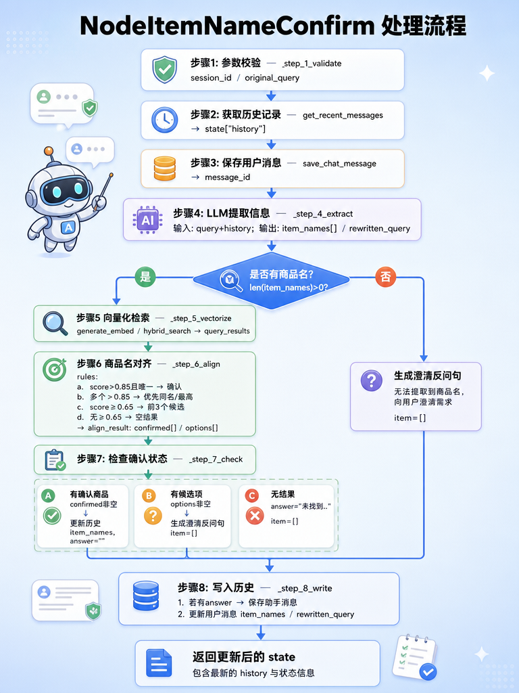

[TOC]

# 掌柜智库 - 【检索】产品确认

## 1. 任务目标

### 1.1 涉及模块 

```
processor/query_processor/nodes/
├── node_item_name_confirm.py
```

#### 1.2 节点在流程中的位置



## 2. 节点业务流程

### 2.1 节点作用

根据用户提出的问题，初步对齐要问的是**哪个产品**以便定位手册。
方式就是利用大模型从问题中提取产品名，与知识库中已有产品进行向量比对。
如果没法确定则返回用户，把候选名单给**用户引导用户确认产品**。

### 2.2 步骤分解




###  2.3 流程说明

1. **参数校验**
2. **读取历史会话**：根据 `session_id` 从 MongoDB 中获取最近 10 条历史会话记录，用于构建上下文。
3. **保存当前问题**：将用户当前的提问保存到数据库，确保对话历史的完整性。
4. **意图理解与改写 (LLM)**：
   *   利用大模型分析当前问题及历史上下文。
   *   提取商品名：识别用户询问的核心商品名称（`item_names`），支持提取多个，返回 JSON 列表。
   *   指代消歧与改写：处理“它”、“这个”等代词，生成指代明确的重写问题 (`rewritten_query`)。
   *   输出结构：`{"item_names": [], "rewritten_query": ""}`。
5. **向量化评分 (BGE-M3)**：
   *   将提取出的 `item_names` 逐个进行向量化。
   *   在 Milvus 向量数据库中查询，与标准商品名进行比对，获取相似度评分（Score）。
6. **商品名对齐策略 (核心逻辑)**：
   *   **> 0.85 (确信匹配)**：
       *   **含义**：极高置信度，系统认为用户输入的名称与库中商品名几乎完全一致。
       *   **操作**：直接锁定该商品。若有多个 > 0.85，取最高分的一个。
   *   **0.6 ~ 0.85 (疑似候选)**：
       *   **含义**：可能是相关商品，也可能是误匹配。
       *   **操作**：将其作为“候选商品”，后续让用户确认。
   *   **< 0.6 (无关/噪音)**：
       *   **含义**：低置信度，认为与库中商品无关。
       *   **操作**：直接丢弃，不作为有效商品名返回。
7. **确认状态检查与分支处理**：
   *   **分支 A：已明确确认 (Confirmed)**
       *   **条件**：有一个商品评分 > 0.85，或用户明确选定了一个商品。
       *   **动作**：
           1.  更新状态 `state`，写入确定的 `item_names` 和 `rewritten_query`。
           2.  **回溯更新**：将历史记录中未识别出商品名的对话，补充标记为当前确认的商品名（利用上下文一致性）。
           3.  进入下一节点（如检索节点）。
   *   **分支 B：未确认但有候选 (Ambiguous)**
       *   **条件**：没有 > 0.85 的商品，但有 >= 0.6 的候选列表。
       *   **动作**：生成澄清话术（如“您是想问以下哪个产品：A, B, 还是 C？”），直接返回给用户，**中断流程**等待用户回复。
   *   **分支 C：未确认且无候选 (Unknown)**
       *   **条件**：所有商品评分均 < 0.6。
       *   **动作**：生成通用回复（如“抱歉，未找到相关产品，请提供准确型号”），直接返回给用户，**中断流程**。
8. **持久化状态**：
   *   将生成的答案（包括澄清追问或最终结果）写入 MongoDB 历史记录。
   *   如果有确定的 `item_names`，同步更新到数据库记录中。

MongoDB 是一个基于分布式文件存储的数据库，由 C++ 语言编写。旨在为 WEB 应用提供可扩展的高性能数据存储解决方案。

### 2.4 历史对话管理

#### 2.4.1 历史对话记录的作用

1. **上下文连续**：保留关键信息，支持追问、补充条件与多轮推理不断档。
2. **指代消歧**：如果只考虑本次的问题往往不足以让大模型理解用户的上下文含义，尤其是一些指代比如：“这个设备”，“它”等等。
3. **交互确认**：为明确问题的一些信息，Agent 可能会反问用户一些问题，经过几次确认后才能准确解答后续问题，比如商品的型号。
4. **识别用户**：长期记录对话可以记住用户偏好，最终形成用户画像。

项目中没有使用 LangChain 的 Checkpointer 方式管理会话，而是自定义了一套基于 MongoDB 的持久化管理策略。

这样做的有很多好处：更加灵活自主，可以根据条件范围查询对话，可以给对话自定义格式，管理查询写入内容。

MongoDB 是一种文档数据库，特别适用于存储海量数据，结构简单，关系简单的数据。

*   **性能和单表容量**上都比 MySQL/PostgreSQL 等传统关系型数据库要好。虽比不上 Redis 这种内存数据库，但在持久化能力和检索功能又比内存数据库强上很多。
*   **缺点**是不适合保持有复杂关联关系，查询复杂的场景。

所以对于这种**结构简单、查询简单但数据庞大**的对话信息特别合适。尤其是 MongoDB 的存储基本单元就是一份 **JSON** 文档，与对话也是非常契合。

#### 2.4.2 MongoDB 基本使用

在 MongoDB 中，数据存储在 **数据库 (Database)** -> **集合 (Collection)** -> **文档 (Document)** 中。

以下操作可以在 `mongosh` 命令行或 MongoDB Compass 的 `Mongosh` 终端中执行。

##### 创建数据库和集合

MongoDB 不需要显式创建数据库，当往一个不存在的数据库中写入数据时，它会自动创建。

```javascript
// 切换/创建数据库 'users'
use users
```

##### 插入文档 (Create)

```javascript
// 插入一条数据到 'users' 集合
// 语法: db.collection.insertOne(document)
db.users.insertOne({ name: "张三", age: 25, email: "zhangsan@example.com" })

// 插入多条数据
// 语法: db.collection.insertMany([document1, document2, ...])
db.users.insertMany([
  { name: "李四", age: 30, email: "lisi@example.com", city: "Beijing" },
  { name: "王五", age: 28, email: "wangwu@example.com", city: "Shanghai" },
  { name: "赵六", age: 35, email: "zhaoliu@example.com", city: "Beijing" }
])
```

##### 查询文档 (Read)

```javascript
// 1. 查询所有数据
// 语法: db.collection.find(query, projection)
db.users.find()

// 2. 等值查询：查询 name 为 "张三" 的数据
db.users.find({ name: "张三" })

// 3. 比较操作符查询：
// $gt (大于), $lt (小于), $gte (大于等于), $lte (小于等于), $ne (不等于)
// 示例：查询 age 大于 25 的数据
db.users.find({ age: { $gt: 25 } })

// 4. 逻辑操作符查询：
// $and (与), $or (或)
// 示例：查询 city 为 "Beijing" 并且 age 小于 30 的数据
db.users.find({ city: "Beijing", age: { $lt: 30 } })

// 示例：查询 city 为 "Beijing" 或者 "Shanghai" 的数据
db.users.find({ $or: [ { city: "Beijing" }, { city: "Shanghai" } ] })

// 5. 包含查询 ($in)
// 示例：查询 age 在 [25, 30] 中的数据
db.users.find({ age: { $in: [25, 30] } })
```

##### 更新文档 (Update)

```javascript
// 1. 更新一条数据
// 语法: db.collection.updateOne(filter, update, options)
// $set 操作符用于修改指定字段的值，如果字段不存在则创建
db.users.updateOne(
  { name: "张三" },       // 过滤条件：找到 name 为 "张三" 的第一条文档
  { $set: { age: 26 } }   // 更新操作：将 age 设为 26
)

// 2. 更新多条数据
// 语法: db.collection.updateMany(filter, update, options)
// 示例：将所有 city 为 "Beijing" 的用户的 status 字段设为 "active"
db.users.updateMany(
  { city: "Beijing" },
  { $set: { status: "active" } }
)

// 3. 自增/自减 ($inc)
// 示例：将 name 为 "李四" 的 age 增加 1
db.users.updateOne(
  { name: "李四" },
  { $inc: { age: 1 } }
)
```

##### 删除文档 (Delete)

```javascript
// 1. 删除一条数据
// 语法: db.collection.deleteOne(filter)
// 示例：删除 name 为 "王五" 的第一条记录
db.users.deleteOne({ name: "王五" })

// 2. 删除多条数据
// 语法: db.collection.deleteMany(filter)
// 示例：删除 age 大于等于 35 的所有用户
db.users.deleteMany({ age: { $gte: 35 } })

// 删除所有数据 (慎用)
// db.users.deleteMany({})
```

#### 2.4.3 历史对话工具

对话数据结构

```json
{
    "session_id": "",
    "role": "",
    "text": "",
    "rewritten_query": "",
    "item_names": [],
    "ts": 123
}
```

每条数据代表一条对话。

| 字段名              | 说明                  |
| :------------------ | :-------------------- |
| **session_id**      | session id            |
| **role**            | 角色： user\assistant |
| **text**            | 对话文本              |
| **rewritten_query** | 改写后的问题          |
| **item_names**      | 设备名称，可多个      |
| **ts**              | 时间戳 秒             |

历史对话工具代码实现

```python
# utils/mongo_history_utils.py

# 导入系统模块：用于读取环境变量
import os
# 导入日志模块：用于记录程序运行日志（成功/失败/错误信息）
import logging
# 导入类型注解模块：用于函数参数/返回值的类型提示，提升代码可读性和规范性
from typing import List, Dict, Any, Optional
# 导入时间模块：用于生成时间戳，记录对话的创建时间
from datetime import datetime
# 导入pymongo核心模块：MongoDB原生Python驱动，实现数据库连接和操作
# ASCENDING：表示升序排序，用于MongoDB索引和查询排序
from pymongo import MongoClient, ASCENDING
# 导入bson的ObjectId：MongoDB默认的主键类型，用于唯一标识文档
from bson import ObjectId
# 导入dotenv模块：用于从.env文件加载环境变量，避免硬编码敏感配置（如MongoDB连接地址）
from dotenv import load_dotenv

# 加载.env文件中的环境变量，使os.getenv能读取到配置
load_dotenv()


class HistoryMongoTool:
    """
    MongoDB 历史对话记录读写工具类 (基于原生 PyMongo 实现)
    核心功能：封装MongoDB的连接、集合初始化、索引创建，为上层提供统一的数据库操作入口
    扩展功能：支持与LangChain消息对象的格式转换（原代码预留能力）
    """
    def __init__(self):
        """
        类初始化方法：完成MongoDB的连接、数据库/集合获取、索引创建
        初始化失败会抛出异常并记录错误日志，确保程序感知连接问题
        """
        try:
            # 从环境变量读取MongoDB连接地址（敏感配置，不硬编码）
            self.mongo_url = os.getenv("MONGO_URL")
            # 从环境变量读取要使用的数据库名称
            self.db_name = os.getenv("MONGO_DB_NAME")

            # 创建MongoDB客户端实例，建立与数据库的连接
            self.client = MongoClient(self.mongo_url)
            # 获取指定名称的数据库对象
            self.db = self.client[self.db_name]
            # 获取对话记录的集合（相当于关系型数据库的表），集合名：chat_message
            self.chat_message = self.db["chat_message"]

            # 为chat_message集合创建复合索引，提升查询性能
            # 索引规则：session_id升序 + ts降序，适配"按会话查最新记录"的核心查询场景
            # create_index自带幂等性：索引已存在时不会重复创建，无需额外判断
            self.chat_message.create_index([("session_id", 1), ("ts", -1)])

            # 记录成功日志，确认数据库连接和初始化完成
            logging.info(f"Successfully connected to MongoDB: {self.db_name}")
        except Exception as e:
            # 捕获所有初始化异常，记录详细错误日志
            logging.error(f"Failed to connect to MongoDB: {e}")
            # 重新抛出异常，让调用方感知初始化失败，避免使用未初始化的实例
            raise


# 定义全局变量：存储HistoryMongoTool的单例实例
# 目的：将数据库连接的初始化提前到模块加载阶段，避免第一次调用接口时才建立连接（提升首次响应速度）
_history_mongo_tool = HistoryMongoTool()

def get_history_mongo_tool() -> HistoryMongoTool:
    """
    获取HistoryMongoTool的单例实例（懒加载模式）
    核心逻辑：全局实例为空时创建，不为空时直接返回，保证整个程序只有一个数据库连接实例
    :return: HistoryMongoTool的单例实例
    """
    # 声明使用全局变量，避免函数内视为局部变量
    global _history_mongo_tool
    # 懒加载：仅当全局实例为空时，才创建新的实例
    if _history_mongo_tool is None:
        _history_mongo_tool = HistoryMongoTool()
    # 返回单例实例
    return _history_mongo_tool

def clear_history(session_id: str) -> int:
    """
    清空指定会话的所有历史对话记录
    :param session_id: 会话唯一标识，用于筛选要删除的记录
    :return: 实际删除的文档数量，删除失败返回0
    """
    # 获取全局的HistoryMongoTool实例，使用单例模式避免重复创建数据库连接
    mongo_tool = get_history_mongo_tool()
    try:
        # 执行批量删除操作：删除所有session_id匹配的文档
        result = mongo_tool.chat_message.delete_many({"session_id": session_id})
        # 记录删除成功日志，包含删除数量和会话ID，便于问题排查
        logging.info(f"Deleted {result.deleted_count} messages for session {session_id}")
        # 返回实际删除的数量（delete_many的返回对象包含deleted_count属性）
        return result.deleted_count
    except Exception as e:
        # 捕获删除异常，记录错误日志，包含会话ID
        logging.error(f"Error clearing history for session {session_id}: {e}")
        # 异常时返回0，标识删除失败
        return 0

def save_chat_message(
        session_id: str,
        role: str,
        text: str,
        rewritten_query: str = "",
        item_names: List[str] = None,
        image_urls: List[str] = None,
        message_id: str = None
) -> str:
    """
    写入/更新单条会话记录到MongoDB
    支持两种模式：无message_id时新增记录，有message_id时更新已有记录
    :param session_id: 会话唯一标识，关联对话所属的会话
    :param role: 消息角色，固定值：user（用户）/assistant（助手）
    :param text: 对话核心内容，用户的提问或助手的回答
    :param rewritten_query: 重写后的查询语句（可选，用于检索增强等场景，默认空字符串）
    :param item_names: 关联的商品名称列表（可选，支持多商品，默认None）
    :param image_urls: 关联的图片URL列表（可选，默认None）
    :param message_id: 记录主键ID（可选，有值则更新，无值则新增）
    :return: 插入/更新的记录唯一标识（新增返回ObjectId字符串，更新返回传入的message_id）
    """
    # 生成当前时间的时间戳（秒级），用于记录消息的创建时间，后续用于排序和查询
    ts = datetime.now().timestamp()

    # 构造要插入/更新的文档数据（MongoDB的基本数据单元是文档，类似Python字典）
    document = {
        "session_id": session_id,  # 会话ID，关联维度
        "role": role,  # 消息角色
        "text": text,  # 消息内容
        "rewritten_query": rewritten_query or "",  # 问题优化后的改写，空值处理为空字符串
        "item_names": item_names,  # 关联商品名称列表
        "image_urls": image_urls,  # 关联图片URL列表
        "ts": ts  # 时间戳，排序和时间筛选维度
    }

    # 获取全局的HistoryMongoTool实例，使用单例模式
    mongo_tool = get_history_mongo_tool()
    # 判断是否传入主键ID，区分更新/新增逻辑
    if message_id:
        # 有message_id：执行更新操作（根据主键更新）
        result = mongo_tool.chat_message.update_one(
            {"_id": ObjectId(message_id)},  # 更新条件：主键匹配（需将字符串转为ObjectId类型）
            {"$set": document}  # 更新操作：$set表示只更新指定字段，保留其他字段
        )
        # 更新操作返回传入的message_id作为标识
        return message_id
    else:
        # 无message_id：执行新增操作
        result = mongo_tool.chat_message.insert_one(document)
        # 新增操作返回插入的ObjectId并转为字符串，便于上层使用（避免直接返回ObjectId对象）
        return str(result.inserted_id)


def update_message_item_names(ids: List[str], item_names: List[str]) -> int:
    """
    批量更新历史会话记录的关联商品名称
    :param ids: 要更新的记录主键ID列表（字符串类型）
    :param item_names: 要设置的新商品名称列表
    :return: 实际更新的文档数量，更新失败返回0
    """
    # 获取全局的HistoryMongoTool实例，使用单例模式
    mongo_tool = get_history_mongo_tool()
    try:
        # 将字符串类型的主键列表转为MongoDB的ObjectId类型（数据库中主键是ObjectId类型）
        object_ids = [ObjectId(i) for i in ids]
        # 执行批量更新操作
        result = mongo_tool.chat_message.update_many(
            # 更新条件：复合条件，同时满足
            {
                "_id": {"$in": object_ids}# 主键在指定的ID列表中（批量筛选）
            },
            {"$set": {"item_names": item_names}}  # 更新操作：设置新的商品名称列表
        )
        # 记录更新成功日志，包含更新数量和新的商品名称
        logging.info(f"Updated {result.modified_count} records to item_names: {item_names}")
        # 返回实际更新的数量（modified_count：真正被修改的文档数，区别于matched_count）
        return result.modified_count
    except Exception as e:
        # 捕获批量更新异常，记录错误日志
        logging.error(f"Error updating history item_names: {e}")
        # 异常时返回0，标识更新失败
        return 0


def get_recent_messages(session_id: str, limit: int = 10) -> List[Dict[str, Any]]:
    """
    查询指定会话的最近N条对话记录，返回原始字典格式
    结果按时间正序排列，可直接喂给LLM作为上下文
    :param session_id: 会话唯一标识，用于筛选指定会话的记录
    :param limit: 条数限制，默认返回最近10条
    :return: 对话记录列表（字典格式），查询失败返回空列表
    """
    # 获取全局的HistoryMongoTool实例，使用单例模式
    mongo_tool = get_history_mongo_tool()
    try:
        # 构造查询条件：仅查询指定session_id的记录
        query = {"session_id": session_id}

        # 执行查询：按时间戳升序排序，限制返回条数
        # find(query)：获取符合条件的游标（惰性加载，不立即查询）
        # sort("ts", ASCENDING)：按ts字段升序（从旧到新），适配LLM上下文顺序
        # limit(limit)：限制返回的最大条数
        cursor = mongo_tool.chat_message.find(query).sort("ts", ASCENDING).limit(limit)
        # 将游标转为列表，触发实际数据库查询，获取所有符合条件的文档
        messages = list(cursor)
        # 返回查询结果列表
        return messages
    except Exception as e:
        # 捕获查询异常，记录错误日志
        logging.error(f"Error getting recent messages: {e}")
        # 异常时返回空列表，避免上层处理None报错
        return []


# 主程序入口：仅当直接运行该脚本时执行，用于简单的功能测试
# if __name__ == "__main__":
#     # 简单测试代码：验证数据库的写入和查询功能是否正常
#     # 测试会话ID，用于标识测试的对话记录
#     sid = "000015_hybrid"
#     # 1. 写入用户消息
#     save_chat_message(sid, "user", "你好 (Hybrid)")
#     # 2. 写入助手回复
#     save_chat_message(sid, "assistant", "你好！我是基于原生 Mongo + LangChain 对象的助手。")
#     # 3. 写入带关联商品的用户消息
#     save_chat_message(sid, "user", "这个万用表怎么换电池？", item_names=["混合万用表"])
#
#     # 4. 查询指定会话的最近5条记录，验证查询功能
#     print("--- 查询 LangChain 对象记录 ---")
#     messages = get_recent_messages(sid, limit=5)
#     # 打印查询到的记录数量
#     print(f"查询到的记录数: {len(messages)}")
#     # 遍历打印每条记录的详细内容
#     for m in messages:
#         print(f" {m}  ")

if __name__ == "__main__":
    # 测试会话，用于确认商品名称是否能正确的提取
    sid = "test_session_002"
    # 1. 写入用户消息
    save_chat_message(sid, "user", "你好，有烫金机吗？")
    # 2. 写入助手回复
    save_chat_message(sid, "assistant", "你好！请问你想询问哪个型号？")
    # 3. 写入带关联商品的用户消息
    save_chat_message(sid, "user", "brother的HAK180烫金机")
    save_chat_message(sid, "assistant", "有的")

# if __name__ == "__main__":
#     # 测试会话，用于确认商品名称是否能正确的提取
#     sid = "test_session_003"
#     # 1. 写入用户消息
#     save_chat_message(sid, "user", "你好，有万用表吗？")
#     # 2. 写入助手回复
#     save_chat_message(sid, "assistant", "你好！请问你想询问哪个型号？")
#     # 3. 写入带关联商品的用户消息
#     save_chat_message(sid, "user", "RS12万用表")
#     save_chat_message(sid, "assistant", "有的")

# 主程序入口：仅当直接运行该脚本时执行，用于简单的功能测试
# if __name__ == "__main__":
#     # 测试会话，用于确认商品名称是否能正确的提取
#     sid = "test_session_004"
#     # 1. 写入用户消息
#     save_chat_message(sid, "user", "你好，请问有烫金机吗")
#     # 2. 写入助手回复
#     save_chat_message(sid, "assistant", "你好！请问你想询问哪个型号？")
#     # 3. 写入带关联商品的用户消息
#     save_chat_message(sid, "user", "HAK180和HAK181都可以")
#     save_chat_message(sid, "assistant", "有的")
```

### 2.5 代码实现

#### 2.5.1 单元测试

```python
if __name__ == "__main__":

    # 初始化图状态
    # "HAK 180 烫金机怎么用？"
    # "怎么用呢？"
    init_state = {
        "original_query": "怎么调他的转印温度？"
    }

    # 创建节点对象
    node_item_name_confirm = NodeItemNameConfirm()
    # 执行节点的单元测试
    result = node_item_name_confirm(init_state)
    # 将返回的图状态进行json序列化
    # json_state = json.dumps(result, ensure_ascii=False, indent=4)
    # 输出
    logger.info(format_json(result))
```

MongoDB的ObjectId无法被序列化，需要通过以下方式将ObjectId转换成字符串

```python
# utils/json_format_utils.py

"""
JSON 格式化工具模块

提供统一的 JSON 序列化和格式化功能，确保项目中 JSON 输出的一致性
"""

import json
from typing import Any, Dict
from bson import ObjectId

class CustomJSONEncoder(json.JSONEncoder):
    """
    自定义 JSON 编码器，支持 MongoDB ObjectId 等特殊类型
    """
    def default(self, obj: Any) -> Any:
        if isinstance(obj, ObjectId):
            return str(obj)
        return super().default(obj)

def format_json(data: Any, indent: int = 4, ensure_ascii: bool = False) -> str:
    return json.dumps(data, indent=indent, ensure_ascii=ensure_ascii, cls=CustomJSONEncoder)
```


#### 2.5.2 主流程定义

##### 流程图



##### process

```python
class NodeItemNameConfirm(NodeBase):
    """
    节点功能：确认用户问题中的核心商品名称。
    """

    # 覆盖基类的 name 属性，标识节点名称
    name: str = "node_item_name_confirm"

    def process(self, state: QueryGraphState) -> QueryGraphState:
        """
        必要参数：session_id、original_query
        更新参数：history、rewritten_query、item_names、answer

        :param state: 工作流状态对象
        :return: 更新后的状态对象
        """

        # 步骤1：校验参数
        session_id, original_query = self._step_1_validate_param(state)
        logger.info(f"步骤1：参数校验通过")

        # 步骤2：获取历史记录
        history = get_recent_messages(session_id)
        logger.info(f"步骤2：获取到 {len(history)} 条历史消息")
        # 更新状态
        state["history"] = history

        # 步骤3：用户初始消息保存
        message_id = save_chat_message(session_id, "user", original_query)
        logger.info(f"步骤3：用户消息已初始保存, ID: {message_id}")

        # 步骤4：提取信息
        extract_res = self._step_4_extract_info(original_query, history)
        item_names = extract_res.get("item_names")
        rewritten_query = extract_res.get("rewritten_query", original_query)
        # 更新状态
        state["rewritten_query"] = rewritten_query
        state["item_names"] = item_names

        # 5. & 6. 如果有提取到商品名，进行搜索和对齐
        align_result = {}
        if len(item_names) > 0:
            query_results = self._step_5_vectorize_and_query(item_names)
            align_result = self._step_6_align_item_names(query_results)
        else:
            logger.info("Node: 未提取到商品名，跳过向量检索")

        # 7. 检查确认状态
        state = self._step_7_check_confirmation(state, align_result, history)

        # 8. 写入最终历史
        self._step_8_write_history(state, session_id, rewritten_query, message_id)    
        return state
```

##### 步骤1：参数校验

```python
    def _step_1_validate_param(self, state: QueryGraphState) -> Tuple[str, str]:

        session_id = state.get("session_id") 
        if not session_id:
            raise ValueError("核心参数session_id缺失")

        original_query = state.get("original_query")
        if not original_query:
            raise ValueError("核心参数original_query缺失")

        return session_id, original_query
```

##### 步骤2-3：历史会话管理

```python
# 步骤2：获取历史记录
history = get_recent_messages(session_id)
logger.info(f"步骤2：获取到 {len(history)} 条历史消息")
# 更新状态
state["history"] = history

# 步骤3：用户初始消息保存
message_id = save_chat_message(session_id, "user", original_query)
logger.info(f"步骤3：用户消息已初始保存, ID: {message_id}")
```

##### 步骤4：提取商品名称

**功能**：利用 LLM 从用户当前问题及历史会话中提取核心信息。

**逻辑**：

1.  构造包含历史对话和当前问题的 Prompt。
2.  调用 LLM（开启 JSON 模式），要求提取 `item_names`（商品名列表）并生成 `rewritten_query`（改写后的独立问题）。
3.  解析 LLM 返回的 JSON，处理可能的格式异常。

**RAG 中重写用户提问（rewritten_query）的核心原因（重点环节）**

1. **修复用户输入的 “不完美”**：用户提问常存在口语化、模糊、错别字、信息缺失（比如 “这个怎么用” 缺上下文）等问题，重写后可补全信息、修正错误，让查询更精准（例：“张三的产品”→“查询张三相关的 XX 产品使用说明”）。
2. **适配知识库检索规则**：RAG 的核心是 “检索知识库找答案”，原始提问可能不符合知识库的索引 / 关键词体系（比如用户说 “咋弄”，知识库用 “如何操作”），重写后可对齐术语、补充检索关键词，提升召回率。
3. **增强上下文关联性**：多轮对话中，用户可能只说 “再说说这个”，重写时可结合历史对话补全上下文（例：“再说说这个”→“再说说 XX 产品的使用步骤”），避免检索跑偏。

重写提问的核心目标是：**把用户 “自然、模糊的原始问题” 转化为 “精准、适配检索规则的查询语句”**，最终提升 RAG 检索的准确性和答案的相关性。

提示词

```python
# processor/query_processor/prompt/item_name_confirm.py

ITEM_NAME_EXTRACT_SYSTEM_PROMPT = "你是一个专业的客服助手，擅长理解用户意图和提取关键信息。"

ITEM_NAME_EXTRACT_TEMPLATE = """
历史会话：
{history_text}

当前用户问题：
{query}

请根据历史会话和当前问题，提取用户正在询问的商品名称（item_names）。
1. 如果用户明确提到了商品名称，请提取出来。可能有一个或多个，但不能重复。
2. 如果用户使用了代词（如"这个"、"它"），请结合历史会话指代消解，确定商品名称。
3. 如果无法确定商品名称，item_names 返回空列表。
4. 请重新改写用户的问题（rewritten_query），使其成为包含商品名称的独立完整问题。

请直接返回JSON格式结果，格式如下：
{{
    "item_names": ["商品A", "商品B"],
    "rewritten_query": "关于商品A和商品B，..."
}}
"""
```

代码

```python
    def _step_4_extract_info(self, query, history) -> Dict:
        """
        利用LLM从当前问题以及历史会话中提取出主要询问的商品名称item_names（可多个，JSON列表形式）
        若商品名不够明确则返回空列表，同时根据上下文重新改写问题，保证问题独立完整
        :param query: 字符串 - 用户当前原始查询问题（如："这个多少钱？"）
        :param history: 列表[字典] - 近期会话历史，每条消息含role/text等字段，
                        格式：[{"role": "user/assistant", "text": "消息内容", "_id": "消息ID"}, ...]
        :return: 字典 - 提取结果，固定包含2个字段，格式：
                 {
                     "item_names": ["商品名1", "商品名2", ...],  # 提取的商品名列表，无则空列表
                     "rewritten_query": "改写后的完整问题"       # 包含商品名的独立问题，无则返回原始query
                 }
        """

        try:
            # 1. 获取llm客户端
            chat_model = ChatOpenAI(
                model=lm_config.item_model,
                api_key=lm_config.api_key,
                base_url=lm_config.base_url,
                temperature=lm_config.llm_temperature,
                # 开启JSON标准输出模式，强制模型返回可解析的json_object
                model_kwargs={
                    "response_format": {"type": "json_object"}
                }
            )

            # 2. 构造历史对话文本，拼接为"角色: 内容"的格式，供LLM做上下文理解
            history_text = ""
            for msg in history:
                role = msg.get("role")
                content = msg.get("text")
                history_text += f"{role}: {content}\n"

            # 3. 处理和动态拼接提示词
            # 为了把大括号当作 “普通字符” 保留下来，用双大括号 {{ 表示普通的左大括号 {，双大括号 }} 表示普通的右大括号 }。
            user_prompt = ITEM_NAME_EXTRACT_TEMPLATE.format(
                history_text=history_text,
                query=query
            )

            # 4. 构造LLM调用的消息列表，包含系统角色（定义助手身份）和用户角色（传入提示词）
            messages = [
                SystemMessage(content=ITEM_NAME_EXTRACT_SYSTEM_PROMPT),
                HumanMessage(content=user_prompt)
            ]


            # 5. 调用LLM客户端，发起请求获取结果
            response = chat_model.invoke(messages)
            content = response.content

            # 6. 数据清洗：处理LLM可能返回的代码块格式（如```json ... ```），去除包裹符
            if content.startswith("```json"):
                content = content.replace("```json", "").replace("```", "")

            # 7. 数据解析：将JSON字符串转为字典
            result = json.loads(content)

            # 8. 健壮性处理：确保字段存在
            # 确保返回结果包含item_names字段，无则设为空列表
            if "item_names" not in result:
                result["item_names"] = []
            # 确保返回结果包含rewritten_query字段，无则复用原始查询
            if "rewritten_query" not in result:
                result["rewritten_query"] = query

            # 9. 给item_names 去除空格
            result["item_names"] = [
                name.replace(" ", "").replace("\n", "").replace("\t", "").replace("\r", "")
                for name in result["item_names"]
            ]

            # 10、返回解析后的提取结果
            return result

        except Exception as e:
            # 捕获所有异常（如LLM调用失败、JSON解析失败等），记录错误日志
            logger.error(f"大模型调用异常：{e}")
            # 异常时返回默认结果：空商品名列表+原始查询
            return {"item_names": [], "rewritten_query": query}
```

##### 步骤5：向量化并查询

**功能**：将提取出的商品名转化为向量，并在 Milvus 库中搜索最相似的标准商品名。

**逻辑**：

1.调用 `generate_embeddings` 批量生成 BGE-M3 稠密向量和稀疏向量。

2.遍历每个商品名，构建混合搜索请求（Dense + Sparse）。

```python
# utils/milvus_utils.py
# 在这个文件中添加如下方法

def create_hybrid_search_requests(dense_vector, sparse_vector, dense_params=None, sparse_params=None, expr=None,
                                  limit=5):
    """
    构建Milvus混合搜索请求对象
    分别创建稠密/稀疏向量的搜索请求，用于后续混合搜索融合
    :param dense_vector: 文本生成的稠密向量
    :param sparse_vector: 文本生成的稀疏向量
    :param dense_params: 稠密向量搜索参数，默认使用余弦相似度
    :param sparse_params: 稀疏向量搜索参数，默认使用内积相似度
    :param expr: 搜索过滤表达式，用于精准筛选数据
    :param limit: 单向量搜索返回结果数量，默认5
    :return: 搜索请求列表，包含[dense_req, sparse_req]
    """
    # 稠密向量默认搜索参数：余弦相似度（COSINE），适配BGE-M3稠密向量
    if dense_params is None:
        dense_params = {"metric_type": "COSINE"}
    # 稀疏向量默认搜索参数：内积（IP），适配BGE-M3稀疏向量
    if sparse_params is None:
        sparse_params = {"metric_type": "IP"}

    # 构建稠密向量搜索请求，关联Milvus的dense_vector字段 近似最近邻（ANN）检索请求的核心类
    dense_req = AnnSearchRequest(
        data=[dense_vector],
        anns_field="dense_vector",
        param=dense_params,
        expr=expr,
        limit=limit
    )

    # 构建稀疏向量搜索请求，关联Milvus的sparse_vector字段
    sparse_req = AnnSearchRequest(
        data=[sparse_vector],
        anns_field="sparse_vector",
        param=sparse_params,
        expr=expr,
        limit=limit
    )

    return [dense_req, sparse_req]


def hybrid_search(client, collection_name, reqs, ranker_weights=(0.5, 0.5), norm_score=False, limit=5,
                  output_fields=None, search_params=None):
    """
    执行Milvus稠密+稀疏向量混合搜索
    基于WeightedRanker实现双向量搜索结果加权融合，提升检索准确性
    :param client: MilvusClient实例
    :param collection_name: 集合名称
    :param reqs: 搜索请求列表，固定为[dense_req, sparse_req]
    :param ranker_weights: 加权融合权重，默认(0.5,0.5)，依次对应稠密/稀疏向量
    :param norm_score: 是否归一化评分后再融合，避免评分量级差异导致权重失效
    :param limit: 混合搜索最终返回结果数量，默认5
    :param output_fields: 需要返回的字段列表，默认返回item_name
    :param search_params: 搜索参数，如ef/topk等，默认None
    :return: 混合搜索结果列表，搜索失败返回None
    """
    try:
        # 初始化加权排名器：按权重融合稠密/稀疏向量的搜索结果
        # norm_score=True：先将两个向量评分归一化到0~1区间，再加权计算，避免一个得分特别大、另一个特别小导致权重失效。
        # 版本：V2.4
        rerank = WeightedRanker(ranker_weights[0], ranker_weights[1], norm_score=norm_score)
        # 默认返回字段：文档标识字段
        if output_fields is None:
            output_fields = ["item_name"]

        # 执行混合搜索：融合稠密+稀疏向量结果，按权重重新排序
        res = client.hybrid_search(
            collection_name=collection_name,
            reqs=reqs,
            ranker=rerank,
            limit=limit,
            output_fields=output_fields,
            search_params=search_params
        )

        logger.info(f"Milvus混合搜索完成，集合[{collection_name}]共检索到{len(res[0])}条结果")
        return res
    except Exception as e:
        logger.error(f"Milvus混合搜索执行失败，集合[{collection_name}]：{str(e)}", exc_info=True)
        return None
```

3.调用 `hybrid_search` 在 `ITEM_NAME_COLLECTION` 集合中检索 Top 5 相似结果。

```python
    def _step_5_vectorize_and_query(self, item_names) -> List[Dict]:
        """
           把分析出的item_names逐个向量化（BGEM3模型），并在Milvus向量数据库(kb_item_names)中执行混合搜索，获取匹配评分
           :param item_names: 列表[字符串] - 步骤4中 提取的商品名列表（如["苹果15", "华为P60"]）
           :return: 列表[字典] - 格式：
                [
                    {
                        "extracted_name": "提取的原始商品名",  # 如"苹果15"
                        "matches": [                          # 该商品名的TopN匹配结果，无则空列表
                            {
                                "item_name": "数据库中的商品名",  # Milvus中存储的标准化商品名
                                "score": 0.98                  # 混合搜索的相似度评分（0-1，越高越相似）
                            },
                            ...
                        ]
                    },
                    ...
                ]
        """
        # 1、初始化最终返回结果列表，存储每个商品名的向量化查询结果
        results = []

        # 2、获取Milvus向量数据库的客户端连接对象
        client = get_milvus_client()

        # 3、校验Milvus客户端连接是否成功，失败则记录错误日志并返回空结果
        if not client:
            logger.error("连接 Milvus 失败")
            return results

        # 4、从环境变量中获取Milvus中存储商品名称向量的集合名（表名）
        collection_name = milvus_config.item_name_collection  # kb_item_names

        # 5、对所有商品名称批量生成BGEM3向量（稠密+稀疏），相比逐个生成提升处理效率
        # embeddings格式：{"dense": [向量1, 向量2,...], "sparse": [向量1, 向量2,...]}
        embeddings = generate_embeddings(item_names)

        # 6、遍历每个商品名称，逐个执行向量搜索（保证结果与原始商品名一一对应）
        for i in range(len(item_names)):
            try:
                # 从批量生成的向量结果中，取出当前商品名对应的稠密向量（高维连续值，如[0.12, 0.35,...]）
                dense_vector = embeddings.get("dense")[i]
                # 从批量生成的向量结果中，取出当前商品名对应的稀疏向量（键值对，如{100:0.747, 205:0.664}）
                sparse_vector = embeddings.get("sparse")[i]

                # 构造Milvus混合搜索请求对象，传入稠/稀疏向量，指定返回Top5匹配结果
                # reqs返回格式：[稠密向量搜索请求, 稀疏向量搜索请求]
                reqs = create_hybrid_search_requests(
                    dense_vector=dense_vector,
                    sparse_vector=sparse_vector,
                    limit=5
                )

                # 执行BGEM3混合向量搜索，获取数据库中的匹配结果和评分
                # 默认配置：稠/稀疏向量权重各0.8/0.2，开启评分归一化（将距离值转为0-1相似度评分）
                search_res = hybrid_search(
                    client=client,  # Milvus客户端连接实例
                    collection_name=collection_name,  # 目标向量集合名（存储商品向量的表）
                    reqs=reqs,  # 混合搜索请求对象列表
                    ranker_weights=(0.8, 0.2),  # 稠/稀疏向量评分权重配比（和为1最佳）
                    limit=5,  # 最终返回Top5匹配结果
                    norm_score=True,  # 开启评分归一化，统一评分量级为0-1
                    output_fields=["item_name"]  # 指定返回Milvus中存储的商品名字段（业务字段）
                )

                # 初始化当前商品名的匹配结果列表，存储匹配到的商品名+对应相似度评分
                matches = []
                # 校验搜索结果是否有效（非空且包含数据，适配Milvus批量搜索格式）
                if search_res and len(search_res) > 0:
                    # 遍历当前商品名的Top5匹配结果（search_res[0]为该商品的独立搜索结果集）
                    for hit in search_res[0]:
                        # 提取匹配结果中的商品名和评分，做防KeyError处理（设置默认空字典）
                        # hit格式：{"id": 数据库ID, "distance": 相似度评分, "entity": {"item_name": "标准化商品名"}}
                        matches.append(
                            {
                                "item_name": hit.get("entity", {}).get("item_name"),  # 数据库标准化商品名
                                "score": hit.get("distance"),  # 0-1相似度评分
                            }
                        )

                # 将当前商品名的原始名称+匹配结果，封装后加入最终结果列表
                results.append({
                    "extracted_name": item_names[i],  # step4提取的原始商品名称
                    "matches": matches  # 该商品名的Top5匹配结果（含评分）
                })

            # 捕获单个商品名处理的异常（不中断其他商品名执行），仅记录错误日志
            except Exception as e:
                logger.error(f"查询商品名 '{item_names[i]}' 时出错: {e}")

        # 返回所有商品名的向量化+搜索结果列表
        return results
```

> 这段代码在做什么？
>
> 想象你去图书馆找书，图书管理员会这样帮你：
>
> 1. 你说需求："我想找关于 Python 编程的书"
> 2. 管理员理解：
>    - 听你说的关键词（稠密向量搜索）- 权重 0.8
>    - 看书名、目录的精确匹配（稀疏向量搜索）- 权重 0.2
> 3. 综合评分：把两种搜索方式的结果按 8:2 的比例合并
> 4. 给你最好的 5 本：从所有匹配的书里选出最相关的 Top 5
>
> 
>
> 类比生活场景：找工作面试
>
> - 向量搜索（80% 权重）：看综合能力、潜力（模糊但全面）
> - 关键词搜索（20% 权重）：看简历上的硬性条件（精确但死板）
> - Top 5：最后录用前 5 名
> - 归一化：把所有面试官的打分都换算成百分制，公平比较
>
> 
>
> **注意：**
>
> 导入流程的归一化 `node_item_name_recognition.py` 中的 `"normalize": True`
>
> 是对存储在 Milvus 中的**稀疏向量本身**做归一化
>
> - 目的：让向量的长度变成 1，这样用 IP（内积）计算时，结果就等于余弦相似度
> - 通俗比喻：就像把所有尺子都统一成"米"为单位，这样比较长短时才有意义。如果不统一，有的用厘米、有的用米，就没法直接比了。
> - 作用范围： 只影响单个向量的**存储格式**
>
> 搜索流程的归一化：`node_item_name_confirm.py` 中的 `norm_score=True`
>
> 是对**搜索结果的评分（score）**做归一化
>
> - 目的：把稠密向量和稀疏向量的得分都缩放到 0~1 的范围，然后再加权融合
> - 假设没有归一化：
>   - 稠密向量得分范围：0 ~ 100（比如返回 85 分）
>   - 稀疏向量得分范围：0 ~ 10（比如返回 7 分）
>   - 如果权重是 (0.8, 0.2)：
>   - 最终得分 = 85 × 0.8 + 7 × 0.2 = 68 + 1.4 = 69.4
>   - 你会发现稀疏向量几乎不起作用，因为它的分值太小了！
> - 开启 norm_score=True 后：
>   - 稠密得分 85 → 归一化成 0.85
>   - 稀疏得分 7 → 归一化成 0.7
>   - 最终得分 = 0.85 × 0.8 + 0.7 × 0.2 = 0.68 + 0.14 = 0.82
>   - 这样两个向量才能公平地参与加权。

##### 步骤6：对齐结果

**功能**：根据搜索评分（Score）判定商品名是“确认”、“候选”还是“无效”。
**逻辑**：

* 规则a: 只有一个高置信度结果（>0.85）→ 直接确认该商品名
* 规则b: 如果多条匹配结果评分超过0.85 → 优先取与原始提取名相同的，无则取分数最高的
* 规则c: 如果无0.85分以上结果 → 取分数≥0.6的最高前5个作为候选
* 规则d: 如果无0.6分及以上结果 → 不返回任何商品名（确认+候选均为空）

```python
    def _step_6_align_item_names(self, query_results) -> dict:
        """
        6 根据Milvus搜索评分，逐个对齐step4提取的item_names，生成「确认商品名」和「候选商品名」
        对齐规则（优先级a>b>c>d）：
                a  如果只有一个匹配结果评分高于0.85 → 直接确认该商品名
                b  如果多条匹配结果评分超过0.85 → 优先取与原始提取名相同的，无则取分数最高的
                c  如果无0.85分以上结果 → 取分数≥0.6的最高前5个作为候选
                d  如果无0.6分及以上结果 → 不返回任何商品名（确认+候选均为空）
        :param query_results: 列表[字典] - step5的返回结果，每个商品名的搜索匹配数据（格式同step5返回值）
        :return: 字典 - 商品名对齐结果，包含确认列表和候选列表，格式：
                 {
                     "confirmed_item_names": ["确认商品名1", "确认商品名2"],  # 去重后的确认商品名，无则空列表
                     "options": ["候选商品名1", "候选商品名2", ...]          # 去重后的候选商品名，无则空列表
                 }
        """
        # 1、初始化确认商品名列表（符合高置信度规则的商品名）
        confirmed_item_names: List[str] = []
        # 2、初始化候选商品名列表（低置信度，需用户确认的商品名）
        options: List[str] = []

        logger.info(f"步骤6：获得待处理的数据源：{query_results}")

        for res in query_results:
            # 提取原始的数据，商品名和匹配结果
            extracted_name = (res.get("extracted_name", "") or  "").strip()
            # 获取匹配的商品名，无就获取空列表
            matches = res.get("matches", []) or []
            # 若无匹配结果，直接跳过当前商品名的对齐
            if not matches:
                continue

            # 筛选高置信度匹配结果：评分>0.85
            high = [m for m in matches if m.get("score", 0) > 0.85]
            # 筛选中置信度匹配结果：评分≥0.6（仅高置信度为空时生效）
            mid = [m for m in matches if m.get("score", 0) >= 0.6]

            # 优化 ab 所有评分高于0.85的都可以直接确认
            if len(high) > 0:
                for m in high:
                    confirmed_item_names.append(m.get("item_name"))
                continue
            # 筛选高置信度得分的结果： >= 0.65
            # # a  如果只有一个匹配结果评分高于0.85 → 直接确认该商品名
            # if len(high) == 1:
            #     confirmed_item_names.append(high[0].get("item_name"))
            #     continue
            #
            # # b  如果多条匹配结果评分超过0.85 → 优先取与原始提取名相同的，无则取分数最高的
            # if len(high) > 1:
            #     picked = None
            #     if extracted_name:
            #
            #         # 优先取与原始提取名相同的
            #         for m in high:
            #             if m.get("item_name") == extracted_name:
            #                 picked = m
            #                 break
            #
            #     if not picked:
            #         # 无则取分数最高的
            #         picked = high[0]
            #
            #     confirmed_item_names.append(picked.get("item_name"))
            #     continue

            # 规则c: 无0.85分以上结果，取≥0.6分的最高前3个作为候选
            # 注：高置信度列表high为空时才会走到此处（规则a/b均不满足）
            if len(mid) > 0:
                # 取中置信度结果的前5个，加入候选列表
                for m in mid[:3]:
                    options.append(m.get("item_name"))

            # 规则d: 无0.6分及以上结果 → 不做任何操作，确认+候选列表均为空
        # 返回最终对齐结果：确认列表和候选列表均做去重处理（list(set())）
        return {
            "confirmed_item_names": list(set(confirmed_item_names)),  # 去重，避免重复确认
            "options": list(set(options))  # 去重，避免重复候选
        }
```

##### 步骤7：检查确认状态

**功能**：根据对齐结果更新会话状态（State），决定后续流程分支。

**逻辑**：

1.  **分支A（有确认商品）**：更新 State 中的 `item_names`，并批量回填历史消息中缺失的商品名关联。
2.  **分支B（有候选选项）**：生成澄清反问句（如“您是指...吗？”），写入 State 的 `answer` 字段，清空 `item_names`。
3.  **分支C（无结果）**：生成拒识回复（如“未找到相关产品...”），写入 State 的 `answer` 字段。

```python
   def _step_7_check_confirmation(self, state, align_result, history):
        """
        7 检查step6对齐后的商品名状态，分3种分支更新state，并同步更新历史消息的商品名关联
        :param state: 字典 - 原始会话状态，包含session_id/original_query等核心字段
        :param align_result: 字典 - step6的对齐结果
        :param history: 列表[字典] - 近期会话历史
        :return: 字典 - 更新后的会话状态，包含item_names/answer
        """
        # 从对齐结果中提取确认商品名列表，无则空列表
        confirmed = align_result.get("confirmed_item_names", [])
        # 从对齐结果中提取候选商品名列表，无则空列表
        options = align_result.get("options", [])

        # 分支A：有确认的商品名（高置信度，无需用户确认）
        if confirmed:
            # 收集历史消息中未关联商品名的消息ID（需批量更新关联）
            ids_to_update = []
            for msg in history:
                if not msg.get("item_names"):  # 仅更新item_names为空的历史消息
                    mid = msg.get("_id")  # 提取消息唯一ID
                    if mid:
                        ids_to_update.append(str(mid))  # 转为字符串，避免ID格式问题

            # 若存在需更新的消息ID，批量更新历史消息的商品名关联
            if ids_to_update:
                update_message_item_names(ids_to_update, confirmed)

            # 更新会话状态：设置确认商品名、改写后的查询
            state["item_names"] = confirmed
            state["answer"] = ""
            # 返回更新后的状态
            return state

        # 分支B：无确认商品名，但有候选商品名（中置信度，需用户明确）
        if options:
            # 候选商品名拼接为字符串，格式："商品1、商品2、商品3"
            options_str = "、".join(options)
            # 构造向用户确认的提示语
            answer = f"您是想问以下哪个产品：{options_str}？请明确一下型号。"
            # 更新会话状态：设置确认提示语、清空商品名列表
            state["answer"] = answer
            state["item_names"] = []
            return state

        # 分支C：无确认商品名，且无候选商品名（无匹配结果，需用户重新提供）
        state["answer"] = "抱歉，未找到相关产品，请提供准确型号以便我为您查询。"
        state["item_names"] = []
        return state
```

##### 步骤8：写入历史记录

**功能**：将本次交互的核心数据持久化到 MongoDB。
**逻辑**：

1.  如果生成了助手回答（分支 B/C），调用 `save_chat_message` 保存助手消息。
2.  更新用户当前消息记录，补充 `rewritten_query` 和关联的 `item_names`。

```python
    def _step_8_write_history(self, state, session_id, rewritten_query, message_id):
        """
         8 把本次处理的核心信息（用户问题、助手答案、商品名、改写查询）写入MongoDB的会话历史
         包含2个核心操作：1. 写入助手答案（若有）；2. 更新用户原始问题的关联信息
         :param state: 字典 - step6更新后的会话状态，包含answer/item_names等字段
         :param session_id: 字符串 - 会话唯一标识
         :param rewritten_query: 字符串 - step3改写后的完整问题
         :param message_id: 字符串 - 本次用户问题的消息唯一ID
         :return:
         """
        # 若会话状态中有助手答案（分支B/C），写入助手消息到历史
        if state.get("answer"):
            save_chat_message(
                session_id=session_id,  # 会话ID，关联所属会话
                role="assistant",  # 消息角色：助手
                text=state["answer"],  # 消息内容：向用户确认的提示语/无结果提示语
                rewritten_query="",  # 助手消息无需改写查询，设为空
                item_names=state.get("item_names", [])  # 关联的商品名列表（分支B/C均为空）
            )

        # 强制更新本次用户原始问题的关联信息（核心：补充改写查询、商品名）
        save_chat_message(
            session_id=session_id,  # 会话ID，关联所属会话
            role="user",  # 消息角色：用户
            text=state["original_query"],  # 消息内容：用户原始查询
            rewritten_query=rewritten_query,  # 补充step3改写后的完整问题
            item_names=state.get("item_names", []),  # 补充关联的商品名列表
            message_id=message_id  # 消息ID，指定更新已存在的用户消息（而非新增）
        )

        # 返回最终会话状态，供下游节点使用
        return state
```


