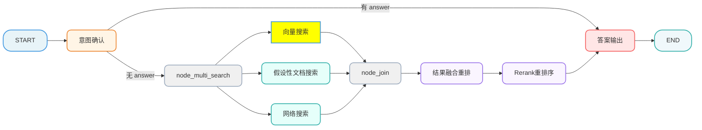
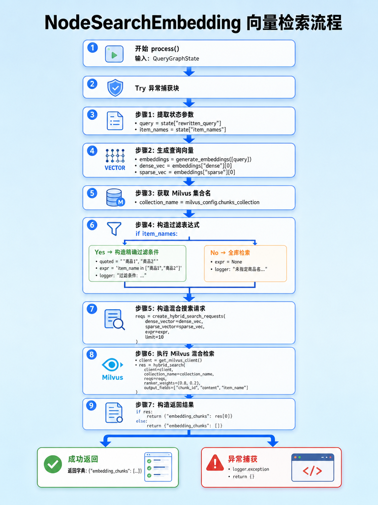

[TOC]

# 掌柜智库-【检索】搜索向量库

## 1. 任务目标

### 1.1 涉及模块 

```
processor/query_processor/nodes/
├── node_search_embedding.py
```

#### 1.2 节点在流程中的位置



## 2. 节点业务流程

### 2.1 节点作用

节点功能：基于已确认主体名+改写后的用户问题，执行Milvus向量数据库混合检索

### 2.2 流程说明

**1）获取查询上下文**
从状态（state）中提取经过改写的问题（`rewritten_query`）以及在上一节点确认的商品名称列表（`item_names`）。

**2）文本向量化**
调用嵌入模型接口，将改写后的问题转换为向量表示。这里同时生成两种向量：

*   **稠密向量 (Dense Vector)**：用于捕捉语义相似度。
*   **稀疏向量 (Sparse Vector)**：用于捕捉关键词匹配。

**3）构建混合检索请求**
准备 Milvus 混合搜索参数：

*   **过滤条件**：如果有确定的商品名，构造 `item_name in [...]` 过滤器，限定搜索范围。
*   **检索策略**：结合稠密向量（COSINE 距离）和稀疏向量（IP 内积）进行多路召回。

**4）执行向量检索**
连接 Milvus 数据库的 `CHUNKS_COLLECTION` 集合，执行混合检索。

*   **加权融合**：使用 0.8/0.2 的权重对稠密和稀疏得分进行重排序（Rerank）。
*   **结果截取**：返回 Top 5 最相关的文档切片（Chunks）。

**5）更新状态**
将检索到的文档切片列表（`embedding_chunks`）存入状态，供后续节点使用。

### 2.3 代码实现

#### 2.3.1 单元测试

```python
if __name__ == "__main__":

    init_state = {
        "rewritten_query": "关于brother HAK180烫金机，如何调节转印温度？",
        "item_names": ["BrotherHAK180烫金机", "BrotherHAK-180烫金机"]
    }
    node_search_embedding = NodeSearchEmbedding()
    result = node_search_embedding(init_state)
    logger.info(serialize_json(result, indent=4))
```

#### 2.3.2 主流程定义

##### 流程图



##### process

```python
# processor/query_processor/nodes/node_search_embedding.py
from config.milvus_config import milvus_config
from processor.query_processor.base import NodeBase, T
from processor.query_processor.state import QueryGraphState
from tool.logger import logger
from utils.embedding_utils import generate_embeddings
from utils.json_format_utils import serialize_json
from utils.milvus_utils import create_hybrid_search_requests, get_milvus_client, hybrid_search


class NodeSearchEmbedding(NodeBase):
     """
    节点功能：基于已确认主体名+改写后的用户问题，执行Milvus向量数据库混合检索
    """

     # 覆盖基类的 name 属性，标识节点名称
     name: str = "node_search_embedding"

     def process(self, state: QueryGraphState) -> QueryGraphState:
         """
         核心节点函数：基于已确认商品名+改写后的用户问题，执行Milvus向量数据库混合检索
         流程：用户问题向量化 → 构造带商品名过滤的混合搜索请求 → 执行稠密+稀疏混合检索 → 返回检索结果
         :param state: Dict - 会话状态字典，包含上游传递的核心信息，关键字段：
                       {
                           "rewritten_query": str,   # step4改写后的完整用户问题（含商品名）
                           "item_names": list[str],  # step7已确认的标准化商品名列表
                       }

         :return: Dict - 检索结果字典，仅包含embedding_chunks字段，供下游节点使用：
                  {
                      "embedding_chunks": List[Dict]  # Milvus检索结果列表，无结果则为空列表
                                                      # 每个元素为一条匹配的向量数据，含业务字段
                  }
         """

         try:

             # 1、用户问题和已确认商品名
             query = state.get("rewritten_query")
             item_names = state.get("item_names")

             # 2、生成向量 (Dense + Sparse)
             embeddings = generate_embeddings([query])
             dense_vec = embeddings.get("dense")[0]
             sparse_vec = embeddings.get("sparse")[0]

             # 3. 获取Milvus的集合
             collection_name = milvus_config.chunks_collection

             # 4、处理 item_names 中的引号，防止注入或语法错误
             expr = None
             if item_names:
                 #quoted = ", ".join(f'"{v}"' for v in item_names)
                 #expr = f"item_name in [{quoted}]"
                 # 'item_name in ["BrotherHAK-180烫金机","BrotherHAK180烫金机"]'
            	 expr = f'item_name in {item_names}'
                 logger.info(f"过滤条件: {expr}")
             else:
                 logger.info("未指定商品名过滤，将全库检索")

             # 5、构造Milvus混合搜索请求对象
             reqs = create_hybrid_search_requests(
                 dense_vector=dense_vec,
                 sparse_vector=sparse_vec,
                 expr=expr,
                 limit=10  # 底层检索返回数量（后续会再过滤为5，预留更多结果做重排序）
             )

             # 6、执行混合向量检索
             logger.info("开始执行 Milvus 混合检索...")
             client = get_milvus_client()
             res = hybrid_search(
                 client=client,
                 collection_name=collection_name,  # 检索的目标集合名（文本片段向量集合）
                 reqs=reqs,  # 构造好的混合搜索请求对象（稠密+稀疏）
                 ranker_weights=(0.8, 0.2),  # 稠/稀疏向量评分权重配比，各占50%（可按业务调优）
                 output_fields=["chunk_id", "content", "item_name"]  # 指定返回的业务字段
             )

             # 7、构造并返回结果：若检索结果非空，取res[0]，否则返回空列表
             return {"embedding_chunks": res[0] if res else []}

         except Exception as e:
             logger.exception(f"向量搜索失败: {e}")
             return {}

```

