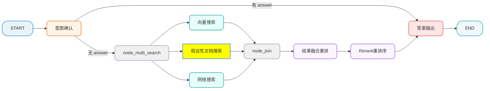
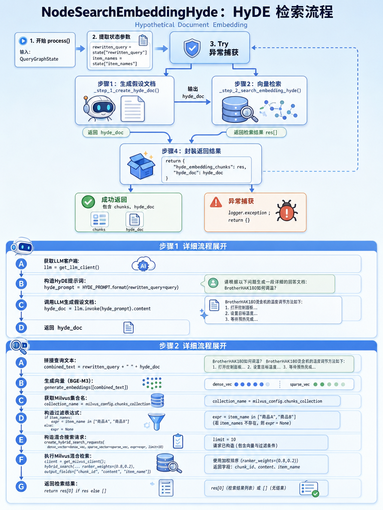

[TOC]

# 掌柜智库-【检索】假设性文档搜索

## 1. 任务目标

### 1.1 涉及模块 

```
processor/query_processor/nodes/
├── node_search_embedding_hyde.py
```

#### 1.2 节点在流程中的位置



## 2. 节点业务流程

### 2.1 节点作用

**什么是HyDE**: HyDE（Hypothetical Document Embeddings，“假设文档向量化”）是一种让检索更“聪明”的技巧。当用户只给出一句短问题时，系统先不急着去向量库里硬搜，而是先让大模型“脑补”出一段可能的答案或相关描述——就像先写一段“假想的说明书”。这段文字通常更具体、更像一篇小文档，包含更多关键词、背景和表达方式。接着，把这段“假想文档”做成向量，再拿它去向量库里找相似内容。结果往往比直接拿那一句短问题去做向量检索更准，因为检索时用的是更“饱满”的语义信号。

它的**优点**是简单、通用、对很多场景都有效；**缺点**是也会“脑补过头”，生成的假设文本可能带偏方向，所以常见做法是配合过滤、重排或多路检索一起用。

**方案A：不用 HyDE（直接搜）**

```
用户问题："HAK180 烫金机怎么用？"
      ↓
 生成向量（短文本）
      ↓
去 Milvus 搜索
```

❌ 可能遇到的问题：

1. 语义太稀疏

   - "怎么用" 这3个字几乎没信息量
   - 向量模型很难从这么短的文本里提取出丰富的语义特征
   - 就像你去图书馆只说"我要看书"，管理员很难帮你找

2. 匹配不到专业术语

   - 数据库里的文档可能是：

     ```
          "HAK180 烫金机的操作步骤如下：
           1. 接通电源...
           2. 调节温度至 150°C...
           3. 放置材料..."
     ```

   - 你的查询只有"怎么用"，和文档里的"操作步骤""调节温度"等关键词语义距离很远

   - 结果：可能搜不到，或者召回的文档相关性很差

**方案B：用 HyDE（先生成假设答案，再搜）**

```
用户问题："HAK180 烫金机怎么用？"
         ↓
   LLM 生成假设答案：
   "HAK180 烫金机的使用方法包括：
    首先需要接通电源并预热设备，
    然后将温度调节到合适的范围（通常 120-180°C），
    接着将待烫印的材料放置在平台上..."
         ↓
    对这段"假设答案"生成向量（长文本，语义丰富）
         ↓
   去 Milvus 搜索
```

✅ 优势：

1. 语义更丰富
   - 假设答案里有"预热""温度调节""放置材料"等专业词汇
   - 这些词和真实文档里的表述高度重合
   - 向量相似度会更高
2. 桥接"问题"和"答案"的语义鸿沟
   - 问题通常是简短、口语化的
   - 答案通常是详细、专业化的
   - HyDE 相当于让 LLM 先"脑补"一个答案，用这个答案的语义去匹配真实文档
3. 提高召回率
   - 即使用户问得很模糊（比如"这个怎么用"），HyDE 也能生成包含专业术语的假设文档
   - 更容易命中知识库里的相关内容

**类比理解**

想象你在找一个菜谱：

❌ 不用 HyDE（直接搜)

```
你说："怎么做红烧肉？"
搜索引擎只能匹配标题里有"红烧肉"的菜
→ 可能找到，也可能找不到（如果文档叫"五花肉炖煮指南"就漏了）
```

✅ 用 HyDE（先脑补再搜）

```
你说："怎么做红烧肉？"
LLM 脑补："红烧肉需要先将五花肉切块，用料酒腌制，然后炒糖色..."
用这段脑补内容去搜
→ 即使文档叫"五花肉炖煮指南"，但因为里面有"切块""料酒""炒糖色"等词，也能匹配上
```

### 2.2 实现思路

**1）利用大模型根据用户查询生成假设性文档（Hypothetical Document）。**

**2）利用“重写问题 + 假设性文档”生成 embedding，并到向量库检索切片。**

### 2.3 代码实现

#### 2.3.1 单元测试

```python
if __name__ == "__main__":

    init_state = {
        "rewritten_query": "关于brother HAK180烫金机，如何调节转印温度？",
        "item_names": ["BrotherHAK180烫金机", "BrotherHAK-180烫金机"]
    }
    node_search_embedding_hyde = NodeSearchEmbeddingHyde()
    result = node_search_embedding_hyde(init_state)
    logger.info(serialize_json(result, indent=4))

```

#### 2.3.2 主流程定义

##### 流程图



##### process

```python
# processor/query_processor/nodes/node_search_embedding_hyde.py
from config.milvus_config import milvus_config
from processor.query_processor.base import NodeBase
from processor.query_processor.prompt.search_embedding_hyde import HYDE_PROMPT
from processor.query_processor.state import QueryGraphState
from tool.logger import logger
from utils.embedding_utils import generate_embeddings
from utils.json_format_utils import serialize_json
from utils.llm_utils import get_llm_client
from utils.milvus_utils import create_hybrid_search_requests, get_milvus_client, hybrid_search


class NodeSearchEmbeddingHyde(NodeBase):
    """
    节点功能：HyDE (Hypothetical Document Embedding)
    先让 LLM 生成假设性答案，再对答案进行向量检索，提高召回率。
    """

    # 覆盖基类的 name 属性，标识节点名称
    name: str = "node_search_embedding_hyde"

    def process(self, state: QueryGraphState) -> QueryGraphState:
        """
        HyDE (Hypothetical Document Embedding) 检索节点
        核心思想：通过LLM生成假设性答案（HyDE文档），将其向量化后用于检索，以解决短查询语义稀疏问题。

        执行步骤：
        1. 参数提取：从会话状态中获取改写后的查询（rewritten_query）和已确认的商品名（item_names）。
        2. 生成假设文档 (Step 1)：调用LLM，基于用户问题生成一段假设性的理想回答（即HyDE文档）。
        3. 混合检索 (Step 2)：
           - 将“用户问题 + 假设文档”合并，生成BGE-M3稠密+稀疏向量。
           - 在Milvus中执行混合检索（带商品名过滤），召回最相似的知识切片。
        4. 结果封装：返回检索到的切片列表和生成的假设文档，更新会话状态。

        :param state: 会话状态字典，包含 rewritten_query, item_names 等
        :return: 包含 hyde_embedding_chunks (检索结果) 和 hyde_doc (假设文档) 的字典
        """

        # 1、用户问题和已确认商品名
        rewritten_query = state.get("rewritten_query")
        item_names = state.get("item_names")

        try:

            # 2、生成假设性文档
            hyde_doc = self._step_1_create_hyde_doc(rewritten_query)

            # 3、用“重写问题 + 假设文档”检索切片
            res = self._step_2_search_embedding_hyde(
                rewritten_query=rewritten_query,
                hyde_doc=hyde_doc,
                item_names=item_names
            )

            # 4、结果封装
            return {
                "hyde_embedding_chunks": res,
                "hyde_doc": hyde_doc,
            }

        except Exception as e:
            logger.exception(f"假设性文档向量搜索失败: {e}")
            return {}

```

##### 定义大模型客户端工具类

```python
# utils/llm_utils.py

from langchain_openai import ChatOpenAI

from config.lm_config import lm_config

_llm_client_cache = {}

def get_llm_client(model: str | None = None, json_mode: bool = False) -> ChatOpenAI:
    """
    获取 LangChain ChatOpenAI 客户端实例
    - model: 允许不同节点使用不同模型
    - json_mode: True 时要求输出 JSON
    """
    m = model or lm_config.llm_model
    key = (m, json_mode)
    if key in _llm_client_cache:
        return _llm_client_cache[key]
 
    extra_body = {"enable_thinking": False}

    model_kwargs: dict = {}
    if json_mode:
        model_kwargs["response_format"] = {"type": "json_object"} 

    client = ChatOpenAI(
        model=m,
        temperature=lm_config.llm_temperature,
        api_key=lm_config.api_key,
        base_url=lm_config.base_url,
        extra_body=extra_body,
        model_kwargs=model_kwargs,
    )
    _llm_client_cache[key] = client
    return client
```

##### 步骤1：获取假设性答案

###### 提示词

```python
# processor/query_processor/prompt/search_embedding_hyde.py
HYDE_PROMPT = """
请基于以下用户查询生成一个简洁的回答范文。
用户查询: {rewritten_query}
要求：
1. 回答要简洁明了，包含核心信息即可
2. 假设你是该领域的专家，提供专业的解释
3. 不要使用"假设"、"可能"等不确定的词汇
4. 保持回答与查询主题高度相关
5. 使用中文回答且不超过300字
"""
```

###### 代码

```python
    def _step_1_create_hyde_doc(self, rewritten_query: str) -> str:
        """
        阶段1：利用大模型根据用户查询生成假设性文档（Hypothetical Document）。
        HyDE的核心在于：利用LLM生成一个“虚构但相关”的文档，用该文档的向量去检索真实的文档，
        从而缓解短查询（Query）与长文档（Document）在语义空间不匹配的问题。

        :param rewritten_query: 用户改写后的查询语句
        :return: LLM生成的假设性文档内容
        """

        logger.info("步骤1: 开始生成假设性文档")

        try:
            llm = get_llm_client()
            hyde_prompt = HYDE_PROMPT.format(rewritten_query=rewritten_query)
            hyde_doc = llm.invoke(hyde_prompt).content
            return hyde_doc

        except Exception as e:
            logger.exception(f"步骤1: 生成假设文档失败: {e}")
            raise e
```

##### 步骤2：根据假设性答案进行向量查询

```python
    def _step_2_search_embedding_hyde(
            self,
            rewritten_query: str,
            hyde_doc: str,
            item_names=None
    ):
        """
        阶段2：利用“重写问题 + 假设性文档”生成 embedding，并到向量库检索切片。

        :param rewritten_query: 改写后的查询
        :param hyde_doc: Step 1 生成的假设性文档
        :param item_names: 商品名称列表，用于元数据过滤 (item_name in [...])
        :return: 检索结果列表
        """

        try:
            # 1、拼接查询与假设文档，形成更丰富的语义上下文
            # 这里把用户问题 + 假设答案拼在一起生成向量，相当于：
            # 既保留了用户的原始意图（rewritten_query）
            # 又增强了语义丰富度（hyde_doc）
            combined_text = rewritten_query + " " + hyde_doc

            # 2、生成向量 (Dense + Sparse)
            embeddings = generate_embeddings([combined_text])
            dense_vec = embeddings.get("dense")[0]
            sparse_vec = embeddings.get("sparse")[0]

            # 3. 获取Milvus的集合
            collection_name = milvus_config.chunks_collection

            # 4、处理 item_names 中的引号，防止注入或语法错误
            expr = None
            if item_names:
                #quoted = ", ".join(f'"{v}"' for v in item_names)
                #expr = f"item_name in [{quoted}]"
                # 'item_name in ["BrotherHAK-180烫金机","BrotherHAK180烫金机"]'
            	expr = f'item_name in {item_names}'
                logger.info(f"步骤2: 过滤条件: {expr}")
            else:
                logger.info("步骤2: 未指定商品名过滤，将全库检索")

            # 5、构造Milvus混合搜索请求对象
            reqs = create_hybrid_search_requests(
                dense_vector=dense_vec,
                sparse_vector=sparse_vec,
                expr=expr,
                limit=10  # 底层检索返回数量（后续会再过滤为5，预留更多结果做重排序）
            )

            # 6、执行混合向量检索
            logger.info("步骤2: 开始执行 Milvus 混合检索...")
            client = get_milvus_client()
            res = hybrid_search(
                client=client,
                collection_name=collection_name,
                reqs=reqs,
                ranker_weights=(0.8, 0.2),
                output_fields=["chunk_id", "content", "item_name"],
            )

            return res[0] if res else []

        except Exception as e:
            logger.error(f"步骤2: 检索过程发生异常: {e}")
            raise e

```

