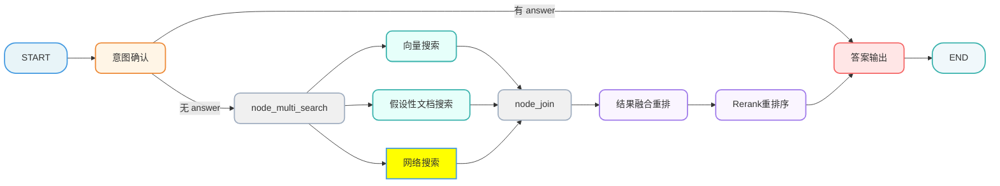
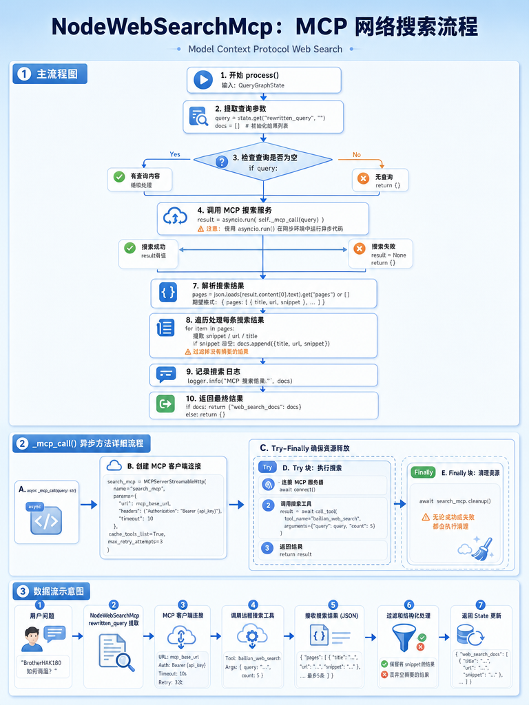

[TOC]

# 掌柜智库-【检索】网络搜索

## 1. 任务目标

### 1.1 涉及模块 

```
processor/query_processor/nodes/
├── node_web_search_mcp.py
```

#### 1.2 节点在流程中的位置



## 2. 节点业务流程

### 2.1 mcp的调用的准备工作

使用MCP 服务需先在阿里云百炼平台完成开通与配置，才能通过代码调用，以下是完整的开通流程说明：

**步骤1：前提条件**

已注册阿里云账号，并完成实名认证（百炼 MCP 服务需实名认证后使用）。

**步骤2：开通百炼 MCP 服务的详细步骤**

1、进入百炼 MCP 广场

打开浏览器，访问百炼 MCP 服务市场链接：[大模型服务平台百炼控制台](https://bailian.console.aliyun.com/cn-beijing/?spm=a2c4g.11186623.0.0.5f885389KrrOsZ&tab=mcp#/mcp-market)

2、搜索并选择目标 MCP 服务

​	在 MCP 广场的搜索框中输入关键词（如 “联网搜索”）；

​	在搜索结果中找到目标服务（如本场景的 “联网搜索”），点击服务卡片进入详情页。


**步骤 3：开通 MCP 服务**

进入服务详情页后，点击 “开通服务” 按钮，会弹出 “开通 MCP 服务” 配置窗口，需完成以下配置：


1. **选择 API Key**：从下拉框中选择已有的`DASHSCOPE_API_KEY`（若未创建，需先在百炼控制台的 “API 密钥管理” 中生成）；
2. 选择部署模式：
   - 推荐选择「个人 FC 资源部署」（资源独立、安全隔离，适合正式场景）；
   - 测试场景可选择「公共 FC 资源部署」（共享资源，启动更快）；
3. 选择计费模式（个人FC资源部署）：
   - 「基础模式」：按调用时长计费（0.000156 元 / 秒），调用后释放资源，成本低；
   - 「极速模式」：按部署时长计费（0.13 元 / 时），启动速度极快（冷启动≤5 毫秒），适合低延迟场景；
4. **选择部署地域**：建议选择与业务服务器同地域（如 “华东 2（上海）”），降低网络延迟；
5. 确认配置后，点击 “确认开通” 按钮，等待百炼平台完成服务部署（通常 1-2 分钟）。

**步骤 4：获取 MCP 服务地址**

开通完成后，在服务详情页的 “使用 MCP SDK 调用” 区域，复制对应的MCP 服务的 **Streamable HTTP Endpoint**，将该地址配置到`.env`文件的`MCP_DASHSCOPE_BASE_URL`中。

### 2.2 处理策略

#### 2.2.1 调用搜索工具

基于已建立的 MCP 连接，通过`call_tool()`调用百炼专属搜索工具`bailian_web_search`，**工具调用固定传参格式（JSON）**，参数不可随意修改：

```
{
  "tool_name": "bailian_web_search",  // 固定值，百炼搜索工具唯一标识
  "arguments": {
    "query": "步骤1提取的rewritten_query",  // 必选，搜索查询词
    "count": 5  // 可选，返回结果数量，默认5条（建议1-10）
  }
}
```

#### 2.2.2 解析与格式化

接收 MCP 流式响应，提取有效数据并清洗，最终封装为统一格式文档列表，为后续节点提供标准化数据。

① MCP 原始返回值（核心有效片段）

```json
{
  "type": "tool_call",
  "content": [
    {
      "text": "{\"pages\": [{\"title\": \"结果标题\", \"url\": \"结果链接\", \"snippet\": \"核心摘要\", \"source\": \"数据源\"}]}"
    }
  ]
}
```

② 解析规则

1. 过滤出`type: "tool_call"`的响应，提取`content[0].text`并转为 JSON 对象；
2. 提取对象中`pages`数组，遍历后仅保留`title`/`url`/`snippet`三个核心字段；
3. 对所有字段做清洗（去首尾空格、过滤空值），剔除`snippet`为空的无效结果。

③ 最终格式化结果（列表嵌套字典，统一格式）

```json
[
  {
    "title": "清洗后的结果标题",
    "url": "清洗后的结果链接",
    "snippet": "清洗后的核心摘要（非空）"
  }
]
```

#### 2.2.3 更新状态与资源清理

① 资源清理

无论调用成功 / 失败 / 中断，均通过`await search_mcp.cleanup()`关闭 MCP 连接，释放客户端资源，避免资源泄漏。

② 状态更新返回

将步骤 4 格式化后的文档列表，以`web_search_docs`为字段名更新到 LangGraph 全局状态并返回，供后续节点（重排序、大模型生成）使用；无有效结果则返回空字典。

最终返回状态（JSON）

```json
{
  "web_search_docs": [
    {
      "title": "HAK 180 烫金机官方操作手册",
      "url": "https://xxx.com/hak180/manual",
      "snippet": "HAK 180 顶部50-170mm局部烫金设置：操作面板【转印参数】-【区域设置】，选择顶部局部，输入起始50mm、结束170mm，保存生效"
    }
  ]
}
```

### 2.3代码实现

#### 2.3.1 准备和环境

安装 openai的sdk

```cmd
uv add openai-agents
```

在`.env`文件，添加以下配置：

```ini
# ===================== MCP =====================
# 百炼MCP WebSearch的SSE接口地址（固定值，无需修改）
MCP_DASHSCOPE_BASE_URL=https://dashscope.aliyuncs.com/api/v1/mcps/WebSearch/mcp
```

#### 2.3.2 定义读取配置文件

```python
# config/bailian_mcp_config.py

# 导入核心依赖：数据类、环境变量读取、路径处理
from dataclasses import dataclass
import os
from dotenv import load_dotenv

load_dotenv()


# 定义mcp的服务配置
@dataclass
class McpConfig:
    mcp_base_url: str
    api_key : str

mcp_config = McpConfig(
    mcp_base_url=os.getenv("MCP_DASHSCOPE_BASE_URL"),
    api_key=os.getenv("OPENAI_API_KEY")
)
```

#### 2.3.3 单元测试

```python
if __name__ == "__main__":

    init_state = {
        "rewritten_query": "关于brother HAK180烫金机，如何调节转印温度？"
    }

    # 执行节点的业务调用
    node_web_search_mcp = NodeWebSearchMcp()
    result = node_web_search_mcp(init_state)
    logger.info(serialize_json(result, indent=4))

```

#### 2.3.4 主流程定义

参考：[Model context protocol (MCP) - OpenAI Agents SDK](https://openai.github.io/openai-agents-python/mcp/)

##### 流程图



##### process

```python
# processor/query_processor/nodes/node_web_search_mcp.py
import asyncio
import json

from agents.mcp import MCPServerStreamableHttp

from config.bailian_mcp_config import mcp_config
from processor.query_processor.base import NodeBase
from processor.query_processor.state import QueryGraphState
from tool.logger import logger
from utils.json_format_utils import serialize_json


class NodeWebSearchMcp(NodeBase):
    """
    节点功能，调用外部搜索引擎补充信息
    """

    # 覆盖基类的 name 属性，标识节点名称
    name: str = "node_web_search_mcp"

    def process(self, state: QueryGraphState) -> QueryGraphState:

        query = state.get("rewritten_query", "")
        docs = []
        # 如果没有查询内容，直接返回
        if query:
            result = asyncio.run(self._mcp_call(query))
            if result:
                pages = json.loads(result.content[0].text).get("pages") or []
                # 统一输出结构化结果，供后续 rerank/引用使用
                # 每条：{title, url, snippet}

                for item in pages:
                    snippet = (item.get("snippet") or "").strip()
                    url = (item.get("url") or "").strip()
                    title = (item.get("title") or "").strip()
                    if not snippet:
                        continue
                    docs.append({"title": title, "url": url, "snippet": snippet})

                logger.info("MCP 搜索结果:", docs)

        if docs:
            return {"web_search_docs": docs}
        return {}


    async def _mcp_call(self, query):

        search_mcp = MCPServerStreamableHttp(
            name="search_mcp",
            params={
                "url": mcp_config.mcp_base_url,
                "headers": {"Authorization": f"Bearer {mcp_config.api_key}"},
                "timeout": 10,
            },
            cache_tools_list=True,
            max_retry_attempts=3,
        )

        try:
            await search_mcp.connect()
            result = await search_mcp.call_tool(
                tool_name="bailian_web_search",
                arguments={"query": query, "count": 5},
            )
            return result
        finally:
            await search_mcp.cleanup()
```

