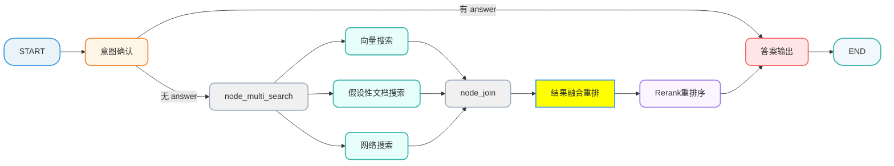
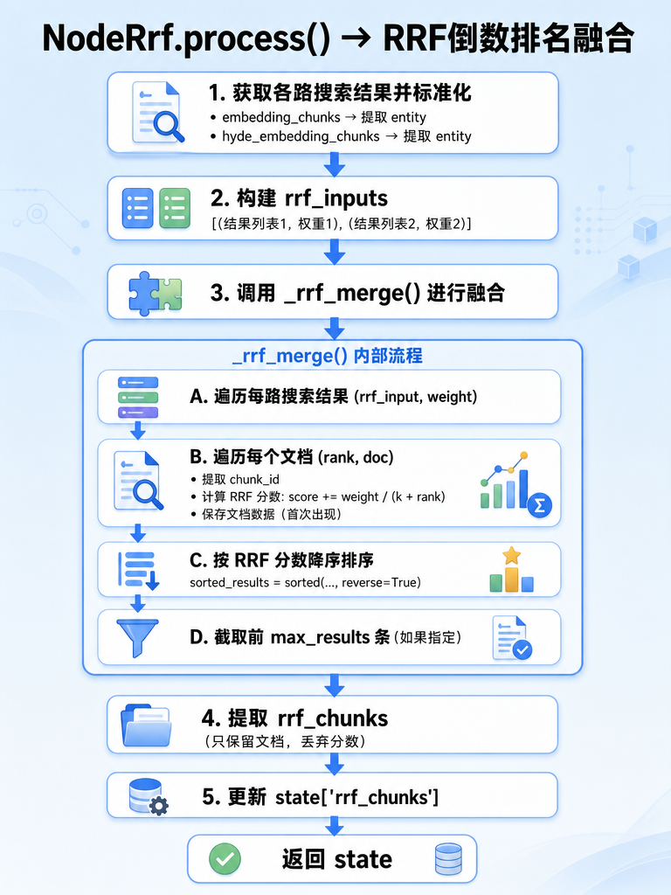

[TOC]

# 掌柜智库-【检索】结果融合重排

## 1. 任务目标

### 1.1 涉及模块 

```
processor/query_processor/nodes/
├── node_rrf.py
```

### 1.2 节点在流程中的位置



## 2. 节点业务流程

### 2.1 节点作用

该节点负责将多路检索结果通过 **Reciprocal Rank Fusion（倒数排名融合）** 算法进行融合，生成统一的排序结果。

### 2.2 RRF介绍

Milvus文档：[RRF 排序器 | Milvus 文档](https://milvus.io/docs/zh/rrf-ranker.md)

#### 2.2.1 什么是 RRF？

简单来说，RRF 就像是一个"多路投票系统"。在这个项目中，当用户提问时，系统会同时从多个渠道找答案：

- 向量搜索（node_search_embedding）：通过语义相似度找相关文档
- HyDE 搜索（node_search_embedding_hyde）：先假设一个答案，再用这个假设去搜
- 网络搜索（node_web_search_mcp）：从互联网上找相关信息

这三路搜索结果各有优劣，RRF 的作用就是把它们公平地合并成一个统一的排名。

#### 2.2.2 为什么要用 RRF？

##### 1️⃣ 不同来源的分数不可比

想象一下：

- 向量搜索说："文档A 得分 0.95"
- HyDE 搜索说："文档B 得分 85.3"
- 网络搜索说："文档C 相关度排第2"

这三个分数的量纲完全不同（有的是 0~1，有的是原始距离，有的是排名），直接相加就像把"米"和"公斤"加在一起，没有意义。
RRF 的解决方案：不看绝对分数，只看排名位置。

一个搜索路的倒数分数计算公式是：`RRF 得分 = 1 / (k + 排名)`

其中 k 是常数（通常取 60）。这样无论原始分数是多少，都转换成统一的"排名权重"。

##### 2️⃣ 三路搜索各有特长

- 向量搜索：擅长理解语义，但可能漏掉关键词匹配的文档
- HyDE：能通过假设性答案找到间接相关的文档
- 网络搜索：提供最新的、知识库外的信息

如果只选一路，可能会错过其他路找到的好答案。RRF 让在多路中都排名靠前的文档获得更高的综合得分，实现"众人拾柴火焰高"。

##### 3️⃣ 鲁棒性强，不依赖单一模型

假如某一路搜索出了问题（比如向量模型对某个专业术语理解偏差），其他两路还能补救。RRF 相当于民主投票，避免"一言堂"。

##### 4️⃣ 无需训练，即插即用

相比需要训练的融合模型（如学习-to-rank），RRF 是一个无参数算法，不需要额外数据训练，直接基于排名就能工作，简单高效。

#### 2.2.3 RRF 算法原理

**Reciprocal Rank Fusion（倒数排名融合）** 是一种经典的排名融合算法。

##### 核心公式

$$
RRF\_score(d) = \sum_{i=1}^{n} \frac{weight_i}{k + rank_i(d)}
$$

##### 参数说明

| 参数      | 说明                                      |
| --------- | ----------------------------------------- |
| d         | 待评分的文档                              |
| n         | 检索路数                                  |
| weight_i  | 第 i 路的权重                             |
| rank_i(d) | 文档 d 在第 i 路中的排名位置（从 1 开始） |
| k         | 平滑常数（通常取 60）                     |

```
假设有文档 A，在两路检索中的基本信息如下：

路径           排名      贡献分数 (k=60, weight=1.0)
─────────────────────────────────────────────────────
向量检索          1        1.0/(60+1) = 0.0164
HyDE 检索         3        1.0/(60+3) = 0.0159
─────────────────────────────────────────────────────
                         总分 = 0.0323
```

###### 常数 k 的作用

k 值决定了排名差异对得分的影响程度：

> 排名位置对得分的影响（k=60）：
>
> - 排名 1:  1/(60+1)  = 0.0164
>
> - 排名 2:  1/(60+2)  = 0.0161  (仅下降 1.8%)
> - 排名 10: 1/(60+10) = 0.0143  (下降 13%)
> - 排名 50: 1/(60+50) = 0.0091  (下降 45%)
>
> 排名位置对得分的影响（k=0）：
>
> - 排名 1:  1/1   = 1.0000
> - 排名 2:  1/2   = 0.5000  (下降 50%)     ← 剧烈下降！
> - 排名 10: 1/10  = 0.1000  (下降 90%)     ← 更剧烈
> - 排名 50: 1/50  = 0.020  (下降 99.8%)   ← 几乎归零
>
> k=60 的作用就像"缓冲垫"：
>
> - 有 k=60：排名靠前的文档之间分数差距很小（第1名和第2名只差 1.8%），即使排到第10名，分数也只降了 13%。这样多个来源的检索结果能相对公平地竞争。
> - 没有 k（k=0）：排名第1的文档分数是 1.0，但排名第2的直接腰斩到 0.5，排名第10的只剩 0.1。这会导致**"赢家通吃"**——只要某个文档在任何一个来源中排第1，它的分数就会远远超过其他所有文档，RRF 的融合效果就失去了意义。
>
> 类比： 想象比赛打分：
>
> - k=60：冠军得 100 分，亚军得 98 分，季军得 96 分……大家都有机会
> - k=0：冠军得 100 分，亚军只得 50 分，季军只得 33 分……冠军优势太大，其他人很难追上
> - 所以 k=60 是为了让不同排名的文档分数差距不要太大，保证多路检索融合时的公平性。

###### k 值选择

- k 较小（如 10）：头部排名差异影响大，适合高精度场景
- k 较大（如 60）：排名差异影响平滑，适合多路融合
- 实践中 k=60 是经过验证的经典选择

###### 加权的意义

不同检索路径的可靠性可能不同，通过权重调节：

```python
search_source = {
    "vector_search_result": (docs, 1.0),   # 向量检索，权重 1.0
    "hyde_search_result": (docs, 1.0),     # HyDE 检索，权重 1.0
}
```

#### 2.2.4 总结：RRF 的优势

| 特点           | 说明                            |
| -------------- | ------------------------------- |
| **无需标准化** | 只看排名，不看原始分数          |
| **抗噪声**     | 平滑常数 k 防止头部排名过度主导 |
| **鼓励共识**   | 多路命中的文档得分更高          |
| **惩罚离散**   | 只在少数路径命中的文档得分较低  |

### 2.3 步骤分解

1）获取上游检索节点返回的文档

2）为不同来源设置权重

3）利用RFF公式融合多路搜索结构

### 2.4 代码实现

#### 2.4.1 单元测试

```python
if __name__ == '__main__':

    # 模拟两路检索结果
    mock_state = {
        "embedding_chunks": [
            {"entity": {"chunk_id": "chunk_1", "content": "向量搜索结果#1"}},
            {"entity": {"chunk_id": "chunk_2", "content": "向量搜索结果#2"}},
            {"entity": {"chunk_id": "chunk_3", "content": "向量搜索结果#3"}},
        ],
        "hyde_embedding_chunks": [
            {"entity": {"chunk_id": "chunk_1", "content": "HyDE搜索结果#1"}},
            {"entity": {"chunk_id": "chunk_4", "content": "HyDE搜索结果#2"}},
            {"entity": {"chunk_id": "chunk_2", "content": "HyDE搜索结果#3"}},
        ]
    }

    node_rrf = NodeRrf()
    result = node_rrf(mock_state)
    logger.info(serialize_json(result, indent=4))

```

#### 2.4.2 主流程定义

##### 流程图



##### process

```python
# processor/query_processor/nodes/node_rrf.py
from typing import List, Dict, Any, Tuple

from processor.query_processor.base import NodeBase
from processor.query_processor.state import QueryGraphState
from tool.logger import logger
from utils.json_format_utils import serialize_json


class NodeRrf(NodeBase):
    """
    节点功能：Reciprocal Rank Fusion
    将多路召回的结果（向量、HyDE、Web）进行加权融合排序。
    """

    # 覆盖基类的 name 属性，标识节点名称
    name: str = "node_rrf"

    def process(self, state: QueryGraphState) -> QueryGraphState:

        # 1. 获取各路搜索的结果（排除网络搜索: reranK节点做）
        embedding_search_list = [
            doc.get('entity') for doc in (state.get('embedding_chunks') or []) if isinstance(doc, dict)
        ]
        hyde_embedding_search_list = [
            doc.get('entity') for doc in (state.get('hyde_embedding_chunks') or []) if isinstance(doc, dict)
        ]

        # 2. 为不同路的搜索结果设置不同的权重
        rrf_inputs = [
            (embedding_search_list, 1.0),
            (hyde_embedding_search_list, 1.0)
        ]

        # 3. 利用RRF的计算公式去获取到所有路查询到的所有chunk对应的score
        rrf_merge_results = self._rrf_merge(rrf_inputs)

        # 4. 获取rrf_chunks（只取文档，不要分数）
        rrf_chunks = [doc for doc, _ in rrf_merge_results]
       
        # 5. 更新state
        state['rrf_chunks'] = rrf_chunks

        # 6. 返回state
        return state

```

##### RRF算法实现

```python

    def _rrf_merge(self, rrf_inputs, k: int = 60, max_results: int = None) -> List[Tuple[Dict[str, Any], float]]:
        """
        利用 RRF 公式计算每一个文档的总得分
        :param rrf_inputs:  列表，每个元素是(各路的搜索结果列表, 权重)的元组
        :param k:           平滑参数(RFF常数)，通常取 60
        :param max_results: 合并完之后返回的文档数，None 表示全部
        :return:            合并以及排序后的文档列表，[(元素, RRF 得分), ...] 按得分降序
        """
        chunk_scores = {}  # 存放所有 chunk 的 RRF 计算后的分数值
        chunk_data = {}  # 存放所有 chunk 的文档数据

        for rrf_input, weight in rrf_inputs:
            for rank, doc in enumerate(rrf_input, start=1):
                chunk_id = doc.get('chunk_id')
                # RRF 公式: score += weight / (k + rank)
                chunk_scores[chunk_id] = chunk_scores.get(chunk_id, 0.0) + weight / (k + rank)

                # 使用 setdefault 保留首次遇到的文档版本(只记录第一次)
                chunk_data.setdefault(chunk_id, doc)

        # 按得分降序排序
        unsorted_results = [(chunk_data[cid], score) for cid, score in chunk_scores.items()]
        sorted_results = sorted(
            unsorted_results,
            # 排序时看每个元素的第 2 个值（也就是分数）
            key=lambda x: x[1],
            reverse=True
        )
        # 等价写法
        # def get_score(item):
        #     return item[1]  # 返回分数
        # sorted_results = sorted(unsorted_results, key=get_score, reverse=True)

        # 动态截取前 max_results 条
        return sorted_results[:max_results] if max_results else sorted_results
```


