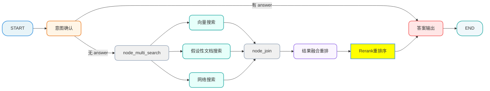
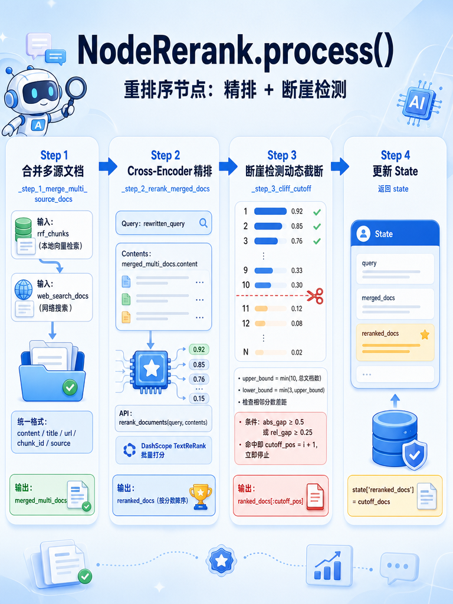

[TOC]

# 掌柜智库-【检索】Rerank重排序

## 1. 任务目标

### 1.1 涉及模块 

```
processor/query_processor/nodes/
├── node_rerank.py
```

### 1.2 节点在流程中的位置



## 2. 节点业务流程

### 2.1 节点作用

该节点使用 Reranker 模型对 RRF 融合结果和网络搜索结果进行精排，并通过断崖检测算法实现动态 TopK 截断。

### 2.2 重排序介绍

#### 2.2.1 什么是重排序

简单来说，RRF 是"粗排"，Rerank 是"精排"。就像招聘流程：

- RRF = HR 初筛简历（快速、批量，但不够精准）
- Rerank = 面试官深度评估（慢、细致，但更准确）

#### 2.2.2 为什么需要重排序？

##### 1️⃣ 向量搜索的局限性

向量搜索（包括 RRF 融合后的结果）有个致命问题：它只看语义相似度，不看真正的匹配度。
举个例子： 用户问："iPhone 17 的电池容量是多少？"
向量搜索可能召回：

- ✅ 文档A："iPhone 17 电池容量为 4823 mAh"（真正相关）
- ⚠️ 文档B："iPhone 16 的电池续航表现优秀"（语义相近，但答非所问）
- ⚠️ 文档C："手机电池保养技巧"（都提到"电池"，但不相关）

向量模型会觉得这三篇都跟"电池"有关，分数差不多。但它无法判断哪篇真正回答了问题。

##### 2️⃣ Cross-Encoder 的优势

###### 交叉编码器

Rerank 使用的 Cross-Encoder （交叉编码器）模型会做一件事：把"问题 + 文档"一起输入模型，让它们互相"对话"，判断真正的匹配度。
就像一个细心的面试官：

- 不仅看候选人的简历（文档内容）
- 还要对照岗位要求（用户问题）
- 逐字逐句判断："这篇文档真的回答了这个问题吗？"

###### 效果对比

```
向量搜索（Bi-Encoder - 双编码器）：Bi-Encoder 就像是一个"平行处理系统"，它把问题和文档分开编码，然后比较它们的相似度
  问题 → [编码器] → 向量A
  文档 → [编码器] → 向量B
  计算 cos(向量A, 向量B) → 相似度
  
Cross-Encoder（Rerank）：
  [问题 + 文档] → [联合编码器] → 直接输出相关性分数

```

###### 工作原理（生活化类比）

想象你要找对象，用了两种方式：

🔹 Bi-Encoder 方式（快速但粗糙）

1. 给你拍张照片 → 提取你的特征向量（身高、学历、爱好等）
2. 给候选人拍张照片 → 提取他的特征向量
3. 计算两个向量的相似度 → 看匹配度

```
你      → [编码器] → 向量A = [0.8, 0.3, 0.9, ...]
候选人  → [编码器] → 向量B = [0.7, 0.4, 0.8, ...]
                    
相似度 = cos(向量A, 向量B) = 0.92 ✅
```

**关键特点：**

- 你和候选人是独立评估的，互不影响
- 编码完成后，可以快速和成千上万个候选人比对
- 速度快，但可能忽略细节

🔹 Cross-Encoder 方式（慢速但精准）

1. 把你和候选人安排相亲 → 让两人面对面交流
2. 观察互动过程 → 看聊天是否投机、价值观是否匹配
3. 给出综合评分

```
[你 + 候选人] → [联合评估器] → 直接输出分数 0.85
```

**关键特点：**

- 两人是一起评估的，能看到互动细节
- 每次只能评估一对，速度慢
- 精度高，能发现细微的匹配/不匹配

##### 3️⃣"两阶段检索" 策略

先用 Bi-Encoder，再用 Cross-Encoder。

```
第1阶段：Bi-Encoder（向量搜索 + RRF）
  ├─ 从 100万篇文档中快速筛选出 50篇候选
  └─ 耗时：~10ms
  
第2阶段：Cross-Encoder（Rerank）
  ├─ 对这 50篇候选进行精确打分
  └─ 耗时：~500ms
  
最终：取前 3-10 篇最高分的文档
```

### 2.3 断崖检测

#### 2.3.1 什么是断崖检测

断崖检测（Cliff Detection） 是一种智能截断策略，用于在重排序（Rerank）后的文档列表中，自动识别"高质量文档"与"低质量文档"之间的分界线。
想象你站在悬崖边：

- 悬崖之上：前几篇文档的相关性分数很高且平稳（如 0.95, 0.92, 0.88）
- 悬崖边缘：某两篇相邻文档之间，分数突然大幅下降（如从 0.88 跌到 0.35）
- 悬崖之下：后续文档的分数都很低，属于"凑数"的低质量内容

断崖检测的目标就是找到这个"悬崖边缘"，只保留悬崖之上的高质量文档，丢弃悬崖之下的噪声。

#### 2.3.2 为什么需要断崖检测？

##### 1️⃣ 避免低质量文档干扰答案生成

大模型（LLM）在生成答案时，会参考所有传入的文档。如果混入了不相关的低质量文档：

- ❌ LLM 可能被误导，生成错误或无关的内容
- ❌ 答案变得冗长、啰嗦，包含大量无用信息
- ❌ 增加 Token 消耗，提高 API 成本

例子： 用户问："iPhone 17 电池容量是多少？"
✅ 高质量文档（前3篇）：明确提到 "iPhone 17 电池容量为 3349mAh"
❌ 低质量文档（第4篇起）：讲的是 "MacBook 的续航技巧" 或 "安卓手机充电指南"
如果不做断崖检测，把这 10 篇都传给 LLM，它可能会混淆信息，甚至开始讲安卓手机的充电方法...

##### 2️⃣ 动态适应不同查询的难度

不同的问题，能找到的相关文档数量是不同的：
断崖检测可以动态调整返回数量：

- 热门问题 → 保留 8-10 篇
- 冷门问题 → 只保留 2-3 篇

##### 3️⃣提升系统响应效率

减少传给 LLM 的文档数量：

- ⚡ 降低 Prompt 长度，加快 LLM 推理速度
- 💰 减少 Token 消耗，降低 API 费用
- 🎯 让 LLM 更聚焦于核心信息

### 2.4 完整流程对比

| 阶段 | 方法 | 速度 | 精度 | 作用 |
| --- | --- | --- | --- | --- |
| 召回 | 向量搜索 + HyDE + MCP | ⚡ 快 | ★★ | 从海量文档中找出"可能相关"的候选 |
| 粗排 | RRF 融合 | ⚡ 快 | ★★★ | 多路投票，统一排名 |
| 精排 | Cross-Encoder Rerank | 🐢 慢 | ★★★★★ | 精确判断每篇文档的真正相关性 |
| 截断 | 断崖检测 | ⚡ 快 | - | 剔除低质量文档，避免噪声 |

### 2.5 步骤分解

1）把 RRF 得到的切片集合和MCP搜索结果进行合并

2）利用 Reranker 模型对文档进行打分、重排

3）根据相关性性评分，用动态 TopK 算法进行截取。

### 2.6 代码实现

#### 2.6.1 单元测试

```python
if __name__ == "__main__":

    mock_state = {
        "rewritten_query": "怎么测这块主板的短路问题？",
        "rrf_chunks": [
            {
                "chunk_id": "local_1",
                "title": "主板维修手册",
                "content": "主板短路通常表现为通电后风扇转一下就停，可以使用万用表的蜂鸣档测量。"
            },
            {
                "chunk_id": "local_2",
                "title": "闲聊",
                "content": "今天中午去吃猪脚饭吧，这块主板外观很漂亮。"
            },
        ],
        "web_search_docs": [
            {
                "url": "https://example.com/repair",
                "title": "短路查修指南",
                "snippet": "主板通电前先打各主供电电感对地阻值，阻值偏低就是短路。"
            },
            {
                "url": "https://example.com/news",
                "title": "科技新闻",
                "snippet": "苹果发布新款手机，A系列芯片性能提升20%。"
            },
        ],
    }

    node_rerank = NodeRerank()
    result = node_rerank(mock_state)
    logger.info(serialize_json(result, indent=4))
```

 #### 2.6.2 主流程定义

##### 流程图



##### process

```python
# processor/query_processor/nodes/node_rerank.py
from typing import Dict, Any, List

from processor.query_processor.base import NodeBase
from processor.query_processor.state import QueryGraphState
from tool.logger import logger
from utils.json_format_utils import serialize_json
from utils.reranker_http_utils import rerank_documents

# -----------------------------
# Rerank / TopK 全局常量
# -----------------------------
# 动态 TopK 硬上限：最多取前 N 条（<=10）
RERANK_MAX_TOPK: int = 10
# 最小 TopK：至少保留前 N 条（>=1，且 <= RERANK_MAX_TOPK）
RERANK_MIN_TOPK: int = 3 #总数最少条数

# 断崖阈值（绝对，判断高分文档）
RERANK_GAP_ABS: float = 0.5
# 断崖阈值（相对，判断低分文档）
RERANK_GAP_RATIO: float = 0.25

class NodeRerank(NodeBase):
    """
    节点功能：使用 Cross-Encoder 模型对 RRF 后的结果进行精确打分重排。
    """

    # 覆盖基类的 name 属性，标识节点名称
    name: str = "node_rerank"

    def process(self, state: QueryGraphState) -> QueryGraphState:
        """
        执行重排序
        流程: 合并多源文档 → Reranker 计算相关性 → 断崖检测动态截断
        :param state: 需包含 rrf_chunks、web_search_docs、rewritten_query
        :return: 更新后的 state，包含 reranked_docs
        """

        # 1. 合并多源文档
        merged_multi_docs: List[Dict[str, Any]] = self._step_1_merge_multi_source_docs(state)

        # 2. Rerank 精排(精排打分)
        reranked_docs: List[Dict[str, Any]] = self._step_2_rerank_merged_docs(state, merged_multi_docs)

        # 3. 动态 Top_K 截取(断崖检测)
        cutoff_docs = self._step_3_cliff_cutoff(reranked_docs)

        # 4. 更新state
        state['reranked_docs'] = cutoff_docs

        # 5. 返回state
        return state
```

##### 合并RFF和网搜文档 

```python
    def _step_1_merge_multi_source_docs(self, state: QueryGraphState) -> List[Dict[str, Any]]:
        """合并本地 RRF 结果和网络搜索结果为统一格式"""

        final_docs = []

        # 1. 获取本地 RRF 的文档
        for rrf_doc in state.get('rrf_chunks'):

            format_rrf_doc = {
                "content": rrf_doc.get('content'),
                "title": rrf_doc.get('title'),
                "chunk_id": rrf_doc.get('chunk_id'),
                "url": None,
                "source": "local"
            }
            final_docs.append(format_rrf_doc)

        # 2. 获取 web 远程的文档
        for web_doc in state.get('web_search_docs'):

            format_web_doc = {
                "content": web_doc.get('snippet'),
                "title": web_doc.get('title'),
                "chunk_id": None,
                "url": web_doc.get('url'),
                "source": "web"
            }
            final_docs.append(format_web_doc)

        return final_docs
```

##### 配置Rerank模型

###### 安装 dashscope 的 sdk

```bash
uv add dashscope
```

###### 在`.env`文件，添加以下配置

```ini
# ====================
# 重排序模型
# ====================
TEXT_RERANK_MODEL=qwen3-rerank
TEXT_RERANK_INSTRUCT=针对给定的查询，检索能够解答该查询的相关段落
```

###### 加载配置参数

```python
# config/reranker_config.py

from dataclasses import dataclass
import os
from dotenv import load_dotenv

load_dotenv()

@dataclass
class RerankerConfig:
    text_rerank_api_key: str # DashScope API Key
    text_rerank_model: str # 模型名称
    text_rerank_instruct: str # 是否使用指令

reranker_config = RerankerConfig(
    text_rerank_api_key=os.getenv("OPENAI_API_KEY"),
    text_rerank_model=os.getenv("TEXT_RERANK_MODEL"),
    text_rerank_instruct=os.getenv("TEXT_RERANK_INSTRUCT")
)
```

###### 定义工具方法

```python
# utils/reranker_http_utils.py

import dashscope
from dotenv import load_dotenv
from config.reranker_config import reranker_config

load_dotenv()

def rerank_documents(query: str, documents: list[str]) -> list[float]:

    dashscope.api_key = reranker_config.text_rerank_api_key
    response = dashscope.TextReRank.call(
        model=reranker_config.text_rerank_model,
        query=query,
        documents=documents,
        top_n=len(documents),
        return_documents=False,
        instruct=reranker_config.text_rerank_instruct,
    )

    status_code = response.get("status_code")
    if status_code != 200:
        message = response.get("message")
        raise RuntimeError(f"DashScope rerank 调用失败: {message}")

    results = response.output.get("results", [])
    scores = [0.0] * len(documents)
    for item in results:
        index = item.get("index")
        score = item.get("relevance_score")
        scores[int(index)] = float(score)
    return scores
```

##### Reranker 计算得分

```python
    def _step_2_rerank_merged_docs(self, state: QueryGraphState, merged_multi_docs: List[Dict[str, Any]]) -> List[Dict[str, Any]]:
        """使用 Reranker 模型对文档进行精排"""

        try:
            user_query = state.get('rewritten_query')
            # 获取文档列表的conten字段组成列表
            contents = [doc.get("content") for doc in merged_multi_docs]
            # 调用Rerank模型：交叉编码器（精排阶段）
            # Query 和 Document 联合编码，精度更高
            rerank_scores = rerank_documents(user_query, contents)

            scored_docs = [{**doc, "score": score} for doc, score in zip(merged_multi_docs, rerank_scores)]
            # 等同如下写法
            # scored_docs = []
            # for doc, score in zip(merged_multi_docs, rerank_scores):
            #     scored_docs.append({
            #         "content": doc.get("content"),
            #         "title": doc.get("title"),
            #         "chunk_id": doc.get("chunk_id"),
            #         "url": doc.get("url"),
            #         "source": doc.get("source"),
            #         "score": float(score),
            #     })


            sorted_score_docs = sorted(
                scored_docs,
                key=lambda x: x["score"],
                reverse=True
            )

            return sorted_score_docs

        except Exception as e:
            logger.error(f"Rerank 重排序失败: {str(e)}")
            return [{**merged_multi_docs, "score": None}]
```

##### 断崖检测算法

重排序后需要决定保留多少文档。传统做法是固定 TopK，但这不够灵活：

> 固定 TopK=5 的问题：
>
> - 情况 1：前 3 篇高度相关，后 2 篇噪声
>
>   得分: [0.95, 0.92, 0.88, 0.12, 0.08]
>
>   ​                                  ↑
>
>   ​                        应该在这里截断
>
> - 情况 2：前 7 篇都相关
>
>   得分: [0.95, 0.91, 0.87, 0.83, 0.79, 0.75, 0.71]
>
>   ​                                                   ↑
>
>   ​                                  固定截断会丢失有价值内容

**断崖检测的思路：** 寻找得分"断崖式下跌"的位置，在那里截断。

> 断崖检测示例：
>
> 得分: [0.95, 0.92, 0.88, 0.12, 0.08]
> 差值:      0.03   0.04   0.76   0.04
>                                          ↑
>                                 断崖！在此截断
>
> 结果: 保留前 3 篇

**为什么需要两个阈值？**

> 场景 1：高分区间断崖
>
> -   得分: [0.95, 0.92, 0.40, ...]
> -   abs_gap = 0.52 > gap_abs=0.5  ✓ 触发截断
>
> 场景 2：低分区间断崖
>
> -   得分: [0.30, 0.28, 0.08, ...]
> -   abs_gap = 0.20 < gap_abs=0.5  ✗
> -   rel_gap = 0.20/0.28 = 0.71 > gap_ratio=0.25  ✓ 触发截断

**断崖检测公式：**

```python
# 相邻得分差
abs_gap = current_score - next_score

# 相对下降比例
rel_gap = abs_gap / (abs(current_score) + 1e-6)

# 满足任一条件即为断崖
if abs_gap >= gap_abs or rel_gap >= gap_ratio:
    cutoff_pos = i + 1
```

参数说明：

- `gap_abs`：绝对差值阈值（默认 0.5）
- `gap_ratio`：相对比例阈值（默认 0.25）
- `min_top_k`：最少保留数量（默认 3）
- `max_top_k`：最多保留数量（默认 10）

##### 断崖检测动态截断

```python
    def _step_3_cliff_cutoff(self, ranked_docs: List[Dict[str, Any]]) -> List[Dict[str, Any]]:
        """断崖检测截断：相邻得分差距超过阈值时截断。"""
        if not ranked_docs:
            return []

        upper_bound = min(RERANK_MAX_TOPK, len(ranked_docs))
        lower_bound = min(RERANK_MIN_TOPK, upper_bound)

        # 默认值：取满硬上限（最多10条）
        cutoff_pos = upper_bound

        # 遍历范围：从min_topk-1到max_topk-2（索引从0开始），检测相邻两个文档的分数差
        # 例：min_topk=3，max_topk=10 → 遍历i=2,3,4,5,6,7,8（对应第3~9条文档，检测与下一条的差距）
        for idx in range(lower_bound - 1, upper_bound - 1):
            current_score = ranked_docs[idx].get("score")
            next_score = ranked_docs[idx + 1].get("score")

            if current_score is None or next_score is None:
                continue

            # 计算相邻文档的分数绝对差距（因已降序，gap≥0）
            abs_gap = current_score - next_score
            # 计算相对差距：绝对差距 / 当前文档分数（+1e-6避免除数为0/极小值，防止程序报错）
            # 1e-6 是 Python 中科学计数法的写法，等价于 0.000001（10 的负 6 次方，也就是百万分之一）。
            rel_gap = abs_gap / (abs(current_score) + 1e-6)

            # 触发断崖截断条件：绝对差距≥绝对阈值 OR 相对差距≥相对阈值
            # 满足任一条件，说明下一条文档相关性骤降，截断在当前位置
            if abs_gap >= RERANK_GAP_ABS or rel_gap >= RERANK_GAP_RATIO:
                # 最终取前i+1条（索引转实际数量，如i=2 → 取前3条）
                cutoff_pos = idx + 1
                logger.debug(f"断崖检测: 位置 {idx + 1}, abs_gap={abs_gap:.4f}, rel_gap={rel_gap:.4f}")
                break

        return ranked_docs[:cutoff_pos]
```

