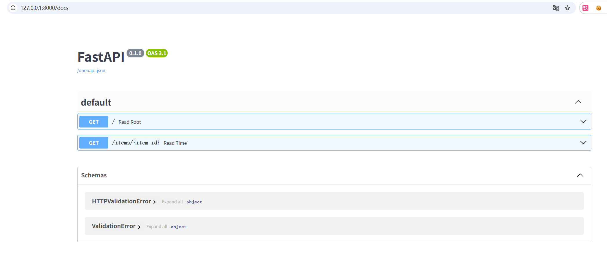
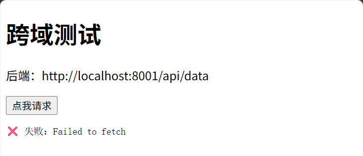
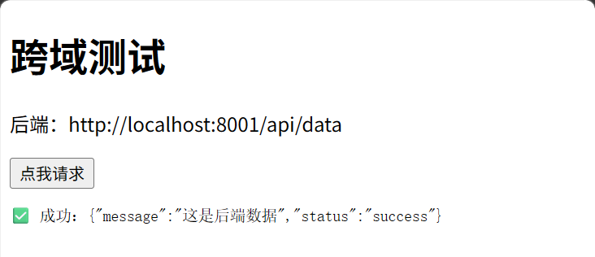
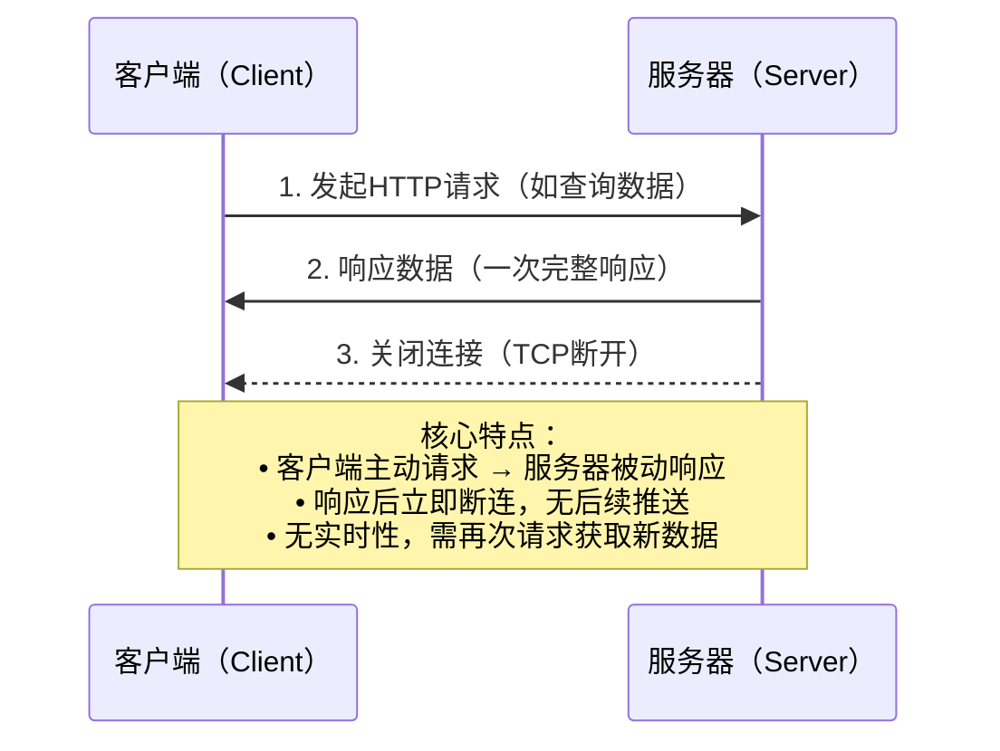
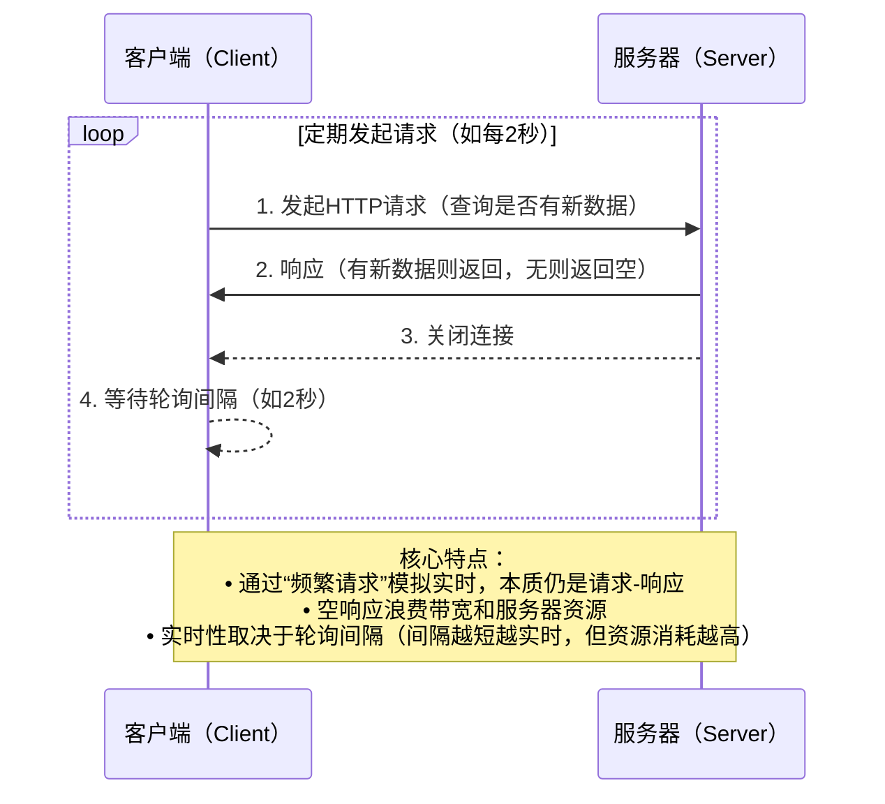
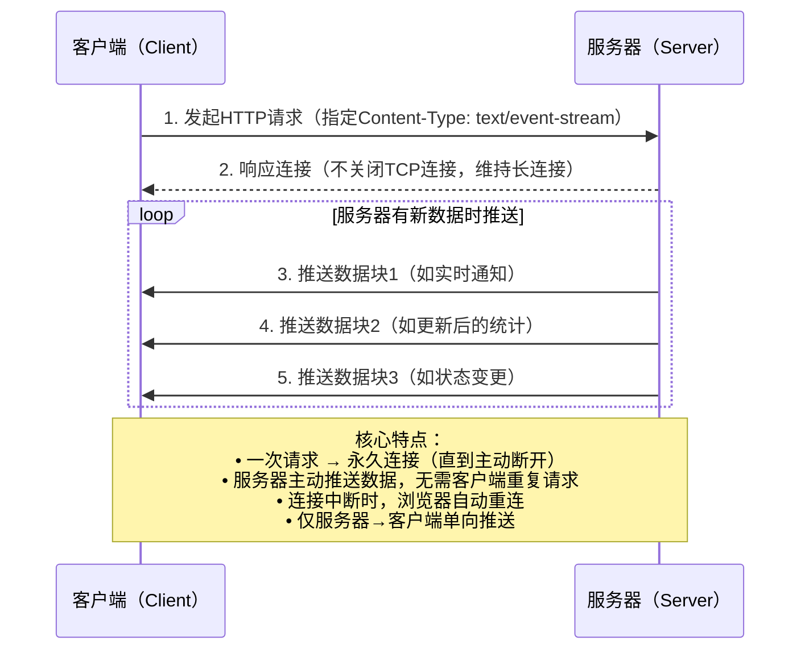

[TOC]

# 掌柜智库-【Web服务】

## 1. FastAPI

### 1.1 为什么选择 FastAPI？

*   **极速性能**：基于 **Starlette** (负责路由和异步) 和 **Pydantic** (负责数据验证)，性能在 Python web 框架中名列前茅。
*   **开发快**：简捷的语法减少了约 40% 的代码量，自动补全支持极佳。
*   **原生异步**：完美支持 `async` / `await`，轻松应对高并发场景。
*   **交互式文档**：启动服务后，访问 `/docs` 即可获得自动生成的 Swagger UI 接口文档，直接在浏览器调试接口。

### 1.2 安装依赖

```bash
uv add fastapi
```

另外我们还需要一个 ASGI 服务器，生产环境可以使用 Uvicorn 或者 Hypercorn：

```bash
uv add "uvicorn[standard]"
```

### 1.3 测试

#### 1.3.1 测试1

```python
# test/fastapi/demo.py

from fastapi import FastAPI

# 创建一个 FastAPI 应用实例
app = FastAPI()

@app.get("/", summary="第一个测试")
async def read_root():
    return {"Hello": "World"}
```

在命令行中运行以下命令以启动应用：

```bash
#如果放在 test/fastapi 目录下，则执行
uv run uvicorn test.fastapi.demo:app --reload
```

现在，打开浏览器并访问 **http://127.0.0.1:8000**，你应该能够看到返回的 JSON 响应。

**代码解析：**

- `from fastapi import FastAPI`： 这行代码从< code>fastapi 模块中导入了 `FastAPI` 类。`FastAPI` 类是 FastAPI 框架的核心，用于创建 FastAPI 应用程序实例。
- `app = FastAPI()`：这行代码创建了一个 FastAPI 应用实例。
- `@app.get("/")`： 这是一个装饰器，用于告诉 FastAPI 哪个 URL 应该触发下面的函数，并且指定了 HTTP 方法为 GET。在这个例子中，它指定了根 URL（即网站的主页）。
- `def index():`： 这是定义了一个名为 `index` 的函数，它将被调用当用户使用 GET 方法访问根 URL 时。
- `return {"Hello": "World"}`： 这行代码是 `index` 函数的返回值。当用户使用 GET 方法访问根 URL 时，这个 JSON 对象将被发送回用户的浏览器或 API 客户端。

默认情况下，你可以通过访问 **http://127.0.0.1:8000/docs** 来打开 Swagger UI 风格的文档： 这个文档是自动生成的，基于 OpenAPI 规范，支持 `Swagger UI（/docs）` 和 `ReDoc(/redoc)` 两种交互式界面。



#### 1.3.2 测试2：参数解析

展示如何定义 GET 请求，以及如何自动解析路径参数和查询参数。

```python
# test/fastapi/demo.py

# 访问 http://127.0.0.1:8000/items/5?q=somequery
# item_id: 路径参数 (自动转为 int)
# q: 查询参数 (可选，默认 None)
@app.get("/items/{item_id}", summary="获取指定参数")
async def read_item(item_id: int, q: str | None = None):
    return {"item_id": item_id, "q": q}


# 接收? skip=? & limit = ?
@app.get("/items", summary="分页")
async def read_item(skip: int = 0, limit: int = 10):
    return {"skip": skip, "limit": limit}
```

函数接受两个参数：

- **item_id** --是路径参数，指定为整数类型。
- **q** -- 是查询参数，指定为字符串类型或空（None）。


**使用以下方式启动可以进行断点调试：**

```python
# test/fastapi/demo.py

if __name__ == "__main__":
    """服务启动入口：本地开发环境直接运行"""
    logger.info("File Import Service 服务启动中...")
    # 启动uvicorn服务，绑定本地IP和8000端口，关闭自动重载（生产环境建议用workers多进程）
    uvicorn.run(
        app=app,
        host="127.0.0.1",  # 仅本地访问，生产环境改为0.0.0.0（允许所有IP访问）
        port=8000  # 服务端口
    )
```

#### 1.3.3 测试3：类型检查和错误提示

```python
# test/fastapi/demo.py

from pydantic import BaseModel

# 定义数据模型
class Item(BaseModel):
    name: str
    price: float
    is_offer: bool = None

# POST 请求接收 JSON 数据
@app.post("/items/", summary="类型检查")
async def create_item(item: Item):
    # item 已经是验证过的 Item 对象
    # 如果客户端传来的 price 是字符串 "abc"，FastAPI 会自动报错
    return {"name": item.name, "price": item.price, "is_offer": item.is_offer}


数据验证的幕后英雄
#用户输入错误数据
#    ↓
#FastAPI 接收请求
#    ↓
#交给 Pydantic 验证  ← Pydantic 登场！
#    ↓
#Pydantic 发现类型不匹配
#    ↓
#生成详细的错误信息
#    ↓
#FastAPI 把错误信息返回给用户

pydantic 的三大功劳：
功劳 1：自动类型检查
功劳 2：自动生成错误信息
功劳 3：自动类型转换（智能功能）

```

##### Pydantic 数据模型

Pydantic 是一个数据校验和序列化库，简单说，它帮你做两件事：**检查数据对不对** 和 **把数据转成标准格式**。在 FastAPI 中充当前后端之间的 **数据契约**——后端保证"我返回的一定是这个格式"，前端可以放心按这个格式解析。

###### 基本用法

```python
# test/fastapi/demo02_pydantic.py

from pydantic import BaseModel, Field, ValidationError


class Student(BaseModel):
    name: str = Field(..., description="姓名")  # 必填
    age: int = Field(..., description="年龄")  # 必填
    score: float = Field(default=0.0, description="成绩")  # 选填，默认0.0


# 1. 正常创建
s1 = Student(name="张三", age=18, score=95.5)
print(s1)
# name='张三' age=18 score=95.5 email=None

# 2. 转成字典
print(s1.model_dump())
# {'name': '张三', 'age': 18, 'score': 95.5}

# 3. 转成 JSON 字符串
print(s1.model_dump_json())
# {"name":"张三","age":18,"score":95.5,"email":null}

# 4. 自动类型转换：字符串 "20" → int 20
s2 = Student(name="李四", age="20")
print(s2.age, type(s2.age))  # 20  <class 'int'>

# 5. 类型校验失败：直接报错
try:
    Student(name="王五", age="不是数字")
except ValidationError as e:
    print(e)  # age - Input should be a valid integer

# 6. 缺少必填字段 ───
try:
    s4 = Student(age=18)  # 缺少必填的 name
except ValidationError as e:
    print(e)
    # name - Field required

# 7. 多余字段自动丢弃
s3 = Student(name="赵六", age=22, hobby="篮球")
print(s3.model_dump())
# {'name': '赵六', 'age': 22, 'score': 0.0}   ← hobby 被丢弃了

# 8. 从字典创建
data = {"name": "孙七", "age": 19, "score": 85, "email": "sun7@test.com"}
s6 = Student(**data)  # ** 解包字典，等价于 Student(name="孙七", age=19, ...)
print(s6)
```

**Field 参数说明：**

```python
class Student(BaseModel):
    name: str = Field(..., description="姓名")
    #           │       │         │
    #           │       │         └── description: 字段描述（生成API文档用）
    #           │       └── ... : 表示该字段必填，没有默认值
    #           └── Field(): Pydantic 提供的字段配置函数

    score: float = Field(default=0.0, description="成绩")
    #                    │
    #                    └── default=0.0 : 选填字段，不传时默认为 0.0
```


#### 1.3.4 测试4：响应JSON数据

##### 常见的响应形式

```python
# test/fastapi/demo.py

# 1、路由处理函数返回一个 Pydantic 模型实例，FastAPI 将自动将其转换为 JSON 格式，并作为响应发送给客户端：
@app.post("/items/return", summary="返回 Pydantic 模型实例")
async def create_item(item: Item):
    return item

#2、使用 HTTPException 抛出异常，返回自定义的状态码和详细信息。
#以下实例在 item_id 为 42 会返回 404 状态码：
from fastapi import HTTPException

@app.delete("/items/{item_id}", summary="抛出异常")
async def read_item(item_id: int):
    if item_id == 42:
        raise HTTPException(status_code=404, detail="Item 找不到")
    return {"item_id": item_id}
```

FastAPI 从 `fastapi.responses` 中提供了多种响应类，覆盖不同的使用场景，下面按「常用程度」整理，每个都附简单示例：

##### JSONResponse（最常用）

- **作用**：返回 JSON 格式的数据（FastAPI 默认的响应类型）；

- **场景**：接口返回普通数据（列表、字典、状态信息等）；

- 示例

  ```python
  # test/fastapi/demo.py
  
  from fastapi.responses import JSONResponse
  
  @app.get("/api/user")
  async def get_user():
      # 等价于直接 return {"name": "张三", "age": 20}（FastAPI 自动转 JSONResponse）
      return JSONResponse(
          content={"name": "张三", "age": 20},
          status_code=200,  # 可选，默认 200
          headers={"X-Custom-Header": "custom-value"}  # 可选，自定义响应头
      )
  ```

##### FileResponse（文件专用）

- **作用**：返回文件（支持大文件、静态文件、下载文件）；

- **场景**：返回 HTML / 图片 / 视频 / Excel 等文件；

- 关键参数

  - `path`：文件路径（必填）；
  - `filename`：下载时显示的文件名（可选）；
  - `media_type`：手动指定 MIME 类型（比如 `media_type="application/pdf"`）；

- 示例:

  ```python
  # test/fastapi/demo.py
  
  from fastapi.responses import FileResponse
  
  @app.get("/download/excel")
  async def download_excel():
      excel_path = "D:/test.xls"
      # 返回文件并指定下载文件名
      return FileResponse(
          path=excel_path,
          filename="月度报表.xlsx",
          media_type="application/vnd.openxmlformats-officedocument.spreadsheetml.sheet"
      )
  ```

##### HTMLResponse

- **作用**：返回 HTML 字符串（直接渲染页面）；

- **场景**：动态生成 HTML 内容（比如拼接变量到 HTML 中）；

- 示例:

  ```python
  # test/fastapi/demo.py
  
  from fastapi.responses import HTMLResponse
  
  @app.get("/hello")
  async def hello(name: str = "游客"):
      html_content = f"""
      <html>
          <body>
              <h1>你好，{name}！</h1>
          </body>
      </html>
      """
      return HTMLResponse(content=html_content, status_code=200)
  ```


##### PlainTextResponse

- **作用**：返回纯文本格式的数据（非 JSON、非 HTML）；

- **场景**：返回简单的文本提示、日志内容等；

- 示例：

  ```python
  # test/fastapi/demo.py
  
  from fastapi.responses import PlainTextResponse
  
  @app.get("/text")
  async def get_text():
      return PlainTextResponse(content="这是纯文本响应", status_code=200)
  ```

##### RedirectResponse

- **作用**：实现页面重定向；

- **场景**：登录成功后跳转到首页、旧接口重定向到新接口等；

- 示例:

  ```python
  # test/fastapi/demo.py
  
  from fastapi.responses import RedirectResponse
  
  @app.get("/old-path")
  async def redirect_old_path():
      # 重定向到 /new-path，状态码 307 表示临时重定向
      return RedirectResponse(url="/new-path", status_code=307)
  
  @app.get("/new-path")
  async def new_path():
      return {"message": "这是新接口"}
  ```

##### StreamingResponse（流式响应）

- **作用**：返回流式数据（逐块传输，不一次性加载到内存）；

- **场景**：返回大文件、LLM 流式输出（比如 ChatGPT 逐字回复）、实时日志流等；

- 示例（LLM 流式输出）：【测试：`curl http://127.0.0.1:8000/stream`】

  ```python
  # test/fastapi/demo.py
  
  from fastapi.responses import StreamingResponse
  import asyncio
  
  async def generate_stream():
      # 模拟流式输出（逐字返回）
      words = ["你", "好", "，", "这", "是", "流", "式", "响", "应"]
      for word in words:
          await asyncio.sleep(0.5)
          yield word.encode("utf-8")  # 流式输出需返回字节流
  
  @app.get("/stream")
  async def stream_response():
      return StreamingResponse(generate_stream(), media_type="text/event-stream")
  ```

##### Response（基础响应类）

- **作用**：所有响应类的父类，用于自定义任意格式的响应；

- **场景**：需要高度定制响应（比如自定义 MIME 类型、响应体格式）；

- 示例：

  ```python
  # test/fastapi/demo.py
  
  from fastapi.responses import Response
  
  @app.get("/custom")
  async def custom_response():
      # 返回二进制数据，指定自定义 MIME 类型
      return Response(
          content="<h1>纯文本</h1>",
          # media_type="text/text",
          media_type="text/html",
          status_code=200)
  ```

##### 总结

1. `FileResponse` 是 FastAPI 专门用于**返回文件**的响应类，支持流式传输，适合静态文件 / 下载场景；
2. FastAPI 核心响应类型按场景分类：
   - 常规数据：`JSONResponse`（默认）；
   - 文件：`FileResponse`；
   - 动态 HTML：`HTMLResponse`；
   - 纯文本：`PlainTextResponse`；
   - 重定向：`RedirectResponse`；
   - 流式数据：`StreamingResponse`；
   - 自定义响应：`Response`（父类）；
3. 选择响应类型的核心原则：**匹配返回数据的格式和业务场景**（比如静态文件用 `FileResponse`，流式输出用 `StreamingResponse`）。

#### 1.3.5 测试5：静态资源托管

托管静态资源，如HTML 页面、图片、css等

**验证是否成功：**在当前文件所在目录中创建一个`static`目录， 在`static`目录下放一个测试文件（如 `image.png`），创建 `mount_static.py` 并启动服务，访问 http://127.0.0.1:8000/static/image.png 应该能正常访问

`mount_static.py` 内容如下：

```python
# test/fastapi/mount_static.py

from fastapi.staticfiles import StaticFiles
from pathlib import Path
from fastapi import FastAPI, Request

app = FastAPI()

# 当前文件目录
BASE_DIR = Path(__file__).parent
print("当前文件目录：", BASE_DIR)
static_dir = BASE_DIR / "static"

# 挂载静态文件
# 第一个参数：所有以 /static 开头的请求都交给这个模块处理
# 第二个参数：指定静态文件的存放目录
# 第三个参数：给挂载点起个名字（路由的名字）
app.mount("/static", StaticFiles(directory=str(static_dir)), name="static")
# 用户访问：http://127.0.0.1:8000/static/image.png
#      ↓
# FastAPI 看到 "/static" 开头
#      ↓
# 交给 StaticFiles 处理
#      ↓
# StaticFiles 去 {static_dir} 找文件
#      ↓
# 返回给用户

if __name__ == "__main__":
    import uvicorn
    uvicorn.run(app, host="127.0.0.1", port=8000)

# uv run uvicorn test.fastapi.mount_static:app --reload
```

#### 1.3.6 测试6：跨域配置 

###### 代码示例

在上一步的 `static` 目录中创建一个前端页面 `front.html`，使用上一部的静态资源托管的方式访问，前端页面运行在 `8000` 端口 http://127.0.0.1:8000/static/frontend.html

```html
<!DOCTYPE html>
<html>
<body>
    <h1>跨域测试</h1>
    <p>后端：http://127.0.0.1:8001/api/data</p>
    <button onclick="test()">点我请求</button>
    <pre id="r"></pre>

    <script>
        async function test() {
            const r = document.getElementById('r');
            try {
                const res = await fetch('http://127.0.0.1:8001/api/data');
                const data = await res.json();
                r.innerText = '✅ 成功：' + JSON.stringify(data);
            } catch (e) {
                r.innerText = '❌ 失败：' + e.message;
            }
        }
    </script>
</body>
</html>

```

创建一个后端服务 `backend_cors.py`，启动程序使其运行在 `8001` 端口

```python
# test/fastapi/backend_cors.py

from fastapi import FastAPI

import uvicorn
from starlette.middleware.cors import CORSMiddleware

app = FastAPI()

# ⚠️ 注意：这里先故意不配置 CORS！测试不跨域的效果
# ✅ 配置 CORS（允许跨域）
app.add_middleware(
    CORSMiddleware,
    allow_origins=["*"],  # 允许所有来源（开发环境方便测试）
    allow_credentials=True, # 允许携带 Cookie
    allow_methods=["*"],  # 允许所有 HTTP 方法（GET, POST, PUT, DELETE 等）
    allow_headers=["*"],  # 允许所有请求头
)

@app.get("/api/data")
async def get_data():
    return {"message": "这是后端数据", "status": "success"}

if __name__ == "__main__":
    uvicorn.run(app, host="127.0.0.1", port=8001)

# uv run uvicorn test.import.fastapi.backend_cors:app --reload --port 8001
```

通过前端的**“点我请求”**按钮访问后端，屏蔽掉跨域部分的代码，运行效果如下：



放开跨域部分的代码运行效果如下：



###### 什么是跨域？

浏览器地址栏里的地址，就是当前页面的**"源"（Origin）**，页面中里JS 代码发起请求时，浏览器会拿请求的`目标的地址`和这个`源`做对比。

"源"由三部分组成：

```
http://127.0.0.1:8000
────── ───────── ─────
 协议     域名    端口

这三部分合在一起就是"源"
```

浏览器的规则很简单：

```
目标的地址和源的协议、域名、端口 三个都一样  →  同源  →  放行，JS 正常获取响应
任何一个不同  →  跨域  →  拦截，JS 无法获取响应
```

跨域问题的本质是：服务端的响应头里缺少"允许跨域"的标记，浏览器看不到这个标记就不让 JS 读取响应。

技术层面的真相：
✅ 请求确实发送成功了
✅ 服务端也正常处理并返回了数据
❌ 但浏览器看到响应头没有 CORS 标记，就拦截了，不让 JS 拿到数据

###### 注意

**前后端一个是 localhost 一个是 127.0.0.1 也算跨域**

#### 1.3.7 测试7：同步和异步

**定义下载文件方法**

同步方式下载文件：

```python
# test/fastapi/同步1.py

import time

def download_file(name):
    print(f"开始下载：{name}")
    time.sleep(2)  # 模拟下载耗时 2 秒（整个程序卡住2秒，阻塞）
    print(f"下载完成：{name}")

download_file("文件 1")

```

异步方式下载文件：

```python
# test/fastapi/异步1.py
import asyncio

async def download_file(name):
    print(f"开始下载：{name}")
    await asyncio.sleep(2)  # 模拟下载耗时 2 秒（让出控制权2秒，非阻塞）
    print(f"下载完成：{name}")

asyncio.run(download_file("文件 1"))
```

**并发下载 3 个文件**

同步方式：

```python
# test/fastapi/同步1.py
import time

def download_file(name):
    print(f"开始下载：{name}")
    time.sleep(2)  # 模拟下载耗时 2 秒
    print(f"下载完成：{name}")

# 逐个下载
time_begin = time.time()
download_file("文件 1")
download_file("文件 2")
download_file("文件 3")
time_end = time.time()

# 总耗时：6 秒（2+2+2）
print(f"总耗时：{time_end - time_begin} 秒")

```

异步方式：

```python
# test/fastapi/异步2.py

import asyncio
import time


async def download_file(name):
    print(f"开始下载：{name}")
    await asyncio.sleep(2)  # 模拟下载耗时 2 秒
    print(f"下载完成：{name}")

async def main():
    # 三个任务同时开始！
    await asyncio.gather(
        download_file("文件 1"),
        download_file("文件 2"),
        download_file("文件 3")
    )

time_begin = time.time()
asyncio.run(main())
time_end = time.time()

# 总耗时：约 2 秒（同时进行）
print(f"总耗时：{time_end - time_begin} 秒")
```

**协程对象和运行协程：**

```python
import asyncio

# 1. 定义【异步函数】
async def my_task():
    await asyncio.sleep(1) #
    return "完成"

# 2. 调用异步函数时，返回的是【协程对象】
coroutine = my_task()  # 这是一个协程（还没执行）

# 3. 用 asyncio 来【运行协程】
asyncio.run(coroutine)  # 启动协程，得到结果

```

> **协程（Coroutine）** 是一种**轻量级的用户态线程**，也叫微线程，它是 Python 中实现**异步编程**的核心机制。
>
> 简单来说：
>
> 协程是**可以暂停执行、后续再恢复执行**的函数，它在单线程内实现多任务的并发切换，不需要操作系统参与调度，开销远小于线程 / 进程。
>
> 1. **本质**：单线程内的**协作式多任务**（任务主动让出执行权，而非被操作系统强制抢占）
>
> 2. 特点：
>
>    - 无需创建线程 / 进程，资源消耗极低
>    - 由程序自身控制切换，没有线程切换的开销
>    - 遇到 I/O 操作（网络请求、文件读写、数据库查询）时自动暂停，不阻塞主线程
>
>    
>
> 3. **适用场景**：高并发 I/O 密集型任务（爬虫、API 接口、WebSocket 等）

**FastAPI中的同步和异步**

**场景 1：**简单返回数据（两种方式都可以）

```python
# \test\fastapi\async_sync.py

from fastapi import FastAPI

app = FastAPI()

# ✅ 异步版本
@app.get("/simple-async")
async def simple_async():
    return {"message": "Hello"}

# ✅ 同步版本
@app.get("/simple-sync")
def simple_sync():
    return {"message": "Hello"}

if __name__ == "__main__":
    import uvicorn
    uvicorn.run(app, host="127.0.0.1", port=8000)

# uv run uvicorn test.import.fastapi.async_sync:app --reload
```

**场景 2：**需要等待某个操作（必须用 async）

```python
# \test\fastapi\async.py

import asyncio

from fastapi import FastAPI

app = FastAPI()

# ✅ 正确：异步函数可以用 await
@app.get("/fetch-data")
async def fetch_data():
    # 模拟耗时操作（如查数据库）
    await asyncio.sleep(1) # 让出CPU
    return {"data": "完成"}

# ❌ 错误：同步函数不能用 await
@app.get("/fetch-data")
def fetch_data():  # 少了 async
    await asyncio.sleep(1)  # SyntaxError!
    return {"data": "完成"}

# ⚠️ 勉强能用但不好：同步函数做耗时操作会阻塞
@app.get("/fetch-data-bad")
def fetch_data_bad():
    import time
    time.sleep(1)  # 阻塞整个线程
    return {"data": "完成"}

if __name__ == "__main__":
    import uvicorn
    uvicorn.run(app, host="127.0.0.1", port=8000)

# uv run uvicorn test.import.fastapi.async:app --reload

```

**💡 FastAPI 中的最佳实践**
推荐：默认用 async

```python
from fastapi import FastAPI

app = FastAPI()

# ✅ 推荐：即使现在不需要 await，以后可能需要
@app.get("/users/{user_id}")
async def get_user(user_id: int):
    # 现在很简单
    return {"user_id": user_id}
    
    # 以后如果要查数据库，直接加 await 就行
    # user = await db.query(user_id)
    # return user

```

#### 1.3.8 测试8: 后台任务 

展示如何在返回响应后继续执行耗时操作（如发送邮件、处理数据），避免阻塞用户。

```python
# \test\fastapi\bg_task.py
import asyncio

from fastapi import BackgroundTasks, FastAPI
import time

app = FastAPI()

# 定义一个模拟的耗时任务（方式1）
# ✅ 此处适合 CPU 密集型或阻塞操作
def write_log1(email: str, content: str):
    while True:
        print(f"异步任务正在执行...... 向 {email} 发邮件，内容是：{content}  {time.asctime()}")
        time.sleep(1)  # 模拟耗时操作
    #process_large_file()  # 同步的文件处理
    #run_cpu_heavy_task()  # CPU 计算


# 定义一个模拟的耗时任务（方式2）
# ✅ 此处适合 IO 密集型任务
async def write_log2(email: str, content: str):
    while True:
        print(f"异步任务正在执行...... 向 {email} 发邮件，内容是：{content}  {time.asctime()}")
        await asyncio.sleep(1)  # 模拟耗时操作
    # await send_email_async(email)  # 调用其他异步函数
    # await save_to_db_async(content)  # 异步数据库操作

@app.post("/send-task/{email}")
async def send_task(email: str, background_tasks: BackgroundTasks):
    # 1. 添加任务到后台队列
    background_tasks.add_task(write_log2, email, "你好")

    # 2. 立即返回响应给用户，不需要等待 write_log 执行完毕
    return {"message": "异步任务已启动"}


if __name__ == "__main__":
    import uvicorn
    uvicorn.run(app, host="127.0.0.1", port=8000)

# uv run uvicorn test.import.fastapi.bg_task:app --reload
```

#### 1.3.9 测试9: 文件上传

展示如何接收上传的文件，这是本项目最常用的功能。

```python
# test/fastapi/upload.py
import datetime
import uuid
from typing import Optional

from fastapi import FastAPI, File,UploadFile,HTTPException
from fastapi.responses import JSONResponse
import os

from pydantic import BaseModel, Field

app = FastAPI()

UPLOAD_FOLDER = r'D:\uploads'
os.makedirs(UPLOAD_FOLDER, exist_ok=True)
ALLOWED_TYPES = ["image/jpeg", "image/png", "image/gif"]
CHUNK_SIZE = 1024 * 1024  # 1MB分块

# ========== Pydantic 模型定义 ==========

class UploadResponseData(BaseModel):
    """上传成功后的数据"""
    filename: str = Field(..., description="原始文件名")
    saved_filename: str = Field(..., description="保存的文件名")
    content_type: str = Field(..., description="文件类型")
    file_size: int = Field(..., description="文件大小（字节）")
    save_path: str = Field(..., description="保存路径")
    remark: Optional[str] = Field(default=None, description="备注信息")


class UploadResponse(BaseModel):
    """统一响应格式"""
    code: int = Field(default=0, description="状态码：0-成功，其他-失败")
    msg: str = Field(default="success", description="响应消息")
    data: Optional[UploadResponseData] = Field(default=None, description="响应数据")

# ========== 辅助函数 ==========

def generate_unique_filename(original_filename: str) -> str:
    """生成唯一文件名，避免文件覆盖"""
    ext = os.path.splitext(original_filename)[1]  # 获取扩展名
    unique_name = f"{uuid.uuid4().hex}{ext}"
    return unique_name


def validate_file_type(content_type: str, allowed_types: list) -> bool:
    """验证文件类型"""
    return content_type in allowed_types

# ========== API 接口 ==========
@app.post("/upload",summary="单个文件上传接口", response_model=UploadResponse)
async def upload(
    file: UploadFile = File(
    ..., # 必填参数
    description="需要上传的文件（支持图片/文档等)",
    alias="upload_file", #前端参数的名称，默认文件名是file
    media_type="application/octet-stream"), #接受任何类型的文件（图片、文档、视频等）
    remark:str = None #可选参数
):
    """
    文件上传接口

    - 支持图片格式：JPEG, PNG, GIF
    - 大文件分块读取，避免内存溢出
    - 自动生成唯一文件名，防止文件覆盖
   """

    try:
        # 1. 校验文件类型
        if not validate_file_type(file.content_type, ALLOWED_TYPES):
            raise HTTPException(
                status_code=400,
                detail=f"仅支持上传 {', '.join(ALLOWED_TYPES)} 类型的文件，当前文件类型：{file.content_type}"
            )

        file_path = os.path.join(UPLOAD_FOLDER, file.filename)
        # 2. 生成唯一文件名（避免文件覆盖）
        original_filename = file.filename
        saved_filename = generate_unique_filename(original_filename)
        file_path = os.path.join(UPLOAD_FOLDER, saved_filename)

        # 3. 分块读取并保存文件
        with open(file_path, "wb") as f:
            while True:
                chunk = await file.read(CHUNK_SIZE)
                if not chunk:
                    break
                f.write(chunk)

        # 4. 构建响应数据
        response_data = UploadResponseData(
            filename=original_filename,
            saved_filename=saved_filename,
            content_type=file.content_type,
            file_size=file.size,
            save_path=file_path,
            remark=remark
        )

        # 5. 返回 Pydantic 模型（FastAPI 会自动序列化）
        return UploadResponse(
            code=0,
            msg="文件上传成功",
            data=response_data
        )

    except Exception as e:
        # 异常捕获：返回友好的错误信息
        raise HTTPException(
            status_code=500,
            detail=f"文件上传失败：{str(e)}"
        )

if __name__ == "__main__":
    import uvicorn

    uvicorn.run(app, host="127.0.0.1", port=8000)
```

## 2. SSE快速入门

SSE (**Server-Sent Events**) 是一种 **基于 HTTP 的服务端单向推送** 技术：浏览器用一个长连接（通常是 GET）订阅，服务端持续向这个连接 **按事件（event）流式写数据**，浏览器按事件回调接收。

- **单向推送**：服务端 → 客户端（客户端发消息仍走普通 HTTP 请求）
- **事件化**：每条消息带 event 类型 + data 数据
- **自动重连**：浏览器 EventSource 断线会自动重连（可配合 retry）
- **轻量**：基于 HTTP，不需要 WebSocket 的双工协议栈

以下通过 **时序流程图** 直观对比 HTTP（含普通短连接、轮询）与 SSE 的核心差异


**一、HTTP 普通短连接（基础模式）**



**二、HTTP 轮询（模拟实时的折中方案）**



**三、SSE（基于 HTTP 长连接的服务器推送）**



### 2.1 应用场景

- **任务进度/阶段状态**：文件上传处理、图执行流程、批处理进度条
- **LLM 流式输出**：边生成边展示（token/片段增量 delta）
- **日志/监控流**：持续输出日志、告警、指标变化
- **通知推送**：轻量通知、状态变化（但不适合高频双向交互）

### 2.2 SSE基础入门

#### 2.2.1 生成器

`yield` 是 Python 中一个非常神奇的关键字，它把普通函数变成了**生成器（Generator）**。

##### 通俗比喻：return vs yield

###### 🅰️ `return`：一次性打包（像外卖）

想象你去买包子：
- **普通函数 (`return`)**：老板把所有包子蒸好，装进一个大袋子，**一次性**递给你。
  - **缺点**：如果我要买 10,000 个包子，老板得先蒸完 10,000 个，找个巨大的袋子装好，再给你。你得等很久，而且家里放不下（内存爆炸）。
  - **特点**：一次给完，函数结束。

###### 🅱️ `yield`：现做现卖（像自助餐/挤牙膏）

想象你去吃回转寿司或者挤牙膏：
- **生成器函数 (`yield`)**：老板蒸好**一个**包子，递给你（`yield`）。你吃完后，说“再来一个”，老板再蒸**下一个**递给你。
  - **优点**：老板不用一次蒸 10,000 个，你也不用找大袋子。你需要一个，他给一个。**省空间，响应快**。
  - **特点**：给一个，暂停一下；下次调用，从暂停的地方继续。

---

##### 代码对比

###### ❌ 使用 `return`（返回列表）

```python
def get_numbers_return():
    result = []
    for i in range(5):
        result.append(i)  # 先把所有数据存到列表里
    return result  # 一次性返回整个列表 [0, 1, 2, 3, 4]

# 调用
nums = get_numbers_return()
print(nums)  # [0, 1, 2, 3, 4]
```

**问题**：如果 `range` 是 10 亿，内存直接爆掉。

###### ✅ 使用 `yield`（生成器）

```python
def get_numbers_yield():
    for i in range(5):
        yield i  # 每次只吐出一个值，然后暂停

# 调用
gen = get_numbers_yield()
print(next(gen))  # 0  (第一次要，给0，暂停)
print(next(gen))  # 1  (第二次要，给1，暂停)
print(next(gen))  # 2  (第三次要，给2，暂停)
```

**优势**：不管有多少数据，内存里永远只存当前那一个值。

---

##### 在SSE中`yield` 有什么用？

在 FastAPI 或 Web 开发中，`yield` 的核心作用是：**流式传输（Streaming）**。

###### 场景：AI 打字机效果
想象你在跟 AI 聊天，AI 要生成 1000 个字。

- **如果用 `return`**：
  AI 必须在后台算完 1000 个字，存成一个长字符串，**最后一次性**发给你。
  👉 **用户体验**：屏幕空白很久，突然“蹦”出一大段文字。

- **如果用 `yield`**：
  AI 每生成**一个字**（或一个词），就通过 `yield` 发送给前端。
  👉 **用户体验**：字是一个接一个“打”出来的，像打字机一样，实时看到结果。

##### 总结 `yield` 的三大作用

| 作用            | 解释                                           | 例子                          |
| --------------- | ---------------------------------------------- | ----------------------------- |
| **1. 节省内存** | 不需要把所有数据存在列表里，用多少取多少       | 处理 10GB 的大文件，一行行读  |
| **2. 惰性计算** | 只有当你需要数据时，它才计算                   | 无限序列（如斐波那契数列）    |
| **3. 流式输出** | **Web 开发中最常用**，实现实时推送、打字机效果 | AI 对话、日志实时查看、视频流 |

#### 2.2.2 代码示例

##### 场景1：最基础的 SSE

目标：后端每秒推 1 条固定消息，前端实时显示

###### 步骤1：后端代码（sse1.py）

```python
# test/sse/sse1.py

import asyncio
from fastapi import FastAPI
from fastapi.responses import StreamingResponse
from fastapi.middleware.cors import CORSMiddleware

# 1. 初始化
app = FastAPI()

# 2. 跨域
app.add_middleware(
    CORSMiddleware,  # 启用跨域中间件
    allow_origins=["*"],  # 允许所有来源（任何网页都能调用）
    allow_credentials=True,  # 允许携带 Cookie
    allow_methods=["*"],  # 允许所有请求方式（GET/POST等）
    allow_headers=["*"],  # 允许所有请求头
)

# 3. 定义生成器函数
# 用 `async def` 定义，内部通过 `yield` 逐次返回数据（而非 `return` 一次性返回）；
# 每次 `yield` 都会向客户端推送一段数据，直到循环结束；
async def event_generator():
    # 模拟推5条消息，每秒1条
    for i in range(5):
        # ✅ 核心：SSE固定格式 data: 内容\n\n
        yield f"data: 这是第{i + 1}条测试消息\n\n"
        await asyncio.sleep(1)  # 每秒推1条
    # yield f"data: [END]\n\n"  # 结束标记

# 4. SSE接口
@app.get("/simple_stream")
async def simple_stream():
    # ✅ 核心：StreamingResponse + media_type=text/event-stream
    return StreamingResponse(
        event_generator(),
        media_type="text/event-stream"
    )

if __name__ == "__main__":
    import uvicorn

    uvicorn.run(app, host="127.0.0.1", port=8001)
```

###### 步骤2：前端代码（sse1.html）

```html
<!DOCTYPE html>
<html>
<head>
    <meta charset="UTF-8">
    <title>场景1：基础SSE</title>
</head>
<body>
    <h3>场景1：基础SSE</h3>
    <div id="result"></div>

    <script>
        // ✅ 核心：创建EventSource连接SSE接口
        const eventSource = new EventSource("http://127.0.0.1:8001/simple_stream");
        const resultDom = document.getElementById("result");

        // 监听SSE消息（实时接收）
        eventSource.onmessage = function(event) {
            if (event.data === "[END]") {
                eventSource.close();
                return;
            }
            resultDom.innerHTML += event.data + "<br>";
        };
    </script>
</body>
</html>
```

###### 步骤3：运行演示

1. 启动后端：`python sse1.py`；

2. 打开sse1.html，能看到页面每秒显示 1 条消息：

   ```
   这是第1条测试消息
   这是第2条测试消息
   ...
   这是第5条测试消息
   ```

**核心知识点拆解：**

1. `async def` 异步函数

   FastAPI 支持异步接口，async 标识该函数可以执行异步操作（比如 

   await asyncio.sleep(1)），不会阻塞整个服务的其他请求，性能更好。

2. **异步生成器 event_generator()**

   - 用 `async def` 定义，内部通过 `yield` 逐次返回数据（而非 `return` 一次性返回）；
   - 每次 `yield` 都会向客户端推送一段数据，直到循环结束；
   - `await asyncio.sleep(1)` 是异步休眠，区别于 `time.sleep(1)`（同步休眠会阻塞），保证服务能同时处理其他请求。

3. `StreamingResponse` 流式响应

   FastAPI 提供的专门用于 “流式返回数据” 的响应类，接收一个生成器（或异步生成器）作为参数，会逐次把生成器 yield 的内容发送给客户端。

4. **SSE 协议核心规则**

   - 响应的 `media_type` 必须设为 `text/event-stream`，客户端（比如浏览器）才能识别这是 SSE 流；
   - 推送的每条消息必须遵循 `data: 内容\n\n` 格式（`\n\n` 是消息结束的分隔符，缺一不可）；
   - SSE 是**单向通信**（服务器→客户端），适合实时推送通知、日志、进度等场景。

5. **EventSource 自动重连机制详解**

   - EventSource 是浏览器内置的 SSE（Server-Sent Events）客户端 API，它的设计目标是保持与服务器的持久连接。**当连接断开时，浏览器会自动尝试重新连接，**不需要你手动编写重连代码。

     


##### 场景2：动态传参

目标：前端传会话 ID，后端按 ID 返回专属消息

###### **步骤1：后端代码（sse2.py）**

```python
import asyncio

from fastapi import FastAPI
from fastapi.responses import StreamingResponse
from fastapi.middleware.cors import CORSMiddleware

# 1. 初始化
app = FastAPI()

# 2. 跨域
app.add_middleware(
    CORSMiddleware,  # 启用跨域中间件
    allow_origins=["*"],  # 允许所有来源（任何网页都能调用）
    allow_credentials=True,  # 允许携带 Cookie
    allow_methods=["*"],  # 允许所有请求方式（GET/POST等）
    allow_headers=["*"],  # 允许所有请求头
)

# 4、接口接收session_id参数
@app.get("/stream/{session_id}")
async def stream_by_session(session_id: str):

    # 3. 定义生成器函数
    async def event_generator():
        for i in range(5):
            # 按session_id定制消息
            yield f"data: 会话{session_id} - 第{i + 1}条消息\n\n"
            await asyncio.sleep(1)
        yield f"data: [END]\n\n"  # 结束标记

    async def error_event_generator():
        # ⭐ 关键：不要 return，而是 yield 一个符合 SSE 格式的错误消息
        yield "data: 无效会话id\n\n"
        yield f"data: [END]\n\n"  # 结束标记

    if session_id == "123":
        return StreamingResponse(event_generator(), media_type="text/event-stream")
    else:
        return StreamingResponse(error_event_generator(), media_type="text/event-stream")


if __name__ == "__main__":
    import uvicorn

    uvicorn.run(app, host="127.0.0.1", port=8001)

```

###### **步骤2：前端代码（sse2.html）**

```html
<!DOCTYPE html>
<html>
<head>
    <meta charset="UTF-8">
    <title>场景2：按会话ID推数据</title>
</head>
<body>
    <h3>场景2：按会话ID推数据</h3>
    <input type="text" id="sessionIdInput" placeholder="输入会话ID（如123）" value="123">
    <button onclick="connectSSE()">连接SSE</button>
    <div id="result"></div>

    <script>
        function connectSSE() {
            // ✅ 新增：URL带session_id参数
            const sessionId = document.getElementById("sessionIdInput").value;
            const eventSource = new EventSource(`http://127.0.0.1:8001/stream/${sessionId}`);
            const resultDom = document.getElementById("result");

            // 监听SSE消息（实时接收）
            eventSource.onmessage = function(event) {
                if (event.data === "[END]") {
                    eventSource.close();
                    return;
                }
                resultDom.innerHTML += event.data + "<br>";
            };
        }
    </script>
</body>
</html>
```

**步骤3：运行演示**

启动后端，打开前端，输入 “abc123” 点击连接，页面显示：

```
会话abc123 - 第1条消息
会话abc123 - 第2条消息
...
```

**核心知识点**

- 后端：通过 URL 路径参数（`session_id`）接收前端传参；
- 前端：SSE 连接的 URL 可动态拼接参数，**实现 “一对一” 推送。**

##### 场景3：异步任务

目标：后端先接收查询请求，后台处理，SSE 推送处理结果

###### 步骤1： 后端代码（sse3.py）

```python
import asyncio
from fastapi import FastAPI, BackgroundTasks
from fastapi.responses import StreamingResponse
from fastapi.middleware.cors import CORSMiddleware

# 1. 创建应用
app = FastAPI()

# 2. 跨域
app.add_middleware(
    CORSMiddleware,
    allow_origins=["*"],  # 允许的源
    allow_credentials=True,  # 允许携带cookie
    allow_methods=["*"],  # 允许的请求方法
    allow_headers=["*"],  # 允许的请求头
)

# 3. 定义字典:
# key:会话id session_id
# value:异步队列
task_queues = {}

# 4. 定义异步耗时任务：直接往队列丢数据
async def long_task(session_id: str):
    # 为当前会话创建专属队列
    queue = asyncio.Queue()
    task_queues[session_id] = queue

    # 模拟5秒处理，每秒生成1条结果并丢进队列
    for i in range(5):
        msg = f"会话{session_id}处理结果{i + 1}"
        await queue.put(msg)  # 把数据丢进队列
        await asyncio.sleep(1)

    # 关键：丢一个"结束标记"，告诉SSE可以停止了
    await queue.put(None)


# 5. 提交任务接口
@app.get("/submit/{session_id}")
async def submit_task(session_id: str, background_tasks: BackgroundTasks):
    background_tasks.add_task(long_task, session_id)
    return {"message": "任务已启动", "session_id": session_id}


# 6. 直接从队列取数据
@app.get("/stream/{session_id}")
async def stream_result(session_id: str):
    async def event_generator():
        # 获取当前会话的队列（没有则等待任务创建）
        while session_id not in task_queues:
            await asyncio.sleep(0.1)
        queue = task_queues[session_id]

        # 核心：循环从队列取数据，有数据就推，收到结束标记就停
        while True:
            msg = await queue.get()  # 阻塞等待队列数据
            if msg is None:  # 收到结束标记，退出循环
                break
            yield f"data: {msg}\n\n"  # 推送数据

    return StreamingResponse(event_generator(), media_type="text/event-stream")


if __name__ == "__main__":
    import uvicorn

    uvicorn.run(app, host="127.0.0.1", port=8001)
```

`asyncio.Queue` 是 Python 异步编程（`asyncio` 框架）里的**异步队列**，专门解决异步场景下 “生产者 - 消费者” 的通信问题，你可以把它理解成一个「异步版的消息中转站」—— 生产者（比如你的后台任务）往里面丢数据，消费者（比如你的 SSE 接口）从里面取数据。


核心用法：`asyncio.Queue` 的用法特别简单，核心 3 个方法，且都需要用 `await` 调用（因为是异步操作）：

创建队列

```python
# 创建一个无界异步队列（能装无限多数据）
queue = asyncio.Queue()
# 也可以指定最大容量（比如最多装10条，满了之后put会等待）
queue = asyncio.Queue(maxsize=10)
```

生产者：往队列里放数据（`put`）

```python
await queue.put("要推送的消息")  # 把数据丢进队列
# 如果队列满了（指定了maxsize），这行代码会暂停，直到队列有空闲位置
```

 对应你代码里的后台任务：`await queue.put(msg)`，每秒往队列丢一条消息。

消费者：从队列里取数据（`get`）

```python
msg = await queue.get()  # 从队列取数据
# 如果队列为空，这行代码会「异步暂停」，直到队列里有新数据才唤醒
```

 对应你代码里的 SSE 接口：`msg = await queue.get()`，没有数据就等着，有数据就立刻取。

###### 步骤2：前端代码（sse3.html）

```html
<!DOCTYPE html>
<html>
<head>
    <meta charset="UTF-8">
    <title>步骤3：异步任务 + SSE推送</title>
</head>
<body>
    <h3>步骤3：异步任务 + SSE推送</h3>
    <input type="text" id="sessionIdInput" placeholder="请输入会话id" value="task_001">
    <button onclick="submitTask()">提交任务</button>
    <div id="result"></div>

    <script>

        //提交任务：触发后端的异步background_task
        async function submitTask(){

            //获取sessionId
            const sessionId = document.getElementById("sessionIdInput").value

            //promise：响应式
            let response = await fetch(`http://127.0.0.1:8001/submit/${sessionId}`)

            const resultDom = document.getElementById("result")
            if(response.ok){
                let resultData = await response.json()
                resultDom.innerHTML += resultData.message + "<br>"
            }

            // 创建一个EventSource对象
            const eventSource = new EventSource(`http://127.0.0.1:8001/stream/${sessionId}`)

            // 监听结果
            eventSource.onmessage = function (event){
                resultDom.innerHTML += event.data +  "<br>";
            }
        }

    </script>

</body>
</html>
```

###### 步骤3：运行演示

1. 启动后端，打开前端，点击 “提交任务”；
2. 页面每秒显示 1 条后端处理结果，5 秒后停止。

核心知识点

- 后端：`BackgroundTasks` 实现异步任务，避免阻塞 SSE 连接；
- 核心逻辑：“提交任务→后台处理→SSE 监听结果→实时推送”。

##### 场景4：前端输入查询内容

目标：前端输入查询内容，后端按查询词返回结果

###### **步骤1：后端代码（sse4.py）**

```python
import asyncio
from fastapi import FastAPI, BackgroundTasks
from fastapi.middleware.cors import CORSMiddleware
from fastapi.responses import StreamingResponse
from pydantic import BaseModel

# 1. 创建应用
app = FastAPI()

# 2. 跨域
app.add_middleware(
    CORSMiddleware,
    allow_origins=["*"],  # 允许的源
    allow_credentials=True,  # 允许携带cookie
    allow_methods=["*"],  # 允许的请求方法
    allow_headers=["*"],  # 允许的请求头
)

# 3. 定义字典:
# key:会话id session_id
# value:异步队列
task_queues = {}

# 4. 定义异步耗时任务：直接往队列丢数据
async def long_task(session_id: str, query: str):
    # 为当前会话创建专属异步队列
    queue = asyncio.Queue()
    task_queues[session_id] = queue
    
    # 根据问题生成结果 TODO
    
    # 按查询词生成5条结果，每秒1条丢进队列
    for i in range(5):
        msg = f"【{query}】的第{i+1}段回答：xxx{i+1}"
        await queue.put(msg)  # 数据入队
        await asyncio.sleep(1)
    
    # 关键：放入结束标记，告诉SSE停止推送
    await queue.put(None)

# 5. 定义请求体模型
class QueryRequest(BaseModel):
    query: str
    session_id: str

# 6. 提交任务接口：post形式
@app.post("/submit_query")
async def submit_query(req: QueryRequest, background_tasks: BackgroundTasks):
    # 把查询词和会话ID传给后台任务
    background_tasks.add_task(long_task, req.session_id, req.query)
    return {"message": "任务已启动", "session_id": req.session_id}


# 7. 从队列取数据
@app.get("/stream/{session_id}")
async def stream_result(session_id: str):
    
    async def event_generator():
        # 等待当前会话的队列创建（防止SSE比任务先启动）
        while session_id not in task_queues:
            await asyncio.sleep(0.1)
        queue = task_queues[session_id]
        
        # 核心：循环从队列取数据，有数据就推，收到结束标记就停
        while True:
            msg = await queue.get()  # 阻塞等待队列数据
            if msg is None:  # 收到结束标记，退出循环
                break
            yield f"data: {msg}\n\n"  # 推送数据
    
    return StreamingResponse(event_generator(), media_type="text/event-stream")


if __name__ == "__main__":
    import uvicorn
    uvicorn.run(app, host="127.0.0.1", port=8001)
```

###### **步骤2：前端代码（sse4.html)**

```html
<!DOCTYPE html>
<html>
<head>
    <meta charset="UTF-8">
    <title>步骤4：输入查询内容，接收SSE流式回答</title>
</head>
<body>
    <h3>步骤4：输入查询内容，接收SSE流式回答</h3>
    <input type="text" id="queryInput" placeholder="输入查询内容" value="Python SSE怎么用">
    <button onclick="submitQuery()">提交查询</button>
    <div id="result"></div>

    <script>
        async function submitQuery() {
            
            // 1. 获取问题
            const query = document.getElementById("queryInput").value;
            
            // 2. 自动生成会话ID
            const sessionId = "query_" + Date.now(); 
            
            // 3. POST提交查询内容
            const response = await fetch("http://127.0.0.1:8001/submit_query", {
                method: "POST",
                headers: {"Content-Type": "application/json"},
                body: JSON.stringify({query: query, session_id: sessionId})
            });
            
            //4. 获取响应结果
            const resultDom = document.getElementById("result");
            if(response.ok){
                const resultData = await response.json()
                resultDom.innerHTML += resultData.message + "<br>"
            }

            // 5. 建立SSE连接
            const eventSource = new EventSource(`http://127.0.0.1:8001/stream/${sessionId}`);
            
            // 6. 监听结果
            eventSource.onmessage = function(event) {
                resultDom.innerHTML += event.data + "<br>";
            };
        }
    </script>
</body>
</html>
```

###### **步骤3：运行演示**

输入 “FastAPI 教程”，点击提交，页面显示：

```
【FastAPI教程】的第1段回答：xxx1
【FastAPI教程】的第2段回答：xxx2
...
```

核心知识点

- 后端：用`Pydantic`模型接收 POST 请求体，解析查询内容；
- 前端：POST 请求传 JSON 数据，实现 “用户输入→后端处理→实时返回”。

##### 场景5：SSE 事件属性说明

SSE 协议中，除了核心的 `data` 字段，还支持 `event`（自定义事件类型）、`id`（消息 ID）、`retry`（重连时间）等属性：

- `event`：用于给不同类型的消息标记自定义事件名，前端可以根据事件名区分处理不同消息（比如 “进度更新”“完成通知”）；
- 格式要求：`event: 事件名\n` 必须在 `data: 内容\n\n` 之前；
- 改造方向：在生成 SSE 响应时，为不同阶段的消息（进度、完成）添加不同的 `event` 属性。

###### **步骤1：后端代码（sse5.py）**

```python
import asyncio
import uuid
from fastapi import FastAPI, BackgroundTasks
from fastapi.middleware.cors import CORSMiddleware
from fastapi.responses import StreamingResponse
from pydantic import BaseModel


# 1. 创建应用
app = FastAPI()

# 2. 跨域
app.add_middleware(
    CORSMiddleware,
    allow_origins=["*"],  # 允许的源
    allow_credentials=True,  # 允许携带cookie
    allow_methods=["*"],  # 允许的请求方法
    allow_headers=["*"],  # 允许的请求头
)

# 3. 定义字典:
# key:会话id session_id
# value:异步队列
task_queues = {}

# 4. 定义异步耗时任务：直接往队列丢数据
async def long_task(session_id: str, query: str):
    # 为当前会话创建专属异步队列
    queue = asyncio.Queue()
    task_queues[session_id] = queue

    # 根据问题生成结果 TODO

    # 按查询词生成5条结果，每秒1条丢进队列
    for i in range(5):
        progress_msg = {
            "event": "progress",
            "data": f"【{query}】的第{i+1}段回答:xxx{i+1}"
        }
        await queue.put(progress_msg)  # 进度消息入队
        await asyncio.sleep(1)

    # 任务完成，往队列丢完成消息
    complete_msg = {
        "event": "complete",
        "data": f"【{session_id}】查询完成！所有结果已返回"
    }
    await queue.put(complete_msg)


# 5. 定义请求体模型
class QueryRequest(BaseModel):
    query: str
    session_id: str

# 6. 提交任务接口：post形式
@app.post("/submit_query")
async def submit_query(req: QueryRequest, background_tasks: BackgroundTasks):
    # 把查询词和会话ID传给后台任务
    background_tasks.add_task(long_task, req.session_id, req.query)
    return {"message": "任务已启动", "session_id": req.session_id}

# 7. 从队列取数据
@app.get("/stream/{session_id}")
async def stream_result(session_id: str):

    async def event_generator():
        # 等待当前会话的队列创建（防止SSE比任务先启动）
        while session_id not in task_queues:
            await asyncio.sleep(0.1)
        queue = task_queues[session_id]

        # 循环从队列取消息，有消息就推，收到结束标记就停
        while True:
            msg = await queue.get()  # 异步阻塞等待消息
            if msg is None:  # 收到结束标记，退出循环
                break

            # 拼接自定义Event的SSE格式
            yield f"event: {msg['event']}\n"
            yield f"data: {msg['data']}\n\n"

    return StreamingResponse(event_generator(), media_type="text/event-stream")


if __name__ == "__main__":
    import uvicorn
    uvicorn.run(app, host="127.0.0.1", port=8001)
```

`long_task` 中不再存储纯文本，而是存储包含 `event` 和 `data` 的字典，分别标记消息类型（`progress`/`complete`）和内容；

这样可以区分 “进度更新” 和 “任务完成” 两类消息，前端能针对性处理。

标准 SSE 格式要求：`event: 事件名\n` + `data: 内容\n\n`；

示例输出（前端收到的原始数据）：

```
event: progress
data: 【测试】的第1段回答:xxx1

event: complete
data: 【xxx-xxx-xxx】查询完成！所有结果已返回
```

注意：以下三种写法完全一样。 yield 将 `\n\n` 当做这次输出结束的标志，

```python
# 写法 1：多行写法
yield """event: progress
data: 50\n\n"""
```

```python
# 写法 2：拼接 \n（正确）
yield "event: progress\ndata: 50\n\n"
```

```
# 写法 3：分开 yield（正确）
yield "event: progress\n"
yield "data: 50\n\n"
```


###### **步骤2：前端代码（sse5.html）**

```html
<!DOCTYPE html>
<html>
<head>
    <meta charset="UTF-8">
    <title>步骤5：SSE 事件属性说明</title>
    <style>
        body { padding: 20px; }
        #result { margin-top: 20px; white-space: pre-wrap; }
        .progress { color: purple; }
        .complete { color: green; }
        .error { color: red; }
    </style>
</head>
<body>
    <h3>步骤5：SSE 事件属性说明</h3>
    <input type="text" id="queryInput" placeholder="输入查询内容" value="Python SSE怎么用">
    <button onclick="submitQuery()">提交查询</button>
    <div id="result"></div>

    <script>
        
        async function submitQuery() {
            
            // 1. 获取问题
            const query = document.getElementById("queryInput").value;
            
            // 2. 自动生成会话ID
            const sessionId = "query_" + Date.now(); 
            
            // 3. POST提交查询内容
            const response = await fetch("http://127.0.0.1:8001/submit_query", {
                method: "POST",
                headers: {"Content-Type": "application/json"},
                body: JSON.stringify({query: query, session_id: sessionId})
            });
            
            //4. 获取响应结果
            const resultDom = document.getElementById("result");
            if(response.ok){
                const resultData = await response.json()
                resultDom.innerHTML += resultData.message + "<br>"
            }
            
            // 5. 建立SSE连接
            const eventSource = new EventSource(`http://127.0.0.1:8001/stream/${sessionId}`);
            
            // 6. 监听事件
            // 监听进度事件（progress）
            eventSource.addEventListener('progress', (e) => {
                resultDom.innerHTML += `<div class="progress">${e.data}</div>`;
            });

            // 监听完成事件（complete）
            eventSource.addEventListener('complete', (e) => {
                resultDom.innerHTML += `<div class="complete">${e.data}</div>`;
                eventSource.close(); // 完成后关闭连接
            });

            // 监听错误事件
            eventSource.onerror = (e) => {
                resultDom.innerHTML += `<div class="error">连接异常：${e.message || '未知错误'}</div>`;
                eventSource.close();
            };
        }
        
    </script>
</body>
</html>
```

