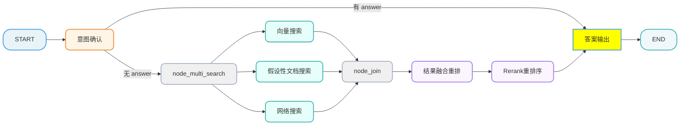
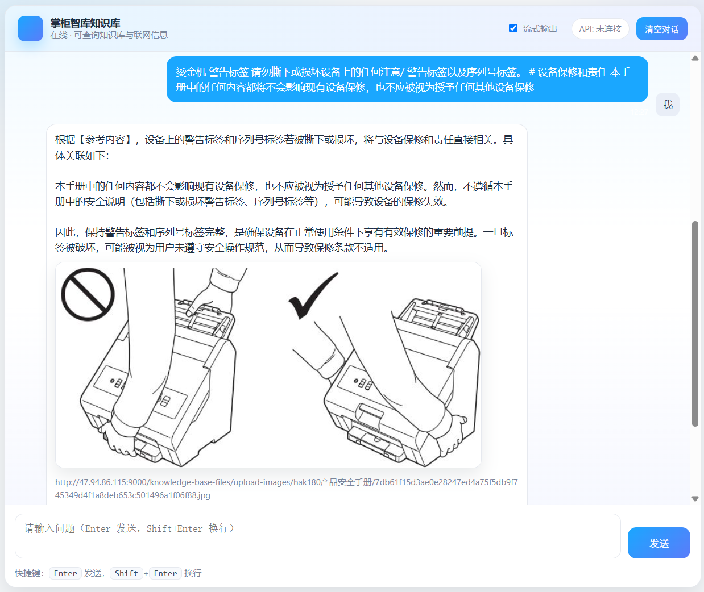

# 掌柜

[TOC]

# 智库-【检索】答案输出

## 1. 任务目标

### 1.1 涉及模块 

```
processor/query_processor/nodes/
├── node_answer_output.py
```

### 1.2 节点在流程中的位置



## 2. 节点业务流程

### 2.1 节点作用

**1）** **检查答案：** 判断state 中的answer是否已经存在，如果存在直接输出answer中的答案，注意判断是否需要流式输出，需要则流式输出

**2）** **生成提示词：**根据state中的问题、重写问题、历史对话、提问商品（item_names）、 重排内容 组织 prompt 并调用 llm 

**3）** **生成答案：**调用大模型输出答案 ，注意判断是否需要流式输出，需要则流式输出

**4）** **保存答案：**把答案写入到 mongodb 的 history 中

**5）** **流操作的final push:  做最后一次push操作**（主要是为了触发前端图片渲染) 

### 2.2 代码实现

#### 2.2.1 单元测试

```python
if __name__ == "__main__":

    logger.info("开始测试: 答案生成节点")


    # 1. 构造模拟数据
    # 模拟重排序后的文档列表 (reranked_docs)
    # 包含：本地文档（带Markdown图片）、联网结果（带URL字段）、纯文本文档
    mock_reranked_docs = [
        {
            "chunk_id": "local_101",
            "source": "local",
            "title": "HAK 180 烫金机操作手册_v2",
            "score": 0.95,
            "url": None,
            "content": """
            HAK 180 烫金机的操作面板位于机器正前方。
            开启电源后，您需要先设置温度，默认建议设置在 110℃ 左右。
            具体的操作面板布局请参考下图：
            

            如果是进行局部烫金，请调节侧面的旋钮。
            
            """
        },
        {
            "chunk_id": None,
            "source": "web",
            "title": "HAK 180 常见故障排除 - 官网",
            "score": 0.88,
            "url": "http://example.com/hak180_troubleshooting.jpeg", # 这是一个直接指向图片的URL（虽然少见，但用于测试提取）
            "content": "如果机器无法加热，请检查保险丝是否熔断..."
        },
        {
            "chunk_id": "local_102",
            "source": "local",
            "title": "安全注意事项",
            "score": 0.82,
            "url": None,
            "content": "操作时请务必佩戴隔热手套，避免高温烫伤。"
        }
    ]

    # 模拟历史记录
    mock_history = [
        {"role": "user", "text": "你好，这款机器怎么用？"},
        {"role": "assistant", "text": "您好！请问您具体指的是哪一款机器？"},
        {"role": "user", "text": "HAK 180 烫金机"}
    ]

    # 模拟输入状态
    mock_state = {
        "session_id": "test_answer_session_001",
        "original_query": "HAK 180 烫金机怎么操作？",
        "rewritten_query": "HAK 180 烫金机的具体操作步骤和面板设置方法",
        "item_names": ["HAK 180 烫金机"],
        "history": mock_history,
        "reranked_docs": mock_reranked_docs,
        "is_stream": False, # 测试非流式
        # "is_stream": True, # 若要测试流式，需确保 SSE 环境或 mock 相关函数
        "answer": None # 初始无答案
    }

   
    # 运行节点
    node_answer_output = NodeAnswerOutput()
    result = node_answer_output(mock_state)

    # 1. 验证 Prompt 构建
    if "prompt" in result:
        print(f"[PASS] Prompt 构建成功 (长度: {len(result['prompt'])})")
        # print(f"Prompt 预览:\n{result['prompt'][:200]}...")
    else:
        print("[FAIL] Prompt 未构建")

    # 2. 验证答案生成
    answer = result.get("answer")
    if answer and len(answer) > 10:
        print(f"[PASS] 答案生成成功 (长度: {len(answer)})")
        print(f"答案预览: {answer[:50]}...")
    else:
        print(f"[WARN] 答案生成可能异常 (Content: {answer})")

    # 3. 验证图片提取
    # 我们期望提取到 3 张图片：
    # 1. http://local-server/images/panel_view.jpg (来自 local_101)
    # 2. http://local-server/images/knob_detail.png (来自 local_101)
    # 3. http://example.com/hak180_troubleshooting.jpeg (来自 web 结果的 url 字段)

    # 注意：这里我们没办法直接从 result state 里拿到 image_urls，因为它是作为 SSE 推送出去的，或者存库了
    # 但我们可以通过日志观察 _extract_images_from_docs 的输出
    # 如果需要验证，可以临时修改 node_answer_output 返回 image_urls
    print("[INFO] 请检查上方日志中是否包含 '图片提取完成' 及以下 URL:")
    print(" - http://local-server/images/panel_view.jpg")
    print(" - http://local-server/images/knob_detail.png")
    print(" - http://example.com/hak180_troubleshooting.jpeg")


```

#### 2.2.2 节点主流程 

##### 流程图

##### process

```python
import re
from typing import List, Dict, Tuple

from langchain_core.prompts import load_prompt

from processor.query_processor.prompt.answer_prompt import ANSWER_PROMPT
from tool.logger import logger

from processor.query_processor.base import NodeBase
from processor.query_processor.state import QueryGraphState
from utils.llm_utils import get_llm_client
from utils.mongo_history_utils import save_chat_message
from utils.sse_utils import push_to_session, SSEEvent
from utils.task_utils import add_done_task, set_task_result

MAX_CONTEXT_CHARS = 12000

class NodeAnswerOutput(NodeBase):
    """
    节点功能: 答案输出
    流程: 检查已有答案 → 构建提示词 → LLM 生成 → 写入历史 → 发送结束事件
    """

    # 覆盖基类的 name 属性，标识节点名称
    name: str = "node_answer_output"

    def process(self, state: QueryGraphState) -> QueryGraphState:
        """
        1 判断state 中的answer是否已经存在，如果存在直接输出answer中的答案，注意判断是否需要流式输出需要则流式输出
        2 根据state中的问题、重新问题、历史对话、提问商品（item_names）、 重排内容 组织prompt 并调用llm 生成答案
        3 调用大模型输出答案 注意判断是否需要流式输出需要则流式输出
        4 把答案写入到mongodb的history中 利用utils/mongo_history_utils.py中的save_chat_message方法
        5 做最后一次push操作（主要是为了触发前端图片渲染)
             {
                "answer": "HAK 180 烫金机的操作面板位于...（大模型生成的纯文本）...",
                "status": "completed",
                "image_urls": [
                    "http://local-server/images/panel_view.jpg",
                    "http://local-server/images/button_detail.jpg"
                ]
              }
        """

        # 阶段一：检查answer是否存在,如果存在直接输出answer中的答案
        answer_exists = self._step_1_check_answer(state)

        # 阶段二  如果没有answer则 构建 Prompt
        if not answer_exists:
            prompt = self._step_2_construct_prompt(state)
            state["prompt"] = prompt

            # 阶段三：  如果没有answer则 调用大模型输出答案
            self._step_3_generate_response(state, prompt)


            # 提取图片URL（用于历史记录和前端展示）
        image_urls = self._extract_images_from_docs(state.get("reranked_docs") or [])

        # 阶段四：把答案写入到mongodb的history中
        if state.get("answer"):
            logger.info("---写入MongoDB历史记录---")
            self._step_4_write_history(state, image_urls=image_urls)

        # 阶段五: 流式输出结束，发送 final 事件 [最后兜底，确保图片都能争取渲染和结束]
        logger.info(f"---发送 final 事件---图片为：{image_urls}")
        if state.get("is_stream"):
            push_to_session(
                state['session_id'],
                SSEEvent.FINAL,
                {
                    "answer": state["answer"],
                    "status": "completed",
                    "image_urls": image_urls  # 发送图片URL给前端
                }
            )

        logger.info("---node_answer_output 节点处理结束---")
        return state


```

##### 检查答案

```python

    def _step_1_check_answer(self, state) -> bool:
      """
      阶段一：检查 state 中是否已有 answer。
      - 若已存在：按需推送流式 delta（用于 SSE），并返回 True
      - 若不存在：返回 False
      """
      answer = state.get("answer")
      is_stream = state.get("is_stream" )
      if answer:
        if is_stream:
          logger.info("---Step 1: 发现已有答案，执行流式推送---")
          push_to_session(state["session_id"], SSEEvent.DELTA, {"delta": answer})
        else:
          set_task_result(state["session_id"], "answer", answer)
        return True
      else:
        return False

```

##### 构建 Prompt 

定义外部提示词文件：

位置：`prompt/answer_out.py`

```python
# processor/query_processor/prompt/answer_prompt.py

# 回答生成提示词
ANSWER_PROMPT = """你是一个智能助手，请根据参考内容回答用户的问题。
要求：
1 尽量基于【参考内容】和【用户问题】 作答，不要编造不存在的事实。
2 如果用户的问题需要通过图片来辅助说明（例如：外观、结构、接线、示意图等）,图片只能来自于本地切片文本中的图片，请在答案最后追加一个独立的图片区块，格式严格如下：
【图片】
<图片URL1>
<图片URL2>
（每行一个URL；如果没有合适图片则不要输出【图片】区块）

【参考内容】
{context}

【历史对话】
{history}

【相关商品/实体】
{item_names}

【用户问题】
{question}

请回答："""
```

定义提示词方法实现：

这段代码的核心功能是**“为大模型准备食材”**：

1. 挑选食材 ：从已经按相关性排好序的文档列表 ( reranked_docs ) 中，依次取出文档。
2. 清洗与摆盘 ：
   - 提取文档的正文 ( text )。
   - 贴上标签 ( meta_parts )：比如这是第几条、来自哪里（本地/网络）、相关性得分多少、标题是什么。这样大模型在引用时知道出处。
   - 拼装成一段完整的文本块。
3. 控制分量 ：累加所有拼装好的文本长度，一旦超过最大限制（ MAX_CONTEXT_CHARS ，比如 12000 字），就停止添加。这是为了防止把大模型“撑死”（超出 Token 限制）。
4. 打包 ：最后把所有选中的文档用换行符拼成一个长字符串 ( context_str )，塞进 Prompt 里发给大模型。

```python
    def _step_2_construct_prompt(self, state: QueryGraphState) -> str:

        """
        阶段二：构建 Prompt
        根据state中的问题、重新问题、历史对话、提问商品（item_names）、 重排内容 组装 LLM 提示词
        """
        char_budget = MAX_CONTEXT_CHARS

        # 1. 获取问题和商品名
        # 优先使用重写后的问题
        question = state.get("rewritten_query") or state.get("original_query", "")
        item_names = state["item_names"]

        # 2. 格式化上下文文档
        context_str, char_budget = self._format_reranked_docs(
            state.get("reranked_docs") or [], char_budget
        )

        # 3. 格式化历史对话
        history_str, char_budget = self._format_chat_history(
            state.get("history") or [], char_budget
        )

        # 4. 格式化 Item Names (提问商品)
        item_names_str = ", ".join(item_names) if item_names else "无指定商品"

        # 5. 组装提示词
        prompt = ANSWER_PROMPT.format(
            context=context_str or "无参考内容",
            history=history_str if history_str else "暂无历史对话",
            item_names=item_names_str,
            question=question,
        )
        logger.info(f"组装后的提示词为：{prompt}")
        return prompt


    def _format_reranked_docs(self, reranked_docs: List[Dict], char_budget: int) -> Tuple[str, int]:
        """格式化重排序文档，带字符预算控制"""
        formatted_lines = []
        used_chars = 0

        # 从重排内容中，提取为资料字符串，不可超过限额
        # 优先使用结构化 reranked_docs（包含 source/chunk_id/url/score），便于约束与引用
        # ---------------------------------------------------------
        # 逻辑解释：
        # 1. 遍历重排序后的文档列表 (reranked_docs)，这些文档已经按相关性从高到低排序。
        # 2. 对每个文档提取关键信息 (text, source, chunk_id, url, title, score)。
        # 3. 构造 "元数据头 + 正文" 格式的字符串，例如：
        #    "[1] [local] [chunk_id=123] [score=0.95] [title=操作手册]
        #     这里是文档的正文内容..."
        # 4. 累加字符长度，如果超过 MAX_CONTEXT_CHARS (如 12000 字符)，则停止添加，
        #    确保 Prompt 长度在 LLM 的处理范围内，避免 Token 溢出。
        # ---------------------------------------------------------
        for idx, doc in enumerate(reranked_docs, start=1):
            content = doc.get("content")
            meta_tags = [f"[{idx}]"]
            for field, template in [
                ("source", "[source={}]"),
                ("chunk_id", "[chunk_id={}]"),
                ("url", "[url={}]"),
                ("title", "[title={}]"),
            ]:
                field_value = str(doc.get(field)).strip()
                if field_value:
                    meta_tags.append(template.format(field_value))

            relevance_score = doc.get("score")
            if relevance_score is not None:
                meta_tags.append(f"[score={float(relevance_score):.4f}]")

            doc_entry = " ".join(meta_tags) + "\n" + content

            if used_chars + len(doc_entry) > char_budget:
                break

            formatted_lines.append(doc_entry)
            used_chars += len(doc_entry) + 2

        return "\n\n".join(formatted_lines), char_budget - used_chars

    def _format_chat_history(self, chat_history: List[Dict], char_budget: int) -> Tuple[str, int]:
        """格式化历史对话"""
        formatted_lines = []
        used_chars = 0

        role_label_map = {"user": "用户", "assistant": "助手"}

        for message in chat_history:
            role = message.get("role", "")
            text = message.get("text", "")
            if not text or role not in role_label_map:
                continue

            formatted_line = f"{role_label_map[role]}: {text}"
            used_chars += len(formatted_line) + 1

            if used_chars > char_budget:
                return "\n".join(formatted_lines), char_budget - used_chars

            formatted_lines.append(formatted_line)

        return "\n".join(formatted_lines), char_budget - used_chars

```

##### 生成回答

```python

    def _step_3_generate_response(self, state: QueryGraphState, prompt: str) -> QueryGraphState:
        """
        阶段三：生成回答
        调用llm生成答案，支持流式输出
        """
        logger.info("---Step 3: 开始生成回答 (LLM Generation)---")

        # 获取 LLM 客户端
        # 注意：这里我们使用统一的 get_llm_client 获取实例
        llm = get_llm_client()

        # 判断是否需要流式输出
        # 通常 state 中会注入 stream_queue 用于 SSE 推送
        session_id = state.get("session_id")
        is_stream = state.get("is_stream")

        if is_stream:
            logger.info(f"模式: 流式输出 (Streaming), Session: {session_id}")
            final_text = ""
            try:
                # 使用 stream 方法进行流式生成
                for chunk in llm.stream(prompt):
                    delta = getattr(chunk, "content", "") or ""
                    if delta:
                        final_text += delta
                        # 将增量内容放入队列
                        push_to_session(session_id, SSEEvent.DELTA, {"delta": delta})

                logger.info(f"流式输出完成，总长度: {len(final_text)}")

            except Exception as e:
                logger.error(f"流式生成出错: {e}", exc_info=True)
                # 发生错误时，尝试推送到前端
                push_to_session(session_id, SSEEvent.ERROR, {"error": str(e)})

            state["answer"] = final_text
        else:
            # 非流式直接调用
            logger.info(f"模式: 非流式输出 (Blocking), Session: {session_id}")
            try:
                response = llm.invoke(prompt)
                content = response.content
                state["answer"] = content
                set_task_result(session_id, "answer", content)
                logger.info(f"生成回答完成，长度: {len(content)}")
            except Exception as e:
                logger.error(f"生成回答出错: {e}", exc_info=True)
                state["answer"] = "抱歉，生成回答时出现错误。"

        return state
```

##### 提取参考内容中的图片链接

在 node_answer_output.py 中，虽然 Prompt 要求大模型输出图片区块，但实际上代码里有一段**“双保险”逻辑**：

```python
def _extract_images_from_docs(docs):
    # ... 正则提取 markdown 图片链接 ...
```

这段代码并没有去解析大模型生成的那个 【图片】 区块，而是 直接从源文档（reranked_docs）里用正则提取图片链接 。

为什么要这样做？

1. 大模型不可控 ：大模型可能会编造 URL，或者格式写错（比如漏了换行）。
2. 源数据最准 ：直接从排好序的文档里提取图片，肯定是真的存在的图片。
   所以，最终给前端的数据结构是： push_to_session 发送的 JSON：

```json
{
    "answer": "HAK 180 烫金机的操作面板位于...（大模型生成的纯文本）...",
    "status": "completed",
    "image_urls": [
        "http://local-server/images/panel_view.jpg",
        "http://local-server/images/button_detail.jpg"
    ]
}
```

- answer : 大模型的回答文本。
- image_urls : 代码自己从文档里提取出来的图片列表（不是大模型生成的）。
  结论： Prompt 里的【图片】要求主要是为了让大模型在 文字回答中能够提及图片 （比如“请看下图”），起到引导作用。但最终传给前端展示图片的，其实是代码里那个靠谱的 _extract_images_from_docs 函数提取逻辑

```python
    def _extract_images_from_docs(self, docs):
        """
        辅助方法：从文档列表中提取图片URL

        核心逻辑：
        1. 遍历所有相关文档（包括本地知识库切片和联网搜索结果）。
        2. 策略一：直接检查文档的 'url' 字段（常见于联网搜索结果）。
           - 验证后缀名是否为图片格式 (.jpg, .png 等)。
        3. 策略二：使用正则表达式扫描文档 'text' 正文内容（常见于本地 Markdown 文档）。
           - 匹配 Markdown 图片语法: 。
        4. 对提取到的 URL 进行去重处理，返回唯一图片列表。

        :param docs: 文档列表，每个文档为字典格式
        :return: 图片 URL 字符串列表
        """
        images = []
        seen = set() # 用于去重，避免同一张图片重复出现
        if not docs:
            return []
        # ---------------------------------------------------------
        # 正则表达式解释：r'!\[.*?\]\((.*?)\)'
        # 1. !\[   -> 匹配 Markdown 图片语法的开头 "![" (注意 [ 需要转义)
        # 2. .*?   -> 非贪婪匹配图片描述文本 (Alt Text)，即 [] 中间的内容
        # 3. \]    -> 匹配描述文本的结束符 "]"
        # 4. \(    -> 匹配 URL 部分的开始符 "("
        # 5. (.*?) -> 捕获组 (Group 1)：非贪婪匹配括号内的实际 URL 内容
        # 6. \)    -> 匹配 URL 部分的结束符 ")"
        # ( ... ) （不带反斜杠）：这就是 捕获组 。
        # 它的作用是告诉程序：“虽然我匹配了整个  结构，但我 只要 这括号里的内容”。
        # ---------------------------------------------------------
        md_img_pattern = re.compile(r'!\[.*?\]\((.*?)\)')

        logger.info(f"开始提取图片，待处理文档数: {len(docs)}")

        for i, doc in enumerate(docs):
            # 1. 优先检查 url 字段 (主要针对 Web Search 结果)
            url = (doc.get("url") or "").strip()
            if url:
                # 简单后缀判断：确保是静态图片资源
                if url.lower().endswith(('.png', '.jpg', '.jpeg', '.gif', '.webp', '.bmp', '.svg')):
                    if url not in seen:
                        logger.debug(f"文档[{i}] 发现图片 URL (字段): {url}")
                        seen.add(url)
                        images.append(url)

            # 2. 检查 text 字段中的 Markdown 图片 (主要针对 Local Chunk)
            text = (doc.get("content") or "").strip()
            if text:
                # findall 机制解释：
                # 正则表达式 r'!\[.*?\]\((.*?)\)' 中包含一个捕获组 (.*?)
                # 当存在捕获组时，findall 只返回括号内匹配到的内容（即 URL），而不是整个  字符串
                # 示例：
                # 输入 text: "参考图片  如下"
                # 返回 matches: ['http://img.com/1.jpg']
                matches = md_img_pattern.findall(text)
                for img_url in matches:
                    img_url = img_url.strip()
                    if img_url and img_url not in seen:
                        logger.debug(f"文档[{i}] 正文发现 Markdown 图片: {img_url}")
                        seen.add(img_url)
                        images.append(img_url)

        logger.info(f"图片提取完成，共找到 {len(images)} 张唯一图片: {images}")
        return images
```

##### 写入历史

```python
    def _step_4_write_history(seld, state: QueryGraphState, image_urls = None) -> QueryGraphState:
        """
        阶段四：把本轮答案写入 MongoDB history。
        利用 utils/mongo_history_utils.py 中的 save_chat_messages 方法。
        """
        session_id = state.get("session_id", "default")
        answer = (state.get("answer") or "").strip()
        item_names = state.get("item_names") or []

        try:
            if answer:
                save_chat_message(
                    session_id=session_id,
                    role="assistant",
                    text=answer,
                    rewritten_query="",
                    item_names=item_names,
                    image_urls=image_urls,
                    message_id=None
                )
        except Exception as e:
            # 写历史失败不应影响主链路
            logger.error(f"写入Mongo历史记录失败: {e}")

        return state
```

##### 实现效果



 

#### 2.2.3 集成测试

##### 前后端集成测试

运行 `query_service.py`

访问  http://127.0.0.1:8001/chat.html 

发现任务追踪效果无法实现

解决方案： 修改base.py和各个节点

在 `state = self.process(state)` 的前面加 `add_running_task`

```python
# processor/query_processor/base.py

# 开始：记录节点运行状态
add_running_task(state['session_id'], self.name, state.get("is_stream"))

state = self.process(state)

# 此处加任务追踪，多路搜索节点无法获取session_id，因此需要在process内部处理
# add_done_task(state.get("session_id"), self.name, state.get("is_stream"))
```

2.在每个节点返回state之前添加 add_running_task

```python
add_done_task(state.get("session_id"), self.name, state.get("is_stream"))
```


